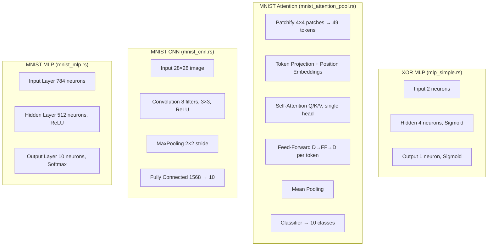
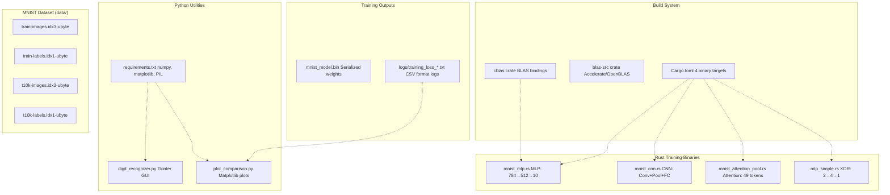
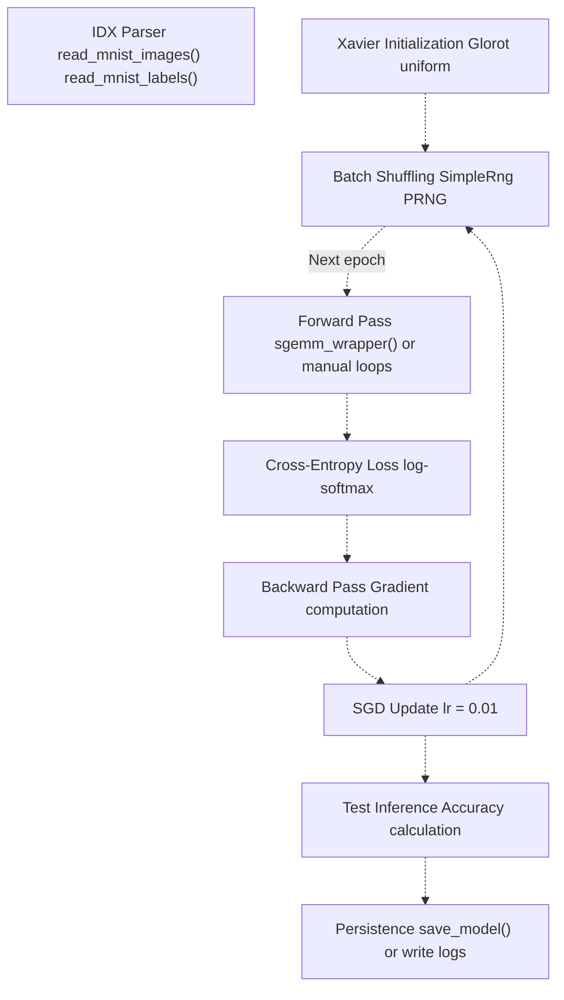

# Overview

> **Relevant source files**
> * [README.md](https://github.com/ThalesMMS/Rust-Neural-Networks/blob/0e978f90/README.md)

This document provides an overview of the Rust Neural Networks repository, which implements multiple neural network architectures in Rust with Python utilities for visualization and inference. This page covers the repository's purpose, implemented models, performance characteristics, and high-level system architecture.

For detailed setup instructions, see [Getting Started](2%20Getting-Started.md). For in-depth documentation of individual models, see [Model Implementations](3%20Model-Implementations.md). For Python tool usage, see [Python Utilities](4%20Python-Utilities.md).

**Sources:** README.md

## Purpose and Scope

This repository demonstrates neural network implementations in Rust targeting two problem domains:

1. **MNIST digit classification** using three architectures: Multi-Layer Perceptron (MLP), Convolutional Neural Network (CNN), and single-head self-attention with feed-forward network
2. **XOR binary classification** using a simple MLP as an educational example

The project separates computationally intensive training (implemented in Rust with optional BLAS acceleration) from user-facing utilities (implemented in Python for visualization and interactive inference). The design and binary model format are inspired by the mlp.c project.

**Sources:** [README.md L1-L12](https://github.com/ThalesMMS/Rust-Neural-Networks/blob/0e978f90/README.md#L1-L12)

## Repository Contents

The repository is organized into Rust source files, Python utilities, and data/output directories:

### Rust Source Files

| File | Binary Target | Purpose |
| --- | --- | --- |
| `mnist_mlp.rs` | `mnist_mlp` | MLP with BLAS-accelerated matrix operations |
| `mnist_cnn.rs` | `mnist_cnn` | CNN with manual convolution and pooling loops |
| `mnist_attention_pool.rs` | `mnist_attention_pool` | Transformer-inspired architecture with self-attention |
| `mlp_simple.rs` | `mlp_simple` | Simple MLP for XOR problem |

### Python Utilities

| File | Purpose |
| --- | --- |
| `digit_recognizer.py` | Interactive GUI for drawing digits and running inference |
| `plot_comparison.py` | Training loss curve visualization |
| `requirements.txt` | Python dependencies (numpy, matplotlib, PIL) |

### Data and Outputs

| Directory/File | Contents |
| --- | --- |
| `data/` | MNIST IDX format files (training and test images/labels) |
| `logs/` | Training loss logs in CSV format |
| `mnist_model.bin` | Serialized model weights and biases |

**Sources:** README.md

## Model Architectures

The repository implements four distinct neural network architectures, each demonstrating different computational patterns:



**MNIST MLP** uses a simple fully-connected architecture with BLAS-accelerated matrix multiplications for optimal performance. **MNIST CNN** implements spatial feature extraction through convolution and pooling operations using explicit loops for educational clarity. **MNIST Attention** employs patch-based tokenization with self-attention mechanisms, inspired by transformer architectures. **XOR MLP** provides a minimal example for understanding backpropagation on a trivial problem.

For detailed architecture documentation, see [MNIST MLP](3a%20MNIST-MLP.md), [MNIST CNN](3b%20MNIST-CNN.md), [MNIST Attention Model](3c%20MNIST-Attention-Model.md), and [Simple XOR MLP](3d%20Simple-XOR-MLP.md).

**Sources:** README.md

## Performance Benchmarks

The following benchmarks were collected using default training parameters on local hardware. Training time represents total time across all epochs:

| Model | Binary Target | Epochs | Batch Size | Train Time (s) | Test Accuracy (%) | Notes |
| --- | --- | --- | --- | --- | --- | --- |
| MNIST MLP | `mnist_mlp` | 10 | 64 | 3.33 | 94.17 | BLAS (Accelerate) |
| MNIST CNN | `mnist_cnn` | 3 | 32 | 11.24 | 91.93 | Conv8/3×3 + MaxPool |
| MNIST Attention | `mnist_attention_pool` | 5 | 32 | 33.88 | 38.55 | D=16, FF=32 |
| XOR MLP | `mlp_simple` | 1,000,000 | - | 0.74 | 100.00 | Threshold 0.5 |

The MLP achieves the best balance of speed and accuracy due to BLAS acceleration. The CNN is slower but demonstrates convolutional architectures. The attention model shows lower accuracy due to limited capacity (D=16, FF=32) and fewer training epochs. Results vary by hardware and build flags.

For optimization strategies, see [BLAS Integration](5a%20BLAS-Integration.md). For build configuration, see [Build System](6a%20Build-System.md).

**Sources:** [Project overview and setup](https://github.com/ThalesMMS/Rust-Neural-Networks/blob/0e978f90/README.md#L138-L149)

## System Architecture

The following diagram shows the complete system architecture, mapping high-level components to specific code entities:



The system separates concerns into distinct layers:

1. **Training Layer (Rust)**: Four binary targets defined in `Cargo.toml` implement different neural network architectures. The `mnist_mlp` binary uses `blas-src` and `cblas` for hardware-accelerated matrix operations.
2. **Data Layer**: MNIST dataset files in IDX binary format provide training and test data. For dataset details, see [MNIST Dataset Setup](2b%20MNIST-Dataset-Setup.md).
3. **Output Layer**: Rust binaries produce two types of outputs: * `mnist_model.bin`: Binary serialization of trained model parameters (weights and biases) * `logs/training_loss_*.txt`: CSV-formatted training metrics
4. **Utilities Layer (Python)**: Python scripts consume Rust outputs for visualization and inference. For detailed documentation, see [Digit Recognizer GUI](4a%20Digit-Recognizer-GUI.md) and [Training Visualization](5b%20Training-Visualization.md).

**Sources:** README.md

## Training Pipeline

The training pipeline is common across all MNIST implementations, with architecture-specific variations in forward and backward propagation:



**Key Pipeline Components:**

* **Data Loading**: IDX format parser functions (`read_mnist_images`, `read_mnist_labels`) load binary dataset files into memory
* **Initialization**: Xavier/Glorot uniform initialization ensures stable gradient flow during early training
* **Shuffling**: Custom `SimpleRng` pseudo-random number generator shuffles training indices for each epoch
* **Forward Pass**: `sgemm_wrapper` performs batched GEMM operations in `mnist_mlp`, while `mnist_cnn` and `mnist_attention_pool` use explicit loops
* **Loss Calculation**: Cross-entropy loss computed via log-softmax
* **Backpropagation**: Gradient computation varies by architecture
* **Optimizer**: Stochastic Gradient Descent (SGD) with learning rate 0.01
* **Evaluation**: Test set inference calculates final accuracy
* **Persistence**: `save_model` serializes weights to `mnist_model.bin`; training metrics logged to `logs/`

For detailed pipeline documentation, see [Training Pipeline](4b%20Training-Pipeline.md). For model serialization format, see [Binary Model Format](5c%20Binary-Model-Format.md).

**Sources:** README.md

## Technology Stack

The project uses a multi-language stack optimized for different concerns:

### Rust (Training)

* **Language**: Rust (edition 2021)
* **Build System**: Cargo with release optimizations (LTO, target-cpu=native)
* **BLAS Backend**: `blas-src` (platform-specific) + `cblas` bindings * macOS: Accelerate framework (Apple Silicon / Intel optimized) * Linux/Windows: OpenBLAS or Intel MKL
* **Threading**: Controlled via `VECLIB_MAXIMUM_THREADS` on macOS Accelerate

### Python (Utilities)

* **Core Libraries**: * `numpy`: Array operations and model inference * `matplotlib`: Training curve visualization * `PIL/Pillow`: Image preprocessing * `tkinter`: GUI framework for digit recognizer

### Data Format

* **Training Data**: MNIST IDX binary format (ubyte files)
* **Model Serialization**: Custom binary format (little-endian f32 arrays)
* **Training Logs**: CSV format (epoch, loss, time)

For BLAS configuration details, see [BLAS Integration](5a%20BLAS-Integration.md). For dependency management, see [Dependencies](6b%20Dependencies.md).

**Sources:** README.md

## Usage Overview

### Building and Running Rust Binaries

Build all targets in release mode:

```
cargo build --release
```

Run specific models:

```
# MNIST MLP (BLAS-accelerated)cargo run --release --bin mnist_mlp# MNIST CNNcargo run --release --bin mnist_cnn# MNIST Attentioncargo run --release --bin mnist_attention_pool# XOR examplecargo run --release --bin mlp_simple
```

Performance optimization flags:

```
RUSTFLAGS="-C target-cpu=native" VECLIB_MAXIMUM_THREADS=8 cargo run --release --bin mnist_mlp
```

### Python Utilities

Install Python dependencies:

```
pip install -r requirements.txt
```

Run digit recognizer GUI:

```
python digit_recognizer.py
```

Generate training comparison plots:

```
python plot_comparison.py
```

For detailed usage instructions, see [Getting Started](2%20Getting-Started.md).

**Sources:** README.md

## Key Design Decisions

### BLAS Acceleration vs. Manual Loops

The `mnist_mlp` implementation uses BLAS-accelerated batched GEMM operations via `sgemm_wrapper`, achieving 10-100× speedups over naive implementations through SIMD instructions and multi-threading. In contrast, `mnist_cnn` and `mnist_attention_pool` use explicit loops for educational clarity, trading performance for readability.

### Language Separation

Rust handles computationally intensive training with optimal performance and memory safety, while Python provides user-friendly interfaces leveraging its rich ecosystem (`numpy`, `matplotlib`, `tkinter`). The `mnist_model.bin` binary format serves as the interface between languages.

### Custom Binary Format

The binary model format (inspired by mlp.c) enables efficient serialization and cross-language model loading without external dependencies like ONNX or Protocol Buffers. See [Binary Model Format](5c%20Binary-Model-Format.md) for specification details.

For architectural deep dives, see [Architecture & Design](5%20Architecture-&-Design.md).

**Sources:** README.md


)

### On this page

- [Overview](#overview)
  - [Purpose and Scope](#purpose-and-scope)
  - [Repository Contents](#repository-contents)
    - [Rust Source Files](#rust-source-files)
    - [Python Utilities](#python-utilities)
    - [Data and Outputs](#data-and-outputs)
  - [Model Architectures](#model-architectures)
  - [Performance Benchmarks](#performance-benchmarks)
  - [System Architecture](#system-architecture)
  - [Training Pipeline](#training-pipeline)
  - [Technology Stack](#technology-stack)
    - [Rust (Training)](#rust-training)
    - [Python (Utilities)](#python-utilities-1)
    - [Data Format](#data-format)
  - [Usage Overview](#usage-overview)
    - [Building and Running Rust Binaries](#building-and-running-rust-binaries)
    - [Python Utilities](#python-utilities-2)
  - [Key Design Decisions](#key-design-decisions)
    - [BLAS Acceleration vs. Manual Loops](#blas-acceleration-vs-manual-loops)
    - [Language Separation](#language-separation)
    - [Custom Binary Format](#custom-binary-format)
    - [On this page](#on-this-page)

Ask Devin about Rust-Neural-Networks