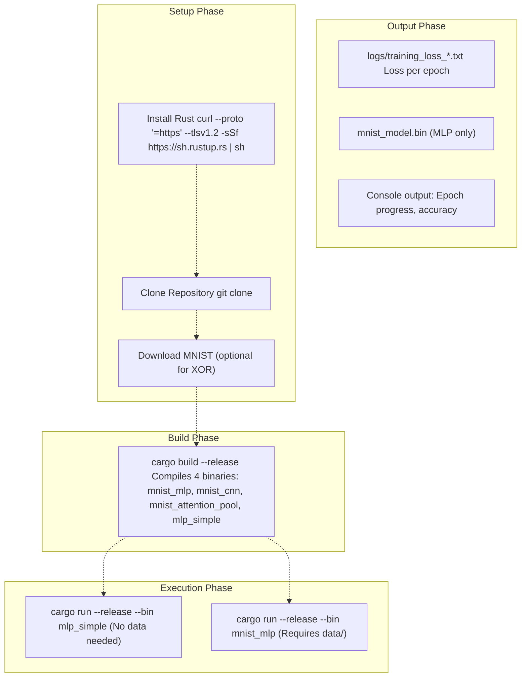
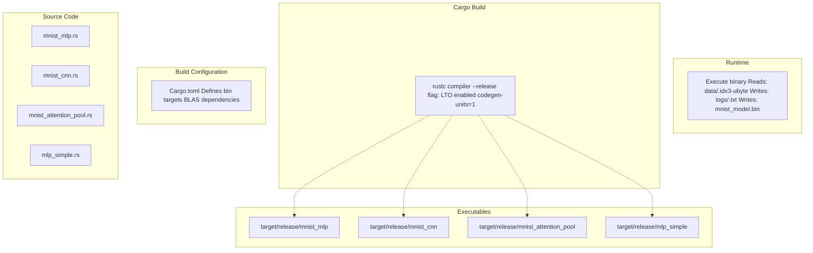

# Getting Started

> **Relevant source files**
> * [Cargo.toml](https://github.com/ThalesMMS/Rust-Neural-Networks/blob/0e978f90/Cargo.toml)
> * [README.md](https://github.com/ThalesMMS/Rust-Neural-Networks/blob/0e978f90/README.md)
> * [requirements.txt](https://github.com/ThalesMMS/Rust-Neural-Networks/blob/0e978f90/requirements.txt)

This page provides a step-by-step guide to set up the Rust Neural Networks repository and run your first model. It covers the essential prerequisites, directory structure, and commands needed to train a neural network on the MNIST dataset or XOR problem.

For detailed installation instructions including BLAS backend configuration, see [Installation](#2.1). For information about the MNIST dataset structure and IDX file format, see [MNIST Dataset Setup](#2.2).

## Prerequisites Overview

The project requires:

| Component | Purpose | Details |
| --- | --- | --- |
| **Rust toolchain** | Compile and run training binaries | Version 1.70+ recommended |
| **BLAS library** | Accelerate matrix operations in MLP | Accelerate (macOS), OpenBLAS (Linux/Windows) |
| **MNIST dataset** | Training and test data | 4 IDX files in `data/` directory |
| **Python 3.7+** (optional) | Visualization and inference GUI | With numpy, matplotlib, PIL |

The simplest model to start with is `mlp_simple` (XOR), which requires no external data files. For MNIST models, you must download the dataset files first.

**Sources**: [README.md L98-L137](https://github.com/ThalesMMS/Rust-Neural-Networks/blob/0e978f90/README.md#L98-L137)

 [Cargo.toml L1-L8](https://github.com/ThalesMMS/Rust-Neural-Networks/blob/0e978f90/Cargo.toml#L1-L8)

 [requirements.txt L1-L2](https://github.com/ThalesMMS/Rust-Neural-Networks/blob/0e978f90/requirements.txt#L1-L2)

## Repository Structure

Understanding the key directories and files helps navigate the project:

```mermaid
flowchart TD

ROOT["Repository Root"]
MLP["mnist_mlp.rs BLAS-accelerated MLP"]
CNN["mnist_cnn.rs Convolutional network"]
ATT["mnist_attention_pool.rs Self-attention model"]
XOR["mlp_simple.rs XOR toy example"]
CARGO["Cargo.toml Build configuration 4 binary targets"]
REQ["requirements.txt Python dependencies"]
TRAIN_IMG["train-images.idx3-ubyte 60,000 training images"]
TRAIN_LAB["train-labels.idx1-ubyte 60,000 training labels"]
TEST_IMG["t10k-images.idx3-ubyte 10,000 test images"]
TEST_LAB["t10k-labels.idx1-ubyte 10,000 test labels"]
LOGS["logs/ training_loss_*.txt"]
MODEL["mnist_model.bin Saved model weights"]
RECOG["digit_recognizer.py Interactive inference"]
PLOT["plot_comparison.py Loss visualization"]

ROOT -.-> MLP
ROOT -.-> CNN
ROOT -.-> ATT
ROOT -.-> XOR
ROOT -.-> CARGO
ROOT -.-> REQ
ROOT -.-> TRAIN_IMG
ROOT -.-> TRAIN_LAB
ROOT -.-> TEST_IMG
ROOT -.-> TEST_LAB
ROOT -.-> LOGS
ROOT -.-> MODEL
ROOT -.-> RECOG
ROOT -.-> PLOT

subgraph subGraph4 ["Python Utilities"]
    RECOG
    PLOT
end

subgraph Outputs ["Outputs"]
    LOGS
    MODEL
end

subgraph subGraph2 ["Data Directory"]
    TRAIN_IMG
    TRAIN_LAB
    TEST_IMG
    TEST_LAB
end

subgraph Configuration ["Configuration"]
    CARGO
    REQ
end

subgraph subGraph0 ["Source Files"]
    MLP
    CNN
    ATT
    XOR
end
```



**Sources**: [README.md L14-L31](https://github.com/ThalesMMS/Rust-Neural-Networks/blob/0e978f90/README.md#L14-L31)

 [Cargo.toml L10-L24](https://github.com/ThalesMMS/Rust-Neural-Networks/blob/0e978f90/Cargo.toml#L10-L24)

## Quick Start Workflow

The following diagram shows the complete workflow from setup to running your first model:



**Sources**: [README.md L98-L128](https://github.com/ThalesMMS/Rust-Neural-Networks/blob/0e978f90/README.md#L98-L128)

 [Cargo.toml L10-L24](https://github.com/ThalesMMS/Rust-Neural-Networks/blob/0e978f90/Cargo.toml#L10-L24)

## Step-by-Step: First Run

### Step 1: Install Rust

If Rust is not installed, run:

```
curl --proto '=https' --tlsv1.2 -sSf https://sh.rustup.rs | sh
```

Verify installation:

```
rustc --versioncargo --version
```

### Step 2: Clone and Navigate

```
git clone https://github.com/ThalesMMS/Rust-Neural-Networkscd Rust-Neural-Networks
```

### Step 3: Run XOR Example (No Data Required)

The simplest way to verify your setup is to run the XOR model, which requires no external data:

```
cargo run --release --bin mlp_simple
```

Expected output:

```javascript
Epoch 10000: Loss = 0.xxxx
Epoch 20000: Loss = 0.xxxx
...
Final test on XOR inputs:
Input: [0.0, 0.0] => Output: 0.xx (expected ~0.0)
Input: [0.0, 1.0] => Output: 0.xx (expected ~1.0)
Input: [1.0, 0.0] => Output: 0.xx (expected ~1.0)
Input: [1.0, 1.0] => Output: 0.xx (expected ~0.0)
Accuracy: 100.00%
```

This confirms that:

* Rust compilation works
* Basic neural network training executes
* Gradient descent converges correctly

**Sources**: [README.md L112-L116](https://github.com/ThalesMMS/Rust-Neural-Networks/blob/0e978f90/README.md#L112-L116)

 [README.md L147](https://github.com/ThalesMMS/Rust-Neural-Networks/blob/0e978f90/README.md#L147-L147)

### Step 4: Download MNIST Dataset (For MNIST Models)

To run MNIST models (`mnist_mlp`, `mnist_cnn`, `mnist_attention_pool`), download the dataset:

1. Create `data/` directory if it doesn't exist: ``` mkdir -p data ```
2. Download from one of these sources: * [https://www.kaggle.com/datasets/hojjatk/mnist-dataset](https://www.kaggle.com/datasets/hojjatk/mnist-dataset) * [http://yann.lecun.com/exdb/mnist/](http://yann.lecun.com/exdb/mnist/)
3. Place these 4 files in `data/`: * `train-images.idx3-ubyte` (60,000 training images) * `train-labels.idx1-ubyte` (60,000 training labels) * `t10k-images.idx3-ubyte` (10,000 test images) * `t10k-labels.idx1-ubyte` (10,000 test labels)

See [MNIST Dataset Setup](#2.2) for detailed information about the IDX file format.

**Sources**: [README.md L151-L163](https://github.com/ThalesMMS/Rust-Neural-Networks/blob/0e978f90/README.md#L151-L163)

### Step 5: Run MNIST MLP

With the dataset in place, train the MNIST MLP model:

```
cargo run --release --bin mnist_mlp
```

Expected output:

```
Epoch 1/10, Loss: 0.xxxx, Accuracy: xx.xx%, Time: x.xxs
Epoch 2/10, Loss: 0.xxxx, Accuracy: xx.xx%, Time: x.xxs
...
Epoch 10/10, Loss: 0.xxxx, Accuracy: xx.xx%, Time: x.xxs
Final test accuracy: 94.xx%
Total training time: x.xxs
Model saved to mnist_model.bin
```

This demonstrates:

* IDX file parsing works correctly
* BLAS acceleration is functioning (3-4 seconds on modern hardware)
* Training converges to ~94-97% test accuracy
* Model serialization to `mnist_model.bin`

**Sources**: [README.md L106-L110](https://github.com/ThalesMMS/Rust-Neural-Networks/blob/0e978f90/README.md#L106-L110)

 [README.md L33-L54](https://github.com/ThalesMMS/Rust-Neural-Networks/blob/0e978f90/README.md#L33-L54)

 [README.md L144](https://github.com/ThalesMMS/Rust-Neural-Networks/blob/0e978f90/README.md#L144-L144)

## Binary Targets Reference

The [Cargo.toml L10-L24](https://github.com/ThalesMMS/Rust-Neural-Networks/blob/0e978f90/Cargo.toml#L10-L24)

 defines four executable binaries:

| Binary | Command | Training Time | Use Case |
| --- | --- | --- | --- |
| `mlp_simple` | `cargo run --release --bin mlp_simple` | ~0.74s | XOR verification, no data needed |
| `mnist_mlp` | `cargo run --release --bin mnist_mlp` | ~3.33s | BLAS-accelerated MNIST (fastest) |
| `mnist_cnn` | `cargo run --release --bin mnist_cnn` | ~11.24s | Convolutional architecture demo |
| `mnist_attention_pool` | `cargo run --release --bin mnist_attention_pool` | ~33.88s | Self-attention mechanism demo |

All MNIST binaries read from the `data/` directory and write logs to `logs/training_loss_<model>.txt`.

**Sources**: [Cargo.toml L10-L24](https://github.com/ThalesMMS/Rust-Neural-Networks/blob/0e978f90/Cargo.toml#L10-L24)

 [README.md L142-L147](https://github.com/ThalesMMS/Rust-Neural-Networks/blob/0e978f90/README.md#L142-L147)

## Compilation and Execution Flow

The following diagram shows how the build system transforms source files into executable binaries:



**Sources**: [Cargo.toml L1-L29](https://github.com/ThalesMMS/Rust-Neural-Networks/blob/0e978f90/Cargo.toml#L1-L29)

 [README.md L100-L104](https://github.com/ThalesMMS/Rust-Neural-Networks/blob/0e978f90/README.md#L100-L104)

## Verifying Your Setup

After running your first model, verify the following outputs:

### Console Output Verification

For `mlp_simple` (XOR):

* Training completes in < 1 second
* Final accuracy shows 100.00%
* All four XOR cases predict correctly (threshold 0.5)

For `mnist_mlp`:

* Training completes in 3-5 seconds (varies by hardware)
* Final test accuracy: 94-97%
* Each epoch shows decreasing loss

### File Output Verification

Check that these files were created:

```
ls -lh logs/# Should show: training_loss_mlp_simple.txt or training_loss_mnist_mlp.txtls -lh mnist_model.bin# Should exist (only for mnist_mlp)
```

The log files contain CSV data:

```
epoch,loss,time_seconds
1,0.xxxx,x.xx
2,0.yyyy,y.yy
...
```

**Sources**: [README.md L138-L147](https://github.com/ThalesMMS/Rust-Neural-Networks/blob/0e978f90/README.md#L138-L147)

## Performance Optimization (Optional)

For optimal performance on the MNIST MLP model, use CPU-specific optimizations:

```
RUSTFLAGS="-C target-cpu=native" VECLIB_MAXIMUM_THREADS=8 cargo run --release --bin mnist_mlp
```

| Flag | Purpose | Effect |
| --- | --- | --- |
| `RUSTFLAGS="-C target-cpu=native"` | Enable CPU-specific SIMD instructions | 10-20% speedup |
| `VECLIB_MAXIMUM_THREADS=8` | Control BLAS threading (macOS Accelerate) | Optimal thread usage |
| `--release` | Enable all optimizations | Required for realistic benchmarks |

The [Cargo.toml L26-L28](https://github.com/ThalesMMS/Rust-Neural-Networks/blob/0e978f90/Cargo.toml#L26-L28)

 already configures aggressive release optimizations:

* `lto = true` (Link-Time Optimization)
* `codegen-units = 1` (Maximum optimization, slower compile)

**Sources**: [README.md L130-L136](https://github.com/ThalesMMS/Rust-Neural-Networks/blob/0e978f90/README.md#L130-L136)

 [Cargo.toml L26-L28](https://github.com/ThalesMMS/Rust-Neural-Networks/blob/0e978f90/Cargo.toml#L26-L28)

## Platform-Specific Notes

### macOS

* Default BLAS backend: **Accelerate framework** (via `blas-src` with `accelerate` feature)
* No additional installation required
* Control threading with `VECLIB_MAXIMUM_THREADS`

### Linux/Windows

* Requires OpenBLAS or Intel MKL installation
* Modify [Cargo.toml L7](https://github.com/ThalesMMS/Rust-Neural-Networks/blob/0e978f90/Cargo.toml#L7-L7)  to change BLAS backend: ``` blas-src = { version = "0.14", features = ["openblas"] } ```
* Install OpenBLAS via package manager (e.g., `apt-get install libopenblas-dev`)

For detailed platform-specific setup, see [Installation](#2.1) and [BLAS Integration](#5.1).

**Sources**: [README.md L135-L136](https://github.com/ThalesMMS/Rust-Neural-Networks/blob/0e978f90/README.md#L135-L136)

 [Cargo.toml L7](https://github.com/ThalesMMS/Rust-Neural-Networks/blob/0e978f90/Cargo.toml#L7-L7)

## Next Steps

After successfully running your first model:

1. **Explore other architectures**: Try `mnist_cnn` and `mnist_attention_pool` to compare performance. See [Model Implementations](#3).
2. **Visualize training**: Install Python dependencies and run visualization tools: ``` pip install -r requirements.txtpython plot_comparison.py  # Plot training curves ``` See [Training Visualization](#4.2).
3. **Interactive inference**: Test the trained MLP model with a drawing GUI: ``` python digit_recognizer.py ``` See [Digit Recognizer GUI](#4.1).
4. **Understand the architecture**: Review the training pipeline and optimization strategies in [Architecture & Design](#5).
5. **Modify hyperparameters**: Edit source files to experiment with learning rates, batch sizes, and network dimensions.

**Sources**: [README.md L165-L185](https://github.com/ThalesMMS/Rust-Neural-Networks/blob/0e978f90/README.md#L165-L185)

Refresh this wiki

Last indexed: 5 January 2026 ([0e978f](https://github.com/ThalesMMS/Rust-Neural-Networks/commit/0e978f90))

### On this page

* [Getting Started](#2-getting-started)
* [Prerequisites Overview](#2-prerequisites-overview)
* [Repository Structure](#2-repository-structure)
* [Quick Start Workflow](#2-quick-start-workflow)
* [Step-by-Step: First Run](#2-step-by-step-first-run)
* [Step 1: Install Rust](#2-step-1-install-rust)
* [Step 2: Clone and Navigate](#2-step-2-clone-and-navigate)
* [Step 3: Run XOR Example (No Data Required)](#2-step-3-run-xor-example-no-data-required)
* [Step 4: Download MNIST Dataset (For MNIST Models)](#2-step-4-download-mnist-dataset-for-mnist-models)
* [Step 5: Run MNIST MLP](#2-step-5-run-mnist-mlp)
* [Binary Targets Reference](#2-binary-targets-reference)
* [Compilation and Execution Flow](#2-compilation-and-execution-flow)
* [Verifying Your Setup](#2-verifying-your-setup)
* [Console Output Verification](#2-console-output-verification)
* [File Output Verification](#2-file-output-verification)
* [Performance Optimization (Optional)](#2-performance-optimization-optional)
* [Platform-Specific Notes](#2-platform-specific-notes)
* [macOS](#2-macos)
* [Linux/Windows](#2-linuxwindows)
* [Next Steps](#2-next-steps)

Ask Devin about Rust-Neural-Networks