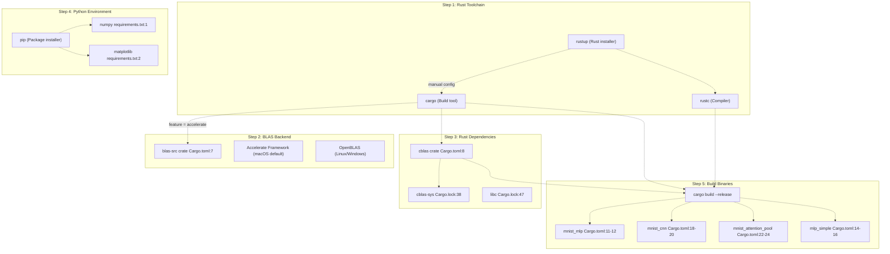
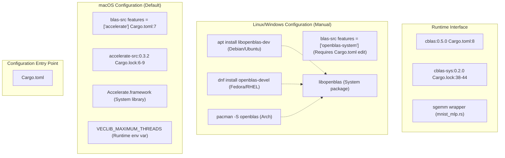
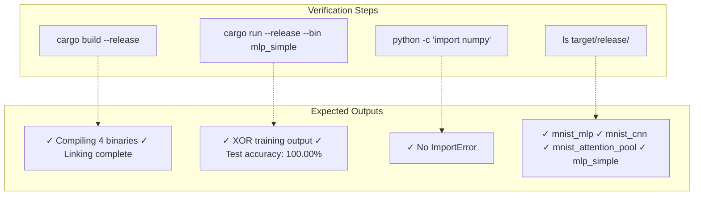

# Installation

> **Relevant source files**
> * [Cargo.lock](https://github.com/ThalesMMS/Rust-Neural-Networks/blob/0e978f90/Cargo.lock)
> * [Cargo.toml](https://github.com/ThalesMMS/Rust-Neural-Networks/blob/0e978f90/Cargo.toml)
> * [README.md](https://github.com/ThalesMMS/Rust-Neural-Networks/blob/0e978f90/README.md)
> * [requirements.txt](https://github.com/ThalesMMS/Rust-Neural-Networks/blob/0e978f90/requirements.txt)

This page provides detailed instructions for installing and configuring the Rust Neural Networks project, including the Rust toolchain, BLAS backend configuration, and Python dependencies. After completing these steps, you will be able to build and run all four neural network implementations (MLP, CNN, Attention, XOR) and use the Python visualization utilities.

For information about the MNIST dataset files and IDX format setup, see [MNIST Dataset Setup](2b%20MNIST-Dataset-Setup.md). For build system configuration details, see [Build System](6a%20Build-System.md).

---

## Prerequisites

Before installation, ensure you have:

* **Operating System**: macOS, Linux, or Windows
* **Internet Connection**: Required for downloading Rust toolchain and dependencies
* **Disk Space**: ~500 MB for Rust toolchain and compiled binaries
* **Administrator/sudo access**: May be required for BLAS library installation on Linux

---

## Installation Overview

The installation process follows this dependency flow:

**Installation Dependency Chain**



**Sources**: [Cargo.toml L1-L29](https://github.com/ThalesMMS/Rust-Neural-Networks/blob/0e978f90/Cargo.toml#L1-L29)

 [Cargo.lock L1-L77](https://github.com/ThalesMMS/Rust-Neural-Networks/blob/0e978f90/Cargo.lock#L1-L77)

 [requirements.txt L1-L3](https://github.com/ThalesMMS/Rust-Neural-Networks/blob/0e978f90/requirements.txt#L1-L3)

 README.md

---

## Step 1: Install Rust Toolchain

### Using rustup (Recommended)

Install Rust using `rustup`, the official installer and version manager:

**macOS and Linux:**

```
curl --proto '=https' --tlsv1.2 -sSf https://sh.rustup.rs | sh
```

**Windows:**
Download and run `rustup-init.exe` from [https://rustup.rs/](https://rustup.rs/)

### Post-Installation

After installation completes, restart your terminal and verify:

```
rustc --version  # Should output: rustc 1.x.xcargo --version  # Should output: cargo 1.x.x
```

The toolchain installs:

* `rustc`: Rust compiler
* `cargo`: Build tool and package manager (used for `cargo build --release`)
* Standard library and documentation

**Sources**: Project overview and setup

---

## Step 2: Configure BLAS Backend

The `mnist_mlp` binary requires a BLAS (Basic Linear Algebra Subprograms) implementation for matrix multiplication acceleration via the `sgemm` (single-precision general matrix multiply) operation. The project uses <FileRef file-url="[https L0](https://github.com/ThalesMMS/Rust-Neural-Networks/blob/0e978f90/blas-src#L0-L0)" 0  file-path="blas-src">Hii with platform-specific backends.

**Platform-Specific BLAS Configuration**



**Sources**: [Cargo.toml L6-L8](https://github.com/ThalesMMS/Rust-Neural-Networks/blob/0e978f90/Cargo.toml#L6-L8)

 [Cargo.lock L6-L44](https://github.com/ThalesMMS/Rust-Neural-Networks/blob/0e978f90/Cargo.lock#L6-L44)

 README.md

 **Sources**: [Project overview and setup](https://github.com/ThalesMMS/Rust-Neural-Networks/blob/0e978f90/README.md#L136-L137)

### macOS (Default Configuration)

The project is pre-configured for macOS using Apple's Accelerate framework. No changes required:

**Cargo.toml configuration (already present):**

```
[dependencies]blas-src = { version = "0.14", features = ["accelerate"] }cblas = "0.5"
```

**Optional: Thread Control**

By default, Accelerate may use all available CPU cores. To limit threading:

```
export VECLIB_MAXIMUM_THREADS=8  # Limit to 8 threads
```

Set this environment variable before running `cargo run --release --bin mnist_mlp`.

**Sources**: [Cargo.toml L6-L8](https://github.com/ThalesMMS/Rust-Neural-Networks/blob/0e978f90/Cargo.toml#L6-L8)

 README.md

 **Sources**: [Project overview and setup](https://github.com/ThalesMMS/Rust-Neural-Networks/blob/0e978f90/README.md#L133-L134)

### Linux Configuration

**1. Install OpenBLAS system library:**

| Distribution | Command |
| --- | --- |
| Debian/Ubuntu | `sudo apt-get install libopenblas-dev` |
| Fedora/RHEL | `sudo dnf install openblas-devel` |
| Arch Linux | `sudo pacman -S openblas` |

**2. Modify Cargo.toml:**

Replace line 7 in [Cargo.toml L7](https://github.com/ThalesMMS/Rust-Neural-Networks/blob/0e978f90/Cargo.toml#L7-L7)

:

```css
# Replace this:blas-src = { version = "0.14", features = ["accelerate"] }# With this:blas-src = { version = "0.14", features = ["openblas-system"] }
```

**3. Verify OpenBLAS is found:**

```
cargo cleancargo build --release --bin mnist_mlp
```

If the build succeeds, OpenBLAS is correctly linked.

**Sources**: Project overview and setup

 [Cargo.toml L7](https://github.com/ThalesMMS/Rust-Neural-Networks/blob/0e978f90/Cargo.toml#L7-L7)

### Windows Configuration

**1. Install OpenBLAS:**

Download pre-built OpenBLAS binaries from:

* [https://github.com/xianyi/OpenBLAS/releases](https://github.com/xianyi/OpenBLAS/releases)

Or install via package managers:

* **vcpkg**: `vcpkg install openblas`
* **MSYS2**: `pacman -S mingw-w64-x86_64-openblas`

**2. Set environment variables:**

```
set OPENBLAS_LIB=C:\path\to\openblas\libset PATH=%PATH%;C:\path\to\openblas\bin
```

**3. Modify Cargo.toml** (same as Linux):

```
blas-src = { version = "0.14", features = ["openblas-system"] }
```

**Sources**: Project overview and setup

 [Cargo.toml L7](https://github.com/ThalesMMS/Rust-Neural-Networks/blob/0e978f90/Cargo.toml#L7-L7)

### Alternative: Intel MKL (All Platforms)

For Intel processors, Math Kernel Library (MKL) can provide better performance:

```
blas-src = { version = "0.14", features = ["intel-mkl-system"] }
```

Install Intel MKL from: [https://www.intel.com/content/www/us/en/developer/tools/oneapi/onemkl.html](https://www.intel.com/content/www/us/en/developer/tools/oneapi/onemkl.html)

**Sources**: [Cargo.toml L7](https://github.com/ThalesMMS/Rust-Neural-Networks/blob/0e978f90/Cargo.toml#L7-L7)

---

## Step 3: Install Python Dependencies

The Python utilities (`digit_recognizer.py`, `plot_comparison.py`) require NumPy and Matplotlib.

### Install via pip

```
pip install -r requirements.txt
```

This installs:

* **numpy**: Array operations and model inference ([requirements.txt L1](https://github.com/ThalesMMS/Rust-Neural-Networks/blob/0e978f90/requirements.txt#L1-L1) )
* **matplotlib**: Training curve visualization ([requirements.txt L2](https://github.com/ThalesMMS/Rust-Neural-Networks/blob/0e978f90/requirements.txt#L2-L2) )

### Install with conda (Alternative)

```
conda install numpy matplotlib
```

### Verify Installation

```python
python -c "import numpy; import matplotlib; print('Dependencies OK')"
```

Expected output: `Dependencies OK`

### Additional GUI Dependencies

The `digit_recognizer.py` GUI requires:

* **tkinter**: Usually pre-installed with Python. If missing: * Ubuntu/Debian: `sudo apt-get install python3-tk` * macOS: Included with Python * Windows: Included with Python
* **PIL (Pillow)**: Auto-installed by matplotlib

**Sources**: [requirements.txt L1-L3](https://github.com/ThalesMMS/Rust-Neural-Networks/blob/0e978f90/requirements.txt#L1-L3)

 **Sources**: [Project overview and setup](https://github.com/ThalesMMS/Rust-Neural-Networks/blob/0e978f90/README.md#L181-L185)

---

## Step 4: Build Project Binaries

### Build All Targets

```
cargo build --release
```

This compiles four binary targets defined in [Cargo.toml L10-L24](https://github.com/ThalesMMS/Rust-Neural-Networks/blob/0e978f90/Cargo.toml#L10-L24)

:

| Binary Target | Source File | Purpose |
| --- | --- | --- |
| `mnist_mlp` | [mnist_mlp.rs](https://github.com/ThalesMMS/Rust-Neural-Networks/blob/0e978f90/mnist_mlp.rs) | MLP with BLAS acceleration |
| `mnist_cnn` | [mnist_cnn.rs](https://github.com/ThalesMMS/Rust-Neural-Networks/blob/0e978f90/mnist_cnn.rs) | CNN with manual convolution |
| `mnist_attention_pool` | [mnist_attention_pool.rs](https://github.com/ThalesMMS/Rust-Neural-Networks/blob/0e978f90/mnist_attention_pool.rs) | Self-attention model |
| `mlp_simple` | [mlp_simple.rs](https://github.com/ThalesMMS/Rust-Neural-Networks/blob/0e978f90/mlp_simple.rs) | XOR demonstration |

Binaries are output to `target/release/`.

### Release Profile Optimizations

The project enables aggressive optimizations in [Cargo.toml L26-L29](https://github.com/ThalesMMS/Rust-Neural-Networks/blob/0e978f90/Cargo.toml#L26-L29)

:

```
[profile.release]lto = true            # Link-time optimizationcodegen-units = 1     # Single codegen unit for maximum optimization
```

These settings increase compile time but significantly improve runtime performance.

**Sources**: [Cargo.toml L10-L29](https://github.com/ThalesMMS/Rust-Neural-Networks/blob/0e978f90/Cargo.toml#L10-L29)

 **Sources**: [Project overview and setup](https://github.com/ThalesMMS/Rust-Neural-Networks/blob/0e978f90/README.md#L100-L104)

### CPU-Specific Optimizations

For additional performance, enable native CPU instruction sets:

```
RUSTFLAGS="-C target-cpu=native" cargo build --release
```

This enables SIMD instructions (AVX, AVX2, FMA on x86; NEON on ARM).

**Sources**: Project overview and setup

---

## Step 5: Verify Installation

**Build System Verification Flow**



**Sources**: README.md

### Test 1: Build Verification

```
cargo build --release
```

**Expected output:**

```
Compiling netural-network-cpp v0.1.0
    Finished release [optimized] target(s) in X.XXs
```

### Test 2: Run Simple Binary

```
cargo run --release --bin mlp_simple
```

**Expected output (truncated):**

```
Epoch 1000000: Loss = 0.0001
Test accuracy: 100.00%
Training completed in 0.74s
```

This verifies:

* Rust compilation works
* Binary execution succeeds
* Basic neural network training functions

**Sources**: Project overview and setup

 **Sources**: [Project overview and setup](https://github.com/ThalesMMS/Rust-Neural-Networks/blob/0e978f90/README.md#L147-L147)

### Test 3: Verify BLAS Integration (macOS/Linux)

```
cargo run --release --bin mnist_mlp 2>&1 | head -n 5
```

**Expected output:**

```
Loading training data...
Loading test data...
Initializing model...
Starting training...
```

If this fails with "undefined symbol: sgemm_", BLAS is not correctly configured. Revisit [Step 2](https://github.com/ThalesMMS/Rust-Neural-Networks/blob/0e978f90/README.md#L2-Installation)

**Sources**: Project overview and setup

### Test 4: Python Dependencies

```python
python -c "import numpy, matplotlib; print('Python OK')"
```

**Expected output:**

```
Python OK
```

### Test 5: Check Binary Outputs

```
ls -lh target/release/ | grep -E "(mnist_mlp|mnist_cnn|mnist_attention_pool|mlp_simple)"
```

**Expected output:**

```
-rwxr-xr-x  mnist_mlp
-rwxr-xr-x  mnist_cnn
-rwxr-xr-x  mnist_attention_pool
-rwxr-xr-x  mlp_simple
```

**Sources**: [Cargo.toml L10-L24](https://github.com/ThalesMMS/Rust-Neural-Networks/blob/0e978f90/Cargo.toml#L10-L24)

---

## Environment Variables Reference

| Variable | Platform | Purpose | Example |
| --- | --- | --- | --- |
| `VECLIB_MAXIMUM_THREADS` | macOS | Limit Accelerate thread count | `export VECLIB_MAXIMUM_THREADS=8` |
| `RUSTFLAGS` | All | Enable CPU-specific optimizations | `export RUSTFLAGS="-C target-cpu=native"` |
| `OPENBLAS_NUM_THREADS` | Linux/Windows | Limit OpenBLAS thread count | `export OPENBLAS_NUM_THREADS=8` |

**Combining optimizations:**

```
# macOSRUSTFLAGS="-C target-cpu=native" VECLIB_MAXIMUM_THREADS=8 cargo run --release --bin mnist_mlp# Linux/WindowsRUSTFLAGS="-C target-cpu=native" OPENBLAS_NUM_THREADS=8 cargo run --release --bin mnist_mlp
```

**Sources**: Project overview and setup

---

## Common Issues

### Issue: "undefined reference to sgemm_"

**Cause**: BLAS library not found during linking.

**Solution**:

* **macOS**: Verify Accelerate framework exists: `ls /System/Library/Frameworks/Accelerate.framework`
* **Linux**: Install OpenBLAS: `sudo apt-get install libopenblas-dev`
* **Windows**: Verify `OPENBLAS_LIB` environment variable is set

### Issue: "cannot find -lopenblas"

**Cause**: OpenBLAS system library not installed (Linux/Windows).

**Solution**: Install OpenBLAS package for your distribution (see [Linux Configuration](https://github.com/ThalesMMS/Rust-Neural-Networks/blob/0e978f90/README.md#Linux-Configuration)).

### Issue: Python "ModuleNotFoundError: No module named 'numpy'"

**Cause**: Python dependencies not installed.

**Solution**: Run `pip install -r requirements.txt`

### Issue: Slow Training Performance

**Cause**: Missing CPU-specific optimizations or threading limits.

**Solution**:

1. Enable native CPU instructions: `RUSTFLAGS="-C target-cpu=native" cargo build --release`
2. Increase thread count: `VECLIB_MAXIMUM_THREADS=16` (macOS) or `OPENBLAS_NUM_THREADS=16` (Linux)
3. Verify release mode: Always use `--release` flag

**Sources**: Project overview and setup

---

## Next Steps

After successful installation:

1. **Set up MNIST dataset**: See [MNIST Dataset Setup](2b%20MNIST-Dataset-Setup.md) for instructions on downloading and organizing the IDX files
2. **Run your first model**: See [MNIST MLP](3a%20MNIST-MLP.md) to train the MLP model
3. **Visualize results**: See [Training Pipeline](4b%20Training-Pipeline.md) to plot training curves

**Sources**: Project overview and setup


)

### On this page

* [Installation](#2.1-installation)
* [Prerequisites](#2.1-prerequisites)
* [Installation Overview](#2.1-installation-overview)
* [Step 1: Install Rust Toolchain](#2.1-step-1-install-rust-toolchain)
* [Using rustup (Recommended)](#2.1-using-rustup-recommended)
* [Post-Installation](#2.1-post-installation)
* [Step 2: Configure BLAS Backend](#2.1-step-2-configure-blas-backend)
* [macOS (Default Configuration)](#2.1-macos-default-configuration)
* [Linux Configuration](#2.1-linux-configuration)
* [Windows Configuration](#2.1-windows-configuration)
* [Alternative: Intel MKL (All Platforms)](#2.1-alternative-intel-mkl-all-platforms)
* [Step 3: Install Python Dependencies](#2.1-step-3-install-python-dependencies)
* [Install via pip](#2.1-install-via-pip)
* [Install with conda (Alternative)](#2.1-install-with-conda-alternative)
* [Verify Installation](#2.1-verify-installation)
* [Additional GUI Dependencies](#2.1-additional-gui-dependencies)
* [Step 4: Build Project Binaries](#2.1-step-4-build-project-binaries)
* [Build All Targets](#2.1-build-all-targets)
* [Release Profile Optimizations](#2.1-release-profile-optimizations)
* [CPU-Specific Optimizations](#2.1-cpu-specific-optimizations)
* [Step 5: Verify Installation](#2.1-step-5-verify-installation)
* [Test 1: Build Verification](#2.1-test-1-build-verification)
* [Test 2: Run Simple Binary](#2.1-test-2-run-simple-binary)
* [Test 3: Verify BLAS Integration (macOS/Linux)](#2.1-test-3-verify-blas-integration-macoslinux)
* [Test 4: Python Dependencies](#2.1-test-4-python-dependencies)
* [Test 5: Check Binary Outputs](#2.1-test-5-check-binary-outputs)
* [Environment Variables Reference](#2.1-environment-variables-reference)
* [Common Issues](#2.1-common-issues)
* [Issue: "undefined reference to sgemm_ "](#2.1-issue-undefined-reference-to-object-object)
* [Issue: "cannot find -lopenblas"](#2.1-issue-cannot-find--lopenblas)
* [Issue: Python "ModuleNotFoundError: No module named 'numpy'"](#2.1-issue-python-modulenotfounderror-no-module-named-numpy)
* [Issue: Slow Training Performance](#2.1-issue-slow-training-performance)
* [Next Steps](#2.1-next-steps)

Ask Devin about Rust-Neural-Networks