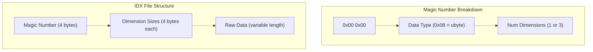
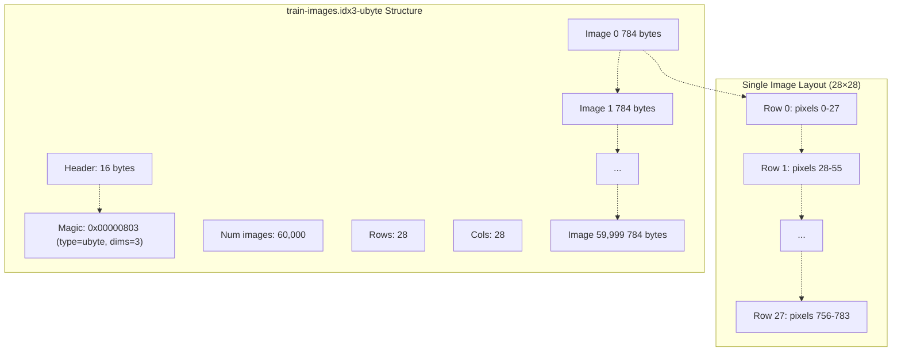
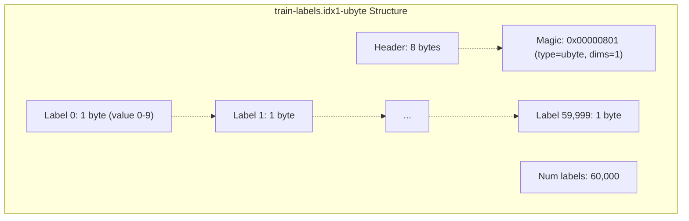
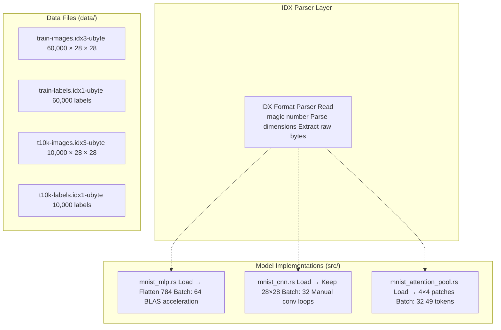
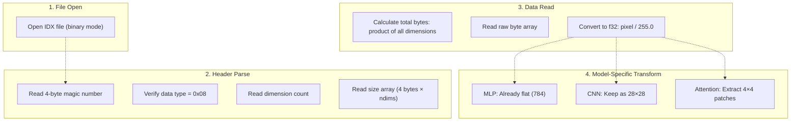

# MNIST Dataset Setup

> **Relevant source files**
> * [README.md](https://github.com/ThalesMMS/Rust-Neural-Networks/blob/0e978f90/README.md)
> * [data/t10k-images.idx3-ubyte](https://github.com/ThalesMMS/Rust-Neural-Networks/blob/0e978f90/data/t10k-images.idx3-ubyte)
> * [data/t10k-labels.idx1-ubyte](https://github.com/ThalesMMS/Rust-Neural-Networks/blob/0e978f90/data/t10k-labels.idx1-ubyte)
> * [data/train-images.idx3-ubyte](https://github.com/ThalesMMS/Rust-Neural-Networks/blob/0e978f90/data/train-images.idx3-ubyte)
> * [data/train-labels.idx1-ubyte](https://github.com/ThalesMMS/Rust-Neural-Networks/blob/0e978f90/data/train-labels.idx1-ubyte)

## Purpose and Scope

This document covers the MNIST dataset structure, file format specifications, and directory organization required for training neural network models in this repository. It explains the IDX binary format, file naming conventions, and how the Rust training code loads and parses these files.

For installation of dependencies and build tools, see [Installation](2a%20Installation.md). For information about specific model architectures that use this data, see [Model Implementations](3%20Model-Implementations.md).

**Sources**: Project overview and setup

---

## Dataset Overview

The MNIST (Modified National Institute of Standards and Technology) database consists of grayscale handwritten digit images (0-9) used for training and evaluating digit classification models. The dataset is pre-split into training and test sets with the following specifications:

| Split | Images | Labels | Image Dimensions | Pixel Range |
| --- | --- | --- | --- | --- |
| Training | 60,000 | 60,000 | 28×28 | 0-255 (uint8) |
| Test | 10,000 | 10,000 | 28×28 | 0-255 (uint8) |

Each image is a single-channel (grayscale) 28×28 pixel grid, stored as unsigned 8-bit integers representing pixel intensities. Labels are single bytes representing digits 0 through 9.

**Sources**: Project overview and setup

 High-Level Diagrams (MNIST Dataset section)

---

## Required Files and Directory Structure

The repository expects MNIST data files to be organized in the `data/` directory at the project root. All four files must be present with exact naming conventions:

```
Rust-Neural-Networks/
├── data/
│   ├── train-images.idx3-ubyte
│   ├── train-labels.idx1-ubyte
│   ├── t10k-images.idx3-ubyte
│   └── t10k-labels.idx1-ubyte
├── src/
│   ├── mnist_mlp.rs
│   ├── mnist_cnn.rs
│   └── mnist_attention_pool.rs
└── Cargo.toml
```

### File Naming Specifications

| File | Purpose | Format | Size (approx) |
| --- | --- | --- | --- |
| `train-images.idx3-ubyte` | Training images | IDX3 (3D tensor) | ~47 MB |
| `train-labels.idx1-ubyte` | Training labels | IDX1 (1D vector) | ~60 KB |
| `t10k-images.idx3-ubyte` | Test images | IDX3 (3D tensor) | ~7.8 MB |
| `t10k-labels.idx1-ubyte` | Test labels | IDX1 (1D vector) | ~10 KB |

**Sources**: Project overview and setup

 [data/t10k-images.idx3-ubyte L1](https://github.com/ThalesMMS/Rust-Neural-Networks/blob/0e978f90/data/t10k-images.idx3-ubyte#L1-L1)

 [data/t10k-labels.idx1-ubyte L1](https://github.com/ThalesMMS/Rust-Neural-Networks/blob/0e978f90/data/t10k-labels.idx1-ubyte#L1-L1)

---

## IDX File Format Specification

MNIST files use the IDX binary format, a simple format for storing vectors and multidimensional matrices of various numerical types. The format consists of a header followed by raw data bytes.

### IDX Format Structure



### Header Format

| Field | Bytes | Description | Example (Images) | Example (Labels) |
| --- | --- | --- | --- | --- |
| Magic byte 1 | 1 | Always 0x00 | 0x00 | 0x00 |
| Magic byte 2 | 1 | Always 0x00 | 0x00 | 0x00 |
| Data type | 1 | 0x08 = unsigned byte | 0x08 | 0x08 |
| Dimensions | 1 | Number of dimensions | 0x03 (3D) | 0x01 (1D) |
| Size[0] | 4 | First dimension (big-endian) | 60,000 or 10,000 | 60,000 or 10,000 |
| Size[1] | 4 | Second dimension (images only) | 28 | N/A |
| Size[2] | 4 | Third dimension (images only) | 28 | N/A |
| Data | Variable | Raw pixel/label bytes | 60000×28×28 bytes | 60000 bytes |

**Note**: All multi-byte integers in IDX format are stored in big-endian byte order (most significant byte first).

### Image File Layout (IDX3)



### Label File Layout (IDX1)



**Sources**: [data/t10k-images.idx3-ubyte L1](https://github.com/ThalesMMS/Rust-Neural-Networks/blob/0e978f90/data/t10k-images.idx3-ubyte#L1-L1)

 [data/t10k-labels.idx1-ubyte L1](https://github.com/ThalesMMS/Rust-Neural-Networks/blob/0e978f90/data/t10k-labels.idx1-ubyte#L1-L1)

 High-Level Diagrams (MNIST Training Pipeline)

---

## Downloading the Dataset

### Official Sources

The MNIST dataset can be downloaded from two primary sources:

| Source | URL | Format | Notes |
| --- | --- | --- | --- |
| Yann LeCun's Website | [http://yann.lecun.com/exdb/mnist/](http://yann.lecun.com/exdb/mnist/) | Gzipped IDX files | Original source, requires gunzip |
| Kaggle | [https://www.kaggle.com/datasets/hojjatk/mnist-dataset](https://www.kaggle.com/datasets/hojjatk/mnist-dataset) | Uncompressed IDX files | Ready to use, no extraction needed |

### Download and Setup Steps

1. **Create data directory** (if not exists): ``` mkdir -p data ```
2. **Download files** from Kaggle (recommended) or Yann LeCun's site
3. **If downloading from Yann LeCun's site**, decompress the files: ``` gunzip data/*.gz ```
4. **Verify file presence**: ``` ls -lh data/# Should show all four .idx*-ubyte files ```
5. **Verify file sizes** (approximate): * `train-images.idx3-ubyte`: ~47 MB * `train-labels.idx1-ubyte`: ~60 KB * `t10k-images.idx3-ubyte`: ~7.8 MB * `t10k-labels.idx1-ubyte`: ~10 KB

**Sources**: Project overview and setup

---

## Data Loading Architecture

### File-to-Model Mapping



### Data Processing Pipeline by Model

Each model implementation loads MNIST data and processes it according to its architecture requirements:

| Model | Input Shape | Preprocessing | Batch Size | File References |
| --- | --- | --- | --- | --- |
| **mnist_mlp** | 784 (flattened) | Flatten 28×28 → 784 | 64 | [src/mnist_mlp.rs](https://github.com/ThalesMMS/Rust-Neural-Networks/blob/0e978f90/src/mnist_mlp.rs) |
| **mnist_cnn** | 28×28×1 | Keep spatial structure | 32 | [src/mnist_cnn.rs](https://github.com/ThalesMMS/Rust-Neural-Networks/blob/0e978f90/src/mnist_cnn.rs) |
| **mnist_attention_pool** | 7×7×16 patches | Patchify to 49 tokens | 32 | [src/mnist_attention_pool.rs](https://github.com/ThalesMMS/Rust-Neural-Networks/blob/0e978f90/src/mnist_attention_pool.rs) |

### Loading Sequence



**Sources**: High-Level Diagrams (Overall System Architecture, MNIST Training Pipeline), README.md

---

## Dataset Statistics and Validation

### Expected Dataset Properties

| Property | Value | Validation Method |
| --- | --- | --- |
| Training samples | 60,000 | Parse header `Size[0]` from train-images |
| Test samples | 10,000 | Parse header `Size[0]` from t10k-images |
| Image height | 28 | Parse header `Size[1]` from image files |
| Image width | 28 | Parse header `Size[2]` from image files |
| Pixel data type | uint8 (0-255) | Parse header byte 3 = 0x08 |
| Label range | 0-9 | Verify all label bytes ≤ 9 |
| Class balance | ~6,000 per digit (training) | Count label occurrences |

### Quick Validation Checks

To verify correct dataset setup:

1. **File existence**: ``` test -f data/train-images.idx3-ubyte && \test -f data/train-labels.idx1-ubyte && \test -f data/t10k-images.idx3-ubyte && \test -f data/t10k-labels.idx1-ubyte && \echo "All files present" ```
2. **Magic number verification** (first 4 bytes): * Images: `00 00 08 03` (ubyte, 3D) * Labels: `00 00 08 01` (ubyte, 1D) ``` # Check train-images magic numberxxd -l 4 data/train-images.idx3-ubyte# Expected: 00000000: 0000 0803# Check train-labels magic numberxxd -l 4 data/train-labels.idx1-ubyte# Expected: 00000000: 0000 0801 ```
3. **Dimension verification** (bytes 4-7, big-endian): ``` # Check number of training images (should be 60,000 = 0x0000EA60)xxd -s 4 -l 4 data/train-images.idx3-ubyte ```

**Sources**: [data/t10k-images.idx3-ubyte L1](https://github.com/ThalesMMS/Rust-Neural-Networks/blob/0e978f90/data/t10k-images.idx3-ubyte#L1-L1)

 [data/t10k-labels.idx1-ubyte L1](https://github.com/ThalesMMS/Rust-Neural-Networks/blob/0e978f90/data/t10k-labels.idx1-ubyte#L1-L1)

 **Sources**: [Project overview and setup](https://github.com/ThalesMMS/Rust-Neural-Networks/blob/0e978f90/README.md#L151-L163)

---

## Training Execution with MNIST Data

Once the dataset is properly configured in `data/`, the models can be trained:

```
# Train MLP (uses BLAS acceleration, fastest)cargo run --release --bin mnist_mlp# Train CNN (manual convolution loops)cargo run --release --bin mnist_cnn# Train Attention modelcargo run --release --bin mnist_attention_pool
```

Each model will automatically:

1. Load the four IDX files from `data/`
2. Parse headers and validate format
3. Read pixel data and normalize to [0, 1]
4. Shuffle training indices using `SimpleRng`
5. Train for the configured number of epochs
6. Evaluate on the test set
7. Report final accuracy

**Expected output structure**:

```python
Loading training data from data/train-images.idx3-ubyte...
Loaded 60000 training samples
Loading test data from data/t10k-images.idx3-ubyte...
Loaded 10000 test samples
Training...
Epoch 1/10, Loss: 0.xxxx
...
Final test accuracy: xx.xx%
```

**Sources**: README.md

 High-Level Diagrams (MNIST Training Pipeline Architecture)

---

## Troubleshooting

### Common Issues

| Problem | Symptom | Solution |
| --- | --- | --- |
| Files not found | `No such file or directory` error | Verify `data/` directory exists and contains all 4 files with exact names |
| Corrupted files | Magic number mismatch error | Re-download files, ensure no text-mode transfer corruption |
| Incorrect format | Dimension parsing error | Ensure files are uncompressed (not `.gz`), verify with `xxd` |
| Insufficient memory | Out of memory during load | System needs ~120 MB RAM for full dataset (60K + 10K images) |
| Permission errors | Cannot read file | Run `chmod 644 data/*.idx*-ubyte` |

### Debug Commands

```
# Verify file typesfile data/*.idx*-ubyte# All should show "data"# Check file sizesls -lh data/# train-images: ~47M, train-labels: ~60K# t10k-images: ~7.8M, t10k-labels: ~10K# Inspect binary headershexdump -C data/train-images.idx3-ubyte | head -n 2# First line should start: 00 00 08 03 00 00 ea 60
```

**Sources**: Project overview and setup

 [data/t10k-images.idx3-ubyte L1](https://github.com/ThalesMMS/Rust-Neural-Networks/blob/0e978f90/data/t10k-images.idx3-ubyte#L1-L1)


)

### On this page

* [MNIST Dataset Setup](#2.2-mnist-dataset-setup)
* [Purpose and Scope](#2.2-purpose-and-scope)
* [Dataset Overview](#2.2-dataset-overview)
* [Required Files and Directory Structure](#2.2-required-files-and-directory-structure)
* [File Naming Specifications](#2.2-file-naming-specifications)
* [IDX File Format Specification](#2.2-idx-file-format-specification)
* [IDX Format Structure](#2.2-idx-format-structure)
* [Header Format](#2.2-header-format)
* [Image File Layout (IDX3)](#2.2-image-file-layout-idx3)
* [Label File Layout (IDX1)](#2.2-label-file-layout-idx1)
* [Downloading the Dataset](#2.2-downloading-the-dataset)
* [Official Sources](#2.2-official-sources)
* [Download and Setup Steps](#2.2-download-and-setup-steps)
* [Data Loading Architecture](#2.2-data-loading-architecture)
* [File-to-Model Mapping](#2.2-file-to-model-mapping)
* [Data Processing Pipeline by Model](#2.2-data-processing-pipeline-by-model)
* [Loading Sequence](#2.2-loading-sequence)
* [Dataset Statistics and Validation](#2.2-dataset-statistics-and-validation)
* [Expected Dataset Properties](#2.2-expected-dataset-properties)
* [Quick Validation Checks](#2.2-quick-validation-checks)
* [Training Execution with MNIST Data](#2.2-training-execution-with-mnist-data)
* [Troubleshooting](#2.2-troubleshooting)
* [Common Issues](#2.2-common-issues)
* [Debug Commands](#2.2-debug-commands)

Ask Devin about Rust-Neural-Networks