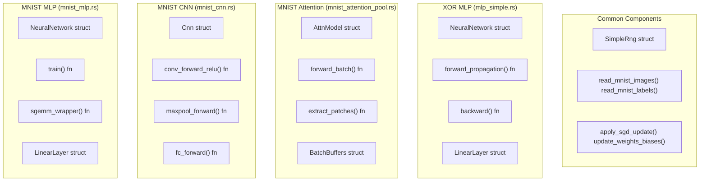
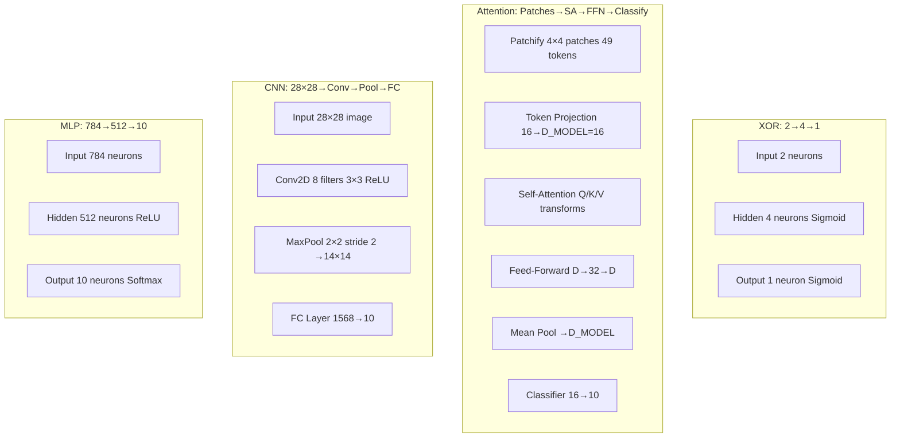
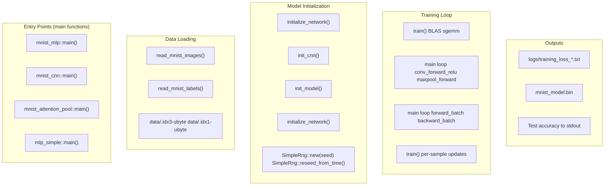

# Model Implementations

> **Relevant source files**
> * [README.md](https://github.com/ThalesMMS/Rust-Neural-Networks/blob/0e978f90/README.md)
> * [mlp_simple.rs](https://github.com/ThalesMMS/Rust-Neural-Networks/blob/0e978f90/mlp_simple.rs)
> * [mnist_attention_pool.rs](https://github.com/ThalesMMS/Rust-Neural-Networks/blob/0e978f90/mnist_attention_pool.rs)
> * [mnist_cnn.rs](https://github.com/ThalesMMS/Rust-Neural-Networks/blob/0e978f90/mnist_cnn.rs)
> * [mnist_mlp.rs](https://github.com/ThalesMMS/Rust-Neural-Networks/blob/0e978f90/mnist_mlp.rs)

## Purpose and Scope

This page provides an overview of the four neural network implementations in the repository, comparing their architectures, performance characteristics, and use cases. Each implementation demonstrates different neural network concepts and optimization strategies for educational purposes.

For detailed documentation on individual models, see:

* MNIST Multi-Layer Perceptron: [MNIST MLP](3a%20MNIST-MLP.md)
* MNIST Convolutional Neural Network: [MNIST CNN](3b%20MNIST-CNN.md)
* MNIST Attention-based Model: [MNIST Attention Model](3c%20MNIST-Attention-Model.md)
* Simple XOR Problem: [Simple XOR MLP](3d%20Simple-XOR-MLP.md)

For information about the training pipeline shared across models, see [Training Visualization](5b%20Training-Visualization.md). For BLAS acceleration details specific to the MLP, see [BLAS Integration](5a%20BLAS-Integration.md).

## Implementation Overview

The repository implements four distinct neural network architectures, each serving different educational and practical purposes:

| Model | Source File | Primary Purpose | Architecture Type |
| --- | --- | --- | --- |
| MNIST MLP | `mnist_mlp.rs` | Production-grade MNIST classification | Fully-connected with BLAS acceleration |
| MNIST CNN | `mnist_cnn.rs` | Educational CNN demonstration | Convolutional layers with manual loops |
| MNIST Attention | `mnist_attention_pool.rs` | Transformer-style attention mechanism | Patch-based self-attention |
| XOR MLP | `mlp_simple.rs` | Basic neural network validation | Simple 2-layer network |

All implementations use custom training loops without external ML frameworks, implementing forward propagation, backpropagation, and SGD optimization from scratch.

**Sources**: [README.md L5-L18](https://github.com/ThalesMMS/Rust-Neural-Networks/blob/0e978f90/README.md#L5-L18)

 README.md

## Model-to-Code Entity Mapping



**Sources**: [mnist_mlp.rs L70-L83](https://github.com/ThalesMMS/Rust-Neural-Networks/blob/0e978f90/mnist_mlp.rs#L70-L83)

 [mnist_cnn.rs L219-L227](https://github.com/ThalesMMS/Rust-Neural-Networks/blob/0e978f90/mnist_cnn.rs#L219-L227)

 [mnist_attention_pool.rs L219-L240](https://github.com/ThalesMMS/Rust-Neural-Networks/blob/0e978f90/mnist_attention_pool.rs#L219-L240)

 [mlp_simple.rs L64-L76](https://github.com/ThalesMMS/Rust-Neural-Networks/blob/0e978f90/mlp_simple.rs#L64-L76)

## Architecture Comparison

### Layer Topology



**Sources**: README.md

 README.md

 README.md

 README.md

### Implementation Characteristics

| Feature | MLP | CNN | Attention | XOR |
| --- | --- | --- | --- | --- |
| **Optimization** | BLAS/GEMM | Manual loops | Manual loops | Manual loops |
| **Data Type** | `f32` | `f32` | `f32` | `f64` |
| **Batch Size** | 64 | 32 | 32 | N/A (per-sample) |
| **Activation** | ReLU | ReLU | ReLU | Sigmoid |
| **Loss Function** | Cross-entropy | Cross-entropy | Cross-entropy | MSE |
| **Key Structs** | `NeuralNetwork`, `LinearLayer` | `Cnn` | `AttnModel`, `BatchBuffers`, `Grads` | `NeuralNetwork`, `LinearLayer` |
| **Parameter Init** | Xavier/Glorot | Xavier/Glorot | Xavier/Glorot | Uniform [-0.5, 0.5] |

**Sources**: [mnist_mlp.rs L9-L18](https://github.com/ThalesMMS/Rust-Neural-Networks/blob/0e978f90/mnist_mlp.rs#L9-L18)

 [mnist_cnn.rs L28-L41](https://github.com/ThalesMMS/Rust-Neural-Networks/blob/0e978f90/mnist_cnn.rs#L28-L41)

 [mnist_attention_pool.rs L38-L46](https://github.com/ThalesMMS/Rust-Neural-Networks/blob/0e978f90/mnist_attention_pool.rs#L38-L46)

 [mlp_simple.rs L4-L10](https://github.com/ThalesMMS/Rust-Neural-Networks/blob/0e978f90/mlp_simple.rs#L4-L10)

## Performance Benchmarks

The following benchmarks were collected on local hardware using default hyperparameters:

| Model | Epochs | Batch Size | Training Time (s) | Test Accuracy (%) | Implementation Strategy |
| --- | --- | --- | --- | --- | --- |
| **MNIST MLP** | 10 | 64 | **3.33** | **94.17** | BLAS-accelerated GEMM |
| **MNIST CNN** | 3 | 32 | 11.24 | 91.93 | Manual convolution loops |
| **MNIST Attention** | 5 | 32 | 33.88 | 38.55 | Manual attention computation |
| **XOR MLP** | 1,000,000 | N/A | 0.74 | 100.00 | Educational validation |

### Performance Analysis

**MLP Performance**: The BLAS-accelerated implementation achieves the best accuracy and fastest training time. Matrix multiplications via `sgemm_wrapper` leverage platform-optimized BLAS libraries (Accelerate on macOS, OpenBLAS on Linux).

**CNN Performance**: Despite using explicit loops for convolution, the CNN achieves competitive accuracy. The 3× slower training compared to MLP is expected due to the lack of BLAS optimization in the convolution kernels at [mnist_cnn.rs L260-L303](https://github.com/ThalesMMS/Rust-Neural-Networks/blob/0e978f90/mnist_cnn.rs#L260-L303)

**Attention Performance**: The low accuracy (38.55%) reflects the minimal model capacity (D=16, FF=32) and limited training (5 epochs). The 10× slowdown versus MLP is due to the quadratic self-attention computation over 49 tokens at [mnist_attention_pool.rs L557-L591](https://github.com/ThalesMMS/Rust-Neural-Networks/blob/0e978f90/mnist_attention_pool.rs#L557-L591)

**XOR Performance**: The simple 2-4-1 architecture achieves perfect accuracy on the 4-sample XOR dataset, validating the core backpropagation implementation.

**Sources**: Project overview and setup

## Code Structure and Data Flow



**Sources**: [mnist_mlp.rs L622-L664](https://github.com/ThalesMMS/Rust-Neural-Networks/blob/0e978f90/mnist_mlp.rs#L622-L664)

 [mnist_cnn.rs L599-L704](https://github.com/ThalesMMS/Rust-Neural-Networks/blob/0e978f90/mnist_cnn.rs#L599-L704)

 [mnist_attention_pool.rs L1169-L1256](https://github.com/ThalesMMS/Rust-Neural-Networks/blob/0e978f90/mnist_attention_pool.rs#L1169-L1256)

 [mlp_simple.rs L236-L248](https://github.com/ThalesMMS/Rust-Neural-Networks/blob/0e978f90/mlp_simple.rs#L236-L248)

## Choosing the Right Model

### Use Case Guide

**MNIST MLP (`mnist_mlp.rs`)**:

* **When to use**: Production MNIST classification, learning BLAS integration, benchmarking
* **Advantages**: Fastest training, highest accuracy, model serialization support
* **Key learning**: BLAS acceleration via `cblas::sgemm`, batched matrix operations
* **Binary target**: `cargo run --release --bin mnist_mlp`

**MNIST CNN (`mnist_cnn.rs`)**:

* **When to use**: Understanding convolution operations, spatial feature learning
* **Advantages**: Educational clarity with explicit loops, demonstrates CNN fundamentals
* **Key learning**: Manual convolution at [mnist_cnn.rs L260-L303](https://github.com/ThalesMMS/Rust-Neural-Networks/blob/0e978f90/mnist_cnn.rs#L260-L303)  max pooling with argmax tracking at [mnist_cnn.rs L309-L355](https://github.com/ThalesMMS/Rust-Neural-Networks/blob/0e978f90/mnist_cnn.rs#L309-L355)
* **Binary target**: `cargo run --release --bin mnist_cnn`

**MNIST Attention (`mnist_attention_pool.rs`)**:

* **When to use**: Learning transformer architectures, self-attention mechanisms
* **Advantages**: Modern architecture, demonstrates patch-based tokenization
* **Key learning**: Self-attention computation at [mnist_attention_pool.rs L557-L591](https://github.com/ThalesMMS/Rust-Neural-Networks/blob/0e978f90/mnist_attention_pool.rs#L557-L591)  token-wise feed-forward at [mnist_attention_pool.rs L593-L623](https://github.com/ThalesMMS/Rust-Neural-Networks/blob/0e978f90/mnist_attention_pool.rs#L593-L623)
* **Limitations**: Low accuracy with current hyperparameters (D=16, FF=32, 5 epochs)
* **Binary target**: `cargo run --release --bin mnist_attention_pool`

**XOR MLP (`mlp_simple.rs`)**:

* **When to use**: Validating backpropagation implementation, teaching basic neural networks
* **Advantages**: Minimal code, perfect accuracy on simple problem
* **Key learning**: Backpropagation fundamentals at [mlp_simple.rs L123-L146](https://github.com/ThalesMMS/Rust-Neural-Networks/blob/0e978f90/mlp_simple.rs#L123-L146)
* **Binary target**: `cargo run --release --bin mlp_simple`

**Sources**: README.md

 [Cargo.toml L1-L20](https://github.com/ThalesMMS/Rust-Neural-Networks/blob/0e978f90/Cargo.toml#L1-L20)

## Common Implementation Patterns

All four implementations share several design patterns:

### 1. Custom RNG (SimpleRng)

Each implementation includes an identical `SimpleRng` struct using xorshift for reproducible initialization:

* **Purpose**: Avoid external dependencies, ensure reproducibility
* **Methods**: `new(seed)`, `reseed_from_time()`, `next_u32()`, `gen_range_f32()`
* **Implementation**: [mnist_mlp.rs L21-L69](https://github.com/ThalesMMS/Rust-Neural-Networks/blob/0e978f90/mnist_mlp.rs#L21-L69)  [mnist_cnn.rs L44-L96](https://github.com/ThalesMMS/Rust-Neural-Networks/blob/0e978f90/mnist_cnn.rs#L44-L96)  [mnist_attention_pool.rs L48-L101](https://github.com/ThalesMMS/Rust-Neural-Networks/blob/0e978f90/mnist_attention_pool.rs#L48-L101)  [mlp_simple.rs L13-L52](https://github.com/ThalesMMS/Rust-Neural-Networks/blob/0e978f90/mlp_simple.rs#L13-L52)

### 2. IDX Format Parsing

MNIST implementations share IDX file parsing logic:

* **Format**: Big-endian binary format with magic number, dimensions, and pixel data
* **Functions**: `read_mnist_images()`, `read_mnist_labels()`, `read_be_u32()`
* **Normalization**: Pixel values scaled from [0, 255] to [0.0, 1.0]
* **Implementation**: [mnist_mlp.rs L563-L620](https://github.com/ThalesMMS/Rust-Neural-Networks/blob/0e978f90/mnist_mlp.rs#L563-L620)  [mnist_cnn.rs L98-L162](https://github.com/ThalesMMS/Rust-Neural-Networks/blob/0e978f90/mnist_cnn.rs#L98-L162)  [mnist_attention_pool.rs L103-L168](https://github.com/ThalesMMS/Rust-Neural-Networks/blob/0e978f90/mnist_attention_pool.rs#L103-L168)

### 3. Xavier/Glorot Initialization

All models except XOR use Xavier uniform initialization for stable training:

```
limit = sqrt(6 / (fan_in + fan_out))
weight ~ Uniform(-limit, limit)
```

* **MLP**: [mnist_mlp.rs L86-L98](https://github.com/ThalesMMS/Rust-Neural-Networks/blob/0e978f90/mnist_mlp.rs#L86-L98)
* **CNN**: [mnist_cnn.rs L230-L250](https://github.com/ThalesMMS/Rust-Neural-Networks/blob/0e978f90/mnist_cnn.rs#L230-L250)
* **Attention**: [mnist_attention_pool.rs L390-L463](https://github.com/ThalesMMS/Rust-Neural-Networks/blob/0e978f90/mnist_attention_pool.rs#L390-L463)

### 4. Batch Gathering

MNIST models gather shuffled mini-batches into contiguous buffers:

* **Function**: `gather_batch(images, labels, indices, start, count, out_inputs, out_labels)`
* **Purpose**: Prepare contiguous memory for BLAS/manual loops
* **Implementation**: [mnist_mlp.rs L239-L258](https://github.com/ThalesMMS/Rust-Neural-Networks/blob/0e978f90/mnist_mlp.rs#L239-L258)  [mnist_cnn.rs L164-L182](https://github.com/ThalesMMS/Rust-Neural-Networks/blob/0e978f90/mnist_cnn.rs#L164-L182)  [mnist_attention_pool.rs L170-L188](https://github.com/ThalesMMS/Rust-Neural-Networks/blob/0e978f90/mnist_attention_pool.rs#L170-L188)

**Sources**: Multiple files cited above

## Training Parameters Summary

| Model | Learning Rate | Epochs | Batch Size | Optimizer | Weight Decay |
| --- | --- | --- | --- | --- | --- |
| MLP | 0.01 | 10 | 64 | SGD | None |
| CNN | 0.01 | 3 | 32 | SGD | None |
| Attention | 0.01 | 5 | 32 | SGD | None |
| XOR | 0.01 | 1,000,000 | N/A | SGD | None |

All models use vanilla SGD without momentum or weight decay. Parameters are defined as constants at the top of each file:

* **MLP**: [mnist_mlp.rs L15-L18](https://github.com/ThalesMMS/Rust-Neural-Networks/blob/0e978f90/mnist_mlp.rs#L15-L18)
* **CNN**: [mnist_cnn.rs L38-L41](https://github.com/ThalesMMS/Rust-Neural-Networks/blob/0e978f90/mnist_cnn.rs#L38-L41)
* **Attention**: [mnist_attention_pool.rs L43-L46](https://github.com/ThalesMMS/Rust-Neural-Networks/blob/0e978f90/mnist_attention_pool.rs#L43-L46)
* **XOR**: [mlp_simple.rs L9-L10](https://github.com/ThalesMMS/Rust-Neural-Networks/blob/0e978f90/mlp_simple.rs#L9-L10)

**Sources**: README.md


)

### On this page

* [Model Implementations](3%20Model-Implementations.md)
* [Purpose and Scope](3%20Model-Implementations.md)
* [Implementation Overview](3%20Model-Implementations.md)
* [Model-to-Code Entity Mapping](3%20Model-Implementations.md)
* [Architecture Comparison](3%20Model-Implementations.md)
* [Layer Topology](3%20Model-Implementations.md)
* [Implementation Characteristics](3%20Model-Implementations.md)
* [Performance Benchmarks](3%20Model-Implementations.md)
* [Performance Analysis](3%20Model-Implementations.md)
* [Code Structure and Data Flow](3%20Model-Implementations.md)
* [Choosing the Right Model](3%20Model-Implementations.md)
* [Use Case Guide](3%20Model-Implementations.md)
* [Common Implementation Patterns](3%20Model-Implementations.md)
* [1. Custom RNG ( SimpleRng )](3%20Model-Implementations.md)
* [2. IDX Format Parsing](3%20Model-Implementations.md)
* [3. Xavier/Glorot Initialization](3%20Model-Implementations.md)
* [4. Batch Gathering](3%20Model-Implementations.md)
* [Training Parameters Summary](3%20Model-Implementations.md)

Ask Devin about Rust-Neural-Networks