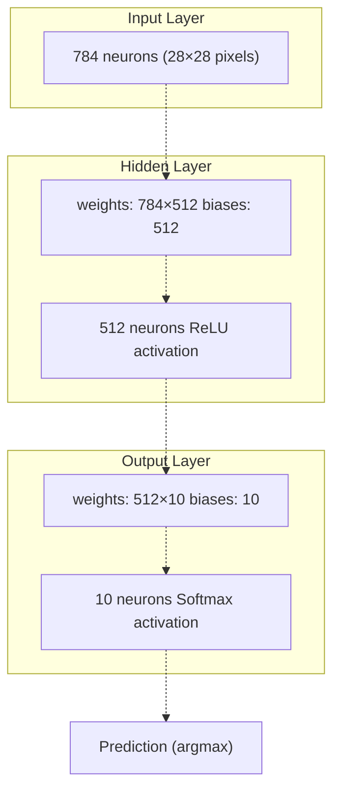
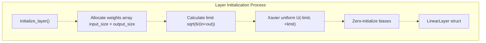
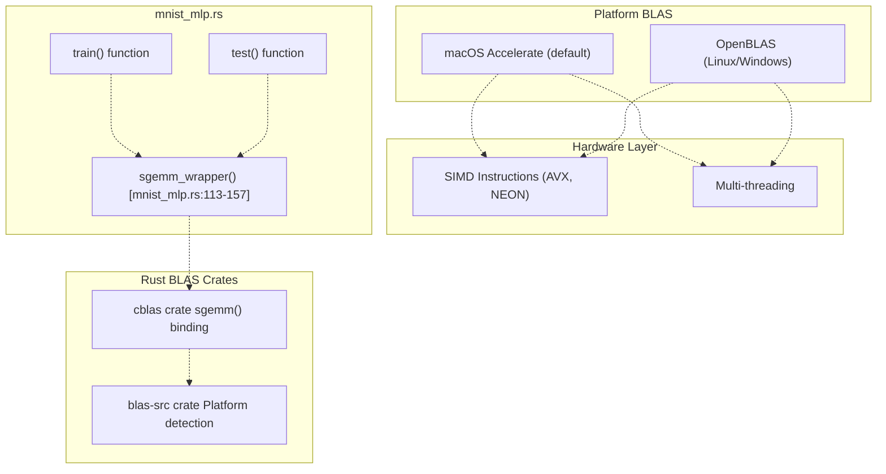
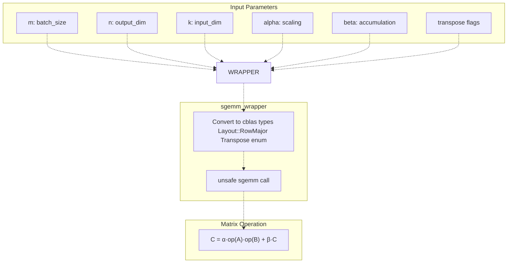
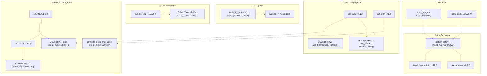
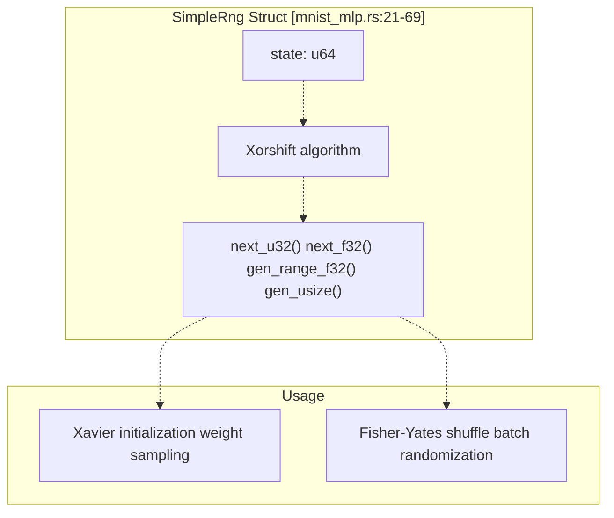
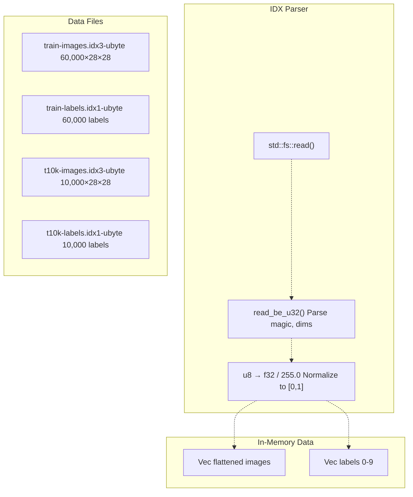
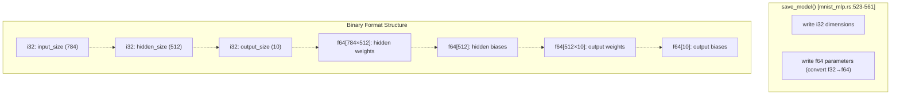
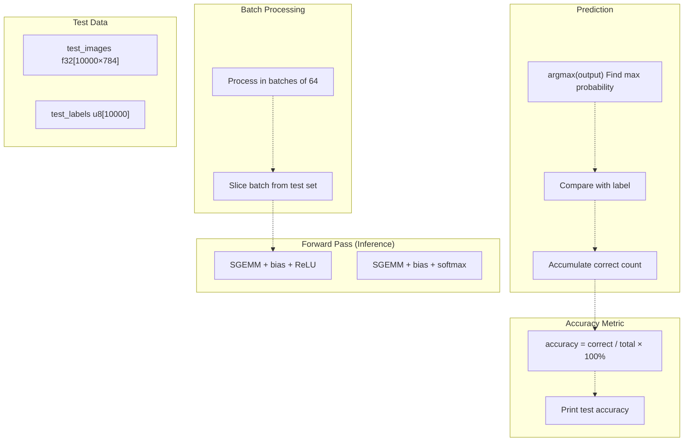
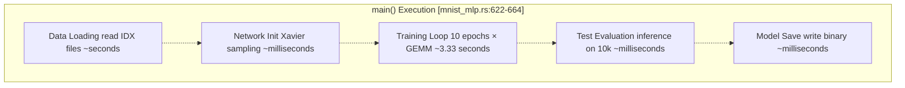

# MNIST MLP

> **Relevant source files**
> * [Cargo.toml](https://github.com/ThalesMMS/Rust-Neural-Networks/blob/0e978f90/Cargo.toml)
> * [README.md](https://github.com/ThalesMMS/Rust-Neural-Networks/blob/0e978f90/README.md)
> * [mnist_mlp.rs](https://github.com/ThalesMMS/Rust-Neural-Networks/blob/0e978f90/mnist_mlp.rs)

This page documents the Multi-Layer Perceptron (MLP) implementation for MNIST digit classification, featuring BLAS-accelerated matrix operations for high-performance training. This is the fastest and most accurate MNIST model in the repository, achieving ~94% test accuracy in approximately 3 seconds on typical hardware.

**Scope**: This page covers the `mnist_mlp` binary implementation, including architecture, BLAS integration, training procedures, and model serialization. For the CNN-based MNIST implementation, see [MNIST CNN](#3.2). For attention-based MNIST, see [MNIST Attention Model](#3.3). For details on BLAS configuration and platform-specific optimization, see [BLAS Integration](#5.1). For information on the binary model format used for persistence, see [Binary Model Format](#5.3).

## Architecture Overview

The MNIST MLP implements a simple two-layer fully-connected neural network optimized for speed through BLAS-accelerated matrix multiplication.

### Network Structure



**Sources**: [mnist_mlp.rs L10-L12](https://github.com/ThalesMMS/Rust-Neural-Networks/blob/0e978f90/mnist_mlp.rs#L10-L12)

 [mnist_mlp.rs L101-L111](https://github.com/ThalesMMS/Rust-Neural-Networks/blob/0e978f90/mnist_mlp.rs#L101-L111)

 [README.md L33-L48](https://github.com/ThalesMMS/Rust-Neural-Networks/blob/0e978f90/README.md#L33-L48)

| Component | Size | Activation | Parameters |
| --- | --- | --- | --- |
| Input Layer | 784 | None | - |
| Hidden Layer | 512 | ReLU | 401,920 weights + 512 biases |
| Output Layer | 10 | Softmax | 5,120 weights + 10 biases |
| **Total** | - | - | **407,562 parameters** |

The network architecture is defined by constants at [mnist_mlp.rs L10-L12](https://github.com/ThalesMMS/Rust-Neural-Networks/blob/0e978f90/mnist_mlp.rs#L10-L12)

:

* `NUM_INPUTS = 784` (28×28 flattened image)
* `NUM_HIDDEN = 512`
* `NUM_OUTPUTS = 10` (digits 0-9)

**Sources**: [mnist_mlp.rs L10-L12](https://github.com/ThalesMMS/Rust-Neural-Networks/blob/0e978f90/mnist_mlp.rs#L10-L12)

 [mnist_mlp.rs L79-L83](https://github.com/ThalesMMS/Rust-Neural-Networks/blob/0e978f90/mnist_mlp.rs#L79-L83)

### Initialization Strategy

The network uses Xavier/Glorot uniform initialization for stable training:



**Sources**: [mnist_mlp.rs L85-L99](https://github.com/ThalesMMS/Rust-Neural-Networks/blob/0e978f90/mnist_mlp.rs#L85-L99)

 [mnist_mlp.rs L101-L111](https://github.com/ThalesMMS/Rust-Neural-Networks/blob/0e978f90/mnist_mlp.rs#L101-L111)

The `initialize_layer` function at [mnist_mlp.rs L86-L99](https://github.com/ThalesMMS/Rust-Neural-Networks/blob/0e978f90/mnist_mlp.rs#L86-L99)

 implements Xavier initialization:

* Computes `limit = sqrt(6.0 / (input_size + output_size))`
* Samples weights uniformly from `[-limit, limit]`
* Initializes biases to zero

**Sources**: [mnist_mlp.rs L85-L99](https://github.com/ThalesMMS/Rust-Neural-Networks/blob/0e978f90/mnist_mlp.rs#L85-L99)

## BLAS Acceleration Architecture

The key performance differentiator of this implementation is the use of BLAS (Basic Linear Algebra Subprograms) for matrix operations.

### BLAS Integration Flow



**Sources**: [mnist_mlp.rs L1-L3](https://github.com/ThalesMMS/Rust-Neural-Networks/blob/0e978f90/mnist_mlp.rs#L1-L3)

 [mnist_mlp.rs L113-L157](https://github.com/ThalesMMS/Rust-Neural-Networks/blob/0e978f90/mnist_mlp.rs#L113-L157)

 [Cargo.toml L6-L8](https://github.com/ThalesMMS/Rust-Neural-Networks/blob/0e978f90/Cargo.toml#L6-L8)

### SGEMM Wrapper Implementation

The `sgemm_wrapper` function at [mnist_mlp.rs L113-L157](https://github.com/ThalesMMS/Rust-Neural-Networks/blob/0e978f90/mnist_mlp.rs#L113-L157)

 provides a safe interface to CBLAS matrix multiplication:



**Sources**: [mnist_mlp.rs L113-L157](https://github.com/ThalesMMS/Rust-Neural-Networks/blob/0e978f90/mnist_mlp.rs#L113-L157)

The wrapper handles:

* Row-major layout conversion
* Transpose flag mapping (`Transpose::None` vs `Transpose::Ordinary`)
* Unsafe BLAS FFI call wrapping
* Type casting from `usize` to `i32` for CBLAS interface

**Sources**: [mnist_mlp.rs L113-L157](https://github.com/ThalesMMS/Rust-Neural-Networks/blob/0e978f90/mnist_mlp.rs#L113-L157)

## Training Pipeline

### Training Data Flow



**Sources**: [mnist_mlp.rs L267-L447](https://github.com/ThalesMMS/Rust-Neural-Networks/blob/0e978f90/mnist_mlp.rs#L267-L447)

### Training Hyperparameters

The training configuration is defined at [mnist_mlp.rs L15-L18](https://github.com/ThalesMMS/Rust-Neural-Networks/blob/0e978f90/mnist_mlp.rs#L15-L18)

:

| Parameter | Value | Location |
| --- | --- | --- |
| Learning Rate | 0.01 | [mnist_mlp.rs L16](https://github.com/ThalesMMS/Rust-Neural-Networks/blob/0e978f90/mnist_mlp.rs#L16-L16) |
| Epochs | 10 | [mnist_mlp.rs L17](https://github.com/ThalesMMS/Rust-Neural-Networks/blob/0e978f90/mnist_mlp.rs#L17-L17) |
| Batch Size | 64 | [mnist_mlp.rs L18](https://github.com/ThalesMMS/Rust-Neural-Networks/blob/0e978f90/mnist_mlp.rs#L18-L18) |
| Optimizer | SGD | [mnist_mlp.rs L260-L264](https://github.com/ThalesMMS/Rust-Neural-Networks/blob/0e978f90/mnist_mlp.rs#L260-L264) |

**Sources**: [mnist_mlp.rs L15-L18](https://github.com/ThalesMMS/Rust-Neural-Networks/blob/0e978f90/mnist_mlp.rs#L15-L18)

 [README.md L41-L46](https://github.com/ThalesMMS/Rust-Neural-Networks/blob/0e978f90/README.md#L41-L46)

### Forward Pass Implementation

The forward pass uses batched GEMM operations for efficiency:

**Hidden Layer Forward** [mnist_mlp.rs L313-L331](https://github.com/ThalesMMS/Rust-Neural-Networks/blob/0e978f90/mnist_mlp.rs#L313-L331)

:

1. `sgemm_wrapper()`: Compute `A1 = X · W1` (batch×hidden matrix multiplication)
2. `add_bias()`: Broadcast-add biases to each row
3. `relu_inplace()`: Apply ReLU activation element-wise

**Output Layer Forward** [mnist_mlp.rs L333-L351](https://github.com/ThalesMMS/Rust-Neural-Networks/blob/0e978f90/mnist_mlp.rs#L333-L351)

:

1. `sgemm_wrapper()`: Compute `A2 = A1 · W2`
2. `add_bias()`: Add biases
3. `softmax_rows()`: Apply row-wise softmax for probability distribution

**Sources**: [mnist_mlp.rs L313-L351](https://github.com/ThalesMMS/Rust-Neural-Networks/blob/0e978f90/mnist_mlp.rs#L313-L351)

### Backward Pass Implementation

The backward pass computes gradients using transposed matrix operations:

**Output Layer Gradients** [mnist_mlp.rs L353-L382](https://github.com/ThalesMMS/Rust-Neural-Networks/blob/0e978f90/mnist_mlp.rs#L353-L382)

:

1. `compute_delta_and_loss()`: Compute `dZ2 = softmax_output - one_hot_label`
2. `sgemm_wrapper()`: Compute `dW2 = A1ᵀ · dZ2` (transpose A1)
3. `sum_rows()`: Compute `db2 = sum(dZ2)` across batch dimension

**Hidden Layer Gradients** [mnist_mlp.rs L384-L426](https://github.com/ThalesMMS/Rust-Neural-Networks/blob/0e978f90/mnist_mlp.rs#L384-L426)

:

1. `sgemm_wrapper()`: Compute `dZ1 = dZ2 · W2ᵀ` (transpose W2)
2. Zero out gradients where `A1 <= 0` (ReLU derivative)
3. `sgemm_wrapper()`: Compute `dW1 = Xᵀ · dZ1`
4. `sum_rows()`: Compute `db1 = sum(dZ1)`

**SGD Parameter Update** [mnist_mlp.rs L428-L431](https://github.com/ThalesMMS/Rust-Neural-Networks/blob/0e978f90/mnist_mlp.rs#L428-L431)

:

```
W_new = W_old - learning_rate × gradient
```

**Sources**: [mnist_mlp.rs L353-L431](https://github.com/ThalesMMS/Rust-Neural-Networks/blob/0e978f90/mnist_mlp.rs#L353-L431)

## Auxiliary Components

### Random Number Generation

The implementation uses a custom pseudo-random number generator for reproducibility:



**Sources**: [mnist_mlp.rs L21-L69](https://github.com/ThalesMMS/Rust-Neural-Networks/blob/0e978f90/mnist_mlp.rs#L21-L69)

The `SimpleRng` struct implements:

* Xorshift RNG algorithm at [mnist_mlp.rs L42-L49](https://github.com/ThalesMMS/Rust-Neural-Networks/blob/0e978f90/mnist_mlp.rs#L42-L49)
* Conversion to uniform `f32` in [0 L52-L54](https://github.com/ThalesMMS/Rust-Neural-Networks/blob/0e978f90/0, 1) at [mnist_mlp.rs#L52-L54)
* Range sampling at [mnist_mlp.rs L57-L59](https://github.com/ThalesMMS/Rust-Neural-Networks/blob/0e978f90/mnist_mlp.rs#L57-L59)
* Integer sampling for shuffling at [mnist_mlp.rs L62-L68](https://github.com/ThalesMMS/Rust-Neural-Networks/blob/0e978f90/mnist_mlp.rs#L62-L68)
* Time-based reseeding at [mnist_mlp.rs L33-L39](https://github.com/ThalesMMS/Rust-Neural-Networks/blob/0e978f90/mnist_mlp.rs#L33-L39)

**Sources**: [mnist_mlp.rs L21-L69](https://github.com/ThalesMMS/Rust-Neural-Networks/blob/0e978f90/mnist_mlp.rs#L21-L69)

### Data Loading

MNIST data is loaded from IDX binary format:



**Sources**: [mnist_mlp.rs L563-L620](https://github.com/ThalesMMS/Rust-Neural-Networks/blob/0e978f90/mnist_mlp.rs#L563-L620)

 [mnist_mlp.rs L622-L634](https://github.com/ThalesMMS/Rust-Neural-Networks/blob/0e978f90/mnist_mlp.rs#L622-L634)

The `read_mnist_images` function at [mnist_mlp.rs L573-L600](https://github.com/ThalesMMS/Rust-Neural-Networks/blob/0e978f90/mnist_mlp.rs#L573-L600)

:

* Reads entire file into memory
* Parses big-endian header (magic number, count, rows, cols)
* Normalizes pixel values from [0, 255] to [0.0, 1.0]
* Returns flattened `Vec<f32>` with shape `[N, 784]`

The `read_mnist_labels` function at [mnist_mlp.rs L603-L620](https://github.com/ThalesMMS/Rust-Neural-Networks/blob/0e978f90/mnist_mlp.rs#L603-L620)

:

* Parses label file header
* Returns raw `Vec<u8>` with values 0-9

**Sources**: [mnist_mlp.rs L573-L620](https://github.com/ThalesMMS/Rust-Neural-Networks/blob/0e978f90/mnist_mlp.rs#L573-L620)

## Model Persistence

### Binary Model Format

The trained model is saved to `mnist_model.bin` using a custom binary format:



**Sources**: [mnist_mlp.rs L523-L561](https://github.com/ThalesMMS/Rust-Neural-Networks/blob/0e978f90/mnist_mlp.rs#L523-L561)

 [README.md L31](https://github.com/ThalesMMS/Rust-Neural-Networks/blob/0e978f90/README.md#L31-L31)

The `save_model` function at [mnist_mlp.rs L523-L561](https://github.com/ThalesMMS/Rust-Neural-Networks/blob/0e978f90/mnist_mlp.rs#L523-L561)

:

* Writes layer dimensions as 32-bit signed integers (native endianness)
* Writes all parameters as 64-bit doubles (converted from f32)
* Uses native byte order (platform-dependent)
* Total file size: `3×4 + (784×512 + 512 + 512×10 + 10)×8 = 3,260,588 bytes`

**Format specification**:

```
Offset    Type       Description
------    ----       -----------
0         i32        input_size (784)
4         i32        hidden_size (512)
8         i32        output_size (10)
12        f64[401920] hidden layer weights (784×512)
3215372   f64[512]   hidden layer biases
3219468   f64[5120]  output layer weights (512×10)
3260428   f64[10]    output layer biases
```

This format is consumed by `digit_recognizer.py` for inference. See [Digit Recognizer GUI](#4.1) for details on model loading.

**Sources**: [mnist_mlp.rs L523-L561](https://github.com/ThalesMMS/Rust-Neural-Networks/blob/0e978f90/mnist_mlp.rs#L523-L561)

## Evaluation and Testing

### Test Inference Pipeline



**Sources**: [mnist_mlp.rs L450-L520](https://github.com/ThalesMMS/Rust-Neural-Networks/blob/0e978f90/mnist_mlp.rs#L450-L520)

The `test` function at [mnist_mlp.rs L450-L520](https://github.com/ThalesMMS/Rust-Neural-Networks/blob/0e978f90/mnist_mlp.rs#L450-L520)

:

* Processes test set in batches of 64 for efficiency
* Performs forward pass only (no gradient computation)
* Finds predicted class via `argmax` of softmax output
* Computes accuracy as `correct_predictions / total_samples × 100%`
* Prints final test accuracy

**Sources**: [mnist_mlp.rs L450-L520](https://github.com/ThalesMMS/Rust-Neural-Networks/blob/0e978f90/mnist_mlp.rs#L450-L520)

## Performance Characteristics

### Runtime Breakdown



**Sources**: [mnist_mlp.rs L622-L664](https://github.com/ThalesMMS/Rust-Neural-Networks/blob/0e978f90/mnist_mlp.rs#L622-L664)

 [README.md L144](https://github.com/ThalesMMS/Rust-Neural-Networks/blob/0e978f90/README.md#L144-L144)

### Benchmark Results

From the default configuration running on macOS with Accelerate framework:

| Metric | Value | Notes |
| --- | --- | --- |
| Training Time | 3.33 seconds | 10 epochs, batch size 64 |
| Test Accuracy | 94.17% | 10,000 test samples |
| Throughput | ~180,000 samples/sec | During training |
| Parameters | 407,562 | Total trainable parameters |
| Model Size | ~3.26 MB | Binary format on disk |

**Performance factors**:

* BLAS acceleration provides 10-100× speedup over naive loops
* Batch size 64 balances memory usage and parallelism
* ReLU activation is computationally cheap
* Softmax is computed row-wise with numerical stability (subtract max)

**Sources**: [README.md L138-L149](https://github.com/ThalesMMS/Rust-Neural-Networks/blob/0e978f90/README.md#L138-L149)

 [mnist_mlp.rs L15-L18](https://github.com/ThalesMMS/Rust-Neural-Networks/blob/0e978f90/mnist_mlp.rs#L15-L18)

### Optimization Flags

The release build configuration at [Cargo.toml L26-L28](https://github.com/ThalesMMS/Rust-Neural-Networks/blob/0e978f90/Cargo.toml#L26-L28)

 enables:

* **LTO** (Link-Time Optimization): `lto = true`
* **Single codegen unit**: `codegen-units = 1` (maximizes optimization)

Additional recommended flags from [README.md L132-L134](https://github.com/ThalesMMS/Rust-Neural-Networks/blob/0e978f90/README.md#L132-L134)

:

```
RUSTFLAGS="-C target-cpu=native" VECLIB_MAXIMUM_THREADS=8 cargo run --release --bin mnist_mlp
```

* `target-cpu=native`: Enables architecture-specific SIMD instructions
* `VECLIB_MAXIMUM_THREADS=8`: Controls Accelerate framework parallelism

**Sources**: [Cargo.toml L26-L28](https://github.com/ThalesMMS/Rust-Neural-Networks/blob/0e978f90/Cargo.toml#L26-L28)

 [README.md L130-L136](https://github.com/ThalesMMS/Rust-Neural-Networks/blob/0e978f90/README.md#L130-L136)

## Code Structure Summary

### Key Functions and Their Roles

| Function | Location | Role |
| --- | --- | --- |
| `main` | [mnist_mlp.rs L622-L664](https://github.com/ThalesMMS/Rust-Neural-Networks/blob/0e978f90/mnist_mlp.rs#L622-L664) | Entry point, orchestrates pipeline |
| `initialize_network` | [mnist_mlp.rs L102-L111](https://github.com/ThalesMMS/Rust-Neural-Networks/blob/0e978f90/mnist_mlp.rs#L102-L111) | Creates `NeuralNetwork` with Xavier init |
| `train` | [mnist_mlp.rs L267-L447](https://github.com/ThalesMMS/Rust-Neural-Networks/blob/0e978f90/mnist_mlp.rs#L267-L447) | Full training loop with SGD |
| `test` | [mnist_mlp.rs L450-L520](https://github.com/ThalesMMS/Rust-Neural-Networks/blob/0e978f90/mnist_mlp.rs#L450-L520) | Evaluate accuracy on test set |
| `save_model` | [mnist_mlp.rs L523-L561](https://github.com/ThalesMMS/Rust-Neural-Networks/blob/0e978f90/mnist_mlp.rs#L523-L561) | Serialize to binary format |
| `sgemm_wrapper` | [mnist_mlp.rs L113-L157](https://github.com/ThalesMMS/Rust-Neural-Networks/blob/0e978f90/mnist_mlp.rs#L113-L157) | Safe BLAS matrix multiplication |
| `gather_batch` | [mnist_mlp.rs L239-L258](https://github.com/ThalesMMS/Rust-Neural-Networks/blob/0e978f90/mnist_mlp.rs#L239-L258) | Shuffle and extract mini-batch |
| `compute_delta_and_loss` | [mnist_mlp.rs L209-L237](https://github.com/ThalesMMS/Rust-Neural-Networks/blob/0e978f90/mnist_mlp.rs#L209-L237) | Cross-entropy loss and output gradient |
| `read_mnist_images` | [mnist_mlp.rs L573-L600](https://github.com/ThalesMMS/Rust-Neural-Networks/blob/0e978f90/mnist_mlp.rs#L573-L600) | Parse IDX image files |
| `read_mnist_labels` | [mnist_mlp.rs L603-L620](https://github.com/ThalesMMS/Rust-Neural-Networks/blob/0e978f90/mnist_mlp.rs#L603-L620) | Parse IDX label files |

**Sources**: [mnist_mlp.rs L1-L664](https://github.com/ThalesMMS/Rust-Neural-Networks/blob/0e978f90/mnist_mlp.rs#L1-L664)

### Data Structures

| Struct | Location | Purpose |
| --- | --- | --- |
| `SimpleRng` | [mnist_mlp.rs L21-L69](https://github.com/ThalesMMS/Rust-Neural-Networks/blob/0e978f90/mnist_mlp.rs#L21-L69) | Reproducible pseudo-random generation |
| `LinearLayer` | [mnist_mlp.rs L72-L77](https://github.com/ThalesMMS/Rust-Neural-Networks/blob/0e978f90/mnist_mlp.rs#L72-L77) | Dense layer (weights, biases) |
| `NeuralNetwork` | [mnist_mlp.rs L80-L83](https://github.com/ThalesMMS/Rust-Neural-Networks/blob/0e978f90/mnist_mlp.rs#L80-L83) | Two-layer MLP container |

**Sources**: [mnist_mlp.rs L21-L83](https://github.com/ThalesMMS/Rust-Neural-Networks/blob/0e978f90/mnist_mlp.rs#L21-L83)

### Activation Functions

| Function | Location | Implementation |
| --- | --- | --- |
| `relu_inplace` | [mnist_mlp.rs L167-L173](https://github.com/ThalesMMS/Rust-Neural-Networks/blob/0e978f90/mnist_mlp.rs#L167-L173) | Element-wise: `x = max(0, x)` |
| `softmax_rows` | [mnist_mlp.rs L175-L195](https://github.com/ThalesMMS/Rust-Neural-Networks/blob/0e978f90/mnist_mlp.rs#L175-L195) | Row-wise: `exp(x - max) / sum(exp)` |

**Sources**: [mnist_mlp.rs L167-L195](https://github.com/ThalesMMS/Rust-Neural-Networks/blob/0e978f90/mnist_mlp.rs#L167-L195)

## Logging and Monitoring

Training progress is logged to `logs/training_loss_c.txt` in CSV format:

```
epoch,loss,time
1,0.346234,0.333125
2,0.289012,0.330456
...
```

The log file is created at [mnist_mlp.rs L268-L272](https://github.com/ThalesMMS/Rust-Neural-Networks/blob/0e978f90/mnist_mlp.rs#L268-L272)

 and written per-epoch at [mnist_mlp.rs L442-L445](https://github.com/ThalesMMS/Rust-Neural-Networks/blob/0e978f90/mnist_mlp.rs#L442-L445)

This CSV format is consumed by `plot_comparison.py` for visualization. See [Training Visualization](#4.2) for details.

**Sources**: [mnist_mlp.rs L268-L272](https://github.com/ThalesMMS/Rust-Neural-Networks/blob/0e978f90/mnist_mlp.rs#L268-L272)

 [mnist_mlp.rs L442-L445](https://github.com/ThalesMMS/Rust-Neural-Networks/blob/0e978f90/mnist_mlp.rs#L442-L445)

 [README.md L24](https://github.com/ThalesMMS/Rust-Neural-Networks/blob/0e978f90/README.md#L24-L24)

Refresh this wiki

Last indexed: 5 January 2026 ([0e978f](https://github.com/ThalesMMS/Rust-Neural-Networks/commit/0e978f90))

### On this page

- [MNIST MLP](#mnist-mlp)
  - [Architecture Overview](#architecture-overview)
    - [Network Structure](#network-structure)
    - [Initialization Strategy](#initialization-strategy)
  - [BLAS Acceleration Architecture](#blas-acceleration-architecture)
    - [BLAS Integration Flow](#blas-integration-flow)
    - [SGEMM Wrapper Implementation](#sgemm-wrapper-implementation)
  - [Training Pipeline](#training-pipeline)
    - [Training Data Flow](#training-data-flow)
    - [Training Hyperparameters](#training-hyperparameters)
    - [Forward Pass Implementation](#forward-pass-implementation)
    - [Backward Pass Implementation](#backward-pass-implementation)
  - [Auxiliary Components](#auxiliary-components)
    - [Random Number Generation](#random-number-generation)
    - [Data Loading](#data-loading)
  - [Model Persistence](#model-persistence)
    - [Binary Model Format](#binary-model-format)
  - [Evaluation and Testing](#evaluation-and-testing)
    - [Test Inference Pipeline](#test-inference-pipeline)
  - [Performance Characteristics](#performance-characteristics)
    - [Runtime Breakdown](#runtime-breakdown)
    - [Benchmark Results](#benchmark-results)
    - [Optimization Flags](#optimization-flags)
  - [Code Structure Summary](#code-structure-summary)
    - [Key Functions and Their Roles](#key-functions-and-their-roles)
    - [Data Structures](#data-structures)
    - [Activation Functions](#activation-functions)
  - [Logging and Monitoring](#logging-and-monitoring)
    - [On this page](#on-this-page)

Ask Devin about Rust-Neural-Networks