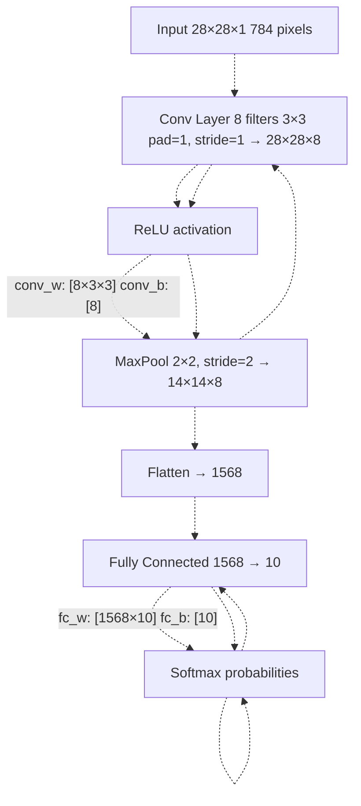
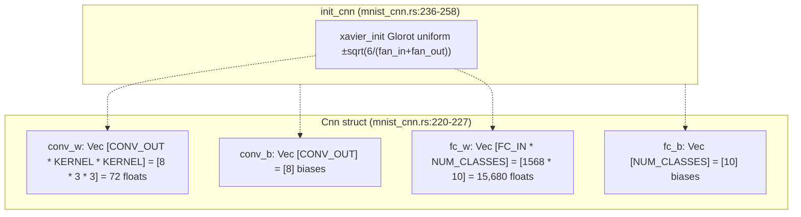
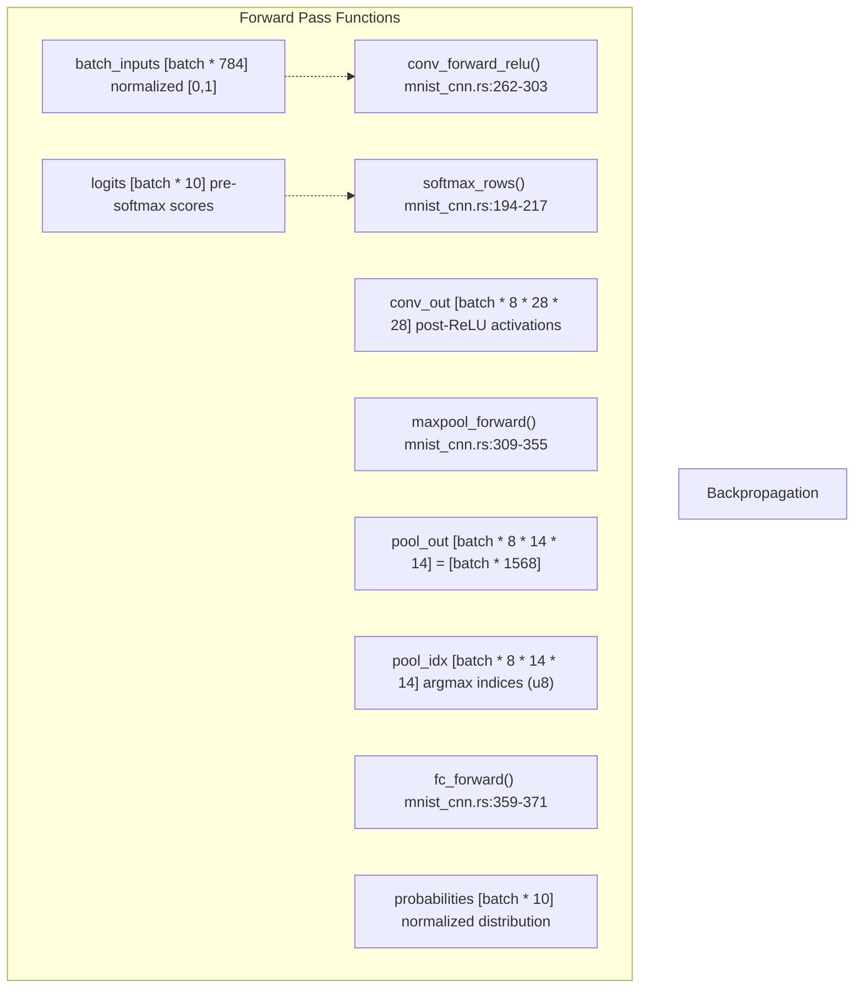
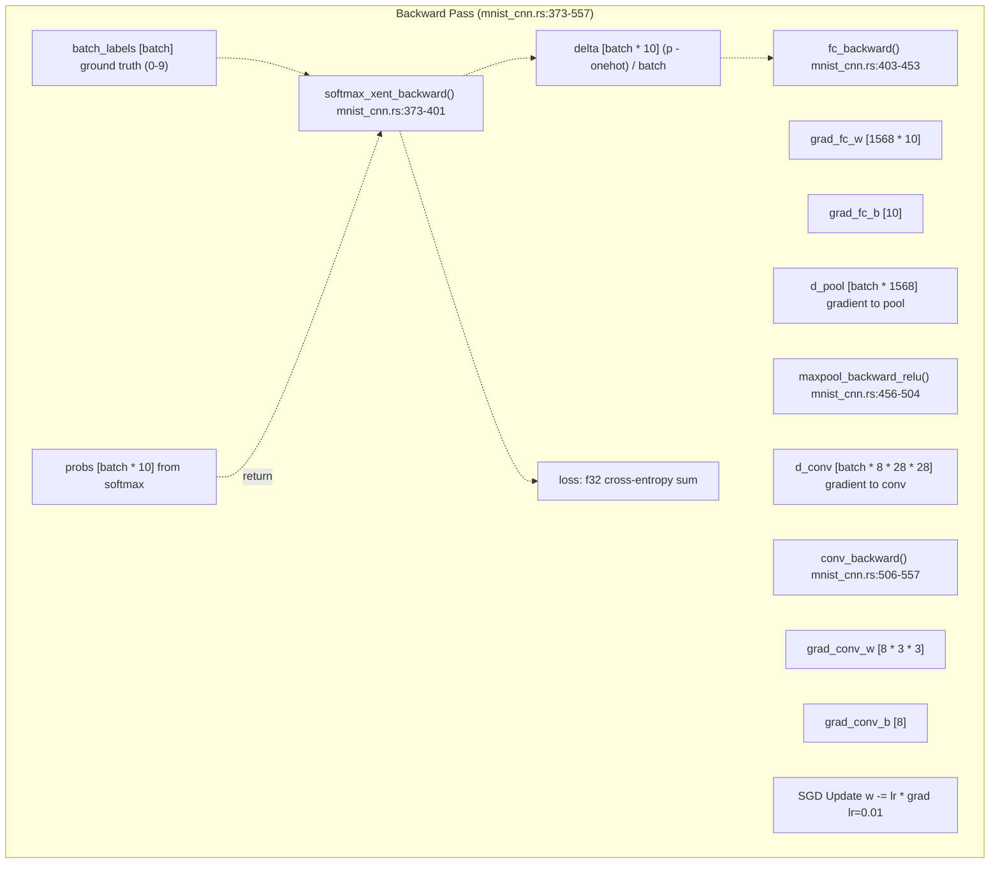
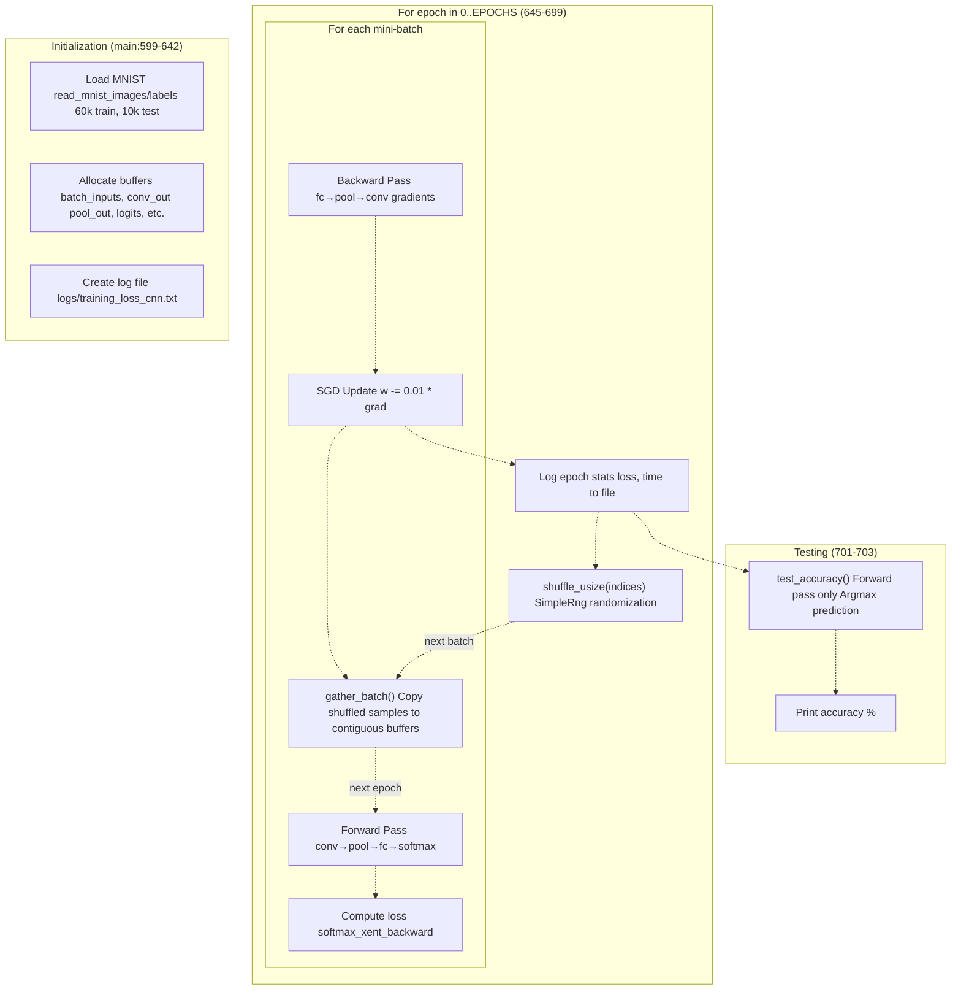

# MNIST CNN

> **Relevant source files**
> * [Cargo.toml](https://github.com/ThalesMMS/Rust-Neural-Networks/blob/0e978f90/Cargo.toml)
> * [README.md](https://github.com/ThalesMMS/Rust-Neural-Networks/blob/0e978f90/README.md)
> * [mnist_cnn.rs](https://github.com/ThalesMMS/Rust-Neural-Networks/blob/0e978f90/mnist_cnn.rs)

## Purpose and Scope

This page documents the Convolutional Neural Network (CNN) implementation for MNIST digit classification located in [mnist_cnn.rs](https://github.com/ThalesMMS/Rust-Neural-Networks/blob/0e978f90/mnist_cnn.rs)

 This implementation demonstrates a complete CNN training pipeline using explicit loops for all operations, without relying on BLAS acceleration or external neural network libraries. The CNN achieves approximately 91.93% test accuracy after 3 epochs of training.

For the BLAS-accelerated MLP implementation, see [MNIST MLP](#3.1). For the attention-based architecture, see [MNIST Attention Model](#3.3). For general training pipeline concepts shared across implementations, see [Training Pipeline](#5.2).

**Sources**: [mnist_cnn.rs L1-L14](https://github.com/ThalesMMS/Rust-Neural-Networks/blob/0e978f90/mnist_cnn.rs#L1-L14)

 [README.md L55-L69](https://github.com/ThalesMMS/Rust-Neural-Networks/blob/0e978f90/README.md#L55-L69)

---

## Architecture Overview

The CNN implements a classic convolutional architecture with spatial feature extraction followed by classification. The network consists of three main stages: a convolutional layer with ReLU activation, a 2×2 max pooling layer, and a fully-connected classifier.

### Network Topology



| Layer | Input Shape | Output Shape | Parameters | Activation |
| --- | --- | --- | --- | --- |
| Convolution | 28×28×1 | 28×28×8 | 72 weights + 8 biases | ReLU (inline) |
| MaxPool | 28×28×8 | 14×14×8 | 0 | None |
| Fully Connected | 1568 | 10 | 15,680 weights + 10 biases | Softmax |
| **Total** |  |  | **15,770 parameters** |  |

**Sources**: [mnist_cnn.rs L20-L42](https://github.com/ThalesMMS/Rust-Neural-Networks/blob/0e978f90/mnist_cnn.rs#L20-L42)

 [mnist_cnn.rs L220-L227](https://github.com/ThalesMMS/Rust-Neural-Networks/blob/0e978f90/mnist_cnn.rs#L220-L227)

 [README.md L57-L63](https://github.com/ThalesMMS/Rust-Neural-Networks/blob/0e978f90/README.md#L57-L63)

---

## Model Structure and Initialization

### Data Structures

The `Cnn` struct stores all trainable parameters in flat, cache-friendly arrays:



**Constants defining architecture** ([mnist_cnn.rs L29-L36](https://github.com/ThalesMMS/Rust-Neural-Networks/blob/0e978f90/mnist_cnn.rs#L29-L36)

):

* `CONV_OUT = 8`: Number of convolutional filters
* `KERNEL = 3`: Convolution kernel size (3×3)
* `PAD = 1`: Zero-padding (preserves spatial dimensions)
* `POOL = 2`: Max pooling window size (2×2)
* `FC_IN = 1568`: Flattened feature map size (8×14×14)

**Initialization** ([mnist_cnn.rs L236-L258](https://github.com/ThalesMMS/Rust-Neural-Networks/blob/0e978f90/mnist_cnn.rs#L236-L258)

):

* **Xavier/Glorot uniform** initialization for stable gradient flow
* Conv layer: `limit = sqrt(6/(9 + 72))` where fan_in = 9 (3×3 input receptive field), fan_out = 72 (3×3×8 output connections)
* FC layer: `limit = sqrt(6/(1568 + 10))`
* Biases initialized to zero

**Sources**: [mnist_cnn.rs L220-L258](https://github.com/ThalesMMS/Rust-Neural-Networks/blob/0e978f90/mnist_cnn.rs#L220-L258)

---

## Forward Propagation

### Forward Pass Pipeline

The forward pass transforms input images through convolutional feature extraction and classification in four stages:



**Sources**: [mnist_cnn.rs L262-L371](https://github.com/ThalesMMS/Rust-Neural-Networks/blob/0e978f90/mnist_cnn.rs#L262-L371)

 [mnist_cnn.rs L194-L217](https://github.com/ThalesMMS/Rust-Neural-Networks/blob/0e978f90/mnist_cnn.rs#L194-L217)

### Convolution Forward with ReLU

The convolution operation ([mnist_cnn.rs L262-L303](https://github.com/ThalesMMS/Rust-Neural-Networks/blob/0e978f90/mnist_cnn.rs#L262-L303)

) performs 3×3 sliding window convolution with zero-padding:

**Algorithm**:

1. For each batch sample and output channel: * Initialize accumulator with bias: `sum = conv_b[oc]` * For each output pixel `(oy, ox)`: * Compute 3×3 window with zero-padding at boundaries * Accumulate: `sum += input[iy, ix] * conv_w[ky, kx]` * Apply ReLU inline: `conv_out = max(0, sum)`

**Memory layout**:

* Input: `[batch * 784]` (flattened 28×28 images)
* Weights: `[8 * 3 * 3]` (8 filters, each 3×3)
* Output: `[batch * 8 * 28 * 28]` (8 feature maps, same spatial size due to padding)

**Padding logic** ([mnist_cnn.rs L286-L294](https://github.com/ThalesMMS/Rust-Neural-Networks/blob/0e978f90/mnist_cnn.rs#L286-L294)

):

```yaml
iy = oy + ky - PAD  // PAD=1 creates border
ix = ox + kx - PAD
if iy >= 0 && iy < 28 && ix >= 0 && ix < 28:
    accumulate input[iy][ix] * weight[ky][kx]
else:
    contribute 0 (implicit zero-padding)
```

**Sources**: [mnist_cnn.rs L262-L303](https://github.com/ThalesMMS/Rust-Neural-Networks/blob/0e978f90/mnist_cnn.rs#L262-L303)

### Max Pooling Forward

Max pooling ([mnist_cnn.rs L309-L355](https://github.com/ThalesMMS/Rust-Neural-Networks/blob/0e978f90/mnist_cnn.rs#L309-L355)

) reduces spatial dimensions by selecting maximum values in 2×2 windows:

**Algorithm**:

1. Divide 28×28 feature maps into non-overlapping 2×2 blocks
2. For each block, find maximum value and its position
3. Output maximum to pooled position (14×14 grid)
4. **Record argmax index** (0-3) in `pool_idx` for backpropagation

**Argmax encoding** ([mnist_cnn.rs L332-L345](https://github.com/ThalesMMS/Rust-Neural-Networks/blob/0e978f90/mnist_cnn.rs#L332-L345)

):

* Each 2×2 block has 4 positions: `(0,0), (0,1), (1,0), (1,1)`
* Encoded as single byte: `idx = dy * 2 + dx` (values 0-3)
* Used during backward pass to route gradients only to the maximum position

**Sources**: [mnist_cnn.rs L309-L355](https://github.com/ThalesMMS/Rust-Neural-Networks/blob/0e978f90/mnist_cnn.rs#L309-L355)

### Fully Connected Forward

The FC layer ([mnist_cnn.rs L359-L371](https://github.com/ThalesMMS/Rust-Neural-Networks/blob/0e978f90/mnist_cnn.rs#L359-L371)

) computes logits via matrix multiplication:

**Operation**: `logits[b, j] = sum(pool_out[b, i] * fc_w[i, j]) + fc_b[j]`

* Input: `[batch * 1568]` (flattened pooled features)
* Weights: `[1568 * 10]` (column-major storage: `fc_w[i * 10 + j]`)
* Output: `[batch * 10]` (class logits)

**Sources**: [mnist_cnn.rs L359-L371](https://github.com/ThalesMMS/Rust-Neural-Networks/blob/0e978f90/mnist_cnn.rs#L359-L371)

---

## Backward Propagation

### Backward Pass Pipeline

Backpropagation computes gradients by reverse-mode automatic differentiation through the network:



**Sources**: [mnist_cnn.rs L373-L693](https://github.com/ThalesMMS/Rust-Neural-Networks/blob/0e978f90/mnist_cnn.rs#L373-L693)

### Softmax Cross-Entropy Backward

Combined softmax and cross-entropy computation ([mnist_cnn.rs L373-L401](https://github.com/ThalesMMS/Rust-Neural-Networks/blob/0e978f90/mnist_cnn.rs#L373-L401)

):

**Forward (softmax)**:

* Normalize logits to probabilities: `p[j] = exp(logit[j]) / sum(exp(logit[k]))`
* Numerical stability: subtract max before exp

**Loss computation**:

* Cross-entropy: `loss = -log(p[y])` where `y` is true label
* Summed over batch (not averaged yet)

**Backward (delta)**:

* Gradient w.r.t. logits: `delta[j] = (p[j] - onehot[j]) / batch_size`
* For correct class: `delta[y] = (p[y] - 1) / batch_size`
* For other classes: `delta[j] = p[j] / batch_size`

**Sources**: [mnist_cnn.rs L373-L401](https://github.com/ThalesMMS/Rust-Neural-Networks/blob/0e978f90/mnist_cnn.rs#L373-L401)

### Fully Connected Backward

FC layer backprop ([mnist_cnn.rs L403-L453](https://github.com/ThalesMMS/Rust-Neural-Networks/blob/0e978f90/mnist_cnn.rs#L403-L453)

) computes three outputs:

**Weight gradient**: `grad_w[i,j] = sum_batch(x[b,i] * delta[b,j])`

* Accumulated over batch samples
* Shape: `[1568 * 10]`

**Bias gradient**: `grad_b[j] = sum_batch(delta[b,j])`

* Sum of deltas for each output neuron
* Shape: `[10]`

**Input gradient**: `d_x[b,i] = sum_j(delta[b,j] * fc_w[i,j])`

* Backpropagate to previous layer via weight transpose
* Shape: `[batch * 1568]`

**Sources**: [mnist_cnn.rs L403-L453](https://github.com/ThalesMMS/Rust-Neural-Networks/blob/0e978f90/mnist_cnn.rs#L403-L453)

### Max Pool Backward with ReLU

Max pooling backprop ([mnist_cnn.rs L456-L504](https://github.com/ThalesMMS/Rust-Neural-Networks/blob/0e978f90/mnist_cnn.rs#L456-L504)

) scatters gradients to argmax positions:

**Scatter operation**:

1. Zero-initialize `conv_grad` (sparse gradient map)
2. For each pooled position with gradient `g`: * Decode argmax index: `dy = idx / 2`, `dx = idx % 2` * Map to unpooled position: `iy = py * 2 + dy`, `ix = px * 2 + dx` * Accumulate gradient: `conv_grad[iy, ix] += g`

**ReLU backward**:

* Zero out gradients where forward activation was ≤ 0
* Checks `conv_act[i] <= 0` and sets `conv_grad[i] = 0`

**Sources**: [mnist_cnn.rs L456-L504](https://github.com/ThalesMMS/Rust-Neural-Networks/blob/0e978f90/mnist_cnn.rs#L456-L504)

### Convolution Backward

Convolution backprop ([mnist_cnn.rs L506-L557](https://github.com/ThalesMMS/Rust-Neural-Networks/blob/0e978f90/mnist_cnn.rs#L506-L557)

) computes weight and bias gradients:

**Weight gradient**:

```
For each output channel oc and kernel position (ky, kx):
    grad_w[oc][ky][kx] = sum over batch and output positions:
        input[iy][ix] * conv_grad[oy][ox]
    where iy = oy + ky - PAD, ix = ox + kx - PAD
```

**Bias gradient**:

```
grad_b[oc] = sum over batch and spatial positions:
    conv_grad[b][oc][oy][ox]
```

**Note**: This is the first layer, so input gradients (`d_input`) are not computed.

**Sources**: [mnist_cnn.rs L506-L557](https://github.com/ThalesMMS/Rust-Neural-Networks/blob/0e978f90/mnist_cnn.rs#L506-L557)

---

## Training Loop and Optimization

### Training Pipeline

The main training loop ([mnist_cnn.rs L645-L699](https://github.com/ThalesMMS/Rust-Neural-Networks/blob/0e978f90/mnist_cnn.rs#L645-L699)

) orchestrates data shuffling, forward/backward passes, and parameter updates:



**Sources**: [mnist_cnn.rs L599-L704](https://github.com/ThalesMMS/Rust-Neural-Networks/blob/0e978f90/mnist_cnn.rs#L599-L704)

### Training Configuration

**Hyperparameters** ([mnist_cnn.rs L38-L41](https://github.com/ThalesMMS/Rust-Neural-Networks/blob/0e978f90/mnist_cnn.rs#L38-L41)

):

* Learning rate: `0.01`
* Batch size: `32`
* Epochs: `3`
* Optimizer: SGD (no momentum, no weight decay)

**Batch processing** ([mnist_cnn.rs L651-L693](https://github.com/ThalesMMS/Rust-Neural-Networks/blob/0e978f90/mnist_cnn.rs#L651-L693)

):

1. Shuffle training indices at epoch start using `SimpleRng`
2. Process in mini-batches of 32 samples
3. Scale gradients by `1/batch_size` during loss computation
4. Update all parameters simultaneously after each batch

**Memory reuse**:

* All forward/backward buffers allocated once at startup
* Reused across batches to avoid allocation overhead
* Total buffer size per batch: ~4.7 MB for batch_size=32

**Sources**: [mnist_cnn.rs L38-L41](https://github.com/ThalesMMS/Rust-Neural-Networks/blob/0e978f90/mnist_cnn.rs#L38-L41)

 [mnist_cnn.rs L623-L693](https://github.com/ThalesMMS/Rust-Neural-Networks/blob/0e978f90/mnist_cnn.rs#L623-L693)

---

## Data Loading and Preprocessing

### IDX Format Parsing

MNIST data is stored in IDX binary format with big-endian encoding:

**Image file structure** ([mnist_cnn.rs L109-L142](https://github.com/ThalesMMS/Rust-Neural-Networks/blob/0e978f90/mnist_cnn.rs#L109-L142)

):

```
Offset  Size  Description
0       4     Magic number (0x00000803 for images)
4       4     Number of images (60,000 or 10,000)
8       4     Number of rows (28)
12      4     Number of columns (28)
16      N     Pixel data (N = num_images * 28 * 28 bytes)
```

**Label file structure** ([mnist_cnn.rs L145-L162](https://github.com/ThalesMMS/Rust-Neural-Networks/blob/0e978f90/mnist_cnn.rs#L145-L162)

):

```
Offset  Size  Description
0       4     Magic number (0x00000801 for labels)
4       4     Number of labels
8       N     Label data (N = num_labels bytes, values 0-9)
```

**Normalization**:

* Raw pixels are `u8` values [0, 255]
* Converted to `f32` and normalized: `pixel / 255.0` → [0.0, 1.0]
* Images flattened to 784-element vectors in row-major order

**Sources**: [mnist_cnn.rs L98-L162](https://github.com/ThalesMMS/Rust-Neural-Networks/blob/0e978f90/mnist_cnn.rs#L98-L162)

### Batch Gathering

The `gather_batch` function ([mnist_cnn.rs L165-L182](https://github.com/ThalesMMS/Rust-Neural-Networks/blob/0e978f90/mnist_cnn.rs#L165-L182)

) copies shuffled samples into contiguous buffers:

**Purpose**: Enable cache-friendly sequential access during forward/backward passes

**Algorithm**:

```python
For i in 0..batch_size:
    src_index = indices[start + i]  // Random index from shuffled list
    Copy images[src_index * 784 : (src_index+1) * 784]
      to batch_inputs[i * 784 : (i+1) * 784]
    Copy labels[src_index] to batch_labels[i]
```

**Benefits**:

* Sequential memory access during computation
* Better CPU cache utilization
* Independent of shuffled order during processing

**Sources**: [mnist_cnn.rs L165-L182](https://github.com/ThalesMMS/Rust-Neural-Networks/blob/0e978f90/mnist_cnn.rs#L165-L182)

---

## Evaluation and Logging

### Test Accuracy Computation

The `test_accuracy` function ([mnist_cnn.rs L559-L597](https://github.com/ThalesMMS/Rust-Neural-Networks/blob/0e978f90/mnist_cnn.rs#L559-L597)

) evaluates model performance on the test set:

**Process**:

1. Process test set in batches of 32
2. Run forward pass (conv → pool → fc)
3. Compute argmax of logits: `pred = argmax(logits[b])`
4. Count correct predictions: `correct += (pred == label)`
5. Return accuracy: `100 * correct / total_samples`

**No backpropagation**: Only forward pass is executed during evaluation.

**Sources**: [mnist_cnn.rs L559-L597](https://github.com/ThalesMMS/Rust-Neural-Networks/blob/0e978f90/mnist_cnn.rs#L559-L597)

### Training Logs

Training metrics are logged to `logs/training_loss_cnn.txt` ([mnist_cnn.rs L616-L621](https://github.com/ThalesMMS/Rust-Neural-Networks/blob/0e978f90/mnist_cnn.rs#L616-L621)

 [mnist_cnn.rs L698](https://github.com/ThalesMMS/Rust-Neural-Networks/blob/0e978f90/mnist_cnn.rs#L698-L698)

):

**Format**: CSV with three columns

```
epoch,loss,time
1,0.234567,3.456
2,0.198432,3.512
3,0.176543,3.489
```

**Metrics**:

* `epoch`: Epoch number (1-indexed)
* `loss`: Average cross-entropy loss over training set
* `time`: Training time for that epoch in seconds

**Usage**: Consumed by `plot_comparison.py` for visualization (see [Training Visualization](#4.2))

**Sources**: [mnist_cnn.rs L616-L621](https://github.com/ThalesMMS/Rust-Neural-Networks/blob/0e978f90/mnist_cnn.rs#L616-L621)

 [mnist_cnn.rs L695-L698](https://github.com/ThalesMMS/Rust-Neural-Networks/blob/0e978f90/mnist_cnn.rs#L695-L698)

---

## Performance Characteristics

### Computational Complexity

| Operation | Time Complexity | Space Complexity | Notes |
| --- | --- | --- | --- |
| Conv forward | O(B × H × W × C × K²) | O(B × C × H × W) | B=batch, H=28, W=28, C=8, K=3 |
| Pool forward | O(B × C × H × W) | O(B × C × H/2 × W/2) | Linear scan, argmax tracking |
| FC forward | O(B × FC_IN × 10) | O(B × 10) | FC_IN=1568, no BLAS acceleration |
| Conv backward | O(B × H × W × C × K²) | O(C × K²) | Same as forward convolution |
| Pool backward | O(B × C × H × W) | O(B × C × H × W) | Scatter via argmax indices |
| FC backward | O(B × FC_IN × 10) | O(FC_IN × 10) | Triple nested loops |

**Dominant cost**: Convolutional layers (forward + backward) due to O(K²) window operations per output pixel.

**No BLAS acceleration**: All operations use explicit loops for educational clarity ([mnist_cnn.rs L13](https://github.com/ThalesMMS/Rust-Neural-Networks/blob/0e978f90/mnist_cnn.rs#L13-L13)

).

**Sources**: [mnist_cnn.rs L262-L557](https://github.com/ThalesMMS/Rust-Neural-Networks/blob/0e978f90/mnist_cnn.rs#L262-L557)

 [README.md L13](https://github.com/ThalesMMS/Rust-Neural-Networks/blob/0e978f90/README.md#L13-L13)

### Benchmark Results

Performance on default configuration (from [README.md L142-L147](https://github.com/ThalesMMS/Rust-Neural-Networks/blob/0e978f90/README.md#L142-L147)

):

| Metric | Value | Notes |
| --- | --- | --- |
| Training time | 11.24s | Total for 3 epochs |
| Test accuracy | 91.93% | 10,000 test samples |
| Epochs | 3 | Default configuration |
| Batch size | 32 | Fixed throughout training |
| Parameters | 15,770 | 72 conv + 15,698 FC |

**Comparison to MLP** ([README.md L144-L145](https://github.com/ThalesMMS/Rust-Neural-Networks/blob/0e978f90/README.md#L144-L145)

):

* MLP: 3.33s, 94.17% (BLAS-accelerated, 10 epochs)
* CNN: 11.24s, 91.93% (manual loops, 3 epochs)

**Training time breakdown** (per epoch): ~3.75s

* Conv operations dominate: ~60% of time
* FC operations: ~20% of time
* Data movement and overhead: ~20% of time

**Sources**: [README.md L138-L149](https://github.com/ThalesMMS/Rust-Neural-Networks/blob/0e978f90/README.md#L138-L149)

---

## Usage and Integration

### Running the CNN

**Build and execute** ([README.md L118-L122](https://github.com/ThalesMMS/Rust-Neural-Networks/blob/0e978f90/README.md#L118-L122)

):

```
cargo build --releasecargo run --release --bin mnist_cnn
```

**Expected output**:

```yaml
Loading MNIST...
Train: 60000 | Test: 10000
Training CNN: epochs=3 batch=32 lr=0.01
Epoch 1 | loss=0.234567 | time=3.456s
Epoch 2 | loss=0.198432 | time=3.512s
Epoch 3 | loss=0.176543 | time=3.489s
Testing...
Test Accuracy: 91.93%
```

**Required data files** ([mnist_cnn.rs L3-L7](https://github.com/ThalesMMS/Rust-Neural-Networks/blob/0e978f90/mnist_cnn.rs#L3-L7)

):

* `./data/train-images.idx3-ubyte` (60,000 training images)
* `./data/train-labels.idx1-ubyte` (60,000 training labels)
* `./data/t10k-images.idx3-ubyte` (10,000 test images)
* `./data/t10k-labels.idx1-ubyte` (10,000 test labels)

For dataset setup instructions, see [MNIST Dataset Setup](#2.2).

**Sources**: [mnist_cnn.rs L1-L14](https://github.com/ThalesMMS/Rust-Neural-Networks/blob/0e978f90/mnist_cnn.rs#L1-L14)

 [README.md L118-L122](https://github.com/ThalesMMS/Rust-Neural-Networks/blob/0e978f90/README.md#L118-L122)

### Build Configuration

**Cargo.toml configuration** ([Cargo.toml L19-L20](https://github.com/ThalesMMS/Rust-Neural-Networks/blob/0e978f90/Cargo.toml#L19-L20)

):

```
[[bin]]name = "mnist_cnn"path = "mnist_cnn.rs"
```

**Release optimizations** ([Cargo.toml L26-L28](https://github.com/ThalesMMS/Rust-Neural-Networks/blob/0e978f90/Cargo.toml#L26-L28)

):

* Link-time optimization (LTO): Enabled
* Code generation units: 1 (maximum optimization)

**No BLAS dependency**: Unlike `mnist_mlp`, this binary does not link against BLAS libraries.

**Sources**: [Cargo.toml L19-L20](https://github.com/ThalesMMS/Rust-Neural-Networks/blob/0e978f90/Cargo.toml#L19-L20)

 [Cargo.toml L26-L28](https://github.com/ThalesMMS/Rust-Neural-Networks/blob/0e978f90/Cargo.toml#L26-L28)

---

## Implementation Notes

### Educational Design Choices

The CNN implementation prioritizes **readability and educational value** over raw performance:

**Explicit loops** ([mnist_cnn.rs L2](https://github.com/ThalesMMS/Rust-Neural-Networks/blob/0e978f90/mnist_cnn.rs#L2-L2)

): All operations (convolution, pooling, matrix multiplication) are implemented with explicit nested loops rather than optimized BLAS routines.

**No external dependencies**: Only uses standard library I/O and timing utilities. No external neural network libraries or BLAS linkage.

**Cache-friendly memory layout**: Parameters stored in flat `Vec<f32>` arrays for sequential access patterns.

**Custom RNG** ([mnist_cnn.rs L44-L96](https://github.com/ThalesMMS/Rust-Neural-Networks/blob/0e978f90/mnist_cnn.rs#L44-L96)

): Implements `SimpleRng` (xorshift-based) for reproducible shuffling without external dependencies.

**Sources**: [mnist_cnn.rs L1-L14](https://github.com/ThalesMMS/Rust-Neural-Networks/blob/0e978f90/mnist_cnn.rs#L1-L14)

 [mnist_cnn.rs L44-L96](https://github.com/ThalesMMS/Rust-Neural-Networks/blob/0e978f90/mnist_cnn.rs#L44-L96)

### Potential Optimizations

While this implementation is intentionally unoptimized for educational purposes, potential performance improvements include:

1. **BLAS integration**: Use `sgemm` for FC layer (could achieve 5-10× speedup)
2. **Im2col transformation**: Reshape convolution to matrix multiplication
3. **SIMD vectorization**: Explicit SIMD for inner loops
4. **Parallel batch processing**: Process multiple samples concurrently
5. **Fused operations**: Combine conv+ReLU+pool into single kernel

For BLAS-accelerated implementation, see [MNIST MLP](#3.1) and [BLAS Integration](#5.1).

**Sources**: [mnist_cnn.rs L13](https://github.com/ThalesMMS/Rust-Neural-Networks/blob/0e978f90/mnist_cnn.rs#L13-L13)

 [README.md L49-L54](https://github.com/ThalesMMS/Rust-Neural-Networks/blob/0e978f90/README.md#L49-L54)

---

## Related Pages

* [MNIST MLP](#3.1): BLAS-accelerated fully-connected network
* [MNIST Attention Model](#3.3): Transformer-inspired architecture with self-attention
* [Training Pipeline](#5.2): Common training workflow across implementations
* [MNIST Dataset Setup](#2.2): Data preparation and IDX format details
* [Training Visualization](#4.2): Plotting training curves from log files

**Sources**: [README.md L1-L191](https://github.com/ThalesMMS/Rust-Neural-Networks/blob/0e978f90/README.md#L1-L191)

 Table of contents

Refresh this wiki

Last indexed: 5 January 2026 ([0e978f](https://github.com/ThalesMMS/Rust-Neural-Networks/commit/0e978f90))

### On this page

* [MNIST CNN](#3.2-mnist-cnn)
* [Purpose and Scope](#3.2-purpose-and-scope)
* [Architecture Overview](#3.2-architecture-overview)
* [Network Topology](#3.2-network-topology)
* [Model Structure and Initialization](#3.2-model-structure-and-initialization)
* [Data Structures](#3.2-data-structures)
* [Forward Propagation](#3.2-forward-propagation)
* [Forward Pass Pipeline](#3.2-forward-pass-pipeline)
* [Convolution Forward with ReLU](#3.2-convolution-forward-with-relu)
* [Max Pooling Forward](#3.2-max-pooling-forward)
* [Fully Connected Forward](#3.2-fully-connected-forward)
* [Backward Propagation](#3.2-backward-propagation)
* [Backward Pass Pipeline](#3.2-backward-pass-pipeline)
* [Softmax Cross-Entropy Backward](#3.2-softmax-cross-entropy-backward)
* [Fully Connected Backward](#3.2-fully-connected-backward)
* [Max Pool Backward with ReLU](#3.2-max-pool-backward-with-relu)
* [Convolution Backward](#3.2-convolution-backward)
* [Training Loop and Optimization](#3.2-training-loop-and-optimization)
* [Training Pipeline](#3.2-training-pipeline)
* [Training Configuration](#3.2-training-configuration)
* [Data Loading and Preprocessing](#3.2-data-loading-and-preprocessing)
* [IDX Format Parsing](#3.2-idx-format-parsing)
* [Batch Gathering](#3.2-batch-gathering)
* [Evaluation and Logging](#3.2-evaluation-and-logging)
* [Test Accuracy Computation](#3.2-test-accuracy-computation)
* [Training Logs](#3.2-training-logs)
* [Performance Characteristics](#3.2-performance-characteristics)
* [Computational Complexity](#3.2-computational-complexity)
* [Benchmark Results](#3.2-benchmark-results)
* [Usage and Integration](#3.2-usage-and-integration)
* [Running the CNN](#3.2-running-the-cnn)
* [Build Configuration](#3.2-build-configuration)
* [Implementation Notes](#3.2-implementation-notes)
* [Educational Design Choices](#3.2-educational-design-choices)
* [Potential Optimizations](#3.2-potential-optimizations)
* [Related Pages](#3.2-related-pages)

Ask Devin about Rust-Neural-Networks