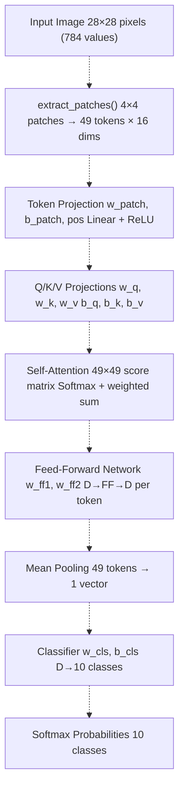
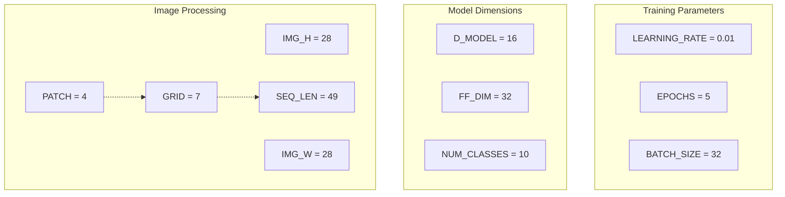
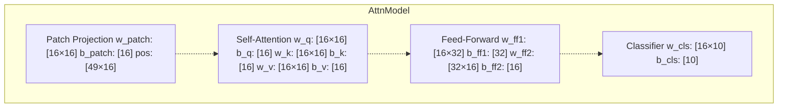
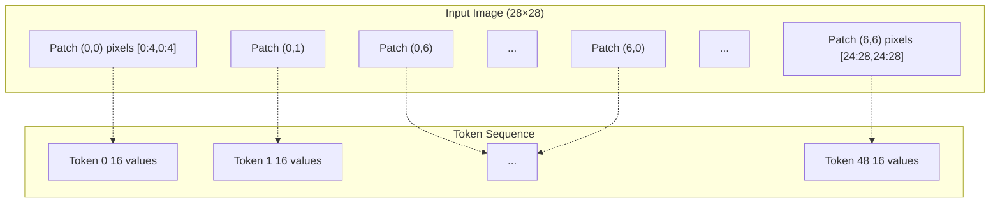
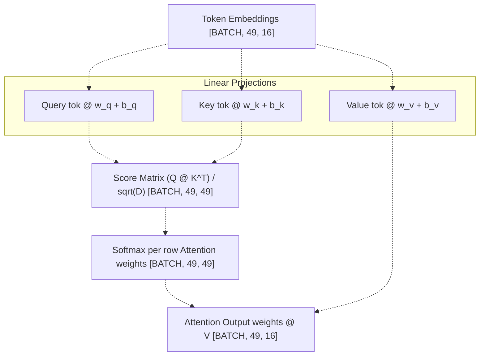
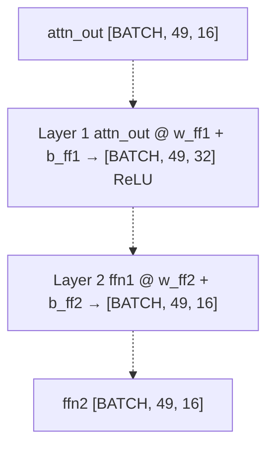
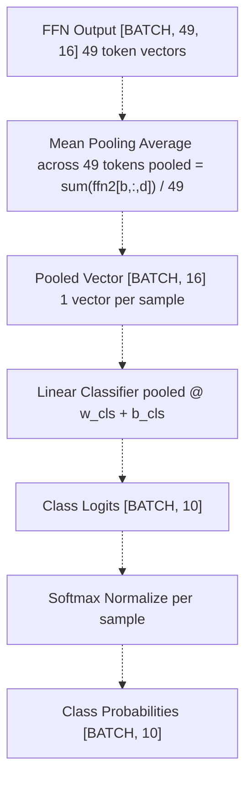
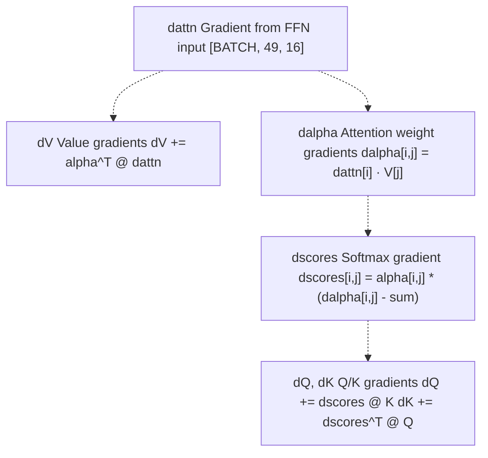
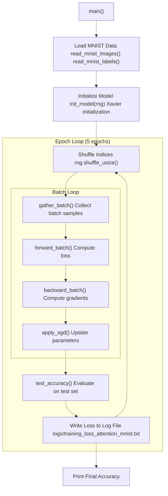

# MNIST Attention Model

> **Relevant source files**
> * [Cargo.toml](https://github.com/ThalesMMS/Rust-Neural-Networks/blob/0e978f90/Cargo.toml)
> * [README.md](https://github.com/ThalesMMS/Rust-Neural-Networks/blob/0e978f90/README.md)
> * [mnist_attention_pool.rs](https://github.com/ThalesMMS/Rust-Neural-Networks/blob/0e978f90/mnist_attention_pool.rs)

## Purpose and Scope

This document describes the transformer-inspired self-attention model for MNIST digit classification implemented in [mnist_attention_pool.rs L1-L1257](https://github.com/ThalesMMS/Rust-Neural-Networks/blob/0e978f90/mnist_attention_pool.rs#L1-L1257)

 The model uses patch-based tokenization and single-head self-attention to process 28×28 grayscale images. This implementation prioritizes educational clarity through explicit CPU loops rather than performance optimization.

For the BLAS-accelerated MLP implementation, see [MNIST MLP](#3.1). For the convolutional architecture, see [MNIST CNN](#3.2). For the common training pipeline shared across all models, see [Training Pipeline](#5.2).

**Sources**: [mnist_attention_pool.rs L1-L18](https://github.com/ThalesMMS/Rust-Neural-Networks/blob/0e978f90/mnist_attention_pool.rs#L1-L18)

 [README.md L70-L87](https://github.com/ThalesMMS/Rust-Neural-Networks/blob/0e978f90/README.md#L70-L87)

---

## Architecture Overview

The attention model implements a simplified transformer-style architecture with the following pipeline: patch extraction → token projection → self-attention → feed-forward network → mean pooling → classification.

### High-Level Architecture Flow



**Architecture Dimensions**:

| Component | Input Shape | Output Shape | Parameters |
| --- | --- | --- | --- |
| Patch Extraction | [BATCH, 784] | [BATCH, 49, 16] | None (reshaping) |
| Token Projection | [BATCH, 49, 16] | [BATCH, 49, 16] | w_patch[16×16], b_patch[16], pos[49×16] |
| Q/K/V Projections | [BATCH, 49, 16] | [BATCH, 49, 16] each | w_q/k/v[16×16], b_q/k/v[16] |
| Self-Attention | Q,K,V [BATCH, 49, 16] | [BATCH, 49, 16] | None (computation) |
| Feed-Forward | [BATCH, 49, 16] | [BATCH, 49, 16] | w_ff1[16×32], w_ff2[32×16] |
| Mean Pool | [BATCH, 49, 16] | [BATCH, 16] | None (averaging) |
| Classifier | [BATCH, 16] | [BATCH, 10] | w_cls[16×10], b_cls[10] |

**Sources**: [mnist_attention_pool.rs L1-L18](https://github.com/ThalesMMS/Rust-Neural-Networks/blob/0e978f90/mnist_attention_pool.rs#L1-L18)

 [mnist_attention_pool.rs L219-L240](https://github.com/ThalesMMS/Rust-Neural-Networks/blob/0e978f90/mnist_attention_pool.rs#L219-L240)

 [README.md L70-L87](https://github.com/ThalesMMS/Rust-Neural-Networks/blob/0e978f90/README.md#L70-L87)

---

## Model Configuration

The model uses small dimensions to enable fast CPU-based training on educational hardware. All hyperparameters are defined as constants at file scope.

### Hyperparameters



| Constant | Value | Description | Line Reference |
| --- | --- | --- | --- |
| `PATCH` | 4 | Patch size (4×4 pixels) | [mnist_attention_pool.rs L33](https://github.com/ThalesMMS/Rust-Neural-Networks/blob/0e978f90/mnist_attention_pool.rs#L33-L33) |
| `GRID` | 7 | Patches per dimension (28÷4) | [mnist_attention_pool.rs L34](https://github.com/ThalesMMS/Rust-Neural-Networks/blob/0e978f90/mnist_attention_pool.rs#L34-L34) |
| `SEQ_LEN` | 49 | Total tokens (7×7) | [mnist_attention_pool.rs L35](https://github.com/ThalesMMS/Rust-Neural-Networks/blob/0e978f90/mnist_attention_pool.rs#L35-L35) |
| `PATCH_DIM` | 16 | Features per patch (4×4) | [mnist_attention_pool.rs L36](https://github.com/ThalesMMS/Rust-Neural-Networks/blob/0e978f90/mnist_attention_pool.rs#L36-L36) |
| `D_MODEL` | 16 | Token embedding dimension | [mnist_attention_pool.rs L39](https://github.com/ThalesMMS/Rust-Neural-Networks/blob/0e978f90/mnist_attention_pool.rs#L39-L39) |
| `FF_DIM` | 32 | Feed-forward hidden size | [mnist_attention_pool.rs L41](https://github.com/ThalesMMS/Rust-Neural-Networks/blob/0e978f90/mnist_attention_pool.rs#L41-L41) |
| `LEARNING_RATE` | 0.01 | SGD learning rate | [mnist_attention_pool.rs L44](https://github.com/ThalesMMS/Rust-Neural-Networks/blob/0e978f90/mnist_attention_pool.rs#L44-L44) |
| `EPOCHS` | 5 | Training epochs | [mnist_attention_pool.rs L45](https://github.com/ThalesMMS/Rust-Neural-Networks/blob/0e978f90/mnist_attention_pool.rs#L45-L45) |
| `BATCH_SIZE` | 32 | Mini-batch size | [mnist_attention_pool.rs L46](https://github.com/ThalesMMS/Rust-Neural-Networks/blob/0e978f90/mnist_attention_pool.rs#L46-L46) |

**Sources**: [mnist_attention_pool.rs L24-L46](https://github.com/ThalesMMS/Rust-Neural-Networks/blob/0e978f90/mnist_attention_pool.rs#L24-L46)

---

## Data Structures

### AttnModel Struct

The `AttnModel` struct contains all learnable parameters organized by architectural component. All weights are stored in row-major order as flat `Vec<f32>`.



**Field Breakdown**:

* **Patch projection**: Transforms 16-dimensional patch vectors to D_MODEL dimensions with learned position embeddings ([mnist_attention_pool.rs L221-L224](https://github.com/ThalesMMS/Rust-Neural-Networks/blob/0e978f90/mnist_attention_pool.rs#L221-L224) )
* **Attention projections**: Separate linear transformations for Query, Key, and Value ([mnist_attention_pool.rs L226-L231](https://github.com/ThalesMMS/Rust-Neural-Networks/blob/0e978f90/mnist_attention_pool.rs#L226-L231) )
* **Feed-forward network**: Two-layer MLP applied to each token independently ([mnist_attention_pool.rs L233-L236](https://github.com/ThalesMMS/Rust-Neural-Networks/blob/0e978f90/mnist_attention_pool.rs#L233-L236) )
* **Classifier head**: Final linear layer mapping pooled representation to class logits ([mnist_attention_pool.rs L238-L239](https://github.com/ThalesMMS/Rust-Neural-Networks/blob/0e978f90/mnist_attention_pool.rs#L238-L239) )

**Sources**: [mnist_attention_pool.rs L219-L240](https://github.com/ThalesMMS/Rust-Neural-Networks/blob/0e978f90/mnist_attention_pool.rs#L219-L240)

### BatchBuffers Struct

The `BatchBuffers` struct holds intermediate activations and gradients for a single mini-batch, enabling efficient memory reuse across training iterations.

**Forward buffers** (lines [mnist_attention_pool.rs L333-L344](https://github.com/ThalesMMS/Rust-Neural-Networks/blob/0e978f90/mnist_attention_pool.rs#L333-L344)

):

* `patches`: Extracted 4×4 patches [BATCH × 49 × 16]
* `tok`: Token embeddings after ReLU [BATCH × 49 × 16]
* `q`, `k`, `v`: Query, Key, Value projections [BATCH × 49 × 16]
* `attn`: Attention weights (softmax scores) [BATCH × 49 × 49]
* `attn_out`: Attention output (weighted V) [BATCH × 49 × 16]
* `ffn1`: Feed-forward hidden layer [BATCH × 49 × 32]
* `ffn2`: Feed-forward output [BATCH × 49 × 16]
* `pooled`: Mean-pooled tokens [BATCH × 16]
* `logits`: Class logits [BATCH × 10]
* `probs`: Softmax probabilities [BATCH × 10]

**Backward buffers** (lines [mnist_attention_pool.rs L346-L358](https://github.com/ThalesMMS/Rust-Neural-Networks/blob/0e978f90/mnist_attention_pool.rs#L346-L358)

):

* `dlogits`, `dpooled`, `dffn2`, `dffn1`: Gradients for forward buffers
* `dattn`, `dalpha`, `dscores`: Attention mechanism gradients
* `dq`, `dk`, `dv`: Q/K/V projection gradients
* `dtok`: Token embedding gradients

**Sources**: [mnist_attention_pool.rs L331-L388](https://github.com/ThalesMMS/Rust-Neural-Networks/blob/0e978f90/mnist_attention_pool.rs#L331-L388)

### Grads Struct

The `Grads` struct mirrors `AttnModel` and accumulates gradients for all learnable parameters during backpropagation. It provides a `zero()` method to reset gradients before each batch ([mnist_attention_pool.rs L281-L328](https://github.com/ThalesMMS/Rust-Neural-Networks/blob/0e978f90/mnist_attention_pool.rs#L281-L328)

).

**Sources**: [mnist_attention_pool.rs L242-L329](https://github.com/ThalesMMS/Rust-Neural-Networks/blob/0e978f90/mnist_attention_pool.rs#L242-L329)

---

## Patch Tokenization

The model splits each 28×28 image into a 7×7 grid of non-overlapping 4×4 patches, creating 49 tokens. Each patch is flattened into a 16-dimensional vector.

### Patch Extraction Process



**Implementation**: The `extract_patches()` function ([mnist_attention_pool.rs L467-L487](https://github.com/ThalesMMS/Rust-Neural-Networks/blob/0e978f90/mnist_attention_pool.rs#L467-L487)

) iterates through the 7×7 grid, copying each 4×4 patch into a contiguous buffer. For each patch at grid position (py, px):

1. Calculate token index: `t = py * GRID + px`
2. For each pixel (dy, dx) within the patch: * Source index: `img_base + (py*PATCH + dy)*IMG_W + (px*PATCH + dx)` * Destination index: `patch_base + dy*PATCH + dx`

**Sources**: [mnist_attention_pool.rs L465-L487](https://github.com/ThalesMMS/Rust-Neural-Networks/blob/0e978f90/mnist_attention_pool.rs#L465-L487)

 [README.md L74](https://github.com/ThalesMMS/Rust-Neural-Networks/blob/0e978f90/README.md#L74-L74)

---

## Token Projection and Position Embeddings

After patch extraction, each 16-dimensional patch vector is projected to D_MODEL dimensions (also 16 in this configuration) with learned position embeddings.

### Token Projection Formula

For each token `t` in batch sample `b`:

```
tok[b,t] = ReLU(patch[b,t] @ w_patch + b_patch + pos[t])
```

Where:

* `patch[b,t]`: 16-dim patch vector
* `w_patch`: [16×16] projection matrix
* `b_patch`: [16] bias vector
* `pos[t]`: [16] position embedding for token t
* `ReLU`: Rectified Linear Unit activation

**Implementation**: The token projection loop ([mnist_attention_pool.rs L507-L529](https://github.com/ThalesMMS/Rust-Neural-Networks/blob/0e978f90/mnist_attention_pool.rs#L507-L529)

) computes the linear transformation and applies ReLU activation in-place.

**Initialization**:

* `w_patch` uses Xavier/Glorot uniform initialization with `limit = sqrt(6 / (PATCH_DIM + D_MODEL))` ([mnist_attention_pool.rs L392-L396](https://github.com/ThalesMMS/Rust-Neural-Networks/blob/0e978f90/mnist_attention_pool.rs#L392-L396) )
* `pos` embeddings initialized uniformly in [-0.1, 0.1] ([mnist_attention_pool.rs L400-L403](https://github.com/ThalesMMS/Rust-Neural-Networks/blob/0e978f90/mnist_attention_pool.rs#L400-L403) )

**Sources**: [mnist_attention_pool.rs L507-L529](https://github.com/ThalesMMS/Rust-Neural-Networks/blob/0e978f90/mnist_attention_pool.rs#L507-L529)

 [mnist_attention_pool.rs L392-L403](https://github.com/ThalesMMS/Rust-Neural-Networks/blob/0e978f90/mnist_attention_pool.rs#L392-L403)

---

## Self-Attention Mechanism

The model implements single-head scaled dot-product attention. Each token attends to all 49 tokens in the sequence, computing attention weights and producing a weighted sum of value vectors.

### Attention Computation Flow



### Attention Formula

For each sample `b` and query token `i`:

1. **Compute attention scores** with all key tokens `j`: ``` score[b,i,j] = (Q[b,i] · K[b,j]) / sqrt(D_MODEL) ```
2. **Apply softmax** across all `j` to get attention weights: ``` alpha[b,i,j] = exp(score[b,i,j]) / sum_j(exp(score[b,i,j])) ```
3. **Compute weighted sum** of value vectors: ``` attn_out[b,i] = sum_j(alpha[b,i,j] * V[b,j]) ```

**Implementation Details**:

* Q/K/V projections computed in parallel loops ([mnist_attention_pool.rs L532-L555](https://github.com/ThalesMMS/Rust-Neural-Networks/blob/0e978f90/mnist_attention_pool.rs#L532-L555) )
* Score computation uses dot products with scaling factor `1/sqrt(D_MODEL)` ([mnist_attention_pool.rs L558-L578](https://github.com/ThalesMMS/Rust-Neural-Networks/blob/0e978f90/mnist_attention_pool.rs#L558-L578) )
* Softmax applied row-wise using `softmax_inplace()` ([mnist_attention_pool.rs L580](https://github.com/ThalesMMS/Rust-Neural-Networks/blob/0e978f90/mnist_attention_pool.rs#L580-L580) )
* Weighted sum accumulates into `attn_out` buffer ([mnist_attention_pool.rs L582-L590](https://github.com/ThalesMMS/Rust-Neural-Networks/blob/0e978f90/mnist_attention_pool.rs#L582-L590) )

**Sources**: [mnist_attention_pool.rs L532-L591](https://github.com/ThalesMMS/Rust-Neural-Networks/blob/0e978f90/mnist_attention_pool.rs#L532-L591)

 [mnist_attention_pool.rs L191-L217](https://github.com/ThalesMMS/Rust-Neural-Networks/blob/0e978f90/mnist_attention_pool.rs#L191-L217)

---

## Feed-Forward Network

After self-attention, each token independently passes through a two-layer MLP with ReLU activation. This is applied per-token with no interaction between tokens.

### FFN Architecture



**Per-Token Computation**:

For each token `t` in batch sample `b`:

```
ffn1[b,t] = ReLU(attn_out[b,t] @ w_ff1 + b_ff1)
ffn2[b,t] = ffn1[b,t] @ w_ff2 + b_ff2
```

Where:

* `w_ff1`: [16×32] first layer weights
* `w_ff2`: [32×16] second layer weights
* Output dimension matches input dimension (D_MODEL = 16)

**Implementation**: The feed-forward computation ([mnist_attention_pool.rs L594-L623](https://github.com/ThalesMMS/Rust-Neural-Networks/blob/0e978f90/mnist_attention_pool.rs#L594-L623)

) processes each token independently, applying ReLU after the first layer but not after the second.

**Sources**: [mnist_attention_pool.rs L593-L623](https://github.com/ThalesMMS/Rust-Neural-Networks/blob/0e978f90/mnist_attention_pool.rs#L593-L623)

---

## Mean Pooling and Classification

### Pooling and Classification Pipeline



**Mean Pooling**: Reduces the sequence of 49 token vectors to a single D_MODEL-dimensional vector by averaging:

```
pooled[b,d] = (1/49) * sum_{t=0}^{48} ffn2[b,t,d]
```

Implementation: [mnist_attention_pool.rs L625-L638](https://github.com/ThalesMMS/Rust-Neural-Networks/blob/0e978f90/mnist_attention_pool.rs#L625-L638)

**Classification**: Linear transformation followed by softmax:

```
logits[b,c] = pooled[b] @ w_cls[:,c] + b_cls[c]
probs[b,c] = exp(logits[b,c]) / sum_c(exp(logits[b,c]))
```

Implementation: [mnist_attention_pool.rs L640-L661](https://github.com/ThalesMMS/Rust-Neural-Networks/blob/0e978f90/mnist_attention_pool.rs#L640-L661)

**Sources**: [mnist_attention_pool.rs L625-L661](https://github.com/ThalesMMS/Rust-Neural-Networks/blob/0e978f90/mnist_attention_pool.rs#L625-L661)

---

## Forward and Backward Propagation

### Forward Pass Function Signature

The `forward_batch()` function ([mnist_attention_pool.rs L490-L684](https://github.com/ThalesMMS/Rust-Neural-Networks/blob/0e978f90/mnist_attention_pool.rs#L490-L684)

) executes the complete forward pass and computes the cross-entropy loss.

**Function**: `forward_batch(model: &AttnModel, batch_inputs: &[f32], batch_labels: &[u8], batch_count: usize, buf: &mut BatchBuffers) -> f32`

**Returns**: Total batch loss (not averaged)

**Processing Steps**:

1. Extract patches ([lines 504](https://github.com/ThalesMMS/Rust-Neural-Networks/blob/0e978f90/lines 504) )
2. Project tokens with position embeddings and ReLU ([lines 507-529](https://github.com/ThalesMMS/Rust-Neural-Networks/blob/0e978f90/lines 507-529) )
3. Compute Q/K/V projections ([lines 532-555](https://github.com/ThalesMMS/Rust-Neural-Networks/blob/0e978f90/lines 532-555) )
4. Calculate self-attention ([lines 557-591](https://github.com/ThalesMMS/Rust-Neural-Networks/blob/0e978f90/lines 557-591) )
5. Apply feed-forward network ([lines 594-623](https://github.com/ThalesMMS/Rust-Neural-Networks/blob/0e978f90/lines 594-623) )
6. Mean-pool tokens ([lines 625-638](https://github.com/ThalesMMS/Rust-Neural-Networks/blob/0e978f90/lines 625-638) )
7. Compute classifier logits and softmax ([lines 640-661](https://github.com/ThalesMMS/Rust-Neural-Networks/blob/0e978f90/lines 640-661) )
8. Calculate cross-entropy loss and gradient w.r.t. logits ([lines 663-682](https://github.com/ThalesMMS/Rust-Neural-Networks/blob/0e978f90/lines 663-682) )

**Sources**: [mnist_attention_pool.rs L490-L684](https://github.com/ThalesMMS/Rust-Neural-Networks/blob/0e978f90/mnist_attention_pool.rs#L490-L684)

### Backward Pass Function Signature

The `backward_batch()` function ([mnist_attention_pool.rs L687-L928](https://github.com/ThalesMMS/Rust-Neural-Networks/blob/0e978f90/mnist_attention_pool.rs#L687-L928)

) computes gradients for all parameters via backpropagation.

**Function**: `backward_batch(model: &AttnModel, batch_count: usize, buf: &mut BatchBuffers, grads: &mut Grads)`

**Backpropagation Order** (reverse of forward):

1. Classifier gradients (`w_cls`, `b_cls`) and `dpooled` ([lines 722-741](https://github.com/ThalesMMS/Rust-Neural-Networks/blob/0e978f90/lines 722-741) )
2. Distribute pooling gradients to tokens ([lines 744-753](https://github.com/ThalesMMS/Rust-Neural-Networks/blob/0e978f90/lines 744-753) )
3. FFN2 gradients and `dffn1` ([lines 756-782](https://github.com/ThalesMMS/Rust-Neural-Networks/blob/0e978f90/lines 756-782) )
4. FFN1 gradients with ReLU backward ([lines 785-812](https://github.com/ThalesMMS/Rust-Neural-Networks/blob/0e978f90/lines 785-812) )
5. Attention output gradients ([lines 815-846](https://github.com/ThalesMMS/Rust-Neural-Networks/blob/0e978f90/lines 815-846) )
6. Q/K/V projection gradients ([lines 850-895](https://github.com/ThalesMMS/Rust-Neural-Networks/blob/0e978f90/lines 850-895) )
7. Token projection and position embedding gradients ([lines 898-925](https://github.com/ThalesMMS/Rust-Neural-Networks/blob/0e978f90/lines 898-925) )

**Gradient Accumulation**: All gradients are accumulated across the batch before applying SGD updates.

**Sources**: [mnist_attention_pool.rs L686-L928](https://github.com/ThalesMMS/Rust-Neural-Networks/blob/0e978f90/mnist_attention_pool.rs#L686-L928)

---

## Attention Backward Pass Details

The attention mechanism backward pass is complex, involving gradients through softmax, matrix multiplications, and scaling operations.

### Attention Gradient Flow



**Key Backward Steps**:

1. **Value gradients** ([mnist_attention_pool.rs L829-L835](https://github.com/ThalesMMS/Rust-Neural-Networks/blob/0e978f90/mnist_attention_pool.rs#L829-L835) ): ``` dV[b,j,d] += sum_i(alpha[b,i,j] * dattn[b,i,d]) ```
2. **Attention weight gradients** ([mnist_attention_pool.rs L820-L827](https://github.com/ThalesMMS/Rust-Neural-Networks/blob/0e978f90/mnist_attention_pool.rs#L820-L827) ): ``` dalpha[b,i,j] = sum_d(dattn[b,i,d] * V[b,j,d]) ```
3. **Softmax gradient** ([mnist_attention_pool.rs L838-L845](https://github.com/ThalesMMS/Rust-Neural-Networks/blob/0e978f90/mnist_attention_pool.rs#L838-L845) ): ``` sum = sum_j(dalpha[b,i,j] * alpha[b,i,j]) dscores[b,i,j] = alpha[b,i,j] * (dalpha[b,i,j] - sum) ```
4. **Query/Key gradients** ([mnist_attention_pool.rs L850-L864](https://github.com/ThalesMMS/Rust-Neural-Networks/blob/0e978f90/mnist_attention_pool.rs#L850-L864) ): ``` dQ[b,i,d] += sum_j(dscores[b,i,j] * K[b,j,d]) / sqrt(D) dK[b,j,d] += sum_i(dscores[b,i,j] * Q[b,i,d]) / sqrt(D) ```

**Sources**: [mnist_attention_pool.rs L814-L895](https://github.com/ThalesMMS/Rust-Neural-Networks/blob/0e978f90/mnist_attention_pool.rs#L814-L895)

---

## Training Loop

### Training Execution Flow



**Main Training Logic** ([mnist_attention_pool.rs L1169-L1256](https://github.com/ThalesMMS/Rust-Neural-Networks/blob/0e978f90/mnist_attention_pool.rs#L1169-L1256)

):

1. **Data Loading**: Read IDX files for train and test sets ([lines 1171-1174](https://github.com/ThalesMMS/Rust-Neural-Networks/blob/0e978f90/lines 1171-1174) )
2. **Model Initialization**: Xavier initialization with random seed ([lines 1188-1191](https://github.com/ThalesMMS/Rust-Neural-Networks/blob/0e978f90/lines 1188-1191) )
3. **Epoch Loop**: For each of 5 epochs: * Shuffle training indices ([line 1209](https://github.com/ThalesMMS/Rust-Neural-Networks/blob/0e978f90/line 1209) ) * Process batches of 32 samples ([lines 1213-1239](https://github.com/ThalesMMS/Rust-Neural-Networks/blob/0e978f90/lines 1213-1239) ) * Compute test accuracy after each epoch ([line 1243](https://github.com/ThalesMMS/Rust-Neural-Networks/blob/0e978f90/line 1243) ) * Log loss and timing ([line 1252](https://github.com/ThalesMMS/Rust-Neural-Networks/blob/0e978f90/line 1252) )

**Sources**: [mnist_attention_pool.rs L1169-L1256](https://github.com/ThalesMMS/Rust-Neural-Networks/blob/0e978f90/mnist_attention_pool.rs#L1169-L1256)

### SGD Update Function

The `apply_sgd()` function ([mnist_attention_pool.rs L930-L977](https://github.com/ThalesMMS/Rust-Neural-Networks/blob/0e978f90/mnist_attention_pool.rs#L930-L977)

) applies vanilla stochastic gradient descent without momentum or weight decay:

```
param := param - learning_rate * gradient
```

All parameters are updated in-place:

* Patch projection: `w_patch`, `b_patch`, `pos`
* Attention: `w_q`, `b_q`, `w_k`, `b_k`, `w_v`, `b_v`
* Feed-forward: `w_ff1`, `b_ff1`, `w_ff2`, `b_ff2`
* Classifier: `w_cls`, `b_cls`

**Sources**: [mnist_attention_pool.rs L930-L977](https://github.com/ThalesMMS/Rust-Neural-Networks/blob/0e978f90/mnist_attention_pool.rs#L930-L977)

---

## Inference and Accuracy Evaluation

### Test Accuracy Function

The `test_accuracy()` function ([mnist_attention_pool.rs L979-L1167](https://github.com/ThalesMMS/Rust-Neural-Networks/blob/0e978f90/mnist_attention_pool.rs#L979-L1167)

) evaluates the model on the test set without computing gradients or loss.

**Function**: `test_accuracy(model: &AttnModel, images: &[f32], labels: &[u8]) -> f32`

**Returns**: Accuracy percentage (0-100)

**Processing**:

1. Iterate through test set in batches of 32 ([line 986](https://github.com/ThalesMMS/Rust-Neural-Networks/blob/0e978f90/line 986) )
2. Execute forward pass without backward ([lines 1000-1146](https://github.com/ThalesMMS/Rust-Neural-Networks/blob/0e978f90/lines 1000-1146) )
3. Take argmax of logits as prediction ([lines 1149-1159](https://github.com/ThalesMMS/Rust-Neural-Networks/blob/0e978f90/lines 1149-1159) )
4. Count correct predictions ([line 1160](https://github.com/ThalesMMS/Rust-Neural-Networks/blob/0e978f90/line 1160) )
5. Return percentage: `100.0 * correct / total` ([line 1166](https://github.com/ThalesMMS/Rust-Neural-Networks/blob/0e978f90/line 1166) )

**Optimization**: Reuses `BatchBuffers` to avoid repeated allocations ([line 984](https://github.com/ThalesMMS/Rust-Neural-Networks/blob/0e978f90/line 984)

)

**Sources**: [mnist_attention_pool.rs L979-L1167](https://github.com/ThalesMMS/Rust-Neural-Networks/blob/0e978f90/mnist_attention_pool.rs#L979-L1167)

---

## Performance Characteristics

### Benchmark Results

From [README.md L146](https://github.com/ThalesMMS/Rust-Neural-Networks/blob/0e978f90/README.md#L146-L146)

:

| Metric | Value | Notes |
| --- | --- | --- |
| **Training Time** | 33.88s | Total for 5 epochs |
| **Test Accuracy** | 38.55% | Default hyperparameters |
| **Epochs** | 5 | Limited training |
| **Batch Size** | 32 |  |
| **Model Size** | ~18K parameters | Small capacity |

**Performance Analysis**:

The attention model achieves significantly lower accuracy (38.55%) compared to the MLP (94.17%) and CNN (91.93%) due to:

1. **Limited training**: Only 5 epochs vs. 10 for MLP, 3 for CNN
2. **Small model capacity**: D_MODEL=16, FF_DIM=32 are minimal dimensions
3. **No optimization**: Uses explicit CPU loops without BLAS acceleration
4. **Single attention head**: More heads would increase expressiveness
5. **No residual connections**: Standard transformers use skip connections
6. **No layer normalization**: Helps training stability in deeper models

The 33.88s training time reflects the computational cost of:

* O(SEQ_LEN²) attention score matrix per sample (49×49 = 2,401 operations)
* Nested loops for batch, sequence, and dimension iterations
* No SIMD or multi-threading optimizations

**Sources**: [README.md L146](https://github.com/ThalesMMS/Rust-Neural-Networks/blob/0e978f90/README.md#L146-L146)

 [mnist_attention_pool.rs L12](https://github.com/ThalesMMS/Rust-Neural-Networks/blob/0e978f90/mnist_attention_pool.rs#L12-L12)

---

## Initialization Strategy

### Xavier/Glorot Initialization

The `init_model()` function ([mnist_attention_pool.rs L390-L463](https://github.com/ThalesMMS/Rust-Neural-Networks/blob/0e978f90/mnist_attention_pool.rs#L390-L463)

) uses Xavier uniform initialization for all weight matrices to prevent vanishing/exploding gradients.

**Xavier Formula**:

```
limit = sqrt(6 / (fan_in + fan_out))
weights ~ Uniform(-limit, limit)
```

**Per-Layer Limits**:

| Layer | Dimensions | Xavier Limit | Line |
| --- | --- | --- | --- |
| Patch projection | 16→16 | sqrt(6/32) ≈ 0.433 | [392](https://github.com/ThalesMMS/Rust-Neural-Networks/blob/0e978f90/392) |
| Q/K/V projections | 16→16 | sqrt(6/32) ≈ 0.433 | [406](https://github.com/ThalesMMS/Rust-Neural-Networks/blob/0e978f90/406) |
| Feed-forward 1 | 16→32 | sqrt(6/48) ≈ 0.354 | [424](https://github.com/ThalesMMS/Rust-Neural-Networks/blob/0e978f90/424) |
| Feed-forward 2 | 32→16 | sqrt(6/48) ≈ 0.354 | [431](https://github.com/ThalesMMS/Rust-Neural-Networks/blob/0e978f90/431) |
| Classifier | 16→10 | sqrt(6/26) ≈ 0.480 | [439](https://github.com/ThalesMMS/Rust-Neural-Networks/blob/0e978f90/439) |

**Special Initializations**:

* **Biases**: Initialized to zero for all layers
* **Position embeddings**: Uniform in [-0.1, 0.1] ([line 402](https://github.com/ThalesMMS/Rust-Neural-Networks/blob/0e978f90/line 402) )

**Sources**: [mnist_attention_pool.rs L390-L463](https://github.com/ThalesMMS/Rust-Neural-Networks/blob/0e978f90/mnist_attention_pool.rs#L390-L463)

---

## Loss Computation

### Cross-Entropy Loss

The loss is computed using softmax cross-entropy at the end of `forward_batch()` ([mnist_attention_pool.rs L663-L682](https://github.com/ThalesMMS/Rust-Neural-Networks/blob/0e978f90/mnist_attention_pool.rs#L663-L682)

).

**Loss Formula**:

```
loss = -(1/N) * sum_{b=1}^{N} log(probs[b, y_b])
```

Where:

* N = batch size
* y_b = true label for sample b
* probs[b, y_b] = predicted probability for true class

**Gradient Computation**:

The gradient w.r.t. logits before softmax:

```
dlogits[b,c] = (probs[b,c] - 1{c == y_b}) / N
```

Where 1{·} is the indicator function.

**Numerical Stability**:

* Small epsilon (1e-9) added when computing log to avoid log(0) ([line 665](https://github.com/ThalesMMS/Rust-Neural-Networks/blob/0e978f90/line 665) )
* Softmax uses max subtraction internally ([mnist_attention_pool.rs L192-L196](https://github.com/ThalesMMS/Rust-Neural-Networks/blob/0e978f90/mnist_attention_pool.rs#L192-L196) )

**Sources**: [mnist_attention_pool.rs L663-L682](https://github.com/ThalesMMS/Rust-Neural-Networks/blob/0e978f90/mnist_attention_pool.rs#L663-L682)

 [mnist_attention_pool.rs L191-L209](https://github.com/ThalesMMS/Rust-Neural-Networks/blob/0e978f90/mnist_attention_pool.rs#L191-L209)

---

## Key Implementation Details

### Memory Layout

All multi-dimensional arrays are stored as flat `Vec<f32>` in row-major order:

**Example**: Token tensor `[BATCH, SEQ_LEN, D_MODEL]`

* Element at (b, t, d): `tokens[b * SEQ_LEN * D_MODEL + t * D_MODEL + d]`
* Contiguous memory enables cache-friendly access patterns

**Weight Matrices**: Stored in row-major order where row corresponds to input dimension:

* `w_q[d_in * D_MODEL + d_out]` for Q projection
* Enables efficient dot products during forward pass

**Sources**: [mnist_attention_pool.rs L360-L387](https://github.com/ThalesMMS/Rust-Neural-Networks/blob/0e978f90/mnist_attention_pool.rs#L360-L387)

### SimpleRng Random Number Generator

The model uses a custom xorshift PRNG ([mnist_attention_pool.rs L49-L101](https://github.com/ThalesMMS/Rust-Neural-Networks/blob/0e978f90/mnist_attention_pool.rs#L49-L101)

) for:

* Weight initialization ([mnist_attention_pool.rs L390-L463](https://github.com/ThalesMMS/Rust-Neural-Networks/blob/0e978f90/mnist_attention_pool.rs#L390-L463) )
* Training index shuffling ([mnist_attention_pool.rs L1209](https://github.com/ThalesMMS/Rust-Neural-Networks/blob/0e978f90/mnist_attention_pool.rs#L1209-L1209) )
* Reproducible results without external dependencies

**Operations**:

* `next_f32()`: Uniform [0, 1) float\n- `gen_range_f32(low, high)`](https://github.com/ThalesMMS/Rust-Neural-Networks/blob/0e978f90/0, 1) float\n- `gen_range_f32(low, high)`#LNaN-LNaN)

### Batch Gathering

The `gather_batch()` function ([mnist_attention_pool.rs L171-L188](https://github.com/ThalesMMS/Rust-Neural-Networks/blob/0e978f90/mnist_attention_pool.rs#L171-L188)

) copies a contiguous subset of samples from the shuffled dataset into batch buffers, enabling efficient batch processing.

**Sources**: [mnist_attention_pool.rs L171-L188](https://github.com/ThalesMMS/Rust-Neural-Networks/blob/0e978f90/mnist_attention_pool.rs#L171-L188)

---

## Logging and Output

### Training Log Format

Training metrics are written to `logs/training_loss_attention_mnist.txt` in CSV format:

```
epoch,loss,time
1,2.302585,6.45
2,2.298123,6.51
...
```

**Columns**:

* `epoch`: Epoch number (1-indexed)
* `loss`: Average training loss for the epoch
* `time`: Epoch duration in seconds

**File Creation**: [mnist_attention_pool.rs L1181-L1186](https://github.com/ThalesMMS/Rust-Neural-Networks/blob/0e978f90/mnist_attention_pool.rs#L1181-L1186)

**Writing**: [mnist_attention_pool.rs L1252](https://github.com/ThalesMMS/Rust-Neural-Networks/blob/0e978f90/mnist_attention_pool.rs#L1252-L1252)

This log file can be visualized using `plot_comparison.py` (see [Training Visualization](#4.2)).

**Sources**: [mnist_attention_pool.rs L1181-L1186](https://github.com/ThalesMMS/Rust-Neural-Networks/blob/0e978f90/mnist_attention_pool.rs#L1181-L1186)

 [mnist_attention_pool.rs L1252](https://github.com/ThalesMMS/Rust-Neural-Networks/blob/0e978f90/mnist_attention_pool.rs#L1252-L1252)

---

## Code Organization Summary

### Primary Functions

| Function | Lines | Purpose |
| --- | --- | --- |
| `main()` | [1169-1256](https://github.com/ThalesMMS/Rust-Neural-Networks/blob/0e978f90/1169-1256) | Entry point, training loop |
| `init_model()` | [390-463](https://github.com/ThalesMMS/Rust-Neural-Networks/blob/0e978f90/390-463) | Xavier initialization |
| `extract_patches()` | [467-487](https://github.com/ThalesMMS/Rust-Neural-Networks/blob/0e978f90/467-487) | Image → patch tokens |
| `forward_batch()` | [490-684](https://github.com/ThalesMMS/Rust-Neural-Networks/blob/0e978f90/490-684) | Forward pass + loss |
| `backward_batch()` | [687-928](https://github.com/ThalesMMS/Rust-Neural-Networks/blob/0e978f90/687-928) | Gradient computation |
| `apply_sgd()` | [930-977](https://github.com/ThalesMMS/Rust-Neural-Networks/blob/0e978f90/930-977) | Parameter updates |
| `test_accuracy()` | [979-1167](https://github.com/ThalesMMS/Rust-Neural-Networks/blob/0e978f90/979-1167) | Evaluation without gradients |
| `gather_batch()` | [171-188](https://github.com/ThalesMMS/Rust-Neural-Networks/blob/0e978f90/171-188) | Batch data loading |
| `read_mnist_images()` | [114-148](https://github.com/ThalesMMS/Rust-Neural-Networks/blob/0e978f90/114-148) | IDX image parser |
| `read_mnist_labels()` | [151-168](https://github.com/ThalesMMS/Rust-Neural-Networks/blob/0e978f90/151-168) | IDX label parser |
| `softmax_inplace()` | [191-209](https://github.com/ThalesMMS/Rust-Neural-Networks/blob/0e978f90/191-209) | Single vector softmax |
| `softmax_rows_inplace()` | [212-217](https://github.com/ThalesMMS/Rust-Neural-Networks/blob/0e978f90/212-217) | Batched softmax |

**Sources**: [mnist_attention_pool.rs L1-L1257](https://github.com/ThalesMMS/Rust-Neural-Networks/blob/0e978f90/mnist_attention_pool.rs#L1-L1257)

---

## Comparison with Other Models

The attention model represents a fundamentally different architectural approach compared to the MLP ([MNIST MLP](#3.1)) and CNN ([MNIST CNN](#3.2)):

**Architectural Differences**:

* **Token-based**: Processes 49 discrete tokens rather than treating input as a single vector (MLP) or spatial grid (CNN)
* **Global receptive field**: Each token attends to all other tokens, unlike CNN's local 3×3 convolution
* **Position-aware**: Learned position embeddings vs. CNN's implicit spatial structure
* **No pooling layers**: Uses mean pooling over tokens rather than max pooling (CNN) or direct flattening (MLP)

**Training Characteristics**:

* **No BLAS**: Pure CPU loops vs. MLP's BLAS-accelerated matrix multiplication
* **Computational cost**: O(N²) attention vs. O(N) for MLP/CNN operations
* **Memory footprint**: Stores 49×49 attention matrices per sample

For detailed BLAS integration discussion, see [BLAS Integration](#5.1). For training pipeline commonalities, see [Training Pipeline](#5.2).

**Sources**: [README.md L1-L191](https://github.com/ThalesMMS/Rust-Neural-Networks/blob/0e978f90/README.md#L1-L191)

Refresh this wiki

Last indexed: 5 January 2026 ([0e978f](https://github.com/ThalesMMS/Rust-Neural-Networks/commit/0e978f90))

### On this page

* [MNIST Attention Model](#3.3-mnist-attention-model)
* [Purpose and Scope](#3.3-purpose-and-scope)
* [Architecture Overview](#3.3-architecture-overview)
* [High-Level Architecture Flow](#3.3-high-level-architecture-flow)
* [Model Configuration](#3.3-model-configuration)
* [Hyperparameters](#3.3-hyperparameters)
* [Data Structures](#3.3-data-structures)
* [AttnModel Struct](#3.3-attnmodel-struct)
* [BatchBuffers Struct](#3.3-batchbuffers-struct)
* [Grads Struct](#3.3-grads-struct)
* [Patch Tokenization](#3.3-patch-tokenization)
* [Patch Extraction Process](#3.3-patch-extraction-process)
* [Token Projection and Position Embeddings](#3.3-token-projection-and-position-embeddings)
* [Token Projection Formula](#3.3-token-projection-formula)
* [Self-Attention Mechanism](#3.3-self-attention-mechanism)
* [Attention Computation Flow](#3.3-attention-computation-flow)
* [Attention Formula](#3.3-attention-formula)
* [Feed-Forward Network](#3.3-feed-forward-network)
* [FFN Architecture](#3.3-ffn-architecture)
* [Mean Pooling and Classification](#3.3-mean-pooling-and-classification)
* [Pooling and Classification Pipeline](#3.3-pooling-and-classification-pipeline)
* [Forward and Backward Propagation](#3.3-forward-and-backward-propagation)
* [Forward Pass Function Signature](#3.3-forward-pass-function-signature)
* [Backward Pass Function Signature](#3.3-backward-pass-function-signature)
* [Attention Backward Pass Details](#3.3-attention-backward-pass-details)
* [Attention Gradient Flow](#3.3-attention-gradient-flow)
* [Training Loop](#3.3-training-loop)
* [Training Execution Flow](#3.3-training-execution-flow)
* [SGD Update Function](#3.3-sgd-update-function)
* [Inference and Accuracy Evaluation](#3.3-inference-and-accuracy-evaluation)
* [Test Accuracy Function](#3.3-test-accuracy-function)
* [Performance Characteristics](#3.3-performance-characteristics)
* [Benchmark Results](#3.3-benchmark-results)
* [Initialization Strategy](#3.3-initialization-strategy)
* [Xavier/Glorot Initialization](#3.3-xavierglorot-initialization)
* [Loss Computation](#3.3-loss-computation)
* [Cross-Entropy Loss](#3.3-cross-entropy-loss)
* [Key Implementation Details](#3.3-key-implementation-details)
* [Memory Layout](#3.3-memory-layout)
* [SimpleRng Random Number Generator](#3.3-simplerng-random-number-generator)
* [Batch Gathering](#3.3-batch-gathering)
* [Logging and Output](#3.3-logging-and-output)
* [Training Log Format](#3.3-training-log-format)
* [Code Organization Summary](#3.3-code-organization-summary)
* [Primary Functions](#3.3-primary-functions)
* [Comparison with Other Models](#3.3-comparison-with-other-models)

Ask Devin about Rust-Neural-Networks