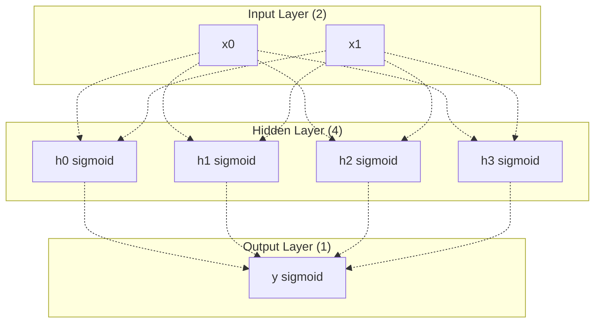
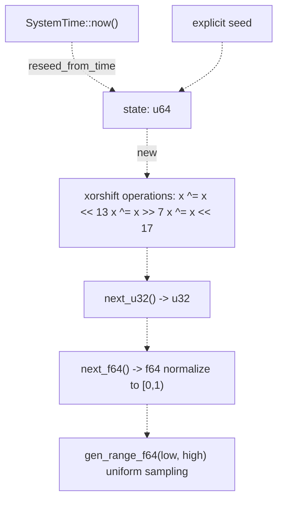
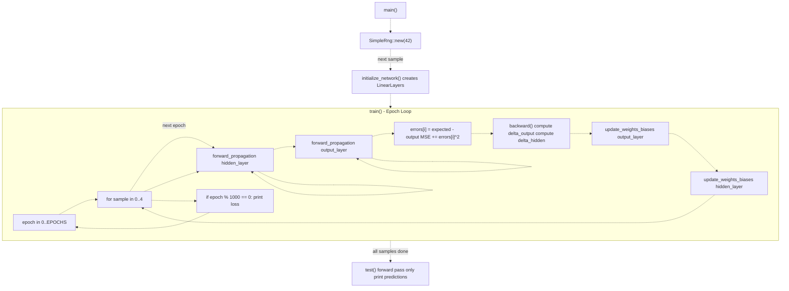
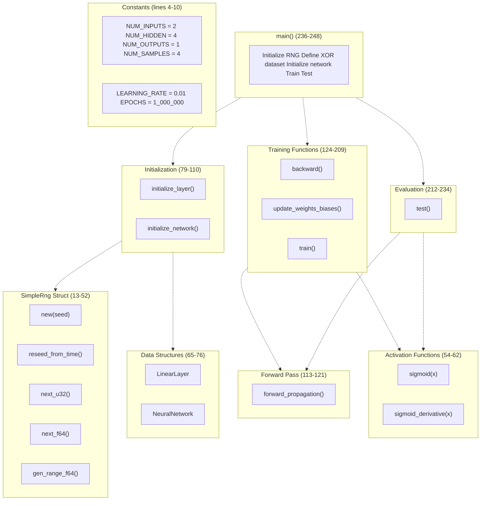

# Simple XOR MLP

> **Relevant source files**
> * [Cargo.toml](https://github.com/ThalesMMS/Rust-Neural-Networks/blob/0e978f90/Cargo.toml)
> * [README.md](https://github.com/ThalesMMS/Rust-Neural-Networks/blob/0e978f90/README.md)
> * [mlp_simple.rs](https://github.com/ThalesMMS/Rust-Neural-Networks/blob/0e978f90/mlp_simple.rs)

## Purpose and Scope

This page documents the simple Multi-Layer Perceptron (MLP) implementation in [mlp_simple.rs](https://github.com/ThalesMMS/Rust-Neural-Networks/blob/0e978f90/mlp_simple.rs)

 that solves the XOR problem. This implementation serves as an **educational example** demonstrating fundamental neural network concepts including forward propagation, backpropagation, and gradient descent in a minimal, self-contained codebase. Unlike the MNIST models (see [3.1](3a%20MNIST-MLP.md), [3.2](3b%20MNIST-CNN.md), [3.3](3c%20MNIST-Attention-Model.md)), this implementation uses no external neural network libraries and includes a custom random number generator to avoid dependencies.

The XOR model achieves **100% accuracy** on the 4-sample XOR dataset after training for 1,000,000 epochs in approximately 0.74 seconds.

**Sources:** README.md

 [mlp_simple.rs L1-L249](https://github.com/ThalesMMS/Rust-Neural-Networks/blob/0e978f90/mlp_simple.rs#L1-L249)

---

## Architecture

### Network Structure

The XOR MLP implements a two-layer fully-connected neural network with the following configuration:

| Layer | Input Size | Output Size | Activation | Parameters |
| --- | --- | --- | --- | --- |
| Hidden | 2 | 4 | Sigmoid | 12 (8 weights + 4 biases) |
| Output | 4 | 1 | Sigmoid | 5 (4 weights + 1 bias) |

**Total Parameters:** 17

The architecture constants are defined at [mlp_simple.rs L4-L7](https://github.com/ThalesMMS/Rust-Neural-Networks/blob/0e978f90/mlp_simple.rs#L4-L7)

:

* `NUM_INPUTS = 2` - XOR requires two binary inputs
* `NUM_HIDDEN = 4` - Hidden layer with 4 neurons (sufficient for XOR separability)
* `NUM_OUTPUTS = 1` - Single binary output
* `NUM_SAMPLES = 4` - Complete XOR truth table



**Network Architecture Diagram**

**Sources:** [mlp_simple.rs L4-L7](https://github.com/ThalesMMS/Rust-Neural-Networks/blob/0e978f90/mlp_simple.rs#L4-L7)

 [mlp_simple.rs L73-L76](https://github.com/ThalesMMS/Rust-Neural-Networks/blob/0e978f90/mlp_simple.rs#L73-L76)

 README.md

### Activation Functions

The network uses **sigmoid activation** for both hidden and output layers, implemented at [mlp_simple.rs L54-L62](https://github.com/ThalesMMS/Rust-Neural-Networks/blob/0e978f90/mlp_simple.rs#L54-L62)

:

**Sigmoid:** `σ(x) = 1 / (1 + e^(-x))`

**Sigmoid Derivative:** `σ'(x) = σ(x) * (1 - σ(x))`

The `sigmoid_derivative` function assumes the input is already the sigmoid-activated value, which simplifies backpropagation calculations during gradient computation.

**Sources:** [mlp_simple.rs L54-L62](https://github.com/ThalesMMS/Rust-Neural-Networks/blob/0e978f90/mlp_simple.rs#L54-L62)

---

## XOR Problem

### Dataset

The XOR (exclusive OR) problem is a classic non-linearly separable binary classification task. The dataset consists of 4 samples defined at [mlp_simple.rs L240-L242](https://github.com/ThalesMMS/Rust-Neural-Networks/blob/0e978f90/mlp_simple.rs#L240-L242)

:

| x₀ | x₁ | XOR Output |
| --- | --- | --- |
| 0.0 | 0.0 | 0.0 |
| 0.0 | 1.0 | 1.0 |
| 1.0 | 0.0 | 1.0 |
| 1.0 | 1.0 | 0.0 |

The XOR function returns 1 if the inputs differ and 0 if they match. This problem requires a hidden layer because it cannot be solved by a single-layer perceptron (no linear decision boundary can separate the positive and negative classes).

**Sources:** [mlp_simple.rs L240-L242](https://github.com/ThalesMMS/Rust-Neural-Networks/blob/0e978f90/mlp_simple.rs#L240-L242)

---

## Implementation Details

### Data Structures

#### LinearLayer

The `LinearLayer` struct ([mlp_simple.rs L65-L70](https://github.com/ThalesMMS/Rust-Neural-Networks/blob/0e978f90/mlp_simple.rs#L65-L70)

) represents a fully-connected layer:

```yaml
LinearLayer {
    input_size: usize,
    output_size: usize,
    weights: Vec<Vec<f64>>,  // [input_size][output_size]
    biases: Vec<f64>         // [output_size]
}
```

Weights are stored in **row-major order** where `weights[i][j]` represents the connection from input neuron `i` to output neuron `j`.

**Sources:** [mlp_simple.rs L65-L70](https://github.com/ThalesMMS/Rust-Neural-Networks/blob/0e978f90/mlp_simple.rs#L65-L70)

#### NeuralNetwork

The `NeuralNetwork` struct ([mlp_simple.rs L73-L76](https://github.com/ThalesMMS/Rust-Neural-Networks/blob/0e978f90/mlp_simple.rs#L73-L76)

) contains the two layers:

```yaml
NeuralNetwork {
    hidden_layer: LinearLayer,  // 2→4 with sigmoid
    output_layer: LinearLayer   // 4→1 with sigmoid
}
```

**Sources:** [mlp_simple.rs L73-L76](https://github.com/ThalesMMS/Rust-Neural-Networks/blob/0e978f90/mlp_simple.rs#L73-L76)

### SimpleRng: Custom Random Number Generator

To avoid external dependencies, the implementation includes a custom pseudo-random number generator at [mlp_simple.rs L13-L52](https://github.com/ThalesMMS/Rust-Neural-Networks/blob/0e978f90/mlp_simple.rs#L13-L52)

 using the **xorshift algorithm**:



**SimpleRng State Machine**

Key methods:

* `new(seed: u64)` - Initialize with explicit seed ([mlp_simple.rs L19-L22](https://github.com/ThalesMMS/Rust-Neural-Networks/blob/0e978f90/mlp_simple.rs#L19-L22) )
* `reseed_from_time()` - Reseed using nanosecond timestamp ([mlp_simple.rs L25-L31](https://github.com/ThalesMMS/Rust-Neural-Networks/blob/0e978f90/mlp_simple.rs#L25-L31) )
* `next_u32()` - Generate pseudo-random u32 via xorshift ([mlp_simple.rs L34-L41](https://github.com/ThalesMMS/Rust-Neural-Networks/blob/0e978f90/mlp_simple.rs#L34-L41) )
* `gen_range_f64(low, high)` - Uniform random in range ([mlp_simple.rs L49-L51](https://github.com/ThalesMMS/Rust-Neural-Networks/blob/0e978f90/mlp_simple.rs#L49-L51) )

The main function initializes the RNG with seed 42 at [mlp_simple.rs L238](https://github.com/ThalesMMS/Rust-Neural-Networks/blob/0e978f90/mlp_simple.rs#L238-L238)

 for partial reproducibility, then reseeds from system time during network initialization at [mlp_simple.rs L102](https://github.com/ThalesMMS/Rust-Neural-Networks/blob/0e978f90/mlp_simple.rs#L102-L102)

**Sources:** [mlp_simple.rs L13-L52](https://github.com/ThalesMMS/Rust-Neural-Networks/blob/0e978f90/mlp_simple.rs#L13-L52)

 [mlp_simple.rs L102](https://github.com/ThalesMMS/Rust-Neural-Networks/blob/0e978f90/mlp_simple.rs#L102-L102)

 [mlp_simple.rs L238](https://github.com/ThalesMMS/Rust-Neural-Networks/blob/0e978f90/mlp_simple.rs#L238-L238)

### Weight Initialization

The `initialize_layer` function ([mlp_simple.rs L79-L98](https://github.com/ThalesMMS/Rust-Neural-Networks/blob/0e978f90/mlp_simple.rs#L79-L98)

) initializes weights and biases uniformly in the range `[-0.5, 0.5]`:

```
For each weight[i][j]:
    weight[i][j] ~ Uniform(-0.5, 0.5)

For each bias[i]:
    bias[i] ~ Uniform(-0.5, 0.5)
```

This simple initialization strategy provides sufficient variance for the small XOR problem, though larger networks typically use Xavier or He initialization.

**Sources:** [mlp_simple.rs L79-L98](https://github.com/ThalesMMS/Rust-Neural-Networks/blob/0e978f90/mlp_simple.rs#L79-L98)

---

## Training Pipeline

### Training Hyperparameters

Training configuration is defined at [mlp_simple.rs L8-L10](https://github.com/ThalesMMS/Rust-Neural-Networks/blob/0e978f90/mlp_simple.rs#L8-L10)

:

| Parameter | Value |
| --- | --- |
| Learning Rate | 0.01 |
| Epochs | 1,000,000 |
| Batch Size | 1 (online learning) |
| Loss Function | Mean Squared Error (MSE) |

The model trains on all 4 samples sequentially each epoch without batching.

**Sources:** [mlp_simple.rs L8-L10](https://github.com/ThalesMMS/Rust-Neural-Networks/blob/0e978f90/mlp_simple.rs#L8-L10)

 README.md

### Training Flow



**Training Pipeline Flow Diagram**

**Sources:** [mlp_simple.rs L162-L209](https://github.com/ThalesMMS/Rust-Neural-Networks/blob/0e978f90/mlp_simple.rs#L162-L209)

 [mlp_simple.rs L236-L248](https://github.com/ThalesMMS/Rust-Neural-Networks/blob/0e978f90/mlp_simple.rs#L236-L248)

### Forward Propagation

The `forward_propagation` function ([mlp_simple.rs L113-L121](https://github.com/ThalesMMS/Rust-Neural-Networks/blob/0e978f90/mlp_simple.rs#L113-L121)

) implements a single layer's forward pass:

```
For each output neuron i:
    activation = bias[i]
    For each input neuron j:
        activation += input[j] * weight[j][i]
    output[i] = sigmoid(activation)
```

The function is called twice per sample: once for the hidden layer and once for the output layer ([mlp_simple.rs L179-L180](https://github.com/ThalesMMS/Rust-Neural-Networks/blob/0e978f90/mlp_simple.rs#L179-L180)

).

**Sources:** [mlp_simple.rs L113-L121](https://github.com/ThalesMMS/Rust-Neural-Networks/blob/0e978f90/mlp_simple.rs#L113-L121)

 [mlp_simple.rs L179-L180](https://github.com/ThalesMMS/Rust-Neural-Networks/blob/0e978f90/mlp_simple.rs#L179-L180)

### Backward Propagation

The `backward` function ([mlp_simple.rs L124-L146](https://github.com/ThalesMMS/Rust-Neural-Networks/blob/0e978f90/mlp_simple.rs#L124-L146)

) computes gradients using the chain rule:

**Output Layer Deltas:**

```
delta_output[i] = error[i] * sigmoid_derivative(output[i])
```

**Hidden Layer Deltas:**

```
For each hidden neuron i:
    error_hidden = Σ(delta_output[j] * output_weight[i][j])
    delta_hidden[i] = error_hidden * sigmoid_derivative(hidden[i])
```

The deltas represent the gradient of the loss with respect to each neuron's pre-activation value.

**Sources:** [mlp_simple.rs L124-L146](https://github.com/ThalesMMS/Rust-Neural-Networks/blob/0e978f90/mlp_simple.rs#L124-L146)

### Weight Updates

The `update_weights_biases` function ([mlp_simple.rs L149-L159](https://github.com/ThalesMMS/Rust-Neural-Networks/blob/0e978f90/mlp_simple.rs#L149-L159)

) applies Stochastic Gradient Descent (SGD):

```
For each weight[i][j]:
    weight[i][j] += learning_rate * delta[j] * input[i]

For each bias[i]:
    bias[i] += learning_rate * delta[i]
```

Updates are applied immediately after each sample (online learning), not accumulated over batches.

**Sources:** [mlp_simple.rs L149-L159](https://github.com/ThalesMMS/Rust-Neural-Networks/blob/0e978f90/mlp_simple.rs#L149-L159)

---

## Code Structure Overview



**Code Organization Diagram**

The implementation follows a logical structure:

1. **Configuration** - Constants define network dimensions and training parameters
2. **Utilities** - `SimpleRng` provides deterministic randomness
3. **Activations** - Sigmoid and its derivative for forward/backward passes
4. **Structures** - `LinearLayer` and `NeuralNetwork` hold parameters
5. **Initialization** - Random weight/bias initialization
6. **Training** - Forward/backward propagation and weight updates
7. **Evaluation** - Test function for inference
8. **Main** - Orchestrates the complete training and testing pipeline

**Sources:** [mlp_simple.rs L1-L249](https://github.com/ThalesMMS/Rust-Neural-Networks/blob/0e978f90/mlp_simple.rs#L1-L249)

---

## Execution and Performance

### Running the Model

Execute the XOR MLP using Cargo:

```
cargo run --release --bin mlp_simple
```

The `--release` flag enables optimizations defined in [Cargo.toml L26-L28](https://github.com/ThalesMMS/Rust-Neural-Networks/blob/0e978f90/Cargo.toml#L26-L28)

:

* Link-Time Optimization (LTO)
* Single codegen unit for better inlining

**Sources:** [Project overview and setup](https://github.com/ThalesMMS/Rust-Neural-Networks/blob/0e978f90/README.md#L113-L116)

 [Cargo.toml L14-L16](https://github.com/ThalesMMS/Rust-Neural-Networks/blob/0e978f90/Cargo.toml#L14-L16)

 [Cargo.toml L26-L28](https://github.com/ThalesMMS/Rust-Neural-Networks/blob/0e978f90/Cargo.toml#L26-L28)

### Output Format

The training loop prints loss every 1,000 epochs ([mlp_simple.rs L205-L207](https://github.com/ThalesMMS/Rust-Neural-Networks/blob/0e978f90/mlp_simple.rs#L205-L207)

):

```
Epoch 1000, Error: 0.234567
Epoch 2000, Error: 0.123456
...
Epoch 1000000, Error: 0.000001
```

After training completes, the `test` function ([mlp_simple.rs L212-L234](https://github.com/ThalesMMS/Rust-Neural-Networks/blob/0e978f90/mlp_simple.rs#L212-L234)

) prints predictions for all 4 XOR samples:

```yaml
Testing the trained network:
Input: 0.0, 0.0, Expected Output: 0.0, Predicted Output: 0.001
Input: 0.0, 1.0, Expected Output: 1.0, Predicted Output: 0.999
Input: 1.0, 0.0, Expected Output: 1.0, Predicted Output: 0.999
Input: 1.0, 1.0, Expected Output: 0.0, Predicted Output: 0.001
```

**Sources:** [mlp_simple.rs L205-L207](https://github.com/ThalesMMS/Rust-Neural-Networks/blob/0e978f90/mlp_simple.rs#L205-L207)

 [mlp_simple.rs L212-L234](https://github.com/ThalesMMS/Rust-Neural-Networks/blob/0e978f90/mlp_simple.rs#L212-L234)

### Performance Metrics

From the benchmark table in **Sources**: [Project overview and setup](https://github.com/ThalesMMS/Rust-Neural-Networks/blob/0e978f90/README.md#L142-L147)

:

| Metric | Value |
| --- | --- |
| Training Time | 0.74 seconds |
| Test Accuracy | 100.00% |
| Threshold | 0.5 |
| Hardware | Local machine (unspecified) |

The model achieves perfect classification when using a 0.5 threshold to convert sigmoid outputs to binary predictions. The training time of 0.74 seconds for 1,000,000 epochs demonstrates efficient implementation despite lacking BLAS acceleration.

**Sources:** [Project overview and setup](https://github.com/ThalesMMS/Rust-Neural-Networks/blob/0e978f90/README.md#L142-L147)

---

## Comparison with MNIST Models

Unlike the MNIST models documented in sections [3.1](3a%20MNIST-MLP.md), [3.2](3b%20MNIST-CNN.md), and [3.3](3c%20MNIST-Attention-Model.md), the XOR MLP:

* **Has no external dependencies** - Uses custom RNG instead of external randomness libraries
* **Uses no BLAS acceleration** - All operations are explicit loops (suitable for small model)
* **Trains on tiny dataset** - 4 samples vs. 60,000 for MNIST
* **Uses sigmoid activations** - MNIST models use ReLU for hidden layers
* **Implements MSE loss** - MNIST models use cross-entropy loss
* **Uses online learning** - No mini-batching (each sample updates weights immediately)
* **Runs many epochs** - 1,000,000 epochs vs. 3-10 for MNIST
* **Serves educational purpose** - Demonstrates core concepts in minimal code

The XOR implementation prioritizes **code clarity and self-containment** over performance, making it ideal for understanding fundamental neural network mechanics before exploring the more complex MNIST implementations.

**Sources:** README.md

 [mlp_simple.rs L1-L249](https://github.com/ThalesMMS/Rust-Neural-Networks/blob/0e978f90/mlp_simple.rs#L1-L249)


)

### On this page

* [Simple XOR MLP](#3.4-simple-xor-mlp)
* [Purpose and Scope](#3.4-purpose-and-scope)
* [Architecture](#3.4-architecture)
* [Network Structure](#3.4-network-structure)
* [Activation Functions](#3.4-activation-functions)
* [XOR Problem](#3.4-xor-problem)
* [Dataset](#3.4-dataset)
* [Implementation Details](#3.4-implementation-details)
* [Data Structures](#3.4-data-structures)
* [SimpleRng: Custom Random Number Generator](#3.4-simplerng-custom-random-number-generator)
* [Weight Initialization](#3.4-weight-initialization)
* [Training Pipeline](#3.4-training-pipeline)
* [Training Hyperparameters](#3.4-training-hyperparameters)
* [Training Flow](#3.4-training-flow)
* [Forward Propagation](#3.4-forward-propagation)
* [Backward Propagation](#3.4-backward-propagation)
* [Weight Updates](#3.4-weight-updates)
* [Code Structure Overview](#3.4-code-structure-overview)
* [Execution and Performance](#3.4-execution-and-performance)
* [Running the Model](#3.4-running-the-model)
* [Output Format](#3.4-output-format)
* [Performance Metrics](#3.4-performance-metrics)
* [Comparison with MNIST Models](#3.4-comparison-with-mnist-models)

Ask Devin about Rust-Neural-Networks