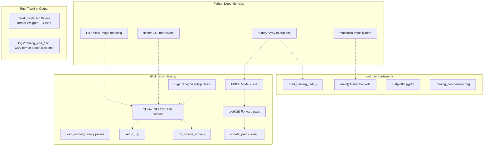
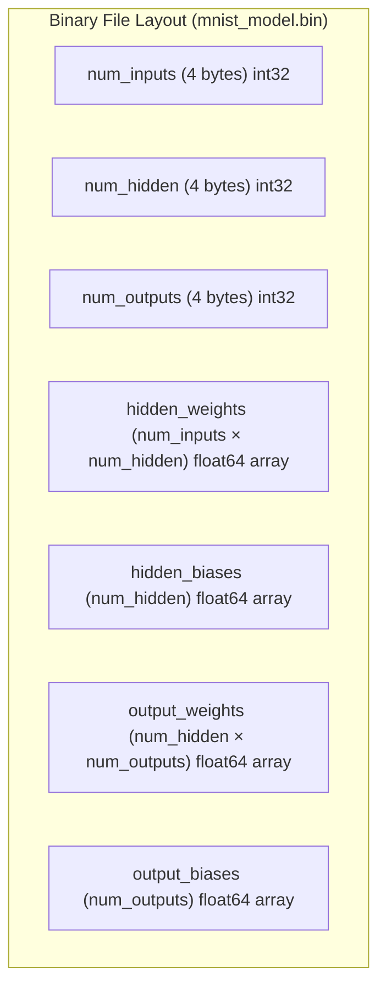
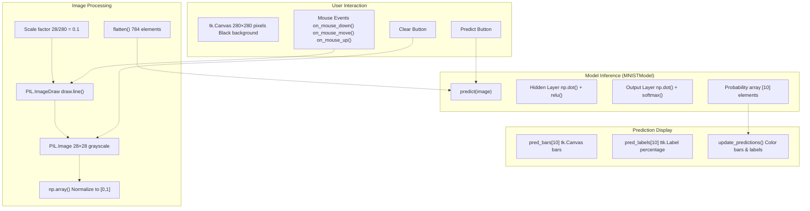
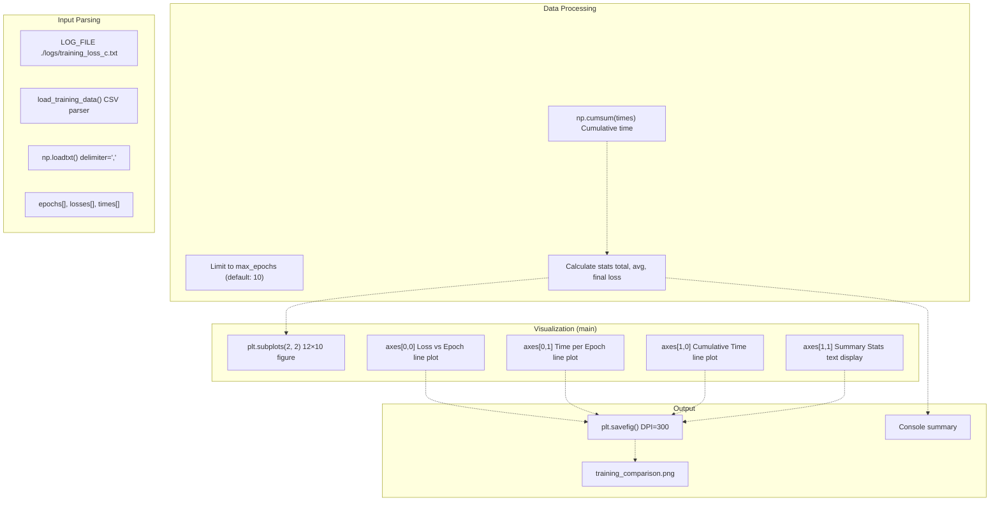

# Python Utilities

> **Relevant source files**
> * [README.md](https://github.com/ThalesMMS/Rust-Neural-Networks/blob/0e978f90/README.md)
> * [digit_recognizer.py](https://github.com/ThalesMMS/Rust-Neural-Networks/blob/0e978f90/digit_recognizer.py)
> * [plot_comparison.py](https://github.com/ThalesMMS/Rust-Neural-Networks/blob/0e978f90/plot_comparison.py)
> * [requirements.txt](https://github.com/ThalesMMS/Rust-Neural-Networks/blob/0e978f90/requirements.txt)

## Purpose and Scope

This document covers the Python utilities provided for model interaction, visualization, and inference. These tools complement the Rust neural network training implementations by providing user-facing interfaces for loading trained models and analyzing training performance. The utilities consume outputs from Rust training (binary model files and CSV training logs) and provide interactive inference and visualization capabilities.

For details about the Rust training implementations that produce these outputs, see [Model Implementations](#3). For information about the binary serialization format used to save models, see [Binary Model Format](#5.3).

**Sources**: [README.md L10-L25](https://github.com/ThalesMMS/Rust-Neural-Networks/blob/0e978f90/README.md#L10-L25)

 [README.md L165-L185](https://github.com/ThalesMMS/Rust-Neural-Networks/blob/0e978f90/README.md#L165-L185)

---

## Overview

The repository includes two Python utilities:

| Utility | Purpose | Input | Output |
| --- | --- | --- | --- |
| `digit_recognizer.py` | Interactive digit drawing and inference | `mnist_model.bin` | Real-time predictions |
| `plot_comparison.py` | Training loss visualization | `logs/training_loss_*.txt` | `training_comparison.png` |

These utilities separate computationally intensive training (performed in Rust with BLAS acceleration) from user-friendly interfaces (implemented in Python leveraging numpy, matplotlib, PIL, and tkinter). The binary model format (`mnist_model.bin`) serves as the critical interface between Rust training and Python inference.

**Sources**: [README.md L21-L25](https://github.com/ThalesMMS/Rust-Neural-Networks/blob/0e978f90/README.md#L21-L25)

 [README.md L165-L185](https://github.com/ThalesMMS/Rust-Neural-Networks/blob/0e978f90/README.md#L165-L185)

---

## System Architecture



**Sources**: [digit_recognizer.py L1-L291](https://github.com/ThalesMMS/Rust-Neural-Networks/blob/0e978f90/digit_recognizer.py#L1-L291)

 [plot_comparison.py L1-L120](https://github.com/ThalesMMS/Rust-Neural-Networks/blob/0e978f90/plot_comparison.py#L1-L120)

 [requirements.txt L1-L3](https://github.com/ThalesMMS/Rust-Neural-Networks/blob/0e978f90/requirements.txt#L1-L3)

---

## Binary Model Format Interface

The `mnist_model.bin` file uses a custom binary format to store trained neural network parameters. This format serves as the interface between Rust training and Python inference.

### Format Specification

The binary file structure is read by the `MNISTModel.load_model()` method:



### Loading Process

The `MNISTModel.load_model()` method [digit_recognizer.py L28-L58](https://github.com/ThalesMMS/Rust-Neural-Networks/blob/0e978f90/digit_recognizer.py#L28-L58)

 performs binary deserialization:

1. **Read layer dimensions**: Uses `struct.unpack('i', ...)` to read three 4-byte integers [digit_recognizer.py L32-L34](https://github.com/ThalesMMS/Rust-Neural-Networks/blob/0e978f90/digit_recognizer.py#L32-L34)
2. **Read hidden weights**: Reads `num_inputs × num_hidden` double-precision floats (8 bytes each) [digit_recognizer.py L38-L42](https://github.com/ThalesMMS/Rust-Neural-Networks/blob/0e978f90/digit_recognizer.py#L38-L42)
3. **Read hidden biases**: Reads `num_hidden` doubles [digit_recognizer.py L45-L46](https://github.com/ThalesMMS/Rust-Neural-Networks/blob/0e978f90/digit_recognizer.py#L45-L46)
4. **Read output weights**: Reads `num_hidden × num_outputs` doubles [digit_recognizer.py L49-L52](https://github.com/ThalesMMS/Rust-Neural-Networks/blob/0e978f90/digit_recognizer.py#L49-L52)
5. **Read output biases**: Reads `num_outputs` doubles [digit_recognizer.py L55-L56](https://github.com/ThalesMMS/Rust-Neural-Networks/blob/0e978f90/digit_recognizer.py#L55-L56)

All floating-point values are stored as 64-bit doubles (`float64`/`f64` in Rust, `double` in C-style binary format).

**Sources**: [digit_recognizer.py L28-L58](https://github.com/ThalesMMS/Rust-Neural-Networks/blob/0e978f90/digit_recognizer.py#L28-L58)

 [README.md L12](https://github.com/ThalesMMS/Rust-Neural-Networks/blob/0e978f90/README.md#L12-L12)

---

## Digit Recognizer (digit_recognizer.py)

### Purpose

The `digit_recognizer.py` script provides an interactive Tkinter-based GUI for drawing digits and performing real-time inference using a trained MNIST model. Users draw on a 280×280 canvas, which is scaled down to 28×28 pixels for inference, matching the MNIST input dimensions.

**Sources**: [digit_recognizer.py L1-L5](https://github.com/ThalesMMS/Rust-Neural-Networks/blob/0e978f90/digit_recognizer.py#L1-L5)

 [README.md L173-L179](https://github.com/ThalesMMS/Rust-Neural-Networks/blob/0e978f90/README.md#L173-L179)

### Architecture



**Sources**: [digit_recognizer.py L87-L236](https://github.com/ThalesMMS/Rust-Neural-Networks/blob/0e978f90/digit_recognizer.py#L87-L236)

### Key Components

#### MNISTModel Class

The `MNISTModel` class [digit_recognizer.py L16-L84](https://github.com/ThalesMMS/Rust-Neural-Networks/blob/0e978f90/digit_recognizer.py#L16-L84)

 encapsulates the neural network model and inference logic:

| Method | Purpose | Line Numbers |
| --- | --- | --- |
| `__init__()` | Initialize empty model structure | 19-26 |
| `load_model(filename)` | Load weights from binary file | 28-58 |
| `relu(x)` | ReLU activation: `max(0, x)` | 60-63 |
| `softmax(x)` | Softmax activation for probabilities | 65-69 |
| `predict(image)` | Forward pass: hidden → output | 71-84 |

The `predict()` method performs inference in two stages:

1. **Hidden layer**: `hidden = relu(image @ hidden_weights + hidden_biases)` [digit_recognizer.py L77-L78](https://github.com/ThalesMMS/Rust-Neural-Networks/blob/0e978f90/digit_recognizer.py#L77-L78)
2. **Output layer**: `output = softmax(hidden @ output_weights + output_biases)` [digit_recognizer.py L81-L82](https://github.com/ThalesMMS/Rust-Neural-Networks/blob/0e978f90/digit_recognizer.py#L81-L82)

#### DigitRecognizerApp Class

The `DigitRecognizerApp` class [digit_recognizer.py L87-L236](https://github.com/ThalesMMS/Rust-Neural-Networks/blob/0e978f90/digit_recognizer.py#L87-L236)

 manages the GUI and user interaction:

| Component | Type | Purpose | Line Numbers |
| --- | --- | --- | --- |
| `canvas` | `tk.Canvas` | 280×280 drawing surface | 121-123 |
| `image` | `PIL.Image` | 28×28 grayscale image buffer | 100 |
| `draw` | `PIL.ImageDraw` | Drawing context for PIL image | 101 |
| `pred_bars` | `list[tk.Canvas]` | 10 canvas widgets for probability bars | 138-154 |
| `pred_labels` | `list[ttk.Label]` | 10 labels showing percentages | 138-154 |

**Drawing workflow** [digit_recognizer.py L176-L197](https://github.com/ThalesMMS/Rust-Neural-Networks/blob/0e978f90/digit_recognizer.py#L176-L197)

:

1. User drags mouse on 280×280 canvas
2. White lines drawn on Tkinter canvas with 20px brush
3. Coordinates scaled down by factor of 0.1 (28/280)
4. Lines drawn on 28×28 PIL image with scaled brush size

**Auto-prediction** [digit_recognizer.py L199-L204](https://github.com/ThalesMMS/Rust-Neural-Networks/blob/0e978f90/digit_recognizer.py#L199-L204)

: When mouse button is released, `predict()` is automatically called to update the probability display.

**Sources**: [digit_recognizer.py L87-L236](https://github.com/ThalesMMS/Rust-Neural-Networks/blob/0e978f90/digit_recognizer.py#L87-L236)

### Usage

```
# Install dependenciespip install -r requirements.txt# Run with default model (searches for mnist_model.bin)python digit_recognizer.py# Run with specific model filepython digit_recognizer.py serial  # Uses mnist_model.bin
```

The application searches for available model files in this order: `mnist_model.bin`, `mnist_model_cpu.bin`, `mnist_model_gpu.bin` [digit_recognizer.py L238-L272](https://github.com/ThalesMMS/Rust-Neural-Networks/blob/0e978f90/digit_recognizer.py#L238-L272)

**Sources**: [README.md L173-L185](https://github.com/ThalesMMS/Rust-Neural-Networks/blob/0e978f90/README.md#L173-L185)

 [digit_recognizer.py L238-L286](https://github.com/ThalesMMS/Rust-Neural-Networks/blob/0e978f90/digit_recognizer.py#L238-L286)

---

## Training Visualization (plot_comparison.py)

### Purpose

The `plot_comparison.py` script reads CSV-formatted training logs and generates multi-panel visualizations showing loss curves, per-epoch timing, and cumulative training time. The script outputs a PNG image and prints summary statistics to the console.

**Sources**: [plot_comparison.py L1-L5](https://github.com/ThalesMMS/Rust-Neural-Networks/blob/0e978f90/plot_comparison.py#L1-L5)

 [README.md L165-L171](https://github.com/ThalesMMS/Rust-Neural-Networks/blob/0e978f90/README.md#L165-L171)

### Architecture



**Sources**: [plot_comparison.py L1-L120](https://github.com/ThalesMMS/Rust-Neural-Networks/blob/0e978f90/plot_comparison.py#L1-L120)

### Key Components

#### Configuration

Global configuration constants [plot_comparison.py L11-L16](https://github.com/ThalesMMS/Rust-Neural-Networks/blob/0e978f90/plot_comparison.py#L11-L16)

:

| Constant | Value | Purpose |
| --- | --- | --- |
| `LOG_DIR` | `"./logs"` | Directory containing training logs |
| `OUTPUT_FILE` | `"training_comparison.png"` | Output image filename |
| `LOG_FILE` | `"./logs/training_loss_c.txt"` | Default log file to visualize |

#### load_training_data() Function

The `load_training_data()` function [plot_comparison.py L18-L43](https://github.com/ThalesMMS/Rust-Neural-Networks/blob/0e978f90/plot_comparison.py#L18-L43)

 parses CSV training logs:

**CSV Format**: Each line contains `epoch,loss,time` [plot_comparison.py L21](https://github.com/ThalesMMS/Rust-Neural-Networks/blob/0e978f90/plot_comparison.py#L21-L21)

**Processing steps**:

1. Check file existence [plot_comparison.py L24-L26](https://github.com/ThalesMMS/Rust-Neural-Networks/blob/0e978f90/plot_comparison.py#L24-L26)
2. Load CSV using `np.loadtxt()` with comma delimiter [plot_comparison.py L29](https://github.com/ThalesMMS/Rust-Neural-Networks/blob/0e978f90/plot_comparison.py#L29-L29)
3. Handle single-epoch edge case by reshaping [plot_comparison.py L30-L31](https://github.com/ThalesMMS/Rust-Neural-Networks/blob/0e978f90/plot_comparison.py#L30-L31)
4. Limit to `max_epochs` if specified [plot_comparison.py L33-L35](https://github.com/ThalesMMS/Rust-Neural-Networks/blob/0e978f90/plot_comparison.py#L33-L35)
5. Extract columns: epochs (int), losses (float), times (float) [plot_comparison.py L37-L39](https://github.com/ThalesMMS/Rust-Neural-Networks/blob/0e978f90/plot_comparison.py#L37-L39)

#### main() Function

The `main()` function [plot_comparison.py L45-L119](https://github.com/ThalesMMS/Rust-Neural-Networks/blob/0e978f90/plot_comparison.py#L45-L119)

 generates visualizations:

**Four-panel layout** [plot_comparison.py L56](https://github.com/ThalesMMS/Rust-Neural-Networks/blob/0e978f90/plot_comparison.py#L56-L56)

:

| Position | Content | Plot Type | Line Numbers |
| --- | --- | --- | --- |
| `axes[0,0]` | Training Loss vs Epoch | Line plot with markers | 60-65 |
| `axes[0,1]` | Time per Epoch | Line plot with squares | 68-73 |
| `axes[1,0]` | Cumulative Training Time | Line plot with diamonds | 76-81 |
| `axes[1,1]` | Summary Statistics | Text box | 84-100 |

**Styling**: All plots use grid lines (`alpha=0.3`, `linestyle='--'`), markers for data points, and labeled axes [plot_comparison.py L61-L81](https://github.com/ThalesMMS/Rust-Neural-Networks/blob/0e978f90/plot_comparison.py#L61-L81)

**Summary statistics** [plot_comparison.py L87-L100](https://github.com/ThalesMMS/Rust-Neural-Networks/blob/0e978f90/plot_comparison.py#L87-L100)

:

* Total training time: `np.sum(times)`
* Average time per epoch: `np.mean(times)`
* Final loss: `losses[-1]`
* Total epochs: `len(epochs)`

The figure is saved at 300 DPI with tight bounding box [plot_comparison.py L114](https://github.com/ThalesMMS/Rust-Neural-Networks/blob/0e978f90/plot_comparison.py#L114-L114)

**Sources**: [plot_comparison.py L45-L119](https://github.com/ThalesMMS/Rust-Neural-Networks/blob/0e978f90/plot_comparison.py#L45-L119)

### Usage

```
# Install dependenciespip install -r requirements.txt# Generate training visualizationpython plot_comparison.py
```

The script reads from `logs/training_loss_c.txt` by default and outputs `training_comparison.png`. Console output shows a summary table [plot_comparison.py L105-L111](https://github.com/ThalesMMS/Rust-Neural-Networks/blob/0e978f90/plot_comparison.py#L105-L111)

**Sources**: [README.md L165-L171](https://github.com/ThalesMMS/Rust-Neural-Networks/blob/0e978f90/README.md#L165-L171)

 [plot_comparison.py L11-L16](https://github.com/ThalesMMS/Rust-Neural-Networks/blob/0e978f90/plot_comparison.py#L11-L16)

---

## Dependencies

The Python utilities require the following packages specified in `requirements.txt`:

| Package | Version | Purpose | Used By |
| --- | --- | --- | --- |
| `numpy` | Latest | Array operations, matrix math | Both utilities |
| `matplotlib` | Latest | Plotting and visualization | `plot_comparison.py` |
| `PIL` (Pillow) | Implicit | Image handling and drawing | `digit_recognizer.py` |
| `tkinter` | Standard library | GUI framework | `digit_recognizer.py` |

**Installation**:

```
pip install -r requirements.txt
```

**Note**: `tkinter` is part of the Python standard library but may require separate installation on some Linux distributions (e.g., `python3-tk` on Ubuntu/Debian).

**Sources**: [requirements.txt L1-L3](https://github.com/ThalesMMS/Rust-Neural-Networks/blob/0e978f90/requirements.txt#L1-L3)

 [digit_recognizer.py L7-L13](https://github.com/ThalesMMS/Rust-Neural-Networks/blob/0e978f90/digit_recognizer.py#L7-L13)

 [plot_comparison.py L7-L9](https://github.com/ThalesMMS/Rust-Neural-Networks/blob/0e978f90/plot_comparison.py#L7-L9)

---

## Data Flow Summary

The Python utilities consume outputs from Rust training in two distinct workflows:

### Inference Workflow

1. Rust `mnist_mlp` trains model and exports to `mnist_model.bin`
2. `digit_recognizer.py` loads binary model using `MNISTModel.load_model()`
3. User draws digit on GUI canvas
4. Image preprocessed (resize, normalize) and passed to `MNISTModel.predict()`
5. Softmax probabilities displayed as colored bars

### Visualization Workflow

1. Rust training programs write CSV logs to `logs/training_loss_*.txt`
2. `plot_comparison.py` loads CSV using `load_training_data()`
3. Statistics calculated (mean, cumulative time)
4. Four-panel matplotlib figure generated
5. PNG image saved and statistics printed to console

**Sources**: [README.md L1-L191](https://github.com/ThalesMMS/Rust-Neural-Networks/blob/0e978f90/README.md#L1-L191)

 Diagram 5 from high-level architecture

Refresh this wiki

Last indexed: 5 January 2026 ([0e978f](https://github.com/ThalesMMS/Rust-Neural-Networks/commit/0e978f90))

### On this page

* [Python Utilities](#4-python-utilities)
* [Purpose and Scope](#4-purpose-and-scope)
* [Overview](#4-overview)
* [System Architecture](#4-system-architecture)
* [Binary Model Format Interface](#4-binary-model-format-interface)
* [Format Specification](#4-format-specification)
* [Loading Process](#4-loading-process)
* [Digit Recognizer ( digit_recognizer.py )](#4-digit-recognizer-object-object)
* [Purpose](#4-purpose)
* [Architecture](#4-architecture)
* [Key Components](#4-key-components)
* [Usage](#4-usage)
* [Training Visualization ( plot_comparison.py )](#4-training-visualization-object-object)
* [Purpose](#4-purpose-1)
* [Architecture](#4-architecture-1)
* [Key Components](#4-key-components-1)
* [Usage](#4-usage-1)
* [Dependencies](#4-dependencies)
* [Data Flow Summary](#4-data-flow-summary)
* [Inference Workflow](#4-inference-workflow)
* [Visualization Workflow](#4-visualization-workflow)

Ask Devin about Rust-Neural-Networks