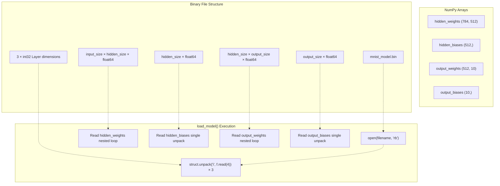
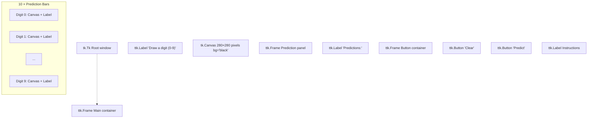
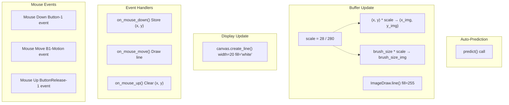
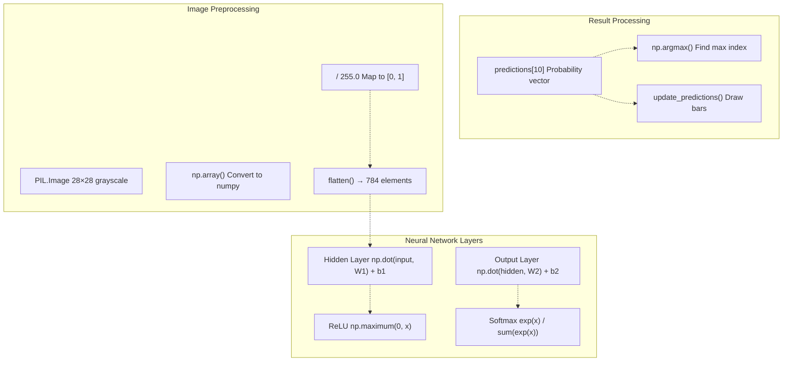
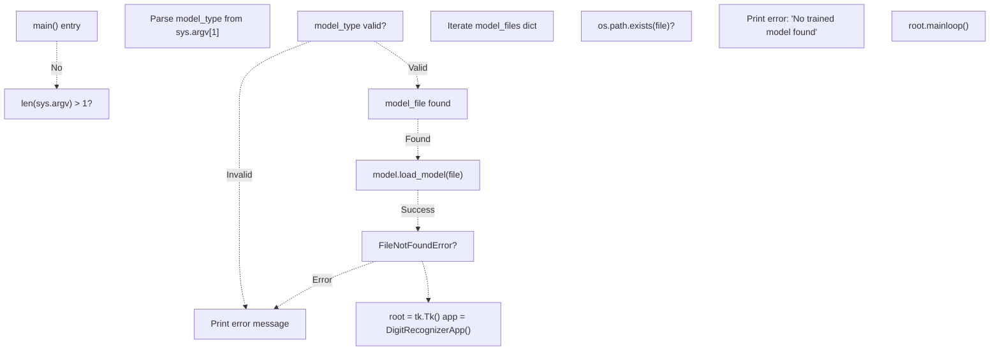

# Digit Recognizer GUI

> **Relevant source files**
> * [README.md](https://github.com/ThalesMMS/Rust-Neural-Networks/blob/0e978f90/README.md)
> * [digit_recognizer.py](https://github.com/ThalesMMS/Rust-Neural-Networks/blob/0e978f90/digit_recognizer.py)
> * [mnist_model.bin](https://github.com/ThalesMMS/Rust-Neural-Networks/blob/0e978f90/mnist_model.bin)
> * [requirements.txt](https://github.com/ThalesMMS/Rust-Neural-Networks/blob/0e978f90/requirements.txt)

## Purpose and Scope

The Digit Recognizer GUI is a Python-based interactive application that provides real-time inference for MNIST digit classification using trained neural network models. The application loads binary model files produced by the Rust training implementations (see [MNIST MLP](3a%20MNIST-MLP.md)) and presents a drawing interface where users can sketch digits for immediate classification.

This page covers the GUI implementation, model loading mechanism, image preprocessing, and inference execution. For information about the binary model format specification, see [Binary Model Format](5c%20Binary-Model-Format.md). For details on training the models consumed by this application, see [MNIST MLP](3a%20MNIST-MLP.md).

**Sources**: Project overview and setup

 [digit_recognizer.py L1-L6](https://github.com/ThalesMMS/Rust-Neural-Networks/blob/0e978f90/digit_recognizer.py#L1-L6)

---

## System Architecture

The digit recognizer consists of two primary components: `MNISTModel` for neural network operations and `DigitRecognizerApp` for GUI management. The system loads a trained model from disk, maintains dual canvas representations (display canvas and internal 28×28 image buffer), and performs forward propagation on user drawings.

```mermaid
flowchart TD

main["main() digit_recognizer.py:238"]
cli["Command Line Parser model_type selection"]
MNISTModel["MNISTModel digit_recognizer.py:16-84"]
load_model["load_model() Parse binary format"]
predict["predict() Forward propagation"]
relu["relu() staticmethod ReLU activation"]
softmax["softmax() staticmethod Softmax activation"]
DigitRecognizerApp["DigitRecognizerApp digit_recognizer.py:87-236"]
setup_ui["setup_ui() Build Tkinter widgets"]
canvas["tk.Canvas 280x280 Display surface"]
pil_image["PIL.Image 28x28 Internal buffer"]
pred_bars["Prediction bars 10 canvas widgets"]
on_mouse_down["on_mouse_down() digit_recognizer.py:171"]
on_mouse_move["on_mouse_move() digit_recognizer.py:176"]
on_mouse_up["on_mouse_up() digit_recognizer.py:199"]
predict_handler["predict() digit_recognizer.py:213"]
clear_canvas["clear_canvas() digit_recognizer.py:206"]
model_bin["mnist_model.bin Binary weights file"]
requirements["requirements.txt numpy, matplotlib"]

cli -.-> MNISTModel
main -.-> DigitRecognizerApp
canvas -.-> on_mouse_down
canvas -.-> on_mouse_move
canvas -.-> on_mouse_up
predict -.-> pred_bars
requirements -.-> MNISTModel

subgraph subGraph4 ["External Files"]
    model_bin
    requirements
end

subgraph subGraph3 ["Event Handlers"]
    on_mouse_down
    on_mouse_move
    on_mouse_up
    predict_handler
    clear_canvas
end

subgraph subGraph2 ["GUI Layer"]
    DigitRecognizerApp
    setup_ui
    canvas
    pil_image
    pred_bars
    DigitRecognizerApp -.-> setup_ui
    DigitRecognizerApp -.-> pil_image
end

subgraph subGraph1 ["Model Layer"]
    MNISTModel
    load_model
    predict
    relu
    softmax
    MNISTModel -.-> load_model
    predict -.-> relu
    predict -.-> softmax
end

subgraph subGraph0 ["Application Entry Point"]
    main
    cli
    main -.-> cli
end
```



**Sources**: [digit_recognizer.py L16-L236](https://github.com/ThalesMMS/Rust-Neural-Networks/blob/0e978f90/digit_recognizer.py#L16-L236)

 [digit_recognizer.py L238-L290](https://github.com/ThalesMMS/Rust-Neural-Networks/blob/0e978f90/digit_recognizer.py#L238-L290)

---

## Model Loading and Binary Format Parsing

The `MNISTModel` class implements model deserialization from the custom binary format written by the Rust MLP training implementation. The binary file structure consists of layer dimensions followed by weight matrices and bias vectors stored as double-precision floats.

### MNISTModel Class Structure

| Attribute | Type | Description |
| --- | --- | --- |
| `num_inputs` | int | Input layer size (784 for MNIST) |
| `num_hidden` | int | Hidden layer size (512 default) |
| `num_outputs` | int | Output layer size (10 for digits) |
| `hidden_weights` | np.ndarray | Shape (784, 512), input→hidden weights |
| `hidden_biases` | np.ndarray | Shape (512,), hidden layer biases |
| `output_weights` | np.ndarray | Shape (512, 10), hidden→output weights |
| `output_biases` | np.ndarray | Shape (10,), output layer biases |

**Sources**: [digit_recognizer.py L16-L27](https://github.com/ThalesMMS/Rust-Neural-Networks/blob/0e978f90/digit_recognizer.py#L16-L27)

### Binary Deserialization Process



The deserialization process uses Python's `struct` module to parse binary data. Layer dimensions are read as 32-bit integers [digit_recognizer.py L32-L34](https://github.com/ThalesMMS/Rust-Neural-Networks/blob/0e978f90/digit_recognizer.py#L32-L34)

 Weight matrices are read row-by-row, unpacking each row as a sequence of double-precision floats [digit_recognizer.py L38-L42](https://github.com/ThalesMMS/Rust-Neural-Networks/blob/0e978f90/digit_recognizer.py#L38-L42)

 [digit_recognizer.py L48-L52](https://github.com/ThalesMMS/Rust-Neural-Networks/blob/0e978f90/digit_recognizer.py#L48-L52)

 Bias vectors are read as single contiguous blocks [digit_recognizer.py L45-L46](https://github.com/ThalesMMS/Rust-Neural-Networks/blob/0e978f90/digit_recognizer.py#L45-L46)

 [digit_recognizer.py L54-L56](https://github.com/ThalesMMS/Rust-Neural-Networks/blob/0e978f90/digit_recognizer.py#L54-L56)

**Sources**: [digit_recognizer.py L28-L58](https://github.com/ThalesMMS/Rust-Neural-Networks/blob/0e978f90/digit_recognizer.py#L28-L58)

---

## GUI Components and Layout

The `DigitRecognizerApp` class manages the Tkinter interface, consisting of three primary regions: a drawing canvas, a prediction display panel, and control buttons.

### Component Hierarchy



**Sources**: [digit_recognizer.py L110-L170](https://github.com/ThalesMMS/Rust-Neural-Networks/blob/0e978f90/digit_recognizer.py#L110-L170)

### Canvas Dual-Representation System

The application maintains two parallel canvas representations to optimize display quality while preserving MNIST input format:

| Canvas | Resolution | Purpose | Implementation |
| --- | --- | --- | --- |
| Display Canvas | 280×280 pixels | User-facing drawing surface | `tk.Canvas` widget [digit_recognizer.py L121-L123](https://github.com/ThalesMMS/Rust-Neural-Networks/blob/0e978f90/digit_recognizer.py#L121-L123) |
| Internal Buffer | 28×28 pixels | Neural network input | `PIL.Image` grayscale [digit_recognizer.py L100-L101](https://github.com/ThalesMMS/Rust-Neural-Networks/blob/0e978f90/digit_recognizer.py#L100-L101) |

During drawing operations, the `on_mouse_move` handler updates both representations simultaneously. Display coordinates are scaled down by a factor of 10 (28/280) to paint on the internal buffer [digit_recognizer.py L187-L191](https://github.com/ThalesMMS/Rust-Neural-Networks/blob/0e978f90/digit_recognizer.py#L187-L191)

 ensuring the neural network receives properly-sized input without aliasing artifacts from naive downsampling.

**Sources**: [digit_recognizer.py L95-L104](https://github.com/ThalesMMS/Rust-Neural-Networks/blob/0e978f90/digit_recognizer.py#L95-L104)

 [digit_recognizer.py L176-L197](https://github.com/ThalesMMS/Rust-Neural-Networks/blob/0e978f90/digit_recognizer.py#L176-L197)

---

## Drawing and Preprocessing Pipeline

User drawing operations trigger a multi-stage pipeline that updates the display, maintains the internal buffer, and optionally triggers inference.



The brush size is configured at 20 pixels for the display canvas [digit_recognizer.py L97](https://github.com/ThalesMMS/Rust-Neural-Networks/blob/0e978f90/digit_recognizer.py#L97-L97)

 and automatically scaled for the internal buffer [digit_recognizer.py L193](https://github.com/ThalesMMS/Rust-Neural-Networks/blob/0e978f90/digit_recognizer.py#L193-L193)

 Lines are drawn using anti-aliased rendering in PIL [digit_recognizer.py L194](https://github.com/ThalesMMS/Rust-Neural-Networks/blob/0e978f90/digit_recognizer.py#L194-L194)

 producing smooth grayscale values rather than binary black/white pixels.

**Sources**: [digit_recognizer.py L171-L204](https://github.com/ThalesMMS/Rust-Neural-Networks/blob/0e978f90/digit_recognizer.py#L171-L204)

---

## Inference Execution

The inference pipeline converts the drawn image into neural network predictions through normalization, forward propagation, and activation functions.



### Forward Propagation Implementation

The `predict` method [digit_recognizer.py L71-L84](https://github.com/ThalesMMS/Rust-Neural-Networks/blob/0e978f90/digit_recognizer.py#L71-L84)

 implements a two-layer fully-connected network:

1. **Hidden Layer**: Computes `hidden = ReLU(image @ hidden_weights + hidden_biases)` where `@` denotes matrix multiplication. The ReLU activation [digit_recognizer.py L61-L63](https://github.com/ThalesMMS/Rust-Neural-Networks/blob/0e978f90/digit_recognizer.py#L61-L63)  applies element-wise `max(0, x)`.
2. **Output Layer**: Computes `output = softmax(hidden @ output_weights + output_biases)`. The softmax activation [digit_recognizer.py L65-L69](https://github.com/ThalesMMS/Rust-Neural-Networks/blob/0e978f90/digit_recognizer.py#L65-L69)  normalizes outputs to a probability distribution by exponentiating and dividing by the sum, with numerical stability from subtracting the maximum value.

**Sources**: [digit_recognizer.py L61-L84](https://github.com/ThalesMMS/Rust-Neural-Networks/blob/0e978f90/digit_recognizer.py#L61-L84)

 [digit_recognizer.py L213-L223](https://github.com/ThalesMMS/Rust-Neural-Networks/blob/0e978f90/digit_recognizer.py#L213-L223)

---

## Prediction Visualization

The prediction display consists of 10 horizontal bar charts, one per digit class, rendered using Tkinter canvas widgets. Each bar's width is proportional to the predicted probability, with the maximum-probability class highlighted in green and others in blue.

### Update Mechanism

The `update_predictions` method [digit_recognizer.py L225-L235](https://github.com/ThalesMMS/Rust-Neural-Networks/blob/0e978f90/digit_recognizer.py#L225-L235)

 updates all visualization components:

| Component | Update Operation | Visual Encoding |
| --- | --- | --- |
| Bar Canvas | `create_rectangle(0, 0, width, 20)` | Width = probability × 140 pixels |
| Bar Color | Conditional fill color | Green (`#4CAF50`) for max, blue (`#2196F3`) otherwise |
| Probability Label | `config(text=f"{prob*100:.1f}%")` | Percentage with one decimal place |

The visualization updates occur after mouse release (auto-predict) [digit_recognizer.py L204](https://github.com/ThalesMMS/Rust-Neural-Networks/blob/0e978f90/digit_recognizer.py#L204-L204)

 or manual prediction button press [digit_recognizer.py L163-L164](https://github.com/ThalesMMS/Rust-Neural-Networks/blob/0e978f90/digit_recognizer.py#L163-L164)

**Sources**: [digit_recognizer.py L137-L154](https://github.com/ThalesMMS/Rust-Neural-Networks/blob/0e978f90/digit_recognizer.py#L137-L154)

 [digit_recognizer.py L225-L235](https://github.com/ThalesMMS/Rust-Neural-Networks/blob/0e978f90/digit_recognizer.py#L225-L235)

---

## Application Entry Point and Model Selection

The `main` function [digit_recognizer.py L238-L286](https://github.com/ThalesMMS/Rust-Neural-Networks/blob/0e978f90/digit_recognizer.py#L238-L286)

 implements a flexible model file discovery system supporting multiple backend types, though the current Rust implementation only produces `mnist_model.bin`.

### Model File Discovery



The application first attempts to use a command-line specified model type [digit_recognizer.py L248-L255](https://github.com/ThalesMMS/Rust-Neural-Networks/blob/0e978f90/digit_recognizer.py#L248-L255)

 falling back to automatic discovery if no argument is provided [digit_recognizer.py L257-L263](https://github.com/ThalesMMS/Rust-Neural-Networks/blob/0e978f90/digit_recognizer.py#L257-L263)

 For this Rust implementation, only `mnist_model.bin` is relevant.

**Sources**: [digit_recognizer.py L238-L290](https://github.com/ThalesMMS/Rust-Neural-Networks/blob/0e978f90/digit_recognizer.py#L238-L290)

---

## Usage Instructions

### Prerequisites

Install Python dependencies listed in `requirements.txt`:

```
pip install -r requirements.txt
```

This installs `numpy` for numerical operations and `matplotlib` (required by requirements.txt but not used directly by the GUI).

**Sources**: [requirements.txt L1-L2](https://github.com/ThalesMMS/Rust-Neural-Networks/blob/0e978f90/requirements.txt#L1-L2)

 **Sources**: [Project overview and setup](https://github.com/ThalesMMS/Rust-Neural-Networks/blob/0e978f90/README.md#L181-L185)

### Running the Application

1. **Train a model**: Execute the MNIST MLP training (see [MNIST MLP](3a%20MNIST-MLP.md)): ``` cargo run --release --bin mnist_mlp ``` This produces `mnist_model.bin` in the project root.
2. **Launch the GUI**: ``` python digit_recognizer.py ```
3. **Draw a digit**: Click and drag on the black canvas to draw a digit. The application auto-predicts on mouse release.
4. **View predictions**: Probability bars on the right show the model's confidence for each digit (0-9). The highest-probability digit is highlighted in green.
5. **Clear and retry**: Click "Clear" to erase the canvas and draw a new digit.

**Sources**: Project overview and setup

---

## Dependencies

| Dependency | Purpose | Import Statement |
| --- | --- | --- |
| `numpy` | Array operations and neural network math | `import numpy as np` |
| `tkinter` | GUI framework and widget toolkit | `import tkinter as tk` |
| `tkinter.ttk` | Themed Tkinter widgets | `from tkinter import ttk` |
| `PIL.Image` | 28×28 image buffer manipulation | `from PIL import Image, ImageDraw` |
| `struct` | Binary format parsing | `import struct` |
| `sys` | Command-line argument parsing | `import sys` |
| `os` | File existence checking | `import os` |

**Sources**: [digit_recognizer.py L7-L13](https://github.com/ThalesMMS/Rust-Neural-Networks/blob/0e978f90/digit_recognizer.py#L7-L13)

 [requirements.txt L1-L2](https://github.com/ThalesMMS/Rust-Neural-Networks/blob/0e978f90/requirements.txt#L1-L2)


)

### On this page

* [Digit Recognizer GUI](#4.1-digit-recognizer-gui)
* [Purpose and Scope](#4.1-purpose-and-scope)
* [System Architecture](#4.1-system-architecture)
* [Model Loading and Binary Format Parsing](#4.1-model-loading-and-binary-format-parsing)
* [MNISTModel Class Structure](#4.1-mnistmodel-class-structure)
* [Binary Deserialization Process](#4.1-binary-deserialization-process)
* [GUI Components and Layout](#4.1-gui-components-and-layout)
* [Component Hierarchy](#4.1-component-hierarchy)
* [Canvas Dual-Representation System](#4.1-canvas-dual-representation-system)
* [Drawing and Preprocessing Pipeline](#4.1-drawing-and-preprocessing-pipeline)
* [Inference Execution](#4.1-inference-execution)
* [Forward Propagation Implementation](#4.1-forward-propagation-implementation)
* [Prediction Visualization](#4.1-prediction-visualization)
* [Update Mechanism](#4.1-update-mechanism)
* [Application Entry Point and Model Selection](#4.1-application-entry-point-and-model-selection)
* [Model File Discovery](#4.1-model-file-discovery)
* [Usage Instructions](#4.1-usage-instructions)
* [Prerequisites](#4.1-prerequisites)
* [Running the Application](#4.1-running-the-application)
* [Dependencies](#4.1-dependencies)

Ask Devin about Rust-Neural-Networks