# Training Pipeline

> **Relevant source files**
> * [README.md](https://github.com/ThalesMMS/Rust-Neural-Networks/blob/0e978f90/README.md)
> * [mnist_attention_pool.rs](https://github.com/ThalesMMS/Rust-Neural-Networks/blob/0e978f90/mnist_attention_pool.rs)
> * [mnist_cnn.rs](https://github.com/ThalesMMS/Rust-Neural-Networks/blob/0e978f90/mnist_cnn.rs)
> * [mnist_mlp.rs](https://github.com/ThalesMMS/Rust-Neural-Networks/blob/0e978f90/mnist_mlp.rs)

## Purpose and Scope

This document describes the common training workflow shared across all neural network implementations in the repository. It covers data loading from IDX files, model initialization with Xavier/Glorot distributions, the mini-batch training loop with forward/backward propagation, stochastic gradient descent (SGD) optimization, and evaluation procedures.

For platform-specific BLAS acceleration details, see [BLAS Integration](5a%20BLAS-Integration.md). For model serialization format, see [Binary Model Format](5c%20Binary-Model-Format.md). For architecture-specific implementation details, see the individual model pages: [MNIST MLP](3a%20MNIST-MLP.md), [MNIST CNN](3b%20MNIST-CNN.md), [MNIST Attention Model](3c%20MNIST-Attention-Model.md), and [Simple XOR MLP](3d%20Simple-XOR-MLP.md).

## Training Pipeline Architecture

The following diagram shows the complete training pipeline flow from data loading through model persistence:

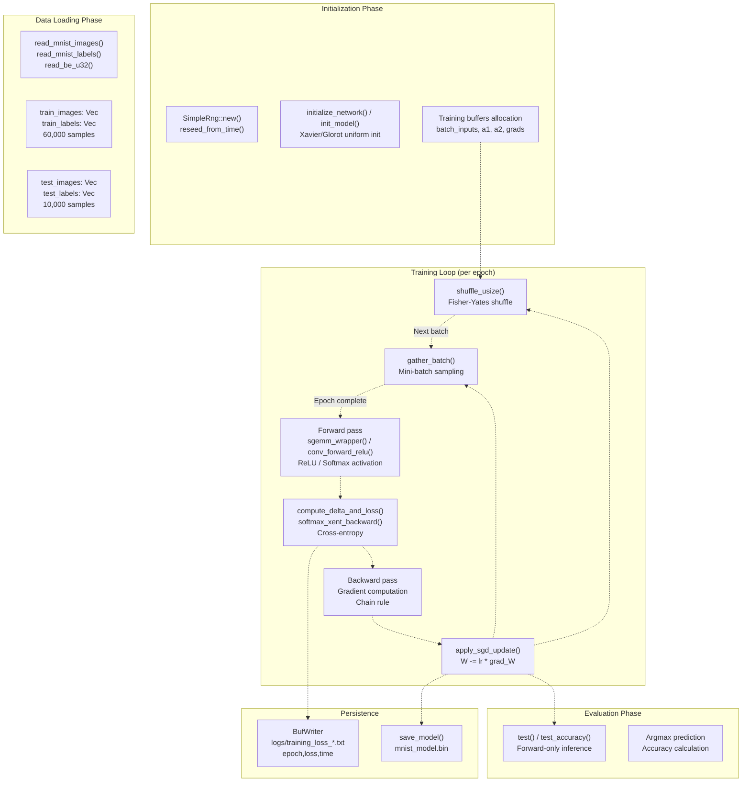

**Sources:** [mnist_mlp.rs L1-L664](https://github.com/ThalesMMS/Rust-Neural-Networks/blob/0e978f90/mnist_mlp.rs#L1-L664)

 [mnist_cnn.rs L1-L704](https://github.com/ThalesMMS/Rust-Neural-Networks/blob/0e978f90/mnist_cnn.rs#L1-L704)

 [mnist_attention_pool.rs L1-L1256](https://github.com/ThalesMMS/Rust-Neural-Networks/blob/0e978f90/mnist_attention_pool.rs#L1-L1256)

## Data Loading

### IDX Format Parsing

All implementations use the IDX binary format for MNIST data. The `read_be_u32()` function parses big-endian 32-bit unsigned integers from the IDX file headers:

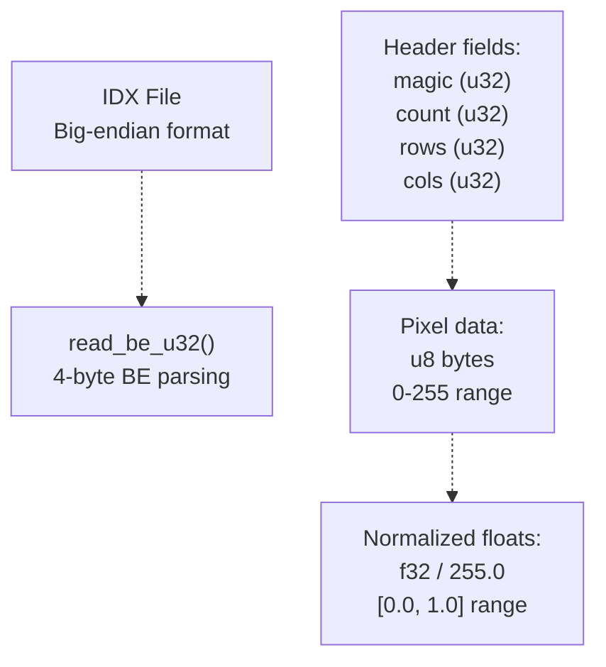

**Sources:** [mnist_mlp.rs L563-L570](https://github.com/ThalesMMS/Rust-Neural-Networks/blob/0e978f90/mnist_mlp.rs#L563-L570)

 [mnist_cnn.rs L99-L106](https://github.com/ThalesMMS/Rust-Neural-Networks/blob/0e978f90/mnist_cnn.rs#L99-L106)

 [mnist_attention_pool.rs L104-L111](https://github.com/ThalesMMS/Rust-Neural-Networks/blob/0e978f90/mnist_attention_pool.rs#L104-L111)

### Image and Label Loading

| Function | Input | Output | Normalization |
| --- | --- | --- | --- |
| `read_mnist_images()` | Filename, count | `Vec<f32>` (N × 784) | `pixel as f32 / 255.0` |
| `read_mnist_labels()` | Filename, count | `Vec<u8>` (N) | Raw labels 0-9 |

The image loader validates dimensions (28×28) and truncates to requested sample count. Data is stored in row-major order as flattened vectors:

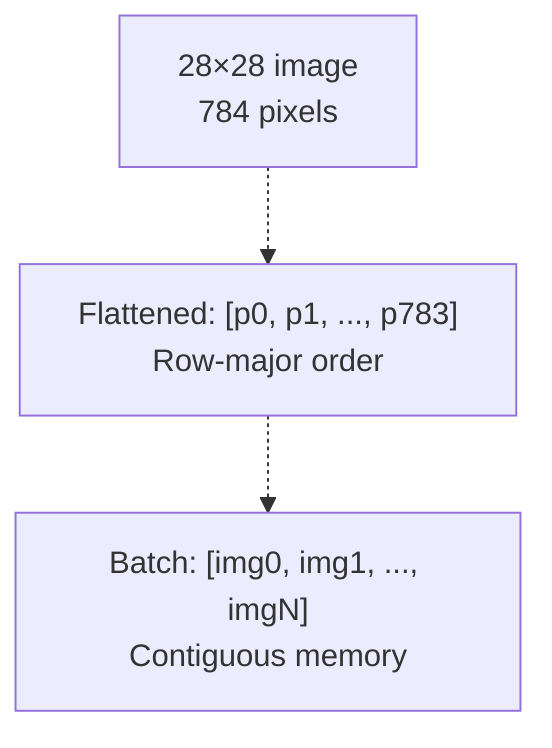

**Sources:** [mnist_mlp.rs L572-L600](https://github.com/ThalesMMS/Rust-Neural-Networks/blob/0e978f90/mnist_mlp.rs#L572-L600)

 [mnist_mlp.rs L603-L620](https://github.com/ThalesMMS/Rust-Neural-Networks/blob/0e978f90/mnist_mlp.rs#L603-L620)

 [mnist_cnn.rs L109-L142](https://github.com/ThalesMMS/Rust-Neural-Networks/blob/0e978f90/mnist_cnn.rs#L109-L142)

 [mnist_cnn.rs L145-L162](https://github.com/ThalesMMS/Rust-Neural-Networks/blob/0e978f90/mnist_cnn.rs#L145-L162)

 [mnist_attention_pool.rs L114-L148](https://github.com/ThalesMMS/Rust-Neural-Networks/blob/0e978f90/mnist_attention_pool.rs#L114-L148)

 [mnist_attention_pool.rs L151-L168](https://github.com/ThalesMMS/Rust-Neural-Networks/blob/0e978f90/mnist_attention_pool.rs#L151-L168)

## Model Initialization

### Random Number Generation

All implementations use `SimpleRng`, a lightweight xorshift-based pseudo-random number generator for reproducible initialization:

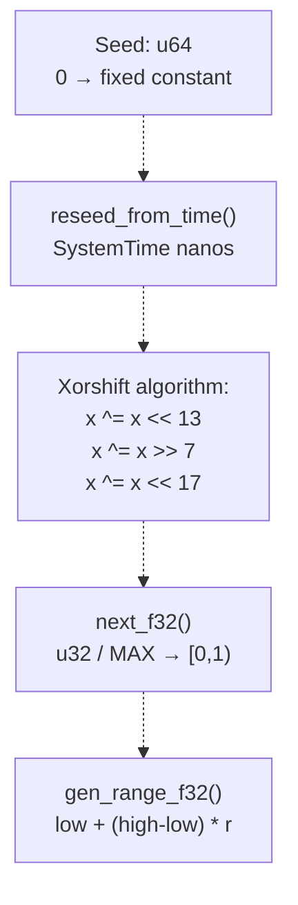

**Sources:** [mnist_mlp.rs L21-L69](https://github.com/ThalesMMS/Rust-Neural-Networks/blob/0e978f90/mnist_mlp.rs#L21-L69)

 [mnist_cnn.rs L44-L96](https://github.com/ThalesMMS/Rust-Neural-Networks/blob/0e978f90/mnist_cnn.rs#L44-L96)

 [mnist_attention_pool.rs L49-L101](https://github.com/ThalesMMS/Rust-Neural-Networks/blob/0e978f90/mnist_attention_pool.rs#L49-L101)

### Xavier/Glorot Initialization

Weights are initialized using Xavier uniform distribution to maintain stable signal magnitude across layers:

| Model | Layer | Formula | Implementation |
| --- | --- | --- | --- |
| MLP | Hidden (784→512) | `limit = sqrt(6 / (784 + 512))` | [mnist_mlp.rs L86-L98](https://github.com/ThalesMMS/Rust-Neural-Networks/blob/0e978f90/mnist_mlp.rs#L86-L98) |
| MLP | Output (512→10) | `limit = sqrt(6 / (512 + 10))` | [mnist_mlp.rs L86-L98](https://github.com/ThalesMMS/Rust-Neural-Networks/blob/0e978f90/mnist_mlp.rs#L86-L98) |
| CNN | Conv (9→8) | `limit = sqrt(6 / (9 + 72))` | [mnist_cnn.rs L236-L244](https://github.com/ThalesMMS/Rust-Neural-Networks/blob/0e978f90/mnist_cnn.rs#L236-L244) |
| CNN | FC (1568→10) | `limit = sqrt(6 / (1568 + 10))` | [mnist_cnn.rs L246-L250](https://github.com/ThalesMMS/Rust-Neural-Networks/blob/0e978f90/mnist_cnn.rs#L246-L250) |
| Attention | All layers | Based on fan-in/fan-out | [mnist_attention_pool.rs L390-L463](https://github.com/ThalesMMS/Rust-Neural-Networks/blob/0e978f90/mnist_attention_pool.rs#L390-L463) |

Biases are initialized to zero. The initialization functions use `gen_range_f32(-limit, limit)` to sample uniformly:

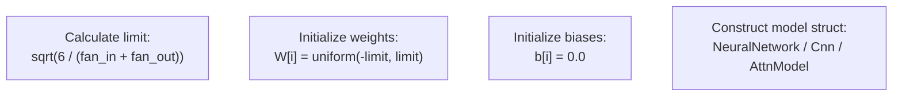

**Sources:** [mnist_mlp.rs L86-L111](https://github.com/ThalesMMS/Rust-Neural-Networks/blob/0e978f90/mnist_mlp.rs#L86-L111)

 [mnist_cnn.rs L230-L258](https://github.com/ThalesMMS/Rust-Neural-Networks/blob/0e978f90/mnist_cnn.rs#L230-L258)

 [mnist_attention_pool.rs L390-L463](https://github.com/ThalesMMS/Rust-Neural-Networks/blob/0e978f90/mnist_attention_pool.rs#L390-L463)

## Training Loop Structure

### Epoch and Batch Organization

The training loop follows this nested structure:

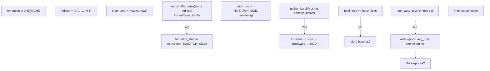

**Sources:** [mnist_mlp.rs L287-L446](https://github.com/ThalesMMS/Rust-Neural-Networks/blob/0e978f90/mnist_mlp.rs#L287-L446)

 [mnist_cnn.rs L645-L699](https://github.com/ThalesMMS/Rust-Neural-Networks/blob/0e978f90/mnist_cnn.rs#L645-L699)

 [mnist_attention_pool.rs L1207-L1253](https://github.com/ThalesMMS/Rust-Neural-Networks/blob/0e978f90/mnist_attention_pool.rs#L1207-L1253)

### Mini-Batch Sampling

The `gather_batch()` function copies shuffled samples into contiguous batch buffers for efficient processing:

| Implementation | Function Location | Buffer Types |
| --- | --- | --- |
| MLP | [mnist_mlp.rs L239-L258](https://github.com/ThalesMMS/Rust-Neural-Networks/blob/0e978f90/mnist_mlp.rs#L239-L258) | `batch_inputs: [f32; BATCH_SIZE * 784]` |
| CNN | [mnist_cnn.rs L165-L182](https://github.com/ThalesMMS/Rust-Neural-Networks/blob/0e978f90/mnist_cnn.rs#L165-L182) | `batch_inputs: [f32; BATCH_SIZE * 784]` |
| Attention | [mnist_attention_pool.rs L171-L188](https://github.com/ThalesMMS/Rust-Neural-Networks/blob/0e978f90/mnist_attention_pool.rs#L171-L188) | `batch_inputs: [f32; BATCH_SIZE * 784]` |

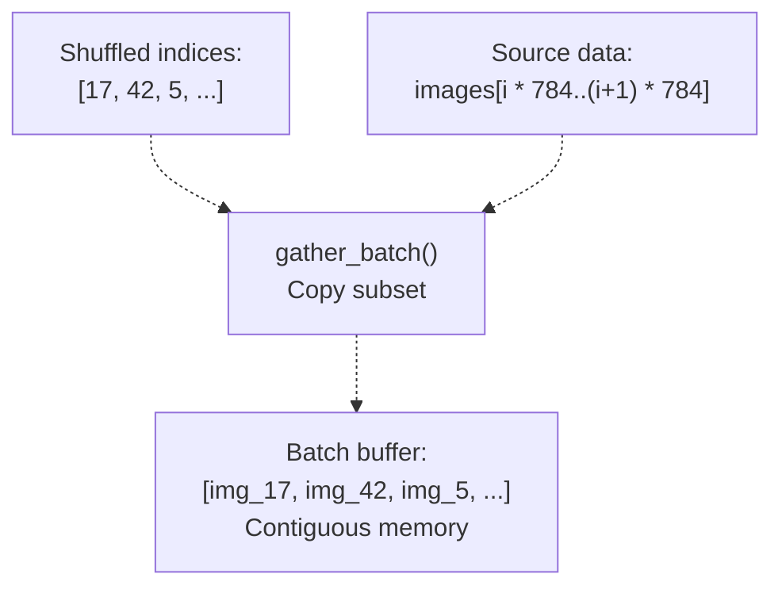

**Sources:** [mnist_mlp.rs L239-L258](https://github.com/ThalesMMS/Rust-Neural-Networks/blob/0e978f90/mnist_mlp.rs#L239-L258)

 [mnist_cnn.rs L165-L182](https://github.com/ThalesMMS/Rust-Neural-Networks/blob/0e978f90/mnist_cnn.rs#L165-L182)

 [mnist_attention_pool.rs L171-L188](https://github.com/ThalesMMS/Rust-Neural-Networks/blob/0e978f90/mnist_attention_pool.rs#L171-L188)

## Forward Propagation

### MLP Forward Pass (BLAS-Accelerated)

The MLP uses `sgemm_wrapper()` for batched matrix multiplication:

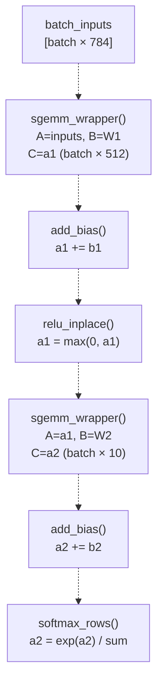

**Sources:** [mnist_mlp.rs L314-L351](https://github.com/ThalesMMS/Rust-Neural-Networks/blob/0e978f90/mnist_mlp.rs#L314-L351)

### CNN Forward Pass (Manual Loops)

The CNN uses explicit loops for convolution, pooling, and fully-connected layers:

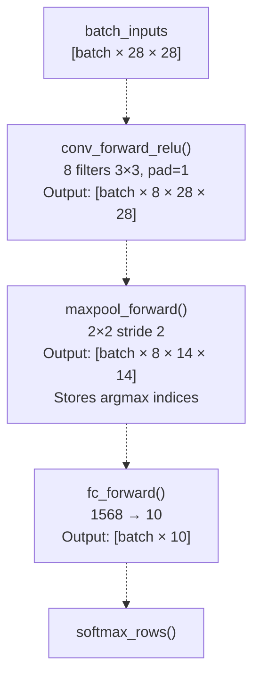

**Sources:** [mnist_cnn.rs L667-L669](https://github.com/ThalesMMS/Rust-Neural-Networks/blob/0e978f90/mnist_cnn.rs#L667-L669)

### Attention Forward Pass

The attention model processes image patches as tokens:

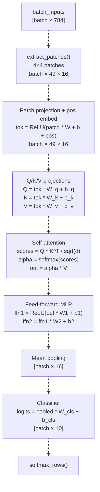

**Sources:** [mnist_attention_pool.rs L489-L661](https://github.com/ThalesMMS/Rust-Neural-Networks/blob/0e978f90/mnist_attention_pool.rs#L489-L661)

## Loss Computation

### Cross-Entropy Loss

All models use softmax cross-entropy loss with numerical stability via max subtraction:

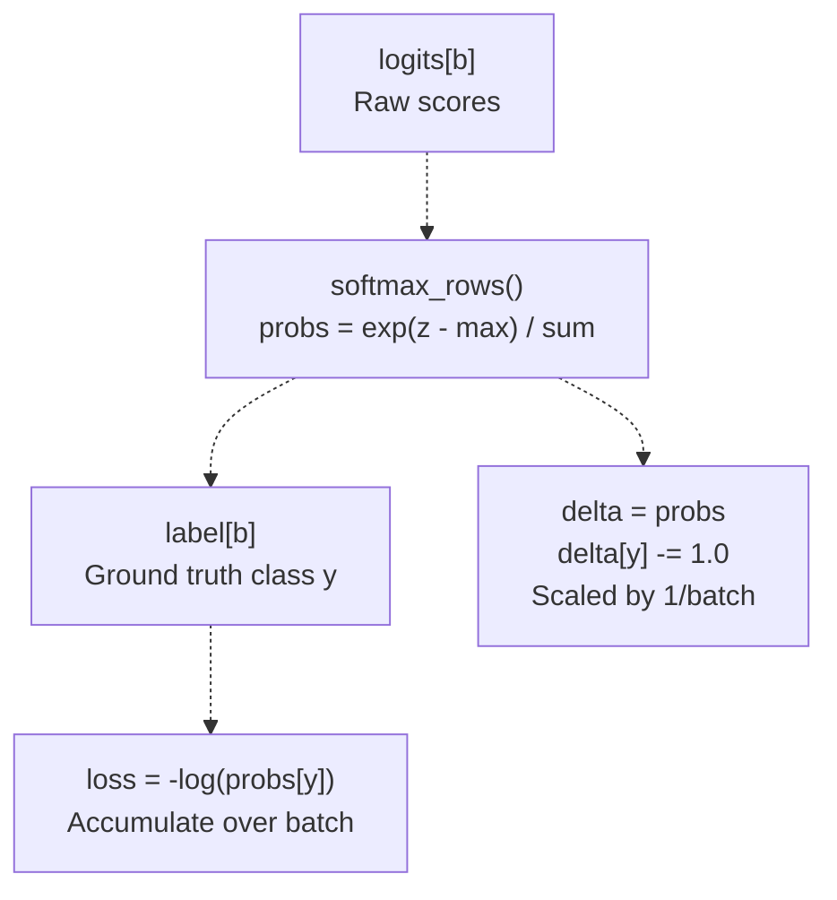

**Sources:** [mnist_mlp.rs L209-L236](https://github.com/ThalesMMS/Rust-Neural-Networks/blob/0e978f90/mnist_mlp.rs#L209-L236)

 [mnist_cnn.rs L374-L401](https://github.com/ThalesMMS/Rust-Neural-Networks/blob/0e978f90/mnist_cnn.rs#L374-L401)

 [mnist_attention_pool.rs L664-L683](https://github.com/ThalesMMS/Rust-Neural-Networks/blob/0e978f90/mnist_attention_pool.rs#L664-L683)

The `compute_delta_and_loss()` / `softmax_xent_backward()` functions combine loss calculation and gradient initialization:

| Implementation | Function | Loss Calculation | Delta Calculation |
| --- | --- | --- | --- |
| MLP | [mnist_mlp.rs L209-L236](https://github.com/ThalesMMS/Rust-Neural-Networks/blob/0e978f90/mnist_mlp.rs#L209-L236) | `-log(probs[label])` | `delta = probs - onehot` |
| CNN | [mnist_cnn.rs L374-L401](https://github.com/ThalesMMS/Rust-Neural-Networks/blob/0e978f90/mnist_cnn.rs#L374-L401) | `-log(probs[label])` | `delta = (probs - onehot) * scale` |
| Attention | [mnist_attention_pool.rs L664-L683](https://github.com/ThalesMMS/Rust-Neural-Networks/blob/0e978f90/mnist_attention_pool.rs#L664-L683) | `-log(probs[label])` | `delta = (probs - onehot) * scale` |

## Backward Propagation

### Gradient Flow Through Layers

Backpropagation applies the chain rule to compute gradients from output to input:

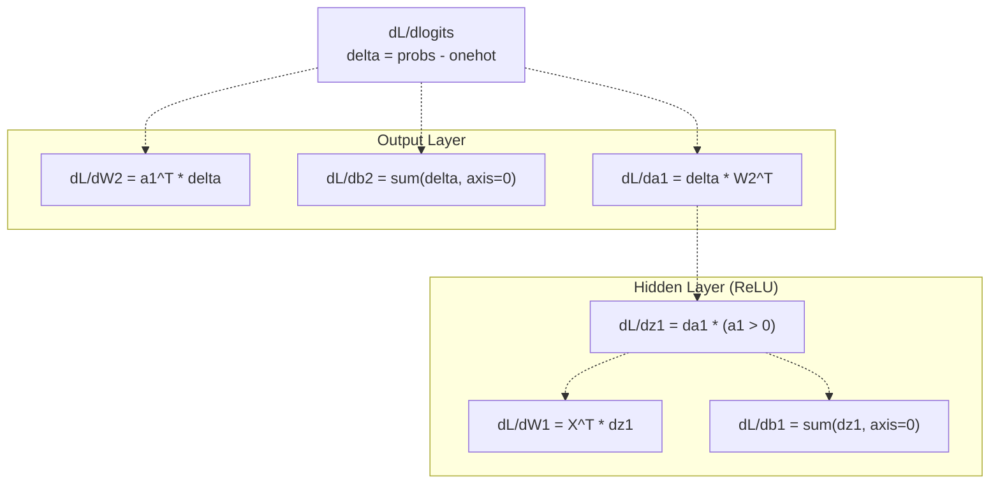

**Sources:** [mnist_mlp.rs L363-L426](https://github.com/ThalesMMS/Rust-Neural-Networks/blob/0e978f90/mnist_mlp.rs#L363-L426)

### MLP Backward Pass

The MLP backward pass uses transposed GEMM operations for efficient gradient computation:

| Step | Operation | SGEMM Call | Output |
| --- | --- | --- | --- |
| Output grad | `dW2 = a1^T * delta` | [mnist_mlp.rs L363-L378](https://github.com/ThalesMMS/Rust-Neural-Networks/blob/0e978f90/mnist_mlp.rs#L363-L378) | `grad_w2 [512 × 10]` |
| Hidden grad | `dz1 = delta * W2^T` | [mnist_mlp.rs L384-L398](https://github.com/ThalesMMS/Rust-Neural-Networks/blob/0e978f90/mnist_mlp.rs#L384-L398) | `dz1 [batch × 512]` |
| ReLU grad | `dz1 *= (a1 > 0)` | [mnist_mlp.rs L401-L405](https://github.com/ThalesMMS/Rust-Neural-Networks/blob/0e978f90/mnist_mlp.rs#L401-L405) | Element-wise mask |
| Input grad | `dW1 = X^T * dz1` | [mnist_mlp.rs L407-L422](https://github.com/ThalesMMS/Rust-Neural-Networks/blob/0e978f90/mnist_mlp.rs#L407-L422) | `grad_w1 [784 × 512]` |

**Sources:** [mnist_mlp.rs L363-L426](https://github.com/ThalesMMS/Rust-Neural-Networks/blob/0e978f90/mnist_mlp.rs#L363-L426)

### CNN Backward Pass

The CNN backward pass routes gradients through pooling and convolution layers:

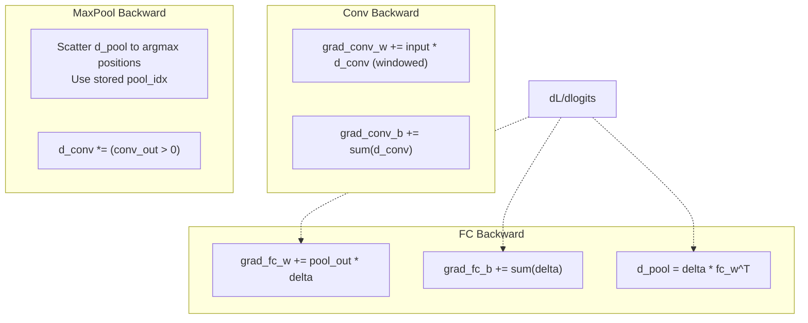

**Sources:** [mnist_cnn.rs L404-L453](https://github.com/ThalesMMS/Rust-Neural-Networks/blob/0e978f90/mnist_cnn.rs#L404-L453)

 [mnist_cnn.rs L456-L504](https://github.com/ThalesMMS/Rust-Neural-Networks/blob/0e978f90/mnist_cnn.rs#L456-L504)

 [mnist_cnn.rs L507-L557](https://github.com/ThalesMMS/Rust-Neural-Networks/blob/0e978f90/mnist_cnn.rs#L507-L557)

### Attention Backward Pass

The attention backward pass handles complex dependencies through self-attention:

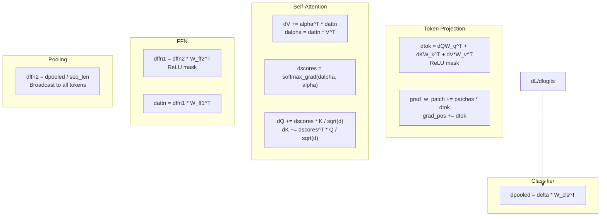

**Sources:** [mnist_attention_pool.rs L686-L928](https://github.com/ThalesMMS/Rust-Neural-Networks/blob/0e978f90/mnist_attention_pool.rs#L686-L928)

## Optimizer

### Stochastic Gradient Descent (SGD)

All implementations use vanilla SGD without momentum or weight decay:

```
W = W - learning_rate * grad_W
b = b - learning_rate * grad_b
```

| Model | Learning Rate | Batch Size | Function |
| --- | --- | --- | --- |
| MLP | 0.01 | 64 | [mnist_mlp.rs L260-L264](https://github.com/ThalesMMS/Rust-Neural-Networks/blob/0e978f90/mnist_mlp.rs#L260-L264) |
| CNN | 0.01 | 32 | [mnist_cnn.rs L680-L692](https://github.com/ThalesMMS/Rust-Neural-Networks/blob/0e978f90/mnist_cnn.rs#L680-L692) |
| Attention | 0.01 | 32 | [mnist_attention_pool.rs L930-L977](https://github.com/ThalesMMS/Rust-Neural-Networks/blob/0e978f90/mnist_attention_pool.rs#L930-L977) |

The update is applied immediately after each mini-batch's gradient computation:

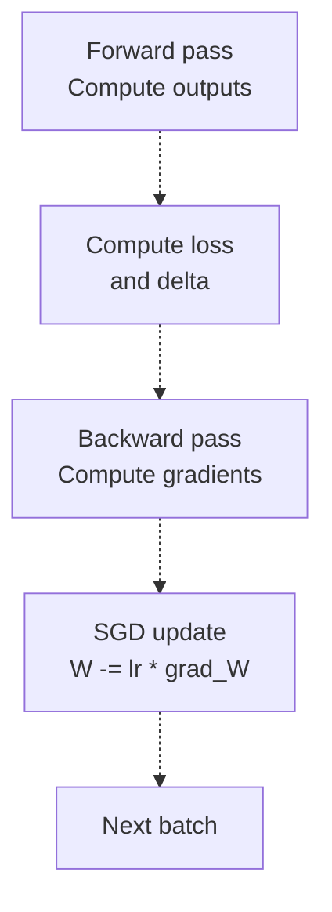

**Sources:** [mnist_mlp.rs L428-L431](https://github.com/ThalesMMS/Rust-Neural-Networks/blob/0e978f90/mnist_mlp.rs#L428-L431)

 [mnist_cnn.rs L680-L692](https://github.com/ThalesMMS/Rust-Neural-Networks/blob/0e978f90/mnist_cnn.rs#L680-L692)

 [mnist_attention_pool.rs L930-L977](https://github.com/ThalesMMS/Rust-Neural-Networks/blob/0e978f90/mnist_attention_pool.rs#L930-L977)

## Evaluation

### Test Accuracy Computation

The `test()` / `test_accuracy()` functions evaluate model performance on held-out test data:

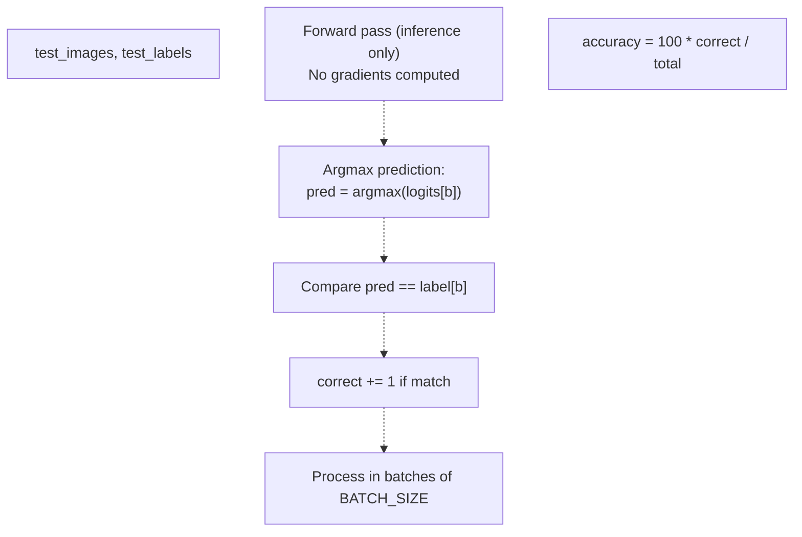

**Sources:** [mnist_mlp.rs L450-L520](https://github.com/ThalesMMS/Rust-Neural-Networks/blob/0e978f90/mnist_mlp.rs#L450-L520)

 [mnist_cnn.rs L559-L597](https://github.com/ThalesMMS/Rust-Neural-Networks/blob/0e978f90/mnist_cnn.rs#L559-L597)

 [mnist_attention_pool.rs L979-L1167](https://github.com/ThalesMMS/Rust-Neural-Networks/blob/0e978f90/mnist_attention_pool.rs#L979-L1167)

The evaluation process differs from training:

* No shuffling of indices
* No gradient computation or backpropagation
* No parameter updates
* Processes sequentially through test set

## Logging and Persistence

### Training Logs

All implementations write training metrics to CSV files in the `logs/` directory:

| Model | Log File | Format | Content |
| --- | --- | --- | --- |
| MLP | `logs/training_loss_c.txt` | CSV | `epoch,loss,time` |
| CNN | `logs/training_loss_cnn.txt` | CSV | `epoch,loss,time` |
| Attention | `logs/training_loss_attention_mnist.txt` | CSV | `epoch,loss,time` |

The logging process uses `BufWriter` for efficient I/O:

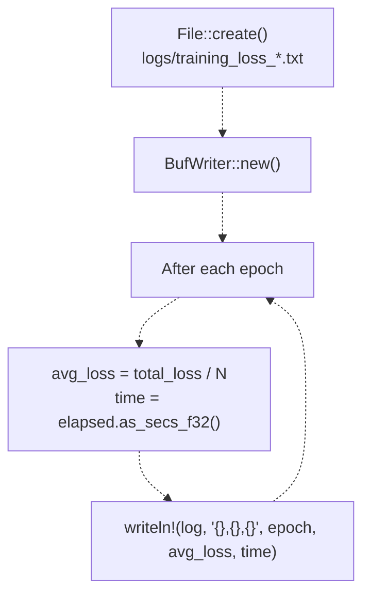

**Sources:** [mnist_mlp.rs L268-L272](https://github.com/ThalesMMS/Rust-Neural-Networks/blob/0e978f90/mnist_mlp.rs#L268-L272)

 [mnist_mlp.rs L442-L445](https://github.com/ThalesMMS/Rust-Neural-Networks/blob/0e978f90/mnist_mlp.rs#L442-L445)

 [mnist_cnn.rs L617-L621](https://github.com/ThalesMMS/Rust-Neural-Networks/blob/0e978f90/mnist_cnn.rs#L617-L621)

 [mnist_cnn.rs L698](https://github.com/ThalesMMS/Rust-Neural-Networks/blob/0e978f90/mnist_cnn.rs#L698-L698)

 [mnist_attention_pool.rs L1182-L1186](https://github.com/ThalesMMS/Rust-Neural-Networks/blob/0e978f90/mnist_attention_pool.rs#L1182-L1186)

 [mnist_attention_pool.rs L1252](https://github.com/ThalesMMS/Rust-Neural-Networks/blob/0e978f90/mnist_attention_pool.rs#L1252-L1252)

### Model Serialization

The MLP implementation includes `save_model()` for binary serialization:

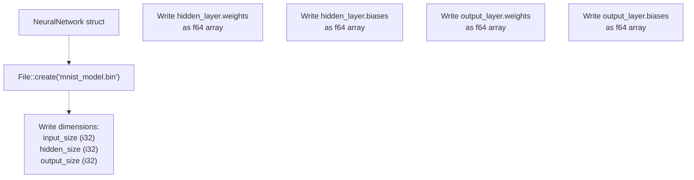

**Sources:** [mnist_mlp.rs L522-L561](https://github.com/ThalesMMS/Rust-Neural-Networks/blob/0e978f90/mnist_mlp.rs#L522-L561)

The serialized model uses native endianness (via `to_ne_bytes()`) and converts f32 weights to f64 for storage. This format is consumed by the Python digit recognizer GUI (see [Digit Recognizer GUI](4a%20Digit-Recognizer-GUI.md)).


)

### On this page

* [Training Pipeline](5b%20Training-Visualization.md)
* [Purpose and Scope](5b%20Training-Visualization.md)
* [Training Pipeline Architecture](5b%20Training-Visualization.md)
* [Data Loading](5b%20Training-Visualization.md)
* [IDX Format Parsing](5b%20Training-Visualization.md)
* [Image and Label Loading](5b%20Training-Visualization.md)
* [Model Initialization](5b%20Training-Visualization.md)
* [Random Number Generation](5b%20Training-Visualization.md)
* [Xavier/Glorot Initialization](5b%20Training-Visualization.md)
* [Training Loop Structure](5b%20Training-Visualization.md)
* [Epoch and Batch Organization](5b%20Training-Visualization.md)
* [Mini-Batch Sampling](5b%20Training-Visualization.md)
* [Forward Propagation](5b%20Training-Visualization.md)
* [MLP Forward Pass (BLAS-Accelerated)](5b%20Training-Visualization.md)
* [CNN Forward Pass (Manual Loops)](5b%20Training-Visualization.md)
* [Attention Forward Pass](5b%20Training-Visualization.md)
* [Loss Computation](5b%20Training-Visualization.md)
* [Cross-Entropy Loss](5b%20Training-Visualization.md)
* [Backward Propagation](5b%20Training-Visualization.md)
* [Gradient Flow Through Layers](5b%20Training-Visualization.md)
* [MLP Backward Pass](5b%20Training-Visualization.md)
* [CNN Backward Pass](5b%20Training-Visualization.md)
* [Attention Backward Pass](5b%20Training-Visualization.md)
* [Optimizer](5b%20Training-Visualization.md)
* [Stochastic Gradient Descent (SGD)](5b%20Training-Visualization.md)
* [Evaluation](5b%20Training-Visualization.md)
* [Test Accuracy Computation](5b%20Training-Visualization.md)
* [Logging and Persistence](5b%20Training-Visualization.md)
* [Training Logs](5b%20Training-Visualization.md)
* [Model Serialization](5b%20Training-Visualization.md)

Ask Devin about Rust-Neural-Networks