# Architecture & Design

> **Relevant source files**
> * [Cargo.lock](https://github.com/ThalesMMS/Rust-Neural-Networks/blob/0e978f90/Cargo.lock)
> * [Cargo.toml](https://github.com/ThalesMMS/Rust-Neural-Networks/blob/0e978f90/Cargo.toml)
> * [README.md](https://github.com/ThalesMMS/Rust-Neural-Networks/blob/0e978f90/README.md)
> * [mnist_mlp.rs](https://github.com/ThalesMMS/Rust-Neural-Networks/blob/0e978f90/mnist_mlp.rs)

## Purpose and Scope

This document provides a technical deep dive into the architectural decisions, optimization strategies, and internal system design of the Rust Neural Networks repository. It covers the overall system organization, design principles, component relationships, and data flow patterns across all implementations.

For specific implementation details of BLAS acceleration and platform-specific configurations, see [BLAS Integration](#5.1). For the common training workflow mechanics, see [Training Pipeline](#5.2). For model serialization format specifications, see [Binary Model Format](#5.3).

For usage instructions and getting started guides, see [Getting Started](#2). For detailed documentation of individual models, see [Model Implementations](#3).

---

## System Architecture Overview

The repository implements a multi-binary Rust architecture with Python utilities for visualization and inference. Each binary is a standalone executable implementing a distinct neural network model, with no shared library code—instead, design patterns and data structures are replicated across implementations for educational clarity.

### Multi-Binary Structure

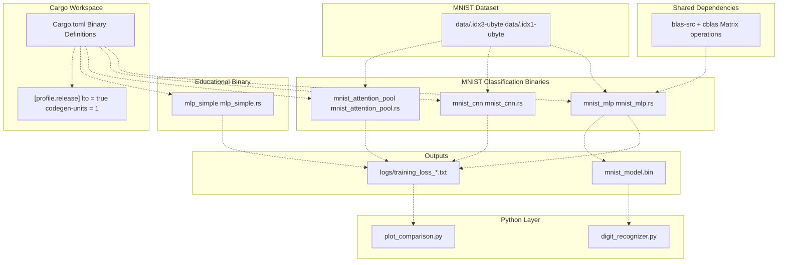

**Sources:** [Cargo.toml L1-L29](https://github.com/ThalesMMS/Rust-Neural-Networks/blob/0e978f90/Cargo.toml#L1-L29)

 [README.md L14-L31](https://github.com/ThalesMMS/Rust-Neural-Networks/blob/0e978f90/README.md#L14-L31)

The system uses Cargo's multi-binary feature with four independent executables defined in [Cargo.toml L10-L24](https://github.com/ThalesMMS/Rust-Neural-Networks/blob/0e978f90/Cargo.toml#L10-L24)

 Each binary is self-contained with no shared module dependencies, enabling independent compilation and execution. The release profile applies aggressive optimizations ([Cargo.toml L26-L28](https://github.com/ThalesMMS/Rust-Neural-Networks/blob/0e978f90/Cargo.toml#L26-L28)

): link-time optimization (`lto = true`) for cross-function inlining and single codegen unit for maximum optimization at the cost of slower compilation.

### Language Separation Strategy

The architecture employs a clear separation of concerns by language:

| Layer | Language | Responsibility | Rationale |
| --- | --- | --- | --- |
| Training & Inference | Rust | Compute-intensive operations | Type safety, zero-cost abstractions, BLAS integration |
| Data Processing | Rust | IDX format parsing, normalization | Memory efficiency, no Python overhead |
| Visualization | Python | Loss curve plotting | Matplotlib ecosystem |
| Interactive UI | Python | GUI for digit drawing | Tkinter, PIL libraries |

**Sources:** [README.md L1-L31](https://github.com/ThalesMMS/Rust-Neural-Networks/blob/0e978f90/README.md#L1-L31)

 [mnist_mlp.rs L1-L664](https://github.com/ThalesMMS/Rust-Neural-Networks/blob/0e978f90/mnist_mlp.rs#L1-L664)

 [digit_recognizer.py](https://github.com/ThalesMMS/Rust-Neural-Networks/blob/0e978f90/digit_recognizer.py)

 [plot_comparison.py](https://github.com/ThalesMMS/Rust-Neural-Networks/blob/0e978f90/plot_comparison.py)

This separation maximizes performance where needed (training in Rust with BLAS acceleration) while leveraging Python's rich ecosystem for user-facing tools. The interface between layers is file-based: binary model format for inference ([mnist_mlp.rs L522-L561](https://github.com/ThalesMMS/Rust-Neural-Networks/blob/0e978f90/mnist_mlp.rs#L522-L561)

) and CSV logs for visualization.

---

## Core Design Principles

### Performance-First Architecture

The codebase prioritizes computational efficiency through multiple strategies:

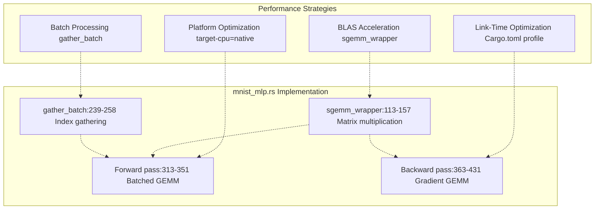

**Sources:** [mnist_mlp.rs L113-L157](https://github.com/ThalesMMS/Rust-Neural-Networks/blob/0e978f90/mnist_mlp.rs#L113-L157)

 [mnist_mlp.rs L239-L258](https://github.com/ThalesMMS/Rust-Neural-Networks/blob/0e978f90/mnist_mlp.rs#L239-L258)

 [Cargo.toml L26-L28](https://github.com/ThalesMMS/Rust-Neural-Networks/blob/0e978f90/Cargo.toml#L26-L28)

 [README.md L130-L136](https://github.com/ThalesMMS/Rust-Neural-Networks/blob/0e978f90/README.md#L130-L136)

**BLAS Integration**: The MLP implementation uses `cblas::sgemm` ([mnist_mlp.rs L113-L157](https://github.com/ThalesMMS/Rust-Neural-Networks/blob/0e978f90/mnist_mlp.rs#L113-L157)

) for all matrix multiplications. The wrapper handles row-major layout and transpose operations, delegating to platform-optimized BLAS libraries (Accelerate on macOS, OpenBLAS on Linux).

**Batch Processing**: All operations process mini-batches rather than individual samples. The `gather_batch` function ([mnist_mlp.rs L239-L258](https://github.com/ThalesMMS/Rust-Neural-Networks/blob/0e978f90/mnist_mlp.rs#L239-L258)

) efficiently collects shuffled samples into contiguous memory for vectorized operations.

**Release Optimizations**: The profile in [Cargo.toml L26-L28](https://github.com/ThalesMMS/Rust-Neural-Networks/blob/0e978f90/Cargo.toml#L26-L28)

 enables full link-time optimization and single-threaded codegen for maximum inlining and dead code elimination.

### Educational Clarity Through Explicit Implementations

While the MLP leverages BLAS for performance, CNN and Attention models use manual loop implementations to demonstrate algorithmic details:

| Operation | MLP (BLAS) | CNN (Manual) | Attention (Manual) |
| --- | --- | --- | --- |
| Matrix Multiplication | `sgemm` call | Explicit triple loops | Explicit loops with attention scores |
| Convolution | N/A | Manual 2D kernel application | N/A |
| Attention Scores | N/A | N/A | Manual Q·K^T computation |
| Pooling | N/A | Manual max selection over windows | Mean pooling over tokens |

**Sources:** [mnist_mlp.rs L113-L157](https://github.com/ThalesMMS/Rust-Neural-Networks/blob/0e978f90/mnist_mlp.rs#L113-L157)

 [mnist_cnn.rs](https://github.com/ThalesMMS/Rust-Neural-Networks/blob/0e978f90/mnist_cnn.rs)

 [mnist_attention_pool.rs](https://github.com/ThalesMMS/Rust-Neural-Networks/blob/0e978f90/mnist_attention_pool.rs)

This dual approach allows users to understand both high-performance patterns (BLAS) and underlying algorithms (manual loops) within the same repository.

### Reproducibility Architecture

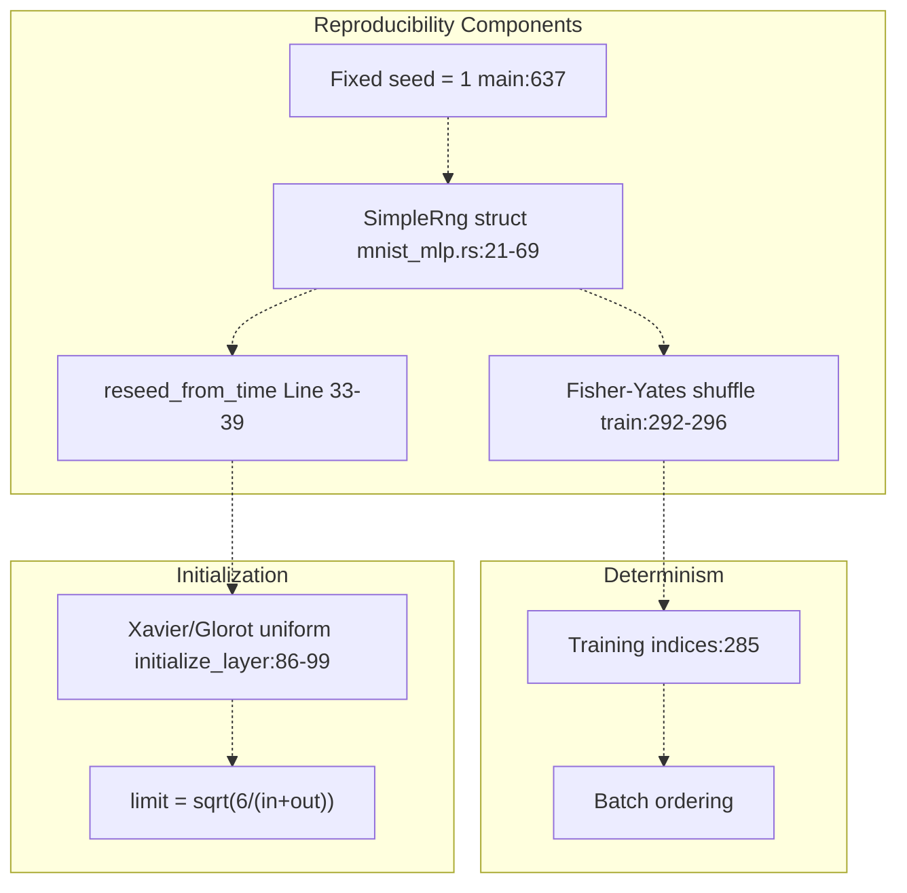

**Sources:** [mnist_mlp.rs L21-L69](https://github.com/ThalesMMS/Rust-Neural-Networks/blob/0e978f90/mnist_mlp.rs#L21-L69)

 [mnist_mlp.rs L86-L99](https://github.com/ThalesMMS/Rust-Neural-Networks/blob/0e978f90/mnist_mlp.rs#L86-L99)

 [mnist_mlp.rs L292-L296](https://github.com/ThalesMMS/Rust-Neural-Networks/blob/0e978f90/mnist_mlp.rs#L292-L296)

 [mnist_mlp.rs L637](https://github.com/ThalesMMS/Rust-Neural-Networks/blob/0e978f90/mnist_mlp.rs#L637-L637)

The system avoids external RNG dependencies by implementing `SimpleRng` ([mnist_mlp.rs L21-L69](https://github.com/ThalesMMS/Rust-Neural-Networks/blob/0e978f90/mnist_mlp.rs#L21-L69)

), a basic xorshift-based pseudo-random number generator. This ensures:

* **Deterministic initialization**: Xavier/Glorot uniform distribution with reproducible seed ([mnist_mlp.rs L86-L99](https://github.com/ThalesMMS/Rust-Neural-Networks/blob/0e978f90/mnist_mlp.rs#L86-L99) )
* **Reproducible shuffling**: Fisher-Yates algorithm for training order ([mnist_mlp.rs L292-L296](https://github.com/ThalesMMS/Rust-Neural-Networks/blob/0e978f90/mnist_mlp.rs#L292-L296) )
* **Time-based reseeding**: Optional randomization via system time ([mnist_mlp.rs L33-L39](https://github.com/ThalesMMS/Rust-Neural-Networks/blob/0e978f90/mnist_mlp.rs#L33-L39) )

The `main` function initializes the RNG with seed 1 ([mnist_mlp.rs L637](https://github.com/ThalesMMS/Rust-Neural-Networks/blob/0e978f90/mnist_mlp.rs#L637-L637)

), but `initialize_network` reseeds from system time ([mnist_mlp.rs L103](https://github.com/ThalesMMS/Rust-Neural-Networks/blob/0e978f90/mnist_mlp.rs#L103-L103)

), making actual runs non-deterministic while keeping the pattern reproducible.

---

## Component Architecture

### Neural Network Data Structures

All implementations share a similar structural pattern, though not through code reuse:

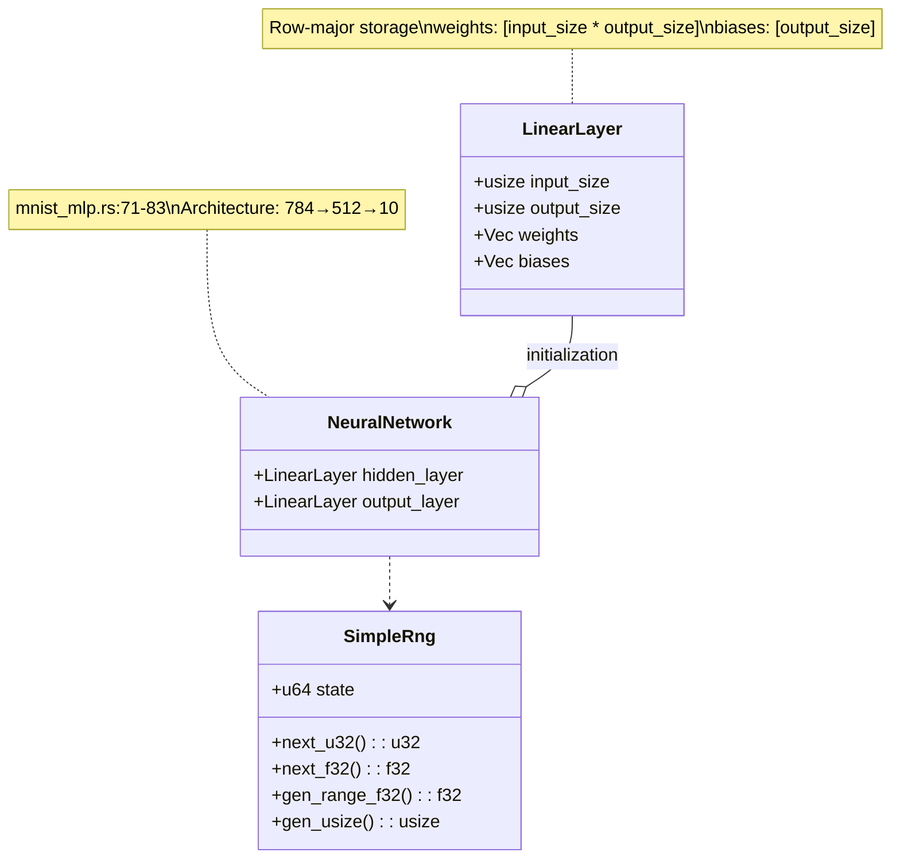

**Sources:** [mnist_mlp.rs L71-L83](https://github.com/ThalesMMS/Rust-Neural-Networks/blob/0e978f90/mnist_mlp.rs#L71-L83)

 [mnist_mlp.rs L79-L83](https://github.com/ThalesMMS/Rust-Neural-Networks/blob/0e978f90/mnist_mlp.rs#L79-L83)

 [mnist_mlp.rs L21-L69](https://github.com/ThalesMMS/Rust-Neural-Networks/blob/0e978f90/mnist_mlp.rs#L21-L69)

**LinearLayer** ([mnist_mlp.rs L71-L77](https://github.com/ThalesMMS/Rust-Neural-Networks/blob/0e978f90/mnist_mlp.rs#L71-L77)

): Represents a fully-connected layer with row-major weight matrix. For a layer with `input_size` inputs and `output_size` outputs, weights are stored as a flat vector of length `input_size * output_size`, where element `[i * output_size + j]` represents the weight from input `i` to output `j`.

**NeuralNetwork** ([mnist_mlp.rs L79-L83](https://github.com/ThalesMMS/Rust-Neural-Networks/blob/0e978f90/mnist_mlp.rs#L79-L83)

): Two-layer MLP structure. The `hidden_layer` maps 784 inputs to 512 hidden units, while `output_layer` maps 512 hidden units to 10 output classes.

### Activation and Loss Functions

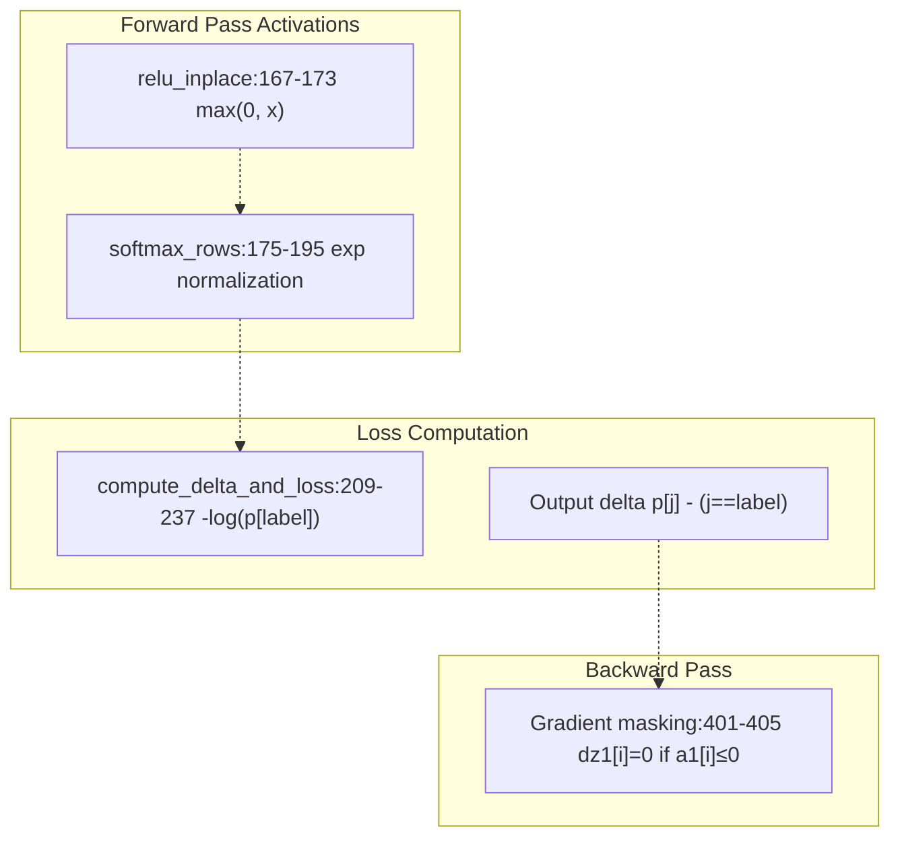

**Sources:** [mnist_mlp.rs L167-L173](https://github.com/ThalesMMS/Rust-Neural-Networks/blob/0e978f90/mnist_mlp.rs#L167-L173)

 [mnist_mlp.rs L175-L195](https://github.com/ThalesMMS/Rust-Neural-Networks/blob/0e978f90/mnist_mlp.rs#L175-L195)

 [mnist_mlp.rs L209-L237](https://github.com/ThalesMMS/Rust-Neural-Networks/blob/0e978f90/mnist_mlp.rs#L209-L237)

 [mnist_mlp.rs L401-L405](https://github.com/ThalesMMS/Rust-Neural-Networks/blob/0e978f90/mnist_mlp.rs#L401-L405)

**ReLU Activation** ([mnist_mlp.rs L167-L173](https://github.com/ThalesMMS/Rust-Neural-Networks/blob/0e978f90/mnist_mlp.rs#L167-L173)

): Applied in-place to hidden layer outputs by zeroing negative values. During backpropagation ([mnist_mlp.rs L401-L405](https://github.com/ThalesMMS/Rust-Neural-Networks/blob/0e978f90/mnist_mlp.rs#L401-L405)

), gradients are masked to zero where activations were non-positive.

**Softmax** ([mnist_mlp.rs L175-L195](https://github.com/ThalesMMS/Rust-Neural-Networks/blob/0e978f90/mnist_mlp.rs#L175-L195)

): Operates row-wise on batches. For numerical stability, subtracts row maximum before exponentiation. Each row is independently normalized to sum to 1.0.

**Cross-Entropy Loss** ([mnist_mlp.rs L209-L237](https://github.com/ThalesMMS/Rust-Neural-Networks/blob/0e978f90/mnist_mlp.rs#L209-L237)

): Computes negative log-likelihood loss and simultaneously calculates output gradients. For each sample, the gradient is `p[j] - 1` for the correct class and `p[j]` for other classes, where `p[j]` is the predicted probability.

### Data Loading Infrastructure

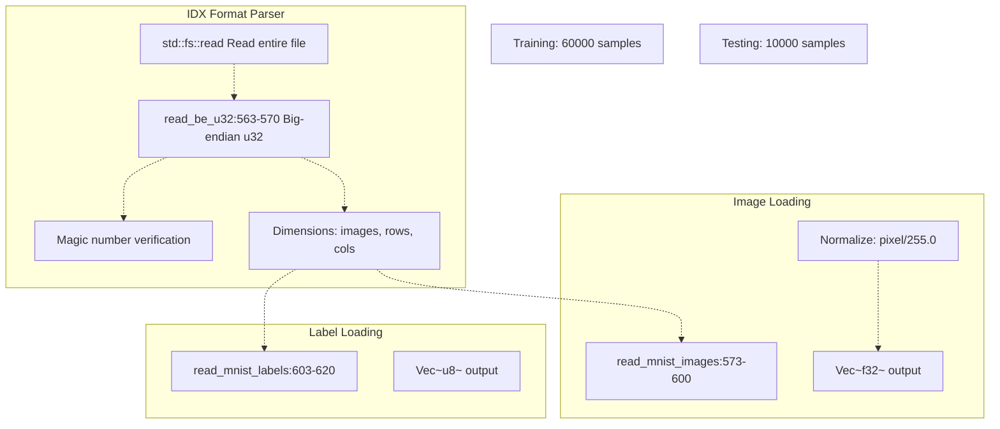

**Sources:** [mnist_mlp.rs L563-L620](https://github.com/ThalesMMS/Rust-Neural-Networks/blob/0e978f90/mnist_mlp.rs#L563-L620)

 [mnist_mlp.rs L622-L664](https://github.com/ThalesMMS/Rust-Neural-Networks/blob/0e978f90/mnist_mlp.rs#L622-L664)

The IDX format parser ([mnist_mlp.rs L563-L620](https://github.com/ThalesMMS/Rust-Neural-Networks/blob/0e978f90/mnist_mlp.rs#L563-L620)

) reads the MNIST binary format:

1. **Header parsing**: Reads big-endian integers for magic number, sample count, and dimensions
2. **Image normalization**: Converts uint8 pixels (0-255) to float32 (0.0-1.0) by dividing by 255.0
3. **Memory efficiency**: Allocates exact buffer sizes based on header metadata

The main function ([mnist_mlp.rs L622-L664](https://github.com/ThalesMMS/Rust-Neural-Networks/blob/0e978f90/mnist_mlp.rs#L622-L664)

) loads all data at startup:

* Training: 60,000 images and labels
* Testing: 10,000 images and labels
* Total memory: ~47MB for images + 70KB for labels

---

## Code Organization Patterns

### Shared Structural Patterns

Despite no code sharing, all implementations follow consistent patterns:

| Component | Pattern | Example (MLP) | Example (CNN) | Example (Attention) |
| --- | --- | --- | --- | --- |
| Constants | Global `const` declarations | `NUM_INPUTS = 784` | `IMG_H = 28`, `IMG_W = 28` | `PATCH_SIZE = 4` |
| RNG | `SimpleRng` struct | [mnist_mlp.rs L21-L69](https://github.com/ThalesMMS/Rust-Neural-Networks/blob/0e978f90/mnist_mlp.rs#L21-L69) | Similar implementation | Similar implementation |
| Data structures | Structs for layers | `LinearLayer`, `NeuralNetwork` | `ConvLayer`, `FCLayer` | `AttentionLayer` |
| Initialization | Xavier/Glorot uniform | [mnist_mlp.rs L86-L99](https://github.com/ThalesMMS/Rust-Neural-Networks/blob/0e978f90/mnist_mlp.rs#L86-L99) | Similar for conv filters | Similar for embeddings |
| Forward pass | Function per layer | Batched GEMM operations | Manual conv/pool loops | Token-wise attention |
| Loss calculation | Cross-entropy | [mnist_mlp.rs L209-L237](https://github.com/ThalesMMS/Rust-Neural-Networks/blob/0e978f90/mnist_mlp.rs#L209-L237) | Similar implementation | Similar implementation |
| Training loop | Epoch iteration with batches | [mnist_mlp.rs L266-L447](https://github.com/ThalesMMS/Rust-Neural-Networks/blob/0e978f90/mnist_mlp.rs#L266-L447) | Similar structure | Similar structure |
| Logging | CSV to `logs/` directory | `training_loss_c.txt` | `training_loss_cnn.txt` | `training_loss_attention.txt` |

**Sources:** [mnist_mlp.rs L10-L18](https://github.com/ThalesMMS/Rust-Neural-Networks/blob/0e978f90/mnist_mlp.rs#L10-L18)

 [mnist_mlp.rs L21-L69](https://github.com/ThalesMMS/Rust-Neural-Networks/blob/0e978f90/mnist_mlp.rs#L21-L69)

 [mnist_mlp.rs L71-L83](https://github.com/ThalesMMS/Rust-Neural-Networks/blob/0e978f90/mnist_mlp.rs#L71-L83)

 [mnist_mlp.rs L86-L99](https://github.com/ThalesMMS/Rust-Neural-Networks/blob/0e978f90/mnist_mlp.rs#L86-L99)

### Divergent Implementation Strategies

The models differ significantly in their computational approaches:

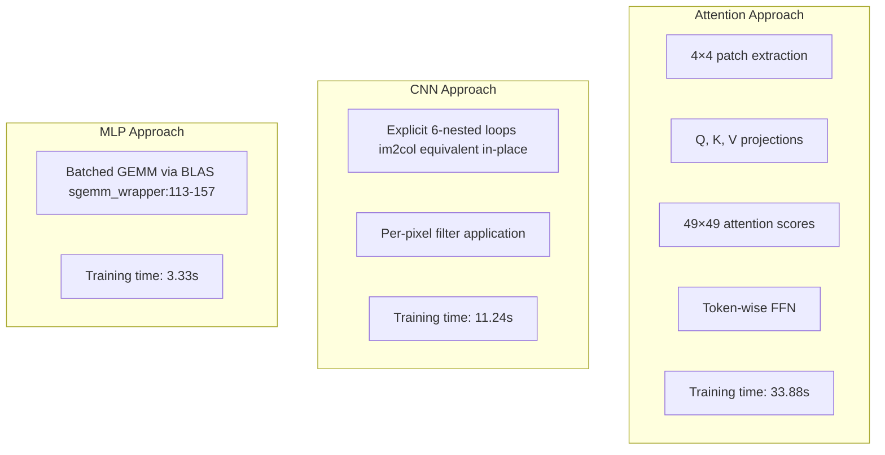

**Sources:** [mnist_mlp.rs L113-L157](https://github.com/ThalesMMS/Rust-Neural-Networks/blob/0e978f90/mnist_mlp.rs#L113-L157)

 [README.md L138-L148](https://github.com/ThalesMMS/Rust-Neural-Networks/blob/0e978f90/README.md#L138-L148)

**MLP**: Vectorizes computation through BLAS, processing entire batches as matrix operations. Forward pass uses two GEMM calls; backward pass uses four GEMM calls for gradients.

**CNN**: Uses explicit nested loops for convolution (6 loops: batch, output channels, output height, output width, kernel height, kernel width) and pooling (5 loops). This is 3.4× slower than MLP but educationally clearer.

**Attention**: Most complex with token extraction, projection, attention score matrix (49×49), and per-token feed-forward networks. 10× slower than MLP but demonstrates transformer architecture.

---

## Data Flow Architecture

### Training Data Flow

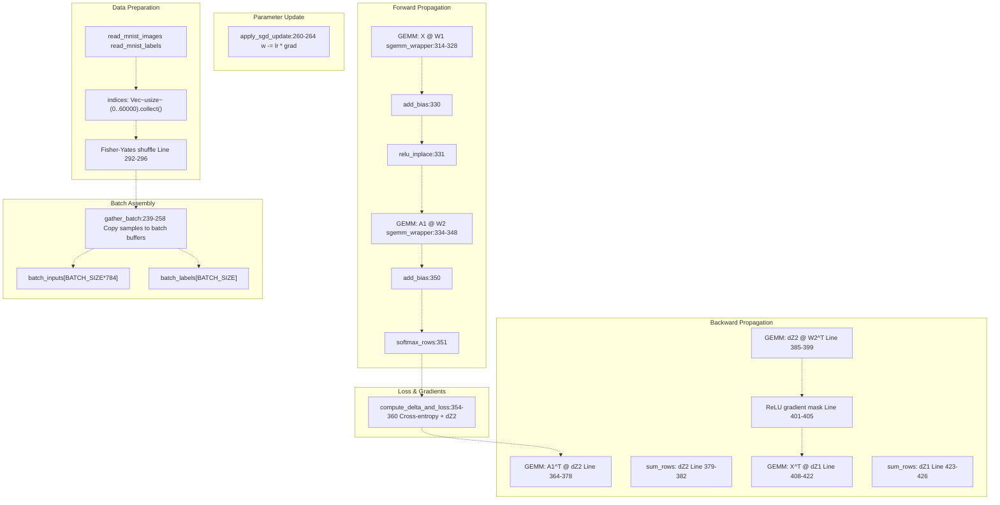

**Sources:** [mnist_mlp.rs L266-L447](https://github.com/ThalesMMS/Rust-Neural-Networks/blob/0e978f90/mnist_mlp.rs#L266-L447)

 [mnist_mlp.rs L239-L258](https://github.com/ThalesMMS/Rust-Neural-Networks/blob/0e978f90/mnist_mlp.rs#L239-L258)

 [mnist_mlp.rs L113-L157](https://github.com/ThalesMMS/Rust-Neural-Networks/blob/0e978f90/mnist_mlp.rs#L113-L157)

 [mnist_mlp.rs L209-L237](https://github.com/ThalesMMS/Rust-Neural-Networks/blob/0e978f90/mnist_mlp.rs#L209-L237)

 [mnist_mlp.rs L260-L264](https://github.com/ThalesMMS/Rust-Neural-Networks/blob/0e978f90/mnist_mlp.rs#L260-L264)

The training loop ([mnist_mlp.rs L266-L447](https://github.com/ThalesMMS/Rust-Neural-Networks/blob/0e978f90/mnist_mlp.rs#L266-L447)

) processes data in several phases:

1. **Shuffling** ([mnist_mlp.rs L292-L296](https://github.com/ThalesMMS/Rust-Neural-Networks/blob/0e978f90/mnist_mlp.rs#L292-L296) ): Fisher-Yates algorithm randomizes training order each epoch
2. **Batch gathering** ([mnist_mlp.rs L239-L258](https://github.com/ThalesMMS/Rust-Neural-Networks/blob/0e978f90/mnist_mlp.rs#L239-L258) ): Copies shuffled samples into contiguous batch buffers
3. **Forward pass**: Two GEMM operations with bias addition and activation
4. **Loss computation** ([mnist_mlp.rs L209-L237](https://github.com/ThalesMMS/Rust-Neural-Networks/blob/0e978f90/mnist_mlp.rs#L209-L237) ): Combines cross-entropy loss with gradient calculation
5. **Backward pass**: Four GEMM operations compute weight gradients and propagate errors
6. **SGD update** ([mnist_mlp.rs L260-L264](https://github.com/ThalesMMS/Rust-Neural-Networks/blob/0e978f90/mnist_mlp.rs#L260-L264) ): Applies learning rate scaled gradients to parameters

### Inference Data Flow

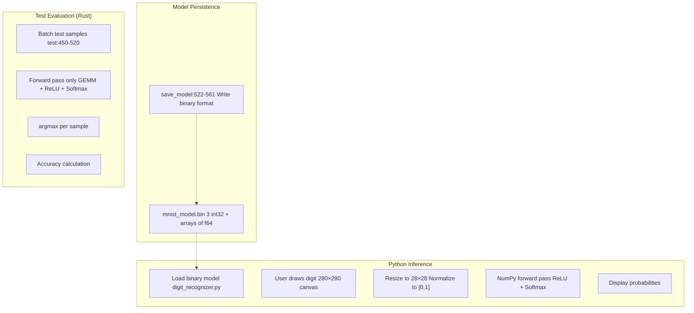

**Sources:** [mnist_mlp.rs L449-L520](https://github.com/ThalesMMS/Rust-Neural-Networks/blob/0e978f90/mnist_mlp.rs#L449-L520)

 [mnist_mlp.rs L522-L561](https://github.com/ThalesMMS/Rust-Neural-Networks/blob/0e978f90/mnist_mlp.rs#L522-L561)

 [digit_recognizer.py](https://github.com/ThalesMMS/Rust-Neural-Networks/blob/0e978f90/digit_recognizer.py)

**Rust Test Evaluation** ([mnist_mlp.rs L449-L520](https://github.com/ThalesMMS/Rust-Neural-Networks/blob/0e978f90/mnist_mlp.rs#L449-L520)

): Processes test set in batches, performing only forward propagation. Uses argmax to find predicted class and compares to ground truth labels.

**Model Saving** ([mnist_mlp.rs L522-L561](https://github.com/ThalesMMS/Rust-Neural-Networks/blob/0e978f90/mnist_mlp.rs#L522-L561)

): Serializes network to binary format:

* Three `i32` values: `input_size`, `hidden_size`, `output_size`
* Weight and bias arrays as `f64` (converted from `f32`)
* Native endianness for platform matching

**Python Inference**: The GUI tool loads the binary model, performs preprocessing, and runs forward propagation in NumPy, demonstrating language interoperability through file-based interfaces.

### Logging Architecture

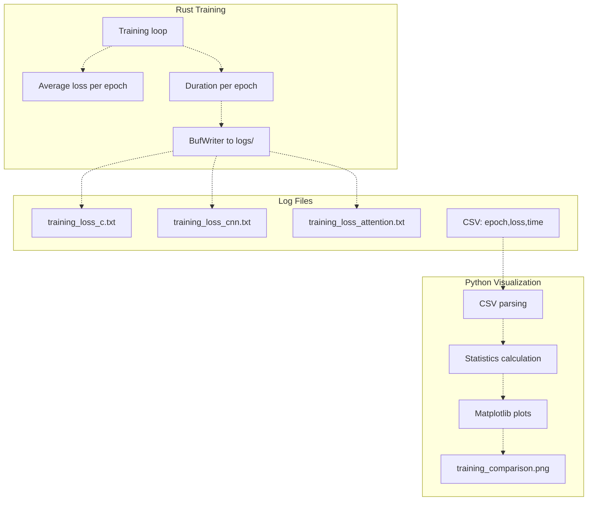

**Sources:** [mnist_mlp.rs L268-L272](https://github.com/ThalesMMS/Rust-Neural-Networks/blob/0e978f90/mnist_mlp.rs#L268-L272)

 [mnist_mlp.rs L442-L445](https://github.com/ThalesMMS/Rust-Neural-Networks/blob/0e978f90/mnist_mlp.rs#L442-L445)

 [plot_comparison.py](https://github.com/ThalesMMS/Rust-Neural-Networks/blob/0e978f90/plot_comparison.py)

Each training run creates a CSV file in `logs/` with epoch number, average loss, and epoch duration ([mnist_mlp.rs L442-L445](https://github.com/ThalesMMS/Rust-Neural-Networks/blob/0e978f90/mnist_mlp.rs#L442-L445)

). The Python visualization script reads these files and generates comparative plots showing loss curves, per-epoch timing, and cumulative training time.

---

## Build System Architecture

The build configuration optimizes for both performance and educational compilation:

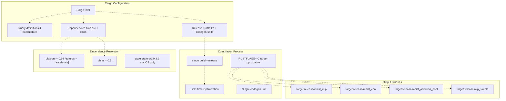

**Sources:** [Cargo.toml L1-L29](https://github.com/ThalesMMS/Rust-Neural-Networks/blob/0e978f90/Cargo.toml#L1-L29)

 [Cargo.lock L1-L77](https://github.com/ThalesMMS/Rust-Neural-Networks/blob/0e978f90/Cargo.lock#L1-L77)

 [README.md L98-L136](https://github.com/ThalesMMS/Rust-Neural-Networks/blob/0e978f90/README.md#L98-L136)

**Binary Targets** ([Cargo.toml L10-L24](https://github.com/ThalesMMS/Rust-Neural-Networks/blob/0e978f90/Cargo.toml#L10-L24)

): Each `[[bin]]` section defines a standalone executable with explicit path, enabling parallel compilation and independent execution.

**Release Profile** ([Cargo.toml L26-L28](https://github.com/ThalesMMS/Rust-Neural-Networks/blob/0e978f90/Cargo.toml#L26-L28)

):

* `lto = true`: Enables full link-time optimization, allowing inlining across crate boundaries
* `codegen-units = 1`: Forces single compilation unit for maximum optimization (slower compile, faster runtime)

**BLAS Backend** ([Cargo.toml L7](https://github.com/ThalesMMS/Rust-Neural-Networks/blob/0e978f90/Cargo.toml#L7-L7)

): The `features = ["accelerate"]` configuration compiles against macOS's Accelerate framework. For Linux/Windows, users must modify this to `["openblas"]` or other backends and install the corresponding native library.

**Performance Flags** ([README.md L132-L134](https://github.com/ThalesMMS/Rust-Neural-Networks/blob/0e978f90/README.md#L132-L134)

): The suggested `RUSTFLAGS="-C target-cpu=native"` enables CPU-specific SIMD instructions (AVX2, AVX-512 on x86; NEON on ARM), complementing the BLAS optimizations.

---

## Summary

The architecture achieves three primary goals:

1. **Performance**: BLAS integration, batch processing, and aggressive release optimizations deliver production-grade speed (3.33s for 10 epochs of MLP training)
2. **Education**: Multiple implementation strategies (BLAS vs. manual loops) and self-contained binaries demonstrate different approaches to neural network implementation
3. **Interoperability**: Language separation with file-based interfaces enables Rust for compute-intensive training and Python for visualization/interaction

The design avoids premature abstraction—each model is independently implemented, making the codebase easier to understand and modify for learning purposes while maintaining professional-grade performance characteristics.

Refresh this wiki

Last indexed: 5 January 2026 ([0e978f](https://github.com/ThalesMMS/Rust-Neural-Networks/commit/0e978f90))

### On this page

* [Architecture & Design](#5-architecture-design)
* [Purpose and Scope](#5-purpose-and-scope)
* [System Architecture Overview](#5-system-architecture-overview)
* [Multi-Binary Structure](#5-multi-binary-structure)
* [Language Separation Strategy](#5-language-separation-strategy)
* [Core Design Principles](#5-core-design-principles)
* [Performance-First Architecture](#5-performance-first-architecture)
* [Educational Clarity Through Explicit Implementations](#5-educational-clarity-through-explicit-implementations)
* [Reproducibility Architecture](#5-reproducibility-architecture)
* [Component Architecture](#5-component-architecture)
* [Neural Network Data Structures](#5-neural-network-data-structures)
* [Activation and Loss Functions](#5-activation-and-loss-functions)
* [Data Loading Infrastructure](#5-data-loading-infrastructure)
* [Code Organization Patterns](#5-code-organization-patterns)
* [Shared Structural Patterns](#5-shared-structural-patterns)
* [Divergent Implementation Strategies](#5-divergent-implementation-strategies)
* [Data Flow Architecture](#5-data-flow-architecture)
* [Training Data Flow](#5-training-data-flow)
* [Inference Data Flow](#5-inference-data-flow)
* [Logging Architecture](#5-logging-architecture)
* [Build System Architecture](#5-build-system-architecture)
* [Summary](#5-summary)

Ask Devin about Rust-Neural-Networks