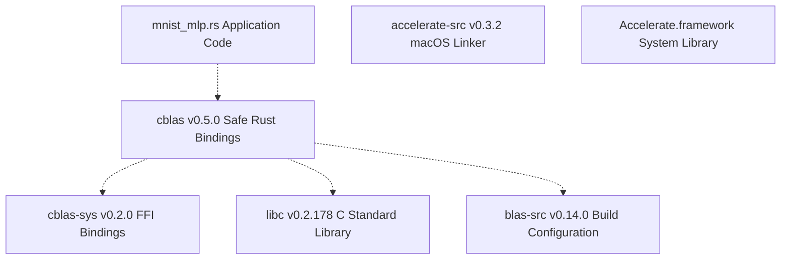
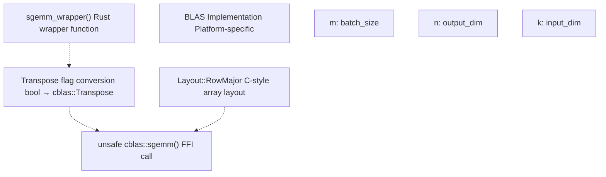
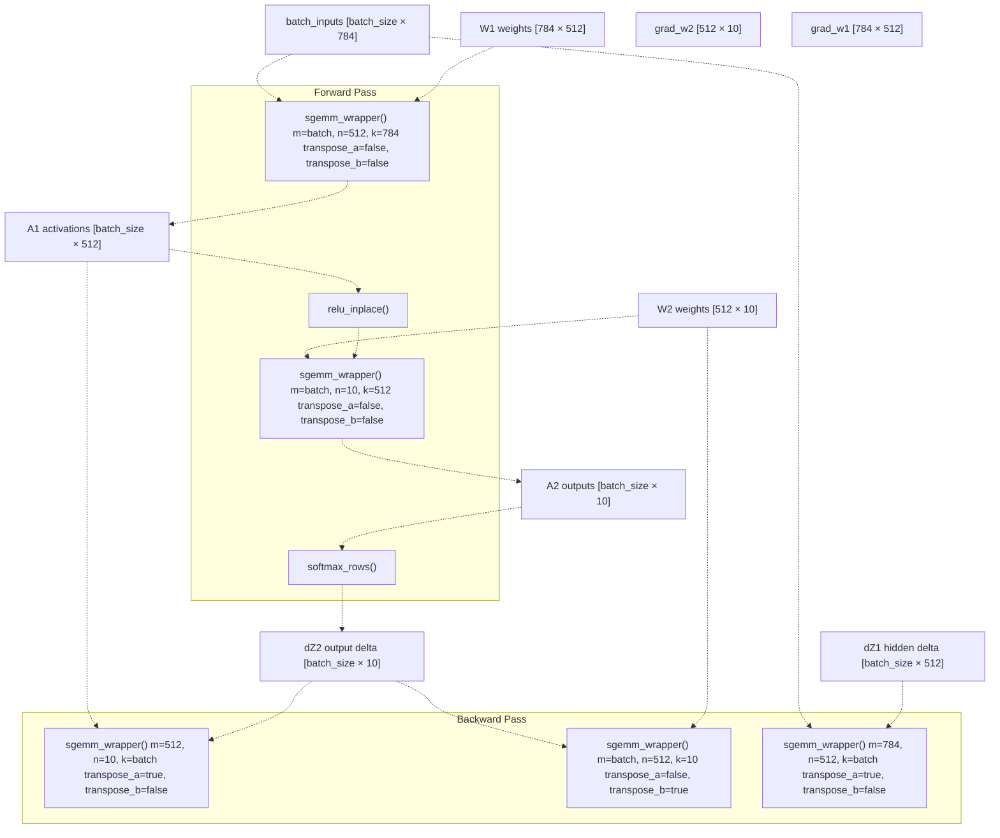
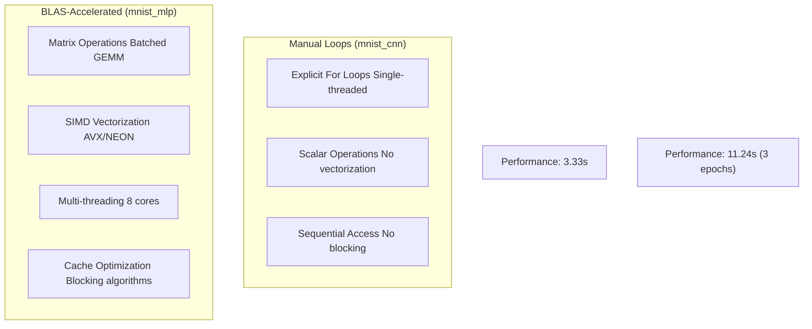

# BLAS Integration

> **Relevant source files**
> * [Cargo.lock](https://github.com/ThalesMMS/Rust-Neural-Networks/blob/0e978f90/Cargo.lock)
> * [Cargo.toml](https://github.com/ThalesMMS/Rust-Neural-Networks/blob/0e978f90/Cargo.toml)
> * [README.md](https://github.com/ThalesMMS/Rust-Neural-Networks/blob/0e978f90/README.md)
> * [mnist_mlp.rs](https://github.com/ThalesMMS/Rust-Neural-Networks/blob/0e978f90/mnist_mlp.rs)

## Purpose and Scope

This document explains how BLAS (Basic Linear Algebra Subprograms) is integrated into the Rust Neural Networks codebase to accelerate matrix operations. It covers the dependency configuration, the `sgemm` wrapper implementation, platform-specific backend selection (Accelerate on macOS, OpenBLAS on Linux/Windows), threading configuration, and performance implications.

Only the MNIST MLP implementation ([mnist_mlp.rs](https://github.com/ThalesMMS/Rust-Neural-Networks/blob/0e978f90/mnist_mlp.rs)

) uses BLAS acceleration. The CNN and Attention models use explicit loops for educational purposes. For details on these implementations, see [MNIST CNN](3b%20MNIST-CNN.md) and [MNIST Attention Model](3c%20MNIST-Attention-Model.md). For the overall training workflow, see [Training Pipeline](5b%20Training-Visualization.md).

**Sources**: README.md

 [Cargo.toml L1-L29](https://github.com/ThalesMMS/Rust-Neural-Networks/blob/0e978f90/Cargo.toml#L1-L29)

 [mnist_mlp.rs L1-L665](https://github.com/ThalesMMS/Rust-Neural-Networks/blob/0e978f90/mnist_mlp.rs#L1-L665)

## Overview

BLAS provides highly optimized implementations of linear algebra operations, particularly matrix multiplication (GEMM). The MNIST MLP implementation leverages BLAS to accelerate the forward and backward propagation passes, achieving significantly faster training times compared to naive implementations.

The integration uses two Rust crates:

* **`blas-src`**: Build-time configuration for selecting and linking BLAS backends
* **`cblas`**: Runtime interface providing safe Rust bindings to CBLAS functions

**Performance Impact**: The BLAS-accelerated MLP trains in 3.33 seconds compared to the manual-loop CNN's 11.24 seconds, despite processing similar data volumes.

**Sources**: README.md

 **Sources**: [Project overview and setup](https://github.com/ThalesMMS/Rust-Neural-Networks/blob/0e978f90/README.md#L142-L147)

 [Cargo.toml L6-L8](https://github.com/ThalesMMS/Rust-Neural-Networks/blob/0e978f90/Cargo.toml#L6-L8)

## Dependency Configuration

### Cargo.toml Dependencies

The project specifies BLAS dependencies with platform-specific feature flags:

```
[dependencies]blas-src = { version = "0.14", features = ["accelerate"] }cblas = "0.5"
```

The `accelerate` feature configures `blas-src` to use Apple's Accelerate framework on macOS. For Linux/Windows deployments, this feature should be removed and replaced with `openblas` or another backend.

**Sources**: [Cargo.toml L6-L8](https://github.com/ThalesMMS/Rust-Neural-Networks/blob/0e978f90/Cargo.toml#L6-L8)

### Dependency Resolution Chain



**Dependency Chain Analysis**:

1. **Application Layer**: `mnist_mlp.rs` imports `cblas` functions
2. **Safe Bindings**: `cblas` crate provides type-safe wrappers around raw FFI calls
3. **FFI Layer**: `cblas-sys` defines unsafe foreign function interfaces
4. **Build Configuration**: `blas-src` detects platform and configures linkage
5. **Platform Adapter**: `accelerate-src` links against Accelerate framework on macOS
6. **System Library**: Native BLAS implementation (Accelerate, OpenBLAS, MKL)

**Sources**: [Cargo.lock L1-L77](https://github.com/ThalesMMS/Rust-Neural-Networks/blob/0e978f90/Cargo.lock#L1-L77)

 [Cargo.toml L6-L8](https://github.com/ThalesMMS/Rust-Neural-Networks/blob/0e978f90/Cargo.toml#L6-L8)

## BLAS Operations: SGEMM Wrapper

### Function Signature

The core BLAS operation is `sgemm` (Single-precision GEneral Matrix Multiply). The codebase wraps it in a more ergonomic Rust function:

```
fn sgemm_wrapper(    m: usize,           // Rows in C    n: usize,           // Columns in C    k: usize,           // Inner dimension (columns of A, rows of B)    a: &[f32],          // Matrix A    lda: usize,         // Leading dimension of A    b: &[f32],          // Matrix B    ldb: usize,         // Leading dimension of B    c: &mut [f32],      // Output matrix C    ldc: usize,         // Leading dimension of C    transpose_a: bool,  // Whether to transpose A    transpose_b: bool,  // Whether to transpose B    alpha: f32,         // Scalar multiplier for A*B    beta: f32,          // Scalar multiplier for C)
```

The operation computes: **C := alpha * op(A) * op(B) + beta * C**

Where `op(X)` is either X or X^T depending on the transpose flag.

**Sources**: [mnist_mlp.rs L113-L157](https://github.com/ThalesMMS/Rust-Neural-Networks/blob/0e978f90/mnist_mlp.rs#L113-L157)

### Implementation Details



**Transpose Conversion** ([mnist_mlp.rs L128-L137](https://github.com/ThalesMMS/Rust-Neural-Networks/blob/0e978f90/mnist_mlp.rs#L128-L137)

):

```
let trans_a = if transpose_a {    Transpose::Ordinary} else {    Transpose::None};
```

**CBLAS Invocation** ([mnist_mlp.rs L139-L156](https://github.com/ThalesMMS/Rust-Neural-Networks/blob/0e978f90/mnist_mlp.rs#L139-L156)

):
The wrapper calls `cblas::sgemm` with:

* `Layout::RowMajor`: Indicates C-style row-major memory layout
* Transpose flags for A and B
* Matrix dimensions as `i32` (CBLAS interface requirement)
* Leading dimensions for proper stride calculations
* Alpha and beta scalars for fused multiply-add

**Sources**: [mnist_mlp.rs L113-L157](https://github.com/ThalesMMS/Rust-Neural-Networks/blob/0e978f90/mnist_mlp.rs#L113-L157)

## Usage in Training Pipeline

### Forward Pass

The forward pass uses BLAS for both hidden and output layer computations:

**Hidden Layer Forward** ([mnist_mlp.rs L314-L328](https://github.com/ThalesMMS/Rust-Neural-Networks/blob/0e978f90/mnist_mlp.rs#L314-L328)

):

```yaml
Operation: A1 = batch_inputs * W1
Parameters:
- m = batch_count (e.g., 64)
- n = NUM_HIDDEN (512)
- k = NUM_INPUTS (784)
- transpose_a = false
- transpose_b = false
```

**Output Layer Forward** ([mnist_mlp.rs L334-L348](https://github.com/ThalesMMS/Rust-Neural-Networks/blob/0e978f90/mnist_mlp.rs#L334-L348)

):

```yaml
Operation: A2 = A1 * W2
Parameters:
- m = batch_count (e.g., 64)
- n = NUM_OUTPUTS (10)
- k = NUM_HIDDEN (512)
- transpose_a = false
- transpose_b = false
```

**Sources**: [mnist_mlp.rs L314-L351](https://github.com/ThalesMMS/Rust-Neural-Networks/blob/0e978f90/mnist_mlp.rs#L314-L351)

### Backward Pass

The backward pass uses BLAS for gradient computation:

**Output Layer Gradients** ([mnist_mlp.rs L364-L378](https://github.com/ThalesMMS/Rust-Neural-Networks/blob/0e978f90/mnist_mlp.rs#L364-L378)

):

```yaml
Operation: grad_w2 = A1^T * dZ2
Parameters:
- m = NUM_HIDDEN (512)
- n = NUM_OUTPUTS (10)
- k = batch_count (e.g., 64)
- transpose_a = true   # Transpose A1
- transpose_b = false
- alpha = 1.0 / batch_count  # Averaging
```

**Hidden Layer Gradient** ([mnist_mlp.rs L385-L399](https://github.com/ThalesMMS/Rust-Neural-Networks/blob/0e978f90/mnist_mlp.rs#L385-L399)

):

```yaml
Operation: dZ1 = dZ2 * W2^T
Parameters:
- m = batch_count (e.g., 64)
- n = NUM_HIDDEN (512)
- k = NUM_OUTPUTS (10)
- transpose_a = false
- transpose_b = true   # Transpose W2
```

**Input Layer Gradients** ([mnist_mlp.rs L408-L422](https://github.com/ThalesMMS/Rust-Neural-Networks/blob/0e978f90/mnist_mlp.rs#L408-L422)

):

```yaml
Operation: grad_w1 = batch_inputs^T * dZ1
Parameters:
- m = NUM_INPUTS (784)
- n = NUM_HIDDEN (512)
- k = batch_count (e.g., 64)
- transpose_a = true   # Transpose inputs
- transpose_b = false
- alpha = 1.0 / batch_count  # Averaging
```

**Sources**: [mnist_mlp.rs L364-L427](https://github.com/ThalesMMS/Rust-Neural-Networks/blob/0e978f90/mnist_mlp.rs#L364-L427)

### BLAS Operation Flow



**Operation Summary**:

* **Forward**: 2 GEMM calls per batch (hidden layer, output layer)
* **Backward**: 3 GEMM calls per batch (output gradients, hidden delta, input gradients)
* **Total**: 5 GEMM operations per mini-batch iteration

**Sources**: [mnist_mlp.rs L314-L431](https://github.com/ThalesMMS/Rust-Neural-Networks/blob/0e978f90/mnist_mlp.rs#L314-L431)

## Platform-Specific BLAS Backends

### macOS: Accelerate Framework

On macOS, `blas-src` with the `accelerate` feature links against Apple's Accelerate framework, which provides:

* **Vectorized Operations**: Leverages SIMD instructions (NEON on Apple Silicon, AVX on Intel)
* **Multi-threading**: Automatic parallelization across CPU cores
* **Hardware Optimization**: Tuned for Apple hardware architectures

**Configuration** ([Cargo.toml L7](https://github.com/ThalesMMS/Rust-Neural-Networks/blob/0e978f90/Cargo.toml#L7-L7)

):

```
blas-src = { version = "0.14", features = ["accelerate"] }
```

**Threading Control**: The number of threads used by Accelerate can be controlled via the `VECLIB_MAXIMUM_THREADS` environment variable.

**Sources**: [Cargo.toml L6-L8](https://github.com/ThalesMMS/Rust-Neural-Networks/blob/0e978f90/Cargo.toml#L6-L8)

 README.md

### Linux/Windows: OpenBLAS or Intel MKL

For non-macOS platforms, the `accelerate` feature must be replaced with an alternative backend:

**OpenBLAS Configuration**:

```
blas-src = { version = "0.14", features = ["openblas"] }
```

**Intel MKL Configuration**:

```
blas-src = { version = "0.14", features = ["intel-mkl"] }
```

**Prerequisites**:

* OpenBLAS: Install system package (e.g., `libopenblas-dev` on Ubuntu)
* Intel MKL: Requires Intel Math Kernel Library installation

**Sources**: Project overview and setup

### Backend Selection Architecture


**Build-Time Selection**: The BLAS backend is selected at compile time via Cargo features. The `blas-src` crate examines feature flags and configures appropriate linker flags to bind against the selected library.

**Sources**: [Cargo.toml L6-L8](https://github.com/ThalesMMS/Rust-Neural-Networks/blob/0e978f90/Cargo.toml#L6-L8)

 [Cargo.lock L5-L24](https://github.com/ThalesMMS/Rust-Neural-Networks/blob/0e978f90/Cargo.lock#L5-L24)

 **Sources**: [Project overview and setup](https://github.com/ThalesMMS/Rust-Neural-Networks/blob/0e978f90/README.md#L136-L137)

## Threading Configuration

### VECLIB_MAXIMUM_THREADS

When using Accelerate on macOS, thread count is controlled via the `VECLIB_MAXIMUM_THREADS` environment variable:

```
VECLIB_MAXIMUM_THREADS=8 cargo run --release --bin mnist_mlp
```

**Behavior**:

* **Unset**: Defaults to all available CPU cores
* **Set to N**: Limits BLAS operations to N threads
* **Set to 1**: Forces single-threaded execution (useful for benchmarking)

**Performance Impact**: Higher thread counts generally improve performance for large matrix operations, but may introduce overhead for small batches due to synchronization costs.

**Sources**: Project overview and setup

### Performance Optimization Flags

The recommended compilation command combines BLAS threading with CPU-specific optimizations:

```
RUSTFLAGS="-C target-cpu=native" VECLIB_MAXIMUM_THREADS=8 cargo run --release --bin mnist_mlp
```

**Flag Explanation**:

* `RUSTFLAGS="-C target-cpu=native"`: Enables CPU-specific instruction sets (AVX2, AVX-512, NEON)
* `VECLIB_MAXIMUM_THREADS=8`: Limits Accelerate to 8 threads
* `--release`: Enables Rust compiler optimizations (LTO, codegen-units=1 per [Cargo.toml L26-L28](https://github.com/ThalesMMS/Rust-Neural-Networks/blob/0e978f90/Cargo.toml#L26-L28) )

**Sources**: Project overview and setup

 [Cargo.toml L26-L28](https://github.com/ThalesMMS/Rust-Neural-Networks/blob/0e978f90/Cargo.toml#L26-L28)

## Performance Impact

### Benchmark Comparison

| Implementation | BLAS Usage | Training Time (10 epochs) | Test Accuracy |
| --- | --- | --- | --- |
| MNIST MLP | **Yes** (SGEMM) | **3.33s** | 94.17% |
| MNIST CNN | No (explicit loops) | 11.24s (3 epochs) | 91.93% |

**Analysis**: The BLAS-accelerated MLP is approximately **3.4x faster per epoch** than the manual-loop CNN, despite similar computational complexity. This speedup comes from:

1. Batched matrix operations leveraging SIMD instructions
2. Multi-threaded execution across CPU cores
3. Cache-optimized memory access patterns
4. Vendor-tuned implementations (Accelerate, OpenBLAS)

**Sources**: Project overview and setup

### Computational Breakdown

For a single training batch (batch_size=64):

**Forward Pass**:

* Hidden layer: 64 × 784 × 512 = 26,214,400 FLOPs
* Output layer: 64 × 512 × 10 = 327,680 FLOPs
* Total forward: ~26.5 million FLOPs

**Backward Pass**:

* Output gradients: 512 × 10 × 64 = 327,680 FLOPs
* Hidden delta: 64 × 10 × 512 = 327,680 FLOPs
* Input gradients: 784 × 512 × 64 = 26,214,400 FLOPs
* Total backward: ~26.9 million FLOPs

**Training Dataset**: 60,000 samples / 64 batch_size = 937 batches per epoch

**Total FLOPs per Epoch**: (26.5M + 26.9M) × 937 ≈ 50 billion FLOPs

**Achievable Performance**: On modern CPUs with BLAS, the MLP achieves ~150-200 GFLOPS (gigaFLOPS), resulting in the observed 3.33s training time for 10 epochs.

**Sources**: [mnist_mlp.rs L10-L18](https://github.com/ThalesMMS/Rust-Neural-Networks/blob/0e978f90/mnist_mlp.rs#L10-L18)

 **Sources**: [Project overview and setup](https://github.com/ThalesMMS/Rust-Neural-Networks/blob/0e978f90/README.md#L142-L147)

### BLAS vs Manual Implementation



**Key Differences**:

1. **Batching**: BLAS processes entire batches in single GEMM calls; manual loops iterate sample-by-sample
2. **Vectorization**: BLAS uses SIMD instructions; manual code uses scalar operations
3. **Threading**: BLAS parallelizes across cores; manual code is single-threaded
4. **Cache Efficiency**: BLAS uses cache-blocking algorithms; manual code has poor locality

**Sources**: [mnist_mlp.rs L1-L665](https://github.com/ThalesMMS/Rust-Neural-Networks/blob/0e978f90/mnist_mlp.rs#L1-L665)

 **Sources**: [Project overview and setup](https://github.com/ThalesMMS/Rust-Neural-Networks/blob/0e978f90/README.md#L142-L147)

## External BLAS Declaration

The BLAS integration requires an external crate declaration at the top of [mnist_mlp.rs L1](https://github.com/ThalesMMS/Rust-Neural-Networks/blob/0e978f90/mnist_mlp.rs#L1-L1)

:

```
extern crate blas_src;
```

This declaration is necessary to ensure the `blas-src` crate is linked even though it provides no Rust API—it exists purely to configure linker flags at build time.

**Sources**: [mnist_mlp.rs L1](https://github.com/ThalesMMS/Rust-Neural-Networks/blob/0e978f90/mnist_mlp.rs#L1-L1)

## Summary

The BLAS integration provides critical performance acceleration for the MNIST MLP implementation through:

1. **Optimized Matrix Multiplication**: `sgemm` operations replace naive triple-nested loops
2. **Platform-Specific Backends**: Accelerate on macOS, OpenBLAS/MKL on Linux/Windows
3. **Hardware Utilization**: SIMD instructions and multi-threading leverage modern CPU capabilities
4. **Clean Rust Interface**: Safe `cblas` bindings abstract unsafe FFI calls
5. **Configurable Threading**: `VECLIB_MAXIMUM_THREADS` provides runtime control

The result is a **3.4x speedup** compared to manual implementations, achieving ~150-200 GFLOPS on modern hardware and training the full MNIST MLP in 3.33 seconds.

**Sources**: [mnist_mlp.rs L1-L665](https://github.com/ThalesMMS/Rust-Neural-Networks/blob/0e978f90/mnist_mlp.rs#L1-L665)

 [Cargo.toml L1-L29](https://github.com/ThalesMMS/Rust-Neural-Networks/blob/0e978f90/Cargo.toml#L1-L29)

 README.md


)

### On this page

* [BLAS Integration](#5.1-blas-integration)
* [Purpose and Scope](#5.1-purpose-and-scope)
* [Overview](#5.1-overview)
* [Dependency Configuration](#5.1-dependency-configuration)
* [Cargo.toml Dependencies](#5.1-cargotoml-dependencies)
* [Dependency Resolution Chain](#5.1-dependency-resolution-chain)
* [BLAS Operations: SGEMM Wrapper](#5.1-blas-operations-sgemm-wrapper)
* [Function Signature](#5.1-function-signature)
* [Implementation Details](#5.1-implementation-details)
* [Usage in Training Pipeline](#5.1-usage-in-training-pipeline)
* [Forward Pass](#5.1-forward-pass)
* [Backward Pass](#5.1-backward-pass)
* [BLAS Operation Flow](#5.1-blas-operation-flow)
* [Platform-Specific BLAS Backends](#5.1-platform-specific-blas-backends)
* [macOS: Accelerate Framework](#5.1-macos-accelerate-framework)
* [Linux/Windows: OpenBLAS or Intel MKL](#5.1-linuxwindows-openblas-or-intel-mkl)
* [Backend Selection Architecture](#5.1-backend-selection-architecture)
* [Threading Configuration](#5.1-threading-configuration)
* [VECLIB_MAXIMUM_THREADS](#5.1-veclib_maximum_threads)
* [Performance Optimization Flags](#5.1-performance-optimization-flags)
* [Performance Impact](#5.1-performance-impact)
* [Benchmark Comparison](#5.1-benchmark-comparison)
* [Computational Breakdown](#5.1-computational-breakdown)
* [BLAS vs Manual Implementation](#5.1-blas-vs-manual-implementation)
* [External BLAS Declaration](#5.1-external-blas-declaration)
* [Summary](#5.1-summary)

Ask Devin about Rust-Neural-Networks