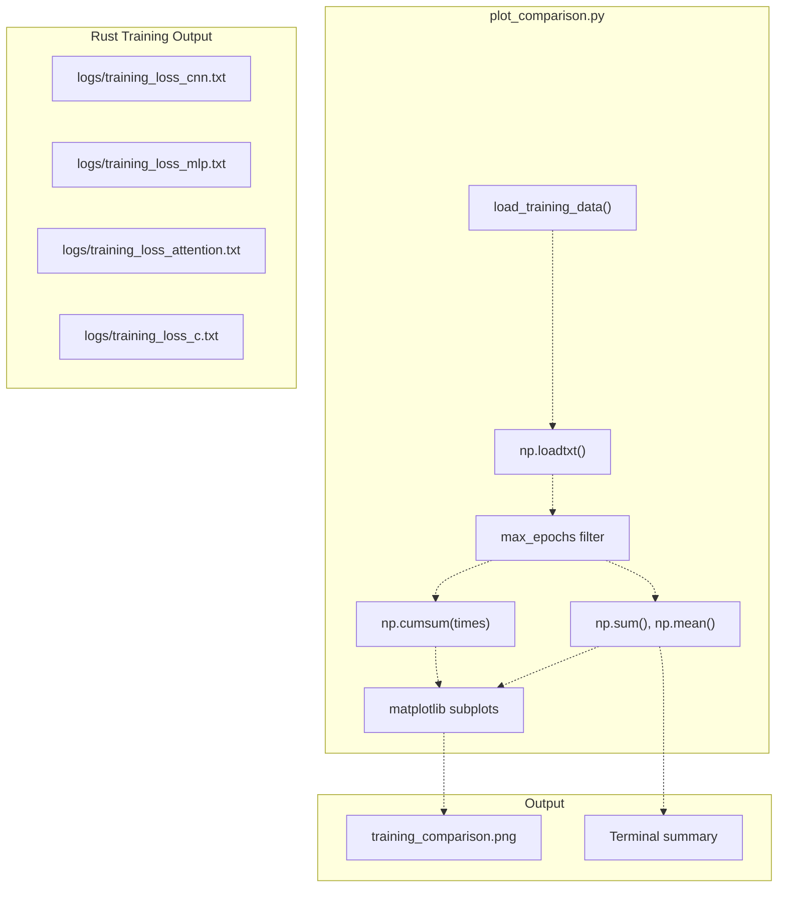
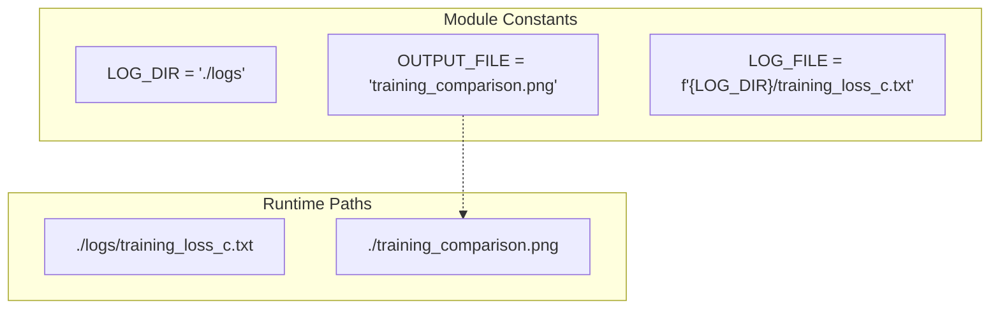
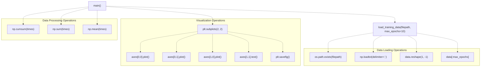
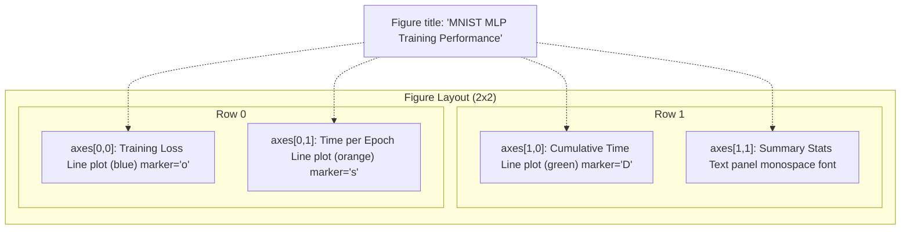
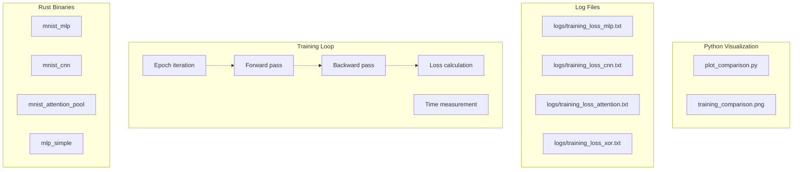

# Training Visualization

> **Relevant source files**
> * [README.md](https://github.com/ThalesMMS/Rust-Neural-Networks/blob/0e978f90/README.md)
> * [plot_comparison.py](https://github.com/ThalesMMS/Rust-Neural-Networks/blob/0e978f90/plot_comparison.py)
> * [requirements.txt](https://github.com/ThalesMMS/Rust-Neural-Networks/blob/0e978f90/requirements.txt)

This page documents the `plot_comparison.py` script, which reads training log files generated by Rust model implementations and produces visual analysis of training performance. The script generates multi-panel plots showing loss curves, per-epoch timing, cumulative training time, and summary statistics.

For interactive model inference with a GUI, see [Digit Recognizer GUI](4a%20Digit-Recognizer-GUI.md). For details on how training logs are generated during model training, see [Training Pipeline](#5.2).

---

## Purpose and Functionality

The `plot_comparison.py` script serves as a post-training analysis tool that visualizes training metrics logged by the Rust neural network implementations. It reads CSV-formatted log files from the `logs/` directory and generates a comprehensive visualization with four panels: training loss curve, per-epoch time, cumulative time, and summary statistics.

**Sources**: Project overview and setup

 [plot_comparison.py L1-L5](https://github.com/ThalesMMS/Rust-Neural-Networks/blob/0e978f90/plot_comparison.py#L1-L5)

---

## Data Flow Architecture

The visualization pipeline processes training logs through a series of transformations before generating output images.

### End-to-End Pipeline



**Sources**: [plot_comparison.py L18-L43](https://github.com/ThalesMMS/Rust-Neural-Networks/blob/0e978f90/plot_comparison.py#L18-L43)

 [plot_comparison.py L45-L116](https://github.com/ThalesMMS/Rust-Neural-Networks/blob/0e978f90/plot_comparison.py#L45-L116)

---

## Log File Format

Training logs are CSV files with three comma-separated columns per line. Each line represents one training epoch.

### CSV Structure

| Column Index | Field Name | Data Type | Description |
| --- | --- | --- | --- |
| 0 | `epoch` | Integer | Epoch number (1-indexed) |
| 1 | `loss` | Float | Average training loss for the epoch |
| 2 | `time` | Float | Wall-clock time in seconds for the epoch |

**Example log file content**:

```
1,2.301456,0.335
2,1.987234,0.328
3,1.654321,0.331
```

The script reads logs using `np.loadtxt(filepath, delimiter=',')` and handles both single-epoch and multi-epoch files by reshaping data when necessary.

**Sources**: [plot_comparison.py L18-L43](https://github.com/ThalesMMS/Rust-Neural-Networks/blob/0e978f90/plot_comparison.py#L18-L43)

---

## Configuration and File Selection

The script is configured via module-level constants at the top of the file.

### Configuration Constants



| Constant | Default Value | Purpose |
| --- | --- | --- |
| `LOG_DIR` | `"./logs"` | Directory containing training log files |
| `OUTPUT_FILE` | `"training_comparison.png"` | Output filename for generated plot |
| `LOG_FILE` | `"./logs/training_loss_c.txt"` | Specific log file to visualize |

The script currently hardcodes `training_loss_c.txt` as the target log file. To visualize different models, modify line 16 to point to the desired log file (e.g., `training_loss_mlp.txt`, `training_loss_cnn.txt`).

**Sources**: [plot_comparison.py L11-L16](https://github.com/ThalesMMS/Rust-Neural-Networks/blob/0e978f90/plot_comparison.py#L11-L16)

---

## Function Reference

The script uses two main functions to process and visualize training data.

### Function Mapping to Code



### load_training_data(filepath, max_epochs=10)

Located at [plot_comparison.py L18-L43](https://github.com/ThalesMMS/Rust-Neural-Networks/blob/0e978f90/plot_comparison.py#L18-L43)

 this function loads and parses CSV training logs.

**Parameters**:

* `filepath` (str): Path to the CSV log file
* `max_epochs` (int): Maximum number of epochs to load (default: 10)

**Returns**: Tuple of `(epochs, losses, times)` or `(None, None, None)` on error

**Logic**:

1. Checks file existence with `os.path.exists()`
2. Loads CSV data with `np.loadtxt(filepath, delimiter=',')`
3. Reshapes single-epoch data from 1D to 2D: `data.reshape(1, -1)`
4. Truncates to `max_epochs`: `data[:max_epochs]`
5. Extracts columns: epochs (col 0), losses (col 1), times (col 2)

**Sources**: [plot_comparison.py L18-L43](https://github.com/ThalesMMS/Rust-Neural-Networks/blob/0e978f90/plot_comparison.py#L18-L43)

### main()

Located at [plot_comparison.py L45-L119](https://github.com/ThalesMMS/Rust-Neural-Networks/blob/0e978f90/plot_comparison.py#L45-L119)

 this function orchestrates the complete visualization pipeline.

**Workflow**:

1. Loads training data via `load_training_data(LOG_FILE)`
2. Computes cumulative time: `np.cumsum(times)`
3. Creates 2x2 subplot grid: `plt.subplots(2, 2, figsize=(12, 10))`
4. Populates four panels (described below)
5. Prints summary statistics to terminal
6. Saves figure to `training_comparison.png` at 300 DPI
7. Displays interactive plot with `plt.show()`

**Sources**: [plot_comparison.py L45-L119](https://github.com/ThalesMMS/Rust-Neural-Networks/blob/0e978f90/plot_comparison.py#L45-L119)

---

## Visualization Components

The script generates a 2x2 grid of visualizations analyzing different aspects of training performance.

### Subplot Layout



### Panel 1: Training Loss (axes[0,0])

Displays the training loss trajectory across epochs.

* **Data source**: `losses` array from log file
* **Plot type**: Line plot with circular markers
* **Style**: Blue line (`#1f77b4`), marker size 6, linewidth 2
* **Axes**: X = epoch number, Y = loss value
* **Code location**: [plot_comparison.py L60-L65](https://github.com/ThalesMMS/Rust-Neural-Networks/blob/0e978f90/plot_comparison.py#L60-L65)

### Panel 2: Time per Epoch (axes[0,1])

Shows the wall-clock time required for each training epoch.

* **Data source**: `times` array from log file
* **Plot type**: Line plot with square markers
* **Style**: Orange line (`#ff7f0e`), marker size 6, linewidth 2
* **Axes**: X = epoch number, Y = time in seconds
* **Code location**: [plot_comparison.py L68-L73](https://github.com/ThalesMMS/Rust-Neural-Networks/blob/0e978f90/plot_comparison.py#L68-L73)

### Panel 3: Cumulative Training Time (axes[1,0])

Displays the total accumulated training time up to each epoch.

* **Data source**: `np.cumsum(times)` - cumulative sum of per-epoch times
* **Plot type**: Line plot with diamond markers
* **Style**: Green line (`#2ca02c`), marker size 6, linewidth 2
* **Axes**: X = epoch number, Y = cumulative seconds
* **Code location**: [plot_comparison.py L76-L81](https://github.com/ThalesMMS/Rust-Neural-Networks/blob/0e978f90/plot_comparison.py#L76-L81)

### Panel 4: Summary Statistics (axes[1,1])

Presents aggregate training metrics as formatted text.

* **Metrics displayed**: * Total Time: `np.sum(times)` formatted to 2 decimal places * Average Time/Epoch: `np.mean(times)` formatted to 2 decimal places * Final Loss: `losses[-1]` formatted to 6 decimal places * Epochs: `len(epochs)` (total epoch count)
* **Presentation**: Centered monospace text with light gray rounded box
* **Code location**: [plot_comparison.py L84-L100](https://github.com/ThalesMMS/Rust-Neural-Networks/blob/0e978f90/plot_comparison.py#L84-L100)

**Sources**: [plot_comparison.py L56-L100](https://github.com/ThalesMMS/Rust-Neural-Networks/blob/0e978f90/plot_comparison.py#L56-L100)

---

## Output Files and Terminal Output

The script produces both visual and textual output.

### Generated Files

| File | Format | Resolution | Location | Purpose |
| --- | --- | --- | --- | --- |
| `training_comparison.png` | PNG | 300 DPI | Current directory | High-resolution plot for reports |

The output filename is controlled by the `OUTPUT_FILE` constant ([plot_comparison.py L13](https://github.com/ThalesMMS/Rust-Neural-Networks/blob/0e978f90/plot_comparison.py#L13-L13)

). The figure is saved with `bbox_inches='tight'` to minimize whitespace ([plot_comparison.py L114](https://github.com/ThalesMMS/Rust-Neural-Networks/blob/0e978f90/plot_comparison.py#L114-L114)

).

### Terminal Output

The script prints a formatted summary to standard output:

```
==================================================
TRAINING SUMMARY
==================================================
Total Training Time: 3.33 seconds
Average Time/Epoch:  0.33 seconds
Final Loss:          0.123456
==================================================

✓ Graph saved to: training_comparison.png
```

This output is generated at [plot_comparison.py L104-L115](https://github.com/ThalesMMS/Rust-Neural-Networks/blob/0e978f90/plot_comparison.py#L104-L115)

**Sources**: [plot_comparison.py L102-L116](https://github.com/ThalesMMS/Rust-Neural-Networks/blob/0e978f90/plot_comparison.py#L102-L116)

---

## Usage Instructions

### Basic Execution

Run the script from the repository root directory:

```
python plot_comparison.py
```

This command assumes:

1. Training logs exist in `./logs/training_loss_c.txt`
2. Python dependencies are installed (`numpy`, `matplotlib`)

### Installation of Dependencies

Install required Python packages via pip:

```
pip install -r requirements.txt
```

The `requirements.txt` file specifies `numpy` and `matplotlib` as dependencies ([requirements.txt L1-L2](https://github.com/ThalesMMS/Rust-Neural-Networks/blob/0e978f90/requirements.txt#L1-L2)

).

### Visualizing Different Models

To visualize logs from different model implementations, modify line 16 in `plot_comparison.py`:

| Model | Log File |
| --- | --- |
| MNIST MLP | `training_loss_mlp.txt` |
| MNIST CNN | `training_loss_cnn.txt` |
| MNIST Attention | `training_loss_attention.txt` |
| XOR MLP | `training_loss_xor.txt` |

**Example modification**:

```
LOG_FILE = f"{LOG_DIR}/training_loss_mlp.txt"
```

**Sources**: Project overview and setup

 [plot_comparison.py L16](https://github.com/ThalesMMS/Rust-Neural-Networks/blob/0e978f90/plot_comparison.py#L16-L16)

---

## Integration with Rust Training Pipeline

The visualization script consumes log files written by Rust model implementations during training. Each Rust binary writes epoch-level metrics to CSV files in the `logs/` directory.

### Log File Generation Flow



Each training binary appends a new line to its log file after completing an epoch, recording the epoch number, average loss, and elapsed time. The CSV format enables language-agnostic data exchange between Rust training code and Python analysis tools.

**Sources**: README.md

 **Sources**: [Project overview and setup](https://github.com/ThalesMMS/Rust-Neural-Networks/blob/0e978f90/README.md#L142-L148)


)

### On this page

* [Training Visualization](4b%20Training-Pipeline.md)
* [Purpose and Functionality](4b%20Training-Pipeline.md)
* [Data Flow Architecture](4b%20Training-Pipeline.md)
* [End-to-End Pipeline](4b%20Training-Pipeline.md)
* [Log File Format](4b%20Training-Pipeline.md)
* [CSV Structure](4b%20Training-Pipeline.md)
* [Configuration and File Selection](4b%20Training-Pipeline.md)
* [Configuration Constants](4b%20Training-Pipeline.md)
* [Function Reference](4b%20Training-Pipeline.md)
* [Function Mapping to Code](4b%20Training-Pipeline.md)
* [load_training_data(filepath, max_epochs=10)](4b%20Training-Pipeline.md)
* [main()](4b%20Training-Pipeline.md)
* [Visualization Components](4b%20Training-Pipeline.md)
* [Subplot Layout](4b%20Training-Pipeline.md)
* [Panel 1: Training Loss (axes[0,0])](#4.2-panel-1-training-loss-axes00)
* [Panel 2: Time per Epoch (axes[0,1])](#4.2-panel-2-time-per-epoch-axes01)
* [Panel 3: Cumulative Training Time (axes[1,0])](#4.2-panel-3-cumulative-training-time-axes10)
* [Panel 4: Summary Statistics (axes[1,1])](#4.2-panel-4-summary-statistics-axes11)
* [Output Files and Terminal Output](4b%20Training-Pipeline.md)
* [Generated Files](4b%20Training-Pipeline.md)
* [Terminal Output](4b%20Training-Pipeline.md)
* [Usage Instructions](4b%20Training-Pipeline.md)
* [Basic Execution](4b%20Training-Pipeline.md)
* [Installation of Dependencies](4b%20Training-Pipeline.md)
* [Visualizing Different Models](4b%20Training-Pipeline.md)
* [Integration with Rust Training Pipeline](4b%20Training-Pipeline.md)
* [Log File Generation Flow](4b%20Training-Pipeline.md)

Ask Devin about Rust-Neural-Networks