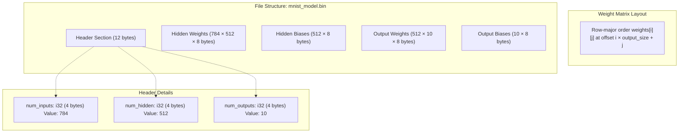
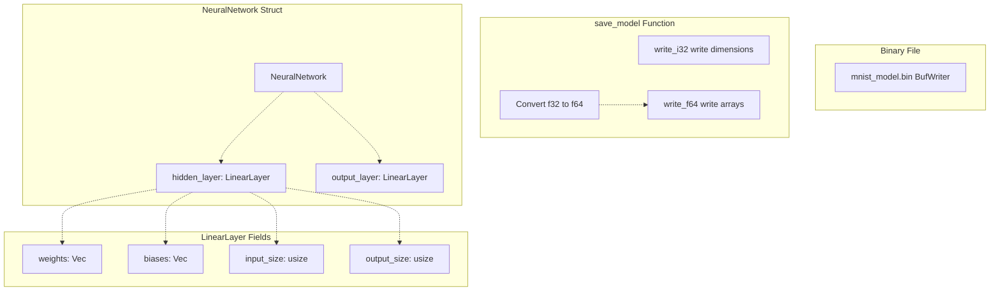
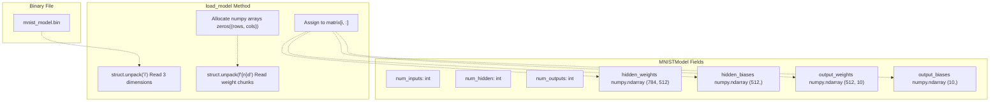
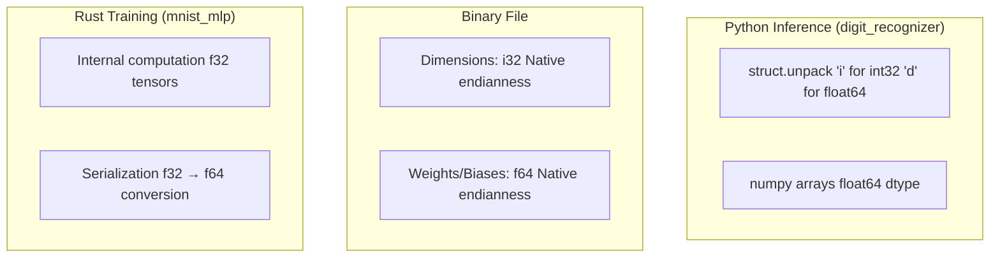

# Binary Model Format

> **Relevant source files**
> * [README.md](https://github.com/ThalesMMS/Rust-Neural-Networks/blob/0e978f90/README.md)
> * [digit_recognizer.py](https://github.com/ThalesMMS/Rust-Neural-Networks/blob/0e978f90/digit_recognizer.py)
> * [mnist_mlp.rs](https://github.com/ThalesMMS/Rust-Neural-Networks/blob/0e978f90/mnist_mlp.rs)
> * [mnist_model.bin](https://github.com/ThalesMMS/Rust-Neural-Networks/blob/0e978f90/mnist_model.bin)

## Purpose and Scope

This document specifies the custom binary format used to serialize trained Multi-Layer Perceptron (MLP) models from Rust and deserialize them in Python utilities. The format enables the `mnist_mlp` implementation to persist trained weights and biases to disk, which can then be loaded by the `digit_recognizer.py` GUI for interactive inference.

For information about the training process that produces these models, see [Training Pipeline](4b%20Training-Pipeline.md). For details on how the Python GUI uses loaded models, see [Digit Recognizer GUI](4a%20Digit-Recognizer-GUI.md).

**Sources:** README.md

 [mnist_mlp.rs L522-L561](https://github.com/ThalesMMS/Rust-Neural-Networks/blob/0e978f90/mnist_mlp.rs#L522-L561)

 [digit_recognizer.py L28-L58](https://github.com/ThalesMMS/Rust-Neural-Networks/blob/0e978f90/digit_recognizer.py#L28-L58)

---

## Format Overview

The binary model format is a simple sequential structure that stores the architecture dimensions followed by all weights and biases in row-major order. The design is inspired by the mlp.c reference implementation and prioritizes simplicity over extensibility.

### Key Characteristics

| Property | Value |
| --- | --- |
| **Byte Order** | Native endianness (platform-dependent) |
| **Integer Type** | 32-bit signed integer (`i32` in Rust, `i` in Python struct) |
| **Float Type** | 64-bit double precision (`f64` in Rust, `d` in Python struct) |
| **Architecture Support** | MLP only (single hidden layer, 784→512→10) |
| **File Extension** | `.bin` (e.g., `mnist_model.bin`) |
| **Versioning** | None (no magic number or version header) |

**Sources:** [mnist_mlp.rs L522-L561](https://github.com/ThalesMMS/Rust-Neural-Networks/blob/0e978f90/mnist_mlp.rs#L522-L561)

 [digit_recognizer.py L28-L58](https://github.com/ThalesMMS/Rust-Neural-Networks/blob/0e978f90/digit_recognizer.py#L28-L58)

---

## Binary File Structure

The following diagram illustrates the complete byte-level structure of the binary model file:



**Detailed Layout:**

| Offset | Size | Field | Type | Description |
| --- | --- | --- | --- | --- |
| 0 | 4 bytes | `num_inputs` | `i32` | Input layer size (784 for MNIST) |
| 4 | 4 bytes | `num_hidden` | `i32` | Hidden layer size (512) |
| 8 | 4 bytes | `num_outputs` | `i32` | Output layer size (10) |
| 12 | 784×512×8 | `hidden_weights` | `[f64]` | Hidden layer weights (input×hidden) |
| 3,211,276 | 512×8 | `hidden_biases` | `[f64]` | Hidden layer biases |
| 3,215,372 | 512×10×8 | `output_weights` | `[f64]` | Output layer weights (hidden×output) |
| 3,256,332 | 10×8 | `output_biases` | `[f64]` | Output layer biases |

**Total file size:** 3,256,412 bytes (~3.1 MB)

**Sources:** [mnist_mlp.rs L543-L558](https://github.com/ThalesMMS/Rust-Neural-Networks/blob/0e978f90/mnist_mlp.rs#L543-L558)

 [digit_recognizer.py L31-L56](https://github.com/ThalesMMS/Rust-Neural-Networks/blob/0e978f90/digit_recognizer.py#L31-L56)

---

## Serialization in Rust

The `save_model` function in `mnist_mlp.rs` implements the serialization logic, converting the in-memory neural network representation to the binary format.

### Serialization Flow



### Implementation Details

The [mnist_mlp.rs L522-L561](https://github.com/ThalesMMS/Rust-Neural-Networks/blob/0e978f90/mnist_mlp.rs#L522-L561)

 `save_model` function performs the following steps:

1. **File Creation:** Opens `mnist_model.bin` using `BufWriter` for efficient I/O
2. **Dimension Writing:** Writes three `i32` values using `.to_ne_bytes()`: * `nn.hidden_layer.input_size` (784) * `nn.hidden_layer.output_size` (512) * `nn.output_layer.output_size` (10)
3. **Data Type Conversion:** Converts internal `f32` values to `f64` for storage
4. **Weight and Bias Writing:** Writes arrays sequentially as `f64` values

**Key Code Constructs:**

```css
// Helper closures defined at <FileRef file-url="https://github.com/ThalesMMS/Rust-Neural-Networks/blob/0e978f90/mnist_mlp.rs#L530-L541" min=530 max=541 file-path="mnist_mlp.rs">Hii</FileRef>let write_i32 = |writer: &mut BufWriter<File>, value: i32| { ... };let write_f64 = |writer: &mut BufWriter<File>, value: f64| { ... };// Dimension writing <FileRef file-url="https://github.com/ThalesMMS/Rust-Neural-Networks/blob/0e978f90/mnist_mlp.rs#L543-L545" min=543 max=545 file-path="mnist_mlp.rs">Hii</FileRef>write_i32(&mut writer, nn.hidden_layer.input_size as i32);write_i32(&mut writer, nn.hidden_layer.output_size as i32);write_i32(&mut writer, nn.output_layer.output_size as i32);// Weight conversion and writing <FileRef file-url="https://github.com/ThalesMMS/Rust-Neural-Networks/blob/0e978f90/mnist_mlp.rs#L547-L558" min=547 max=558 file-path="mnist_mlp.rs">Hii</FileRef>for value in &nn.hidden_layer.weights {    write_f64(&mut writer, *value as f64);  // f32 → f64 conversion}
```

**Sources:** [mnist_mlp.rs L522-L561](https://github.com/ThalesMMS/Rust-Neural-Networks/blob/0e978f90/mnist_mlp.rs#L522-L561)

---

## Deserialization in Python

The `MNISTModel.load_model` method in `digit_recognizer.py` implements the deserialization logic, reconstructing the neural network from the binary file.

### Deserialization Flow



### Implementation Details

The [digit_recognizer.py L28-L58](https://github.com/ThalesMMS/Rust-Neural-Networks/blob/0e978f90/digit_recognizer.py#L28-L58)

 `load_model` method performs the following steps:

1. **Dimension Reading:** Reads three `i32` values using `struct.unpack('i', f.read(4))`
2. **Array Allocation:** Creates zero-initialized numpy arrays with correct shapes
3. **Row-by-Row Reading:** Reads weight matrices one row at a time
4. **Direct Assignment:** Assigns unpacked data to numpy array slices

**Key Code Constructs:**

```css
# Dimension reading <FileRef file-url="https://github.com/ThalesMMS/Rust-Neural-Networks/blob/0e978f90/digit_recognizer.py#L32-L34" min=32 max=34 file-path="digit_recognizer.py">Hii</FileRef>self.num_inputs = struct.unpack('i', f.read(4))[0]self.num_hidden = struct.unpack('i', f.read(4))[0]self.num_outputs = struct.unpack('i', f.read(4))[0]# Weight matrix reading <FileRef file-url="https://github.com/ThalesMMS/Rust-Neural-Networks/blob/0e978f90/digit_recognizer.py#L38-L42" min=38 max=42 file-path="digit_recognizer.py">Hii</FileRef>self.hidden_weights = np.zeros((self.num_inputs, self.num_hidden))for i in range(self.num_inputs):    weights_data = f.read(8 * self.num_hidden)    self.hidden_weights[i, :] = struct.unpack(f'{self.num_hidden}d', weights_data)
```

**Sources:** [digit_recognizer.py L28-L58](https://github.com/ThalesMMS/Rust-Neural-Networks/blob/0e978f90/digit_recognizer.py#L28-L58)

---

## Data Type Conversions

The format involves several data type conversions between Rust training and Python inference:



### Conversion Summary

| Stage | Language | Type | Precision | Notes |
| --- | --- | --- | --- | --- |
| Training | Rust | `f32` | Single | Internal computation [mnist_mlp.rs L10-L18](https://github.com/ThalesMMS/Rust-Neural-Networks/blob/0e978f90/mnist_mlp.rs#L10-L18) |
| Serialization | Rust | `f64` | Double | Cast during write [mnist_mlp.rs L548](https://github.com/ThalesMMS/Rust-Neural-Networks/blob/0e978f90/mnist_mlp.rs#L548-L548) |
| File Storage | Binary | `f64` | Double | 8 bytes per value |
| Deserialization | Python | `float64` | Double | numpy default [digit_recognizer.py L42](https://github.com/ThalesMMS/Rust-Neural-Networks/blob/0e978f90/digit_recognizer.py#L42-L42) |
| Inference | Python | `float64` | Double | No precision loss |

**Rationale for f32 → f64 Conversion:**

The Rust implementation uses `f32` during training for:

* BLAS compatibility (SGEMM operates on single precision)
* Memory efficiency (50% reduction vs. double precision)
* Sufficient precision for MNIST classification

The serialization converts to `f64` to:

* Match Python's default numpy precision
* Prevent potential precision loss across platform boundaries
* Maintain compatibility with the mlp.c reference implementation

**Sources:** [mnist_mlp.rs L10-L18](https://github.com/ThalesMMS/Rust-Neural-Networks/blob/0e978f90/mnist_mlp.rs#L10-L18)

 [mnist_mlp.rs L547-L558](https://github.com/ThalesMMS/Rust-Neural-Networks/blob/0e978f90/mnist_mlp.rs#L547-L558)

 [digit_recognizer.py L39-L56](https://github.com/ThalesMMS/Rust-Neural-Networks/blob/0e978f90/digit_recognizer.py#L39-L56)

---

## Platform Considerations

### Endianness

The format uses **native endianness** via Rust's `.to_ne_bytes()` method [mnist_mlp.rs L531](https://github.com/ThalesMMS/Rust-Neural-Networks/blob/0e978f90/mnist_mlp.rs#L531-L531)

 and Python's `struct.unpack()` default behavior [digit_recognizer.py L32](https://github.com/ThalesMMS/Rust-Neural-Networks/blob/0e978f90/digit_recognizer.py#L32-L32)

 This means:

| Platform | Byte Order | Compatibility |
| --- | --- | --- |
| x86/x86_64 (Intel/AMD) | Little-endian | ✓ Most common |
| ARM (Apple Silicon, mobile) | Little-endian | ✓ Compatible with x86 |
| SPARC, PowerPC (legacy) | Big-endian | ✗ Incompatible |

**Portability Warning:** Models trained on one platform may not load correctly on platforms with different endianness. For cross-platform compatibility, the format would need explicit byte order specification (e.g., always little-endian with `.to_le_bytes()`).

### Memory Layout Verification

Python's `struct.unpack` assumes the same endianness and type sizes as the system that created the file. The following alignment is critical:

* Rust `i32` (4 bytes) ≡ Python `'i'` format (4 bytes)
* Rust `f64` (8 bytes) ≡ Python `'d'` format (8 bytes)

Both languages use IEEE 754 double precision for `f64`/`'d'`, ensuring numerical consistency.

**Sources:** [mnist_mlp.rs L530-L541](https://github.com/ThalesMMS/Rust-Neural-Networks/blob/0e978f90/mnist_mlp.rs#L530-L541)

 [digit_recognizer.py L32-L56](https://github.com/ThalesMMS/Rust-Neural-Networks/blob/0e978f90/digit_recognizer.py#L32-L56)

---

## Limitations and Design Trade-offs

### Current Limitations

1. **No Format Versioning** * No magic number or version header * Cannot detect format changes or incompatibilities * Cannot support backward compatibility
2. **Architecture Specificity** * Hard-coded for two-layer MLP (784→512→10) * Cannot represent CNN, Attention, or variable-sized MLPs * Dimension reading validates nothing beyond basic structure
3. **Platform Dependency** * Native endianness prevents cross-platform portability * Assumes consistent integer and float sizes
4. **No Error Checking** * No checksums or validation * Truncated files cause runtime errors rather than graceful failures * No verification of loaded model correctness

### Design Trade-offs

| Aspect | Current Design | Alternative | Trade-off |
| --- | --- | --- | --- |
| Simplicity | Sequential binary dump | Protocol Buffers, HDF5 | Speed vs. extensibility |
| Size | 3.1 MB uncompressed | Compressed formats | Simplicity vs. storage |
| Portability | Platform-specific | Explicit endianness | Performance vs. compatibility |
| Validation | None | Magic numbers, CRCs | Speed vs. robustness |

The format prioritizes:

* **Simplicity:** Minimal code complexity for educational purposes
* **Performance:** Direct binary I/O without parsing overhead
* **Compatibility:** Easy integration with both Rust and Python

**Sources:** [README.md L12](https://github.com/ThalesMMS/Rust-Neural-Networks/blob/0e978f90/README.md#L12-L12)

 [mnist_mlp.rs L522-L561](https://github.com/ThalesMMS/Rust-Neural-Networks/blob/0e978f90/mnist_mlp.rs#L522-L561)

 [digit_recognizer.py L28-L58](https://github.com/ThalesMMS/Rust-Neural-Networks/blob/0e978f90/digit_recognizer.py#L28-L58)

---

## Usage Example

### Saving a Model (Rust)

After training completes in [mnist_mlp.rs L640-L645](https://github.com/ThalesMMS/Rust-Neural-Networks/blob/0e978f90/mnist_mlp.rs#L640-L645)

:

```
// Train the network (lines 640-645)train(&mut nn, &train_images, &train_labels, train_samples, &mut rng);// Save to binary file (line 655)save_model(&nn, "mnist_model.bin");
```

**Output:** `mnist_model.bin` file created in the current directory.

### Loading a Model (Python)

To use the trained model in the digit recognizer GUI [digit_recognizer.py L274-L281](https://github.com/ThalesMMS/Rust-Neural-Networks/blob/0e978f90/digit_recognizer.py#L274-L281)

:

```sql
# Load the modelmodel = MNISTModel()model.load_model("mnist_model.bin")# Create GUI and run inferenceroot = tk.Tk()app = DigitRecognizerApp(root, model)root.mainloop()
```

**Result:** Interactive GUI displays predictions using loaded model weights.

**Sources:** [mnist_mlp.rs L655](https://github.com/ThalesMMS/Rust-Neural-Networks/blob/0e978f90/mnist_mlp.rs#L655-L655)

 [digit_recognizer.py L274-L286](https://github.com/ThalesMMS/Rust-Neural-Networks/blob/0e978f90/digit_recognizer.py#L274-L286)

---

## Related Formats

The binary model format is specific to the MLP architecture. Other neural network implementations in this repository do **not** support model persistence:

| Model | Serialization Support | Notes |
| --- | --- | --- |
| MNIST MLP | ✓ Yes | Uses format described in this document |
| MNIST CNN | ✗ No | No `save_model` function implemented |
| MNIST Attention | ✗ No | No persistence layer |
| XOR MLP | ✗ No | Educational example only |

For information about these implementations, see:

* [MNIST MLP](3a%20MNIST-MLP.md)
* [MNIST CNN](3b%20MNIST-CNN.md)
* [MNIST Attention Model](3c%20MNIST-Attention-Model.md)
* [Simple XOR MLP](3d%20Simple-XOR-MLP.md)

**Sources:** README.md

 [mnist_mlp.rs L522-L561](https://github.com/ThalesMMS/Rust-Neural-Networks/blob/0e978f90/mnist_mlp.rs#L522-L561)


)

### On this page

* [Binary Model Format](#5.3-binary-model-format)
* [Purpose and Scope](#5.3-purpose-and-scope)
* [Format Overview](#5.3-format-overview)
* [Key Characteristics](#5.3-key-characteristics)
* [Binary File Structure](#5.3-binary-file-structure)
* [Serialization in Rust](#5.3-serialization-in-rust)
* [Serialization Flow](#5.3-serialization-flow)
* [Implementation Details](#5.3-implementation-details)
* [Deserialization in Python](#5.3-deserialization-in-python)
* [Deserialization Flow](#5.3-deserialization-flow)
* [Implementation Details](#5.3-implementation-details-1)
* [Data Type Conversions](#5.3-data-type-conversions)
* [Conversion Summary](#5.3-conversion-summary)
* [Platform Considerations](#5.3-platform-considerations)
* [Endianness](#5.3-endianness)
* [Memory Layout Verification](#5.3-memory-layout-verification)
* [Limitations and Design Trade-offs](#5.3-limitations-and-design-trade-offs)
* [Current Limitations](#5.3-current-limitations)
* [Design Trade-offs](#5.3-design-trade-offs)
* [Usage Example](#5.3-usage-example)
* [Saving a Model (Rust)](#5.3-saving-a-model-rust)
* [Loading a Model (Python)](#5.3-loading-a-model-python)
* [Related Formats](#5.3-related-formats)

Ask Devin about Rust-Neural-Networks