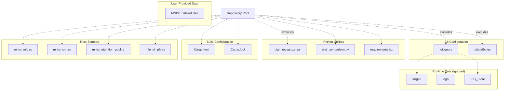
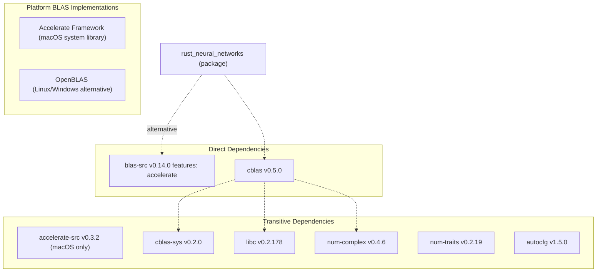
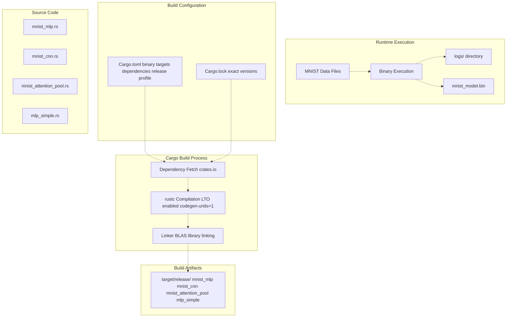

# Development Reference

> **Relevant source files**
> * [.gitattributes](https://github.com/ThalesMMS/Rust-Neural-Networks/blob/0e978f90/.gitattributes)
> * [.gitignore](https://github.com/ThalesMMS/Rust-Neural-Networks/blob/0e978f90/.gitignore)
> * [Cargo.lock](https://github.com/ThalesMMS/Rust-Neural-Networks/blob/0e978f90/Cargo.lock)
> * [Cargo.toml](https://github.com/ThalesMMS/Rust-Neural-Networks/blob/0e978f90/Cargo.toml)
> * [requirements.txt](https://github.com/ThalesMMS/Rust-Neural-Networks/blob/0e978f90/requirements.txt)

## Purpose and Scope

This document provides reference material for developers working with the Rust Neural Networks codebase. It covers the build system configuration, dependency management, compiler optimizations, and repository structure. This page serves as a high-level overview of development concerns—for detailed information on specific topics, see [Build System](6a%20Build-System.md), [Dependencies](6b%20Dependencies.md), and [Project Configuration](6c%20Project-Configuration.md).

This document is targeted at contributors who need to understand how to build, modify, and extend the codebase. For information about training models or using Python utilities, see [Model Implementations](3%20Model-Implementations.md) and [Python Utilities](4%20Python-Utilities.md).

---

## Project Structure

The repository is organized as a Cargo workspace with multiple binary targets, Python utilities, and data directories.

### Repository Layout



**Sources**: [Cargo.toml L1-L29](https://github.com/ThalesMMS/Rust-Neural-Networks/blob/0e978f90/Cargo.toml#L1-L29)

 [.gitignore L1-L4](https://github.com/ThalesMMS/Rust-Neural-Networks/blob/0e978f90/.gitignore#L1-L4)

 [.gitattributes L1-L3](https://github.com/ThalesMMS/Rust-Neural-Networks/blob/0e978f90/.gitattributes#L1-L3)

---

## Binary Target Configuration

The project defines four independent binary targets in [Cargo.toml L10-L24](https://github.com/ThalesMMS/Rust-Neural-Networks/blob/0e978f90/Cargo.toml#L10-L24)

 each implementing a different neural network architecture. All binaries share the same dependency declarations.

| Binary Target | Source File | Purpose | Dependencies |
| --- | --- | --- | --- |
| `mnist_mlp` | `mnist_mlp.rs` | BLAS-accelerated MLP for MNIST | `blas-src`, `cblas` |
| `mnist_cnn` | `mnist_cnn.rs` | Convolutional network for MNIST | None (manual implementation) |
| `mnist_attention_pool` | `mnist_attention_pool.rs` | Self-attention model for MNIST | None (manual implementation) |
| `mlp_simple` | `mlp_simple.rs` | Simple XOR problem solver | None (educational example) |

### Building Individual Targets

Each binary can be built and executed independently:

```
# Build specific binary in release modecargo build --release --bin mnist_mlp# Run specific binarycargo run --release --bin mnist_mlp# Build all binariescargo build --release
```

**Sources**: [Cargo.toml L10-L24](https://github.com/ThalesMMS/Rust-Neural-Networks/blob/0e978f90/Cargo.toml#L10-L24)

---

## Dependency Architecture

The project uses a minimal dependency footprint, with BLAS libraries required only for the `mnist_mlp` target.

### Rust Dependency Graph



**Sources**: [Cargo.toml L6-L8](https://github.com/ThalesMMS/Rust-Neural-Networks/blob/0e978f90/Cargo.toml#L6-L8)

 [Cargo.lock L1-L77](https://github.com/ThalesMMS/Rust-Neural-Networks/blob/0e978f90/Cargo.lock#L1-L77)

### Dependency Specifications

The project declares dependencies in [Cargo.toml L6-L8](https://github.com/ThalesMMS/Rust-Neural-Networks/blob/0e978f90/Cargo.toml#L6-L8)

:

```
[dependencies]blas-src = { version = "0.14", features = ["accelerate"] }cblas = "0.5"
```

* **`blas-src`**: Build-time configuration crate that selects and links platform-specific BLAS implementations. The `accelerate` feature enables Apple's Accelerate framework on macOS.
* **`cblas`**: Runtime interface providing safe Rust bindings to CBLAS (C BLAS interface). Used by `mnist_mlp.rs` for matrix multiplication.

### Python Dependencies

Python utilities require packages listed in [requirements.txt L1-L2](https://github.com/ThalesMMS/Rust-Neural-Networks/blob/0e978f90/requirements.txt#L1-L2)

:

| Package | Purpose | Used By |
| --- | --- | --- |
| `numpy` | Array operations, model inference | `digit_recognizer.py`, `plot_comparison.py` |
| `matplotlib` | Loss curve visualization | `plot_comparison.py` |
| Implicit: `PIL` | Image manipulation | `digit_recognizer.py` |
| Implicit: `tkinter` | GUI framework | `digit_recognizer.py` |

**Sources**: [requirements.txt L1-L2](https://github.com/ThalesMMS/Rust-Neural-Networks/blob/0e978f90/requirements.txt#L1-L2)

---

## Compiler Optimization Configuration

The project uses aggressive release profile optimizations to maximize runtime performance.

### Release Profile Settings

[Cargo.toml L26-L28](https://github.com/ThalesMMS/Rust-Neural-Networks/blob/0e978f90/Cargo.toml#L26-L28)

 defines the release profile:

```
[profile.release]lto = truecodegen-units = 1
```

| Setting | Value | Impact |
| --- | --- | --- |
| `lto` | `true` | Enables Link-Time Optimization, allowing cross-crate inlining and dead code elimination |
| `codegen-units` | `1` | Forces single-threaded code generation for maximum optimization (slower compilation, faster runtime) |

### Optimization Impact

These settings significantly affect compilation time and runtime performance:

* **Link-Time Optimization (LTO)**: Enables whole-program optimization by analyzing all compilation units together. Particularly beneficial for `mnist_mlp.rs`, which calls into external BLAS libraries—LTO can optimize the FFI boundary.
* **Single Codegen Unit**: Prevents parallel code generation, allowing LLVM to apply more aggressive optimizations without partitioning constraints. This is critical for tight loop performance in `mnist_cnn.rs` and `mnist_attention_pool.rs`.

**Trade-off**: Release builds take significantly longer to compile (30-60 seconds vs 5-10 seconds in debug mode), but runtime performance improves by 10-50x depending on the workload.

**Sources**: [Cargo.toml L26-L28](https://github.com/ThalesMMS/Rust-Neural-Networks/blob/0e978f90/Cargo.toml#L26-L28)

---

## Build System Workflow

The following diagram illustrates the complete build and execution pipeline:



**Sources**: [Cargo.toml L1-L29](https://github.com/ThalesMMS/Rust-Neural-Networks/blob/0e978f90/Cargo.toml#L1-L29)

 [Cargo.lock L1-L77](https://github.com/ThalesMMS/Rust-Neural-Networks/blob/0e978f90/Cargo.lock#L1-L77)

---

## Git Configuration

The repository uses two Git configuration files to manage version control behavior:

### Line Ending Normalization

[.gitattributes L1-L2](https://github.com/ThalesMMS/Rust-Neural-Networks/blob/0e978f90/.gitattributes#L1-L2)

 enforces consistent line endings:

```
* text=auto
```

This directive instructs Git to:

1. Detect text files automatically
2. Normalize line endings to LF (`\n`) in the repository
3. Convert to platform-native line endings on checkout (CRLF on Windows, LF on Unix)

This prevents cross-platform line ending issues when developers on different operating systems collaborate.

### Ignored Files

[.gitignore L1-L4](https://github.com/ThalesMMS/Rust-Neural-Networks/blob/0e978f90/.gitignore#L1-L4)

 excludes build artifacts and runtime outputs:

```go
.DS_Store      # macOS filesystem metadata
/target        # Cargo build directory
/logs          # Training log outputs
```

| Pattern | Reason for Exclusion |
| --- | --- |
| `.DS_Store` | macOS-specific directory metadata, irrelevant to project |
| `/target` | Compiled binaries and intermediate build artifacts (reproducible) |
| `/logs` | Runtime-generated training logs (user-specific) |

**Note**: MNIST dataset files are **not** ignored and must be manually placed in the repository root. This is intentional—dataset files are large and should be obtained separately via the download script mentioned in the README.

**Sources**: [.gitattribore L1-L3](https://github.com/ThalesMMS/Rust-Neural-Networks/blob/0e978f90/.gitattribore#L1-L3)

 [.gitignore L1-L4](https://github.com/ThalesMMS/Rust-Neural-Networks/blob/0e978f90/.gitignore#L1-L4)

---

## Development Environment Setup

Developers need to configure both Rust and Python environments.

### Rust Environment

**Required**:

* Rust toolchain: 1.70+ (2021 edition required per [Cargo.toml L4](https://github.com/ThalesMMS/Rust-Neural-Networks/blob/0e978f90/Cargo.toml#L4-L4) )
* Platform-specific BLAS library (see [BLAS Integration](5a%20BLAS-Integration.md))

**macOS**:

```
# Accelerate framework is pre-installedcargo build --release
```

**Linux**:

```
# Install OpenBLAS development filessudo apt-get install libopenblas-dev  # Debian/Ubuntusudo yum install openblas-devel       # RHEL/CentOS# Modify Cargo.toml to use OpenBLAS instead of Accelerate# [dependencies]# blas-src = { version = "0.14", features = ["openblas"] }cargo build --release
```

### Python Environment

**Required for Python utilities only** (not needed for Rust training):

```
pip install -r requirements.txt
```

This installs `numpy` and `matplotlib`. Note that `tkinter` is typically bundled with Python distributions, and `PIL/Pillow` may need to be installed separately:

```
pip install pillow
```

**Sources**: [Cargo.toml L4](https://github.com/ThalesMMS/Rust-Neural-Networks/blob/0e978f90/Cargo.toml#L4-L4)

 [requirements.txt L1-L2](https://github.com/ThalesMMS/Rust-Neural-Networks/blob/0e978f90/requirements.txt#L1-L2)

---

## Development Commands

Common development tasks:

| Command | Purpose |
| --- | --- |
| `cargo build --release` | Build all binaries with optimizations |
| `cargo run --release --bin mnist_mlp` | Train MLP model |
| `cargo clean` | Remove build artifacts |
| `cargo check` | Fast syntax/type checking without codegen |
| `cargo doc --open` | Generate and view dependency documentation |
| `python digit_recognizer.py` | Launch inference GUI |
| `python plot_comparison.py` | Generate training visualizations |

### Development vs Release Builds

| Mode | Command | Compile Time | Runtime Performance | Use Case |
| --- | --- | --- | --- | --- |
| Debug | `cargo build` | Fast (~10s) | Slow (no optimizations) | Development iteration |
| Release | `cargo build --release` | Slow (~60s) | Fast (LTO + optimizations) | Training, benchmarking |

For rapid prototyping, use debug builds. For actual training runs or performance measurement, always use release builds.

**Sources**: [Cargo.toml L26-L28](https://github.com/ThalesMMS/Rust-Neural-Networks/blob/0e978f90/Cargo.toml#L26-L28)

---

## Repository Metadata

Package metadata defined in [Cargo.toml L1-L4](https://github.com/ThalesMMS/Rust-Neural-Networks/blob/0e978f90/Cargo.toml#L1-L4)

:

| Field | Value | Notes |
| --- | --- | --- |
| `name` | `rust_neural_networks` | Package identifier (typo: should be "neural") |
| `version` | `0.1.0` | Initial development version |
| `edition` | `2021` | Rust edition (enables 2021 language features) |

The package name contains a typographical error (`netural` instead of `neural`), but this does not affect functionality. It appears in [Cargo.lock L53](https://github.com/ThalesMMS/Rust-Neural-Networks/blob/0e978f90/Cargo.lock#L53-L53)

 as the resolved package name.

**Sources**: [Cargo.toml L1-L4](https://github.com/ThalesMMS/Rust-Neural-Networks/blob/0e978f90/Cargo.toml#L1-L4)

 [Cargo.lock L53](https://github.com/ThalesMMS/Rust-Neural-Networks/blob/0e978f90/Cargo.lock#L53-L53)

---

## Platform-Specific Considerations

### BLAS Backend Selection

The [Cargo.toml L7](https://github.com/ThalesMMS/Rust-Neural-Networks/blob/0e978f90/Cargo.toml#L7-L7)

 dependency specification:

```
blas-src = { version = "0.14", features = ["accelerate"] }
```

Hard-codes the Accelerate framework (macOS only). To support other platforms:

1. **Conditional features** (recommended for cross-platform projects): ``` [target.'cfg(target_os = "macos")'.dependencies]blas-src = { version = "0.14", features = ["accelerate"] }[target.'cfg(not(target_os = "macos"))'.dependencies]blas-src = { version = "0.14", features = ["openblas"] } ```
2. **Feature flags** (user-selectable): ``` [features]default = ["accelerate"]accelerate = ["blas-src/accelerate"]openblas = ["blas-src/openblas"] ```

The current configuration assumes macOS. For Linux/Windows development, manually edit [Cargo.toml L7](https://github.com/ThalesMMS/Rust-Neural-Networks/blob/0e978f90/Cargo.toml#L7-L7)

 to use `openblas` or `intel-mkl` features.

### Thread Configuration

BLAS implementations use multiple threads by default. To control threading:

**macOS Accelerate**:

```
export VECLIB_MAXIMUM_THREADS=4cargo run --release --bin mnist_mlp
```

**OpenBLAS**:

```
export OPENBLAS_NUM_THREADS=4cargo run --release --bin mnist_mlp
```

**Sources**: [Cargo.toml L7](https://github.com/ThalesMMS/Rust-Neural-Networks/blob/0e978f90/Cargo.toml#L7-L7)

---

## Extending the Project

### Adding a New Binary Target

To add a new neural network implementation:

1. Create source file: `my_model.rs`
2. Add binary target to [Cargo.toml](https://github.com/ThalesMMS/Rust-Neural-Networks/blob/0e978f90/Cargo.toml) : ``` [[bin]]name = "my_model"path = "my_model.rs" ```
3. Build and run: ``` cargo run --release --bin my_model ```

### Adding Dependencies

If your model requires additional libraries (e.g., for GPU acceleration):

1. Add to `[dependencies]` in [Cargo.toml L6-L8](https://github.com/ThalesMMS/Rust-Neural-Networks/blob/0e978f90/Cargo.toml#L6-L8)
2. Run `cargo build` to update [Cargo.lock](https://github.com/ThalesMMS/Rust-Neural-Networks/blob/0e978f90/Cargo.lock)
3. Commit both `Cargo.toml` and `Cargo.lock` changes

**Sources**: [Cargo.toml L10-L24](https://github.com/ThalesMMS/Rust-Neural-Networks/blob/0e978f90/Cargo.toml#L10-L24)

---

## Summary

This development reference provides the essential configuration details for working with the Rust Neural Networks codebase:

* **Project Structure**: Multiple binary targets built from root-level source files
* **Dependencies**: Minimal Rust dependencies (BLAS libraries), separate Python requirements
* **Build Configuration**: Aggressive release optimizations (LTO, single codegen unit)
* **Git Configuration**: Line ending normalization, exclusion of build artifacts
* **Platform Support**: macOS primary (Accelerate), Linux/Windows via OpenBLAS

For deeper dives into specific topics, see [Build System](6a%20Build-System.md) (detailed Cargo configuration), [Dependencies](6b%20Dependencies.md) (complete dependency analysis), and [Project Configuration](6c%20Project-Configuration.md) (repository structure).

**Sources**: [Cargo.toml L1-L29](https://github.com/ThalesMMS/Rust-Neural-Networks/blob/0e978f90/Cargo.toml#L1-L29)

 [Cargo.lock L1-L77](https://github.com/ThalesMMS/Rust-Neural-Networks/blob/0e978f90/Cargo.lock#L1-L77)

 [.gitignore L1-L4](https://github.com/ThalesMMS/Rust-Neural-Networks/blob/0e978f90/.gitignore#L1-L4)

 [.gitattributes L1-L3](https://github.com/ThalesMMS/Rust-Neural-Networks/blob/0e978f90/.gitattributes#L1-L3)

 [requirements.txt L1-L2](https://github.com/ThalesMMS/Rust-Neural-Networks/blob/0e978f90/requirements.txt#L1-L2)


)

### On this page

* [Development Reference](6%20Development-Reference.md)
* [Purpose and Scope](6%20Development-Reference.md)
* [Project Structure](6%20Development-Reference.md)
* [Repository Layout](6%20Development-Reference.md)
* [Binary Target Configuration](6%20Development-Reference.md)
* [Building Individual Targets](6%20Development-Reference.md)
* [Dependency Architecture](6%20Development-Reference.md)
* [Rust Dependency Graph](6%20Development-Reference.md)
* [Dependency Specifications](6%20Development-Reference.md)
* [Python Dependencies](6%20Development-Reference.md)
* [Compiler Optimization Configuration](6%20Development-Reference.md)
* [Release Profile Settings](6%20Development-Reference.md)
* [Optimization Impact](6%20Development-Reference.md)
* [Build System Workflow](6%20Development-Reference.md)
* [Git Configuration](6%20Development-Reference.md)
* [Line Ending Normalization](6%20Development-Reference.md)
* [Ignored Files](6%20Development-Reference.md)
* [Development Environment Setup](6%20Development-Reference.md)
* [Rust Environment](6%20Development-Reference.md)
* [Python Environment](6%20Development-Reference.md)
* [Development Commands](6%20Development-Reference.md)
* [Development vs Release Builds](6%20Development-Reference.md)
* [Repository Metadata](6%20Development-Reference.md)
* [Platform-Specific Considerations](6%20Development-Reference.md)
* [BLAS Backend Selection](6%20Development-Reference.md)
* [Thread Configuration](6%20Development-Reference.md)
* [Extending the Project](6%20Development-Reference.md)
* [Adding a New Binary Target](6%20Development-Reference.md)
* [Adding Dependencies](6%20Development-Reference.md)
* [Summary](6%20Development-Reference.md)

Ask Devin about Rust-Neural-Networks