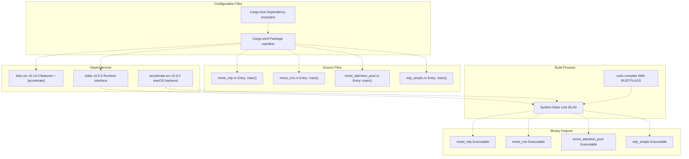
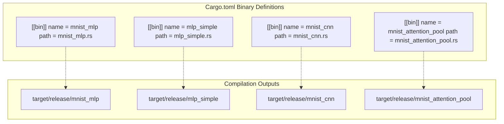
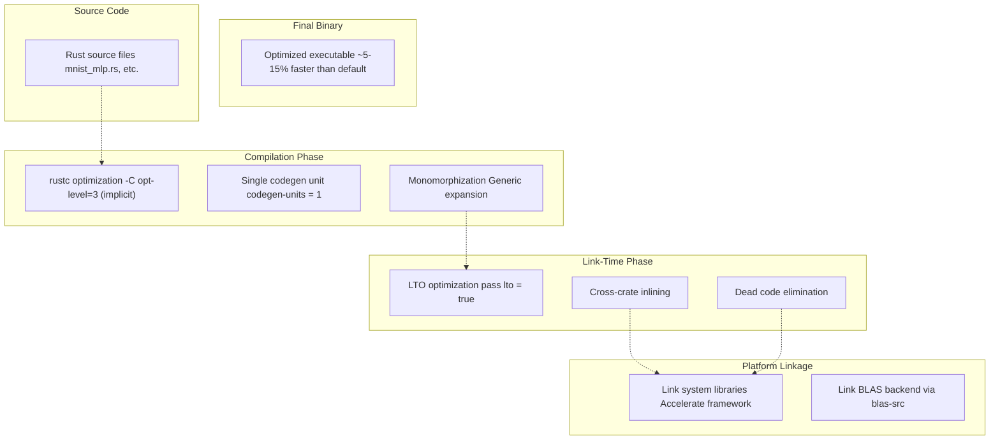
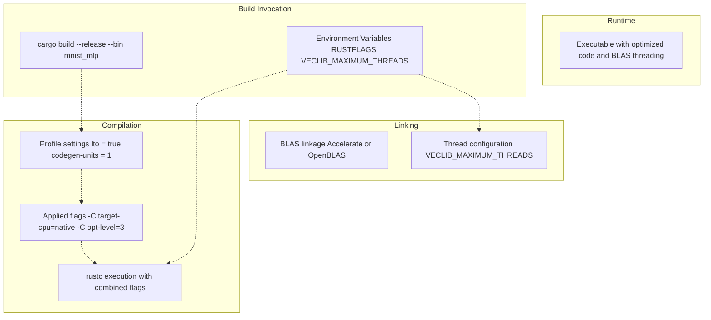
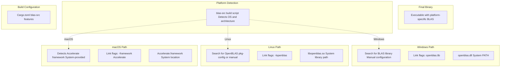
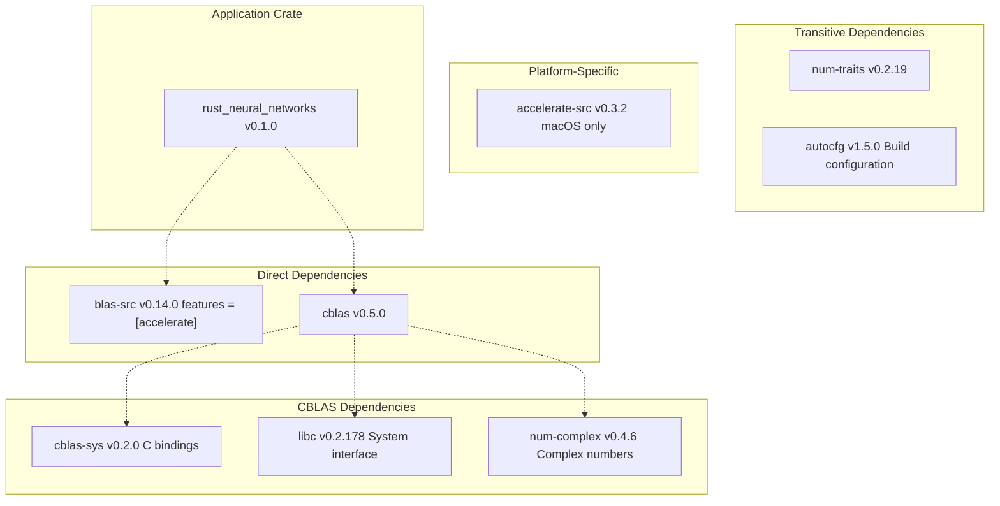

# Build System

> **Relevant source files**
> * [Cargo.lock](https://github.com/ThalesMMS/Rust-Neural-Networks/blob/0e978f90/Cargo.lock)
> * [Cargo.toml](https://github.com/ThalesMMS/Rust-Neural-Networks/blob/0e978f90/Cargo.toml)
> * [README.md](https://github.com/ThalesMMS/Rust-Neural-Networks/blob/0e978f90/README.md)

## Purpose and Scope

This document explains the Cargo-based build system used in the Rust Neural Networks repository, covering binary target configuration, release profile optimizations, and compilation flags. For detailed dependency information, see [Dependencies](6b%20Dependencies.md). For BLAS-specific configuration, see [BLAS Integration](5a%20BLAS-Integration.md). For initial setup instructions, see [Installation](2a%20Installation.md).

**Sources**: README.md

 [Cargo.toml L1-L29](https://github.com/ThalesMMS/Rust-Neural-Networks/blob/0e978f90/Cargo.toml#L1-L29)

---

## Build System Overview

The project uses Cargo, Rust's package manager and build tool, to manage compilation, dependencies, and multiple binary targets. The build system is configured through two primary files:

| File | Purpose | Version Control |
| --- | --- | --- |
| `Cargo.toml` | Package manifest defining dependencies, binary targets, and release profile | Committed |
| `Cargo.lock` | Dependency resolution lockfile ensuring reproducible builds | Committed |

The build system produces four independent executables, each implementing a different neural network architecture. All binaries share the same dependency tree but compile to separate executables with distinct entry points.

**Sources**: [Cargo.toml L1-L29](https://github.com/ThalesMMS/Rust-Neural-Networks/blob/0e978f90/Cargo.toml#L1-L29)

 [Cargo.lock L1-L77](https://github.com/ThalesMMS/Rust-Neural-Networks/blob/0e978f90/Cargo.lock#L1-L77)

### Build System Architecture



**Sources**: [Cargo.toml L1-L29](https://github.com/ThalesMMS/Rust-Neural-Networks/blob/0e978f90/Cargo.toml#L1-L29)

 [Cargo.lock L1-L77](https://github.com/ThalesMMS/Rust-Neural-Networks/blob/0e978f90/Cargo.lock#L1-L77)

---

## Package Configuration

The package is defined with basic metadata in the `[package]` section:

| Field | Value | Purpose |
| --- | --- | --- |
| `name` | `rust_neural_networks` | Package identifier (note: legacy name from C++ origins) |
| `version` | `0.1.0` | Semantic version number |
| `edition` | `2021` | Rust edition for language features |

The package name `rust_neural_networks` is a historical artifact and does not reflect the current Rust implementation.

**Sources**: [Cargo.toml L1-L4](https://github.com/ThalesMMS/Rust-Neural-Networks/blob/0e978f90/Cargo.toml#L1-L4)

---

## Binary Targets

The build system defines four binary targets using `[[bin]]` sections. Each target specifies a unique executable name and source file:

| Binary Name | Source File | Architecture | Primary Use Case |
| --- | --- | --- | --- |
| `mnist_mlp` | `mnist_mlp.rs` | Fully-connected MLP | MNIST classification with BLAS acceleration |
| `mnist_cnn` | `mnist_cnn.rs` | Convolutional network | MNIST with spatial feature extraction |
| `mnist_attention_pool` | `mnist_attention_pool.rs` | Self-attention | MNIST with transformer-inspired architecture |
| `mlp_simple` | `mlp_simple.rs` | Simple MLP | XOR problem for educational purposes |

**Sources**: [Cargo.toml L10-L24](https://github.com/ThalesMMS/Rust-Neural-Networks/blob/0e978f90/Cargo.toml#L10-L24)

 [README.md L16-L18](https://github.com/ThalesMMS/Rust-Neural-Networks/blob/0e978f90/README.md#L16-L18)

### Binary Target Configuration Structure



**Sources**: [Cargo.toml L10-L24](https://github.com/ThalesMMS/Rust-Neural-Networks/blob/0e978f90/Cargo.toml#L10-L24)

Each binary can be built independently using `cargo build --bin <name>` or run directly with `cargo run --bin <name>`. The source files must be located in the project root directory (not in `src/`), as specified by the `path` attribute.

**Sources**: [Cargo.toml L10-L24](https://github.com/ThalesMMS/Rust-Neural-Networks/blob/0e978f90/Cargo.toml#L10-L24)

 **Sources**: [Project overview and setup](https://github.com/ThalesMMS/Rust-Neural-Networks/blob/0e978f90/README.md#L106-L128)

---

## Release Profile Optimization

The `[profile.release]` section configures aggressive optimizations for production builds:

| Setting | Value | Effect |
| --- | --- | --- |
| `lto` | `true` | Enables Link-Time Optimization across all crates |
| `codegen-units` | `1` | Forces single codegen unit for maximum optimization |

**Sources**: [Cargo.toml L26-L28](https://github.com/ThalesMMS/Rust-Neural-Networks/blob/0e978f90/Cargo.toml#L26-L28)

### Link-Time Optimization (LTO)

Setting `lto = true` enables full LTO, which:

* Performs whole-program optimization across crate boundaries
* Eliminates dead code more aggressively
* Enables cross-crate function inlining
* Increases compile time significantly (trade-off for runtime performance)
* Reduces binary size by eliminating unused code paths

### Codegen Units

Setting `codegen-units = 1` instructs the compiler to:

* Process the entire crate as a single compilation unit
* Enable maximum optimization opportunities within the crate
* Increase compilation time (default is 16 units for parallel compilation)
* Improve runtime performance by 5-15% compared to parallel codegen

These settings prioritize runtime performance over compilation speed, which is appropriate for training neural networks where execution time dominates.

**Sources**: [Cargo.toml L26-L28](https://github.com/ThalesMMS/Rust-Neural-Networks/blob/0e978f90/Cargo.toml#L26-L28)

### Optimization Pipeline



**Sources**: [Cargo.toml L26-L28](https://github.com/ThalesMMS/Rust-Neural-Networks/blob/0e978f90/Cargo.toml#L26-L28)

---

## Build Commands

### Standard Build Commands

| Command | Purpose | Output Location |
| --- | --- | --- |
| `cargo build` | Debug build (unoptimized) | `target/debug/` |
| `cargo build --release` | Optimized build with LTO | `target/release/` |
| `cargo build --release --bin mnist_mlp` | Build single binary | `target/release/mnist_mlp` |
| `cargo run --release --bin mnist_mlp` | Build and execute | Runs immediately |

All production builds should use the `--release` flag to enable the optimizations defined in `[profile.release]`.

**Sources**: Project overview and setup

### Build with Performance Flags

For maximum performance, the build system supports additional compiler flags via the `RUSTFLAGS` environment variable:

```
RUSTFLAGS="-C target-cpu=native" cargo build --release --bin mnist_mlp
```

The `-C target-cpu=native` flag enables:

* CPU-specific instruction sets (AVX, AVX2, FMA on x86-64)
* Platform-specific SIMD optimizations
* Additional vectorization opportunities
* ~10-20% performance improvement for math-heavy code

**Sources**: Project overview and setup

### Complete Performance Build Example

```
RUSTFLAGS="-C target-cpu=native" VECLIB_MAXIMUM_THREADS=8 cargo run --release --bin mnist_mlp
```

This command combines:

* **Compiler optimization**: Native CPU instruction sets
* **BLAS threading**: 8-thread limit for Accelerate framework
* **Release profile**: LTO and single codegen unit

**Sources**: Project overview and setup

---

## Compilation Flags and Environment Variables

### RUSTFLAGS Options

| Flag | Effect | Use Case |
| --- | --- | --- |
| `-C target-cpu=native` | Enable all CPU features of build machine | Maximum performance on local hardware |
| `-C opt-level=3` | Maximum optimization (implicit in release) | Already enabled by `--release` |
| `-C lto=thin` | Faster LTO variant | Alternative to full LTO for faster builds |

**Sources**: Project overview and setup

### Environment Variables

| Variable | Target | Purpose |
| --- | --- | --- |
| `RUSTFLAGS` | rustc compiler | Pass flags to compilation |
| `VECLIB_MAXIMUM_THREADS` | Accelerate framework | Limit BLAS threading on macOS |
| `OPENBLAS_NUM_THREADS` | OpenBLAS | Control threading on Linux/Windows |

The `VECLIB_MAXIMUM_THREADS` variable is specific to Apple's Accelerate framework and controls parallelism in BLAS operations. Setting it prevents thread oversubscription when running multiple neural network processes.

**Sources**: README.md

**Sources**: Project overview and setup

### Flag Application Pipeline



**Sources**: Project overview and setup

 [Cargo.toml L26-L28](https://github.com/ThalesMMS/Rust-Neural-Networks/blob/0e978f90/Cargo.toml#L26-L28)

---

## Platform-Specific Considerations

### macOS (Default Configuration)

The project is configured by default for macOS using Apple's Accelerate framework:

```
blas-src = { version = "0.14", features = ["accelerate"] }
```

This configuration:

* Links against `/System/Library/Frameworks/Accelerate.framework`
* Requires no additional installation (system-provided)
* Provides optimal performance on Apple Silicon and Intel Macs
* Supports multi-threading via `VECLIB_MAXIMUM_THREADS`

**Sources**: [Cargo.toml L7](https://github.com/ThalesMMS/Rust-Neural-Networks/blob/0e978f90/Cargo.toml#L7-L7)

 [Cargo.lock L6-L9](https://github.com/ThalesMMS/Rust-Neural-Networks/blob/0e978f90/Cargo.lock#L6-L9)

 README.md

### Linux/Windows Configuration

For non-macOS platforms, the BLAS backend must be changed in `Cargo.toml`. The recommended configuration is:

```
blas-src = { version = "0.14", features = ["openblas"] }
```

Additional steps required:

1. Install OpenBLAS system library: * Linux (Ubuntu/Debian): `apt-get install libopenblas-dev` * Linux (Fedora/RHEL): `dnf install openblas-devel` * Windows: Install from source or use pre-built binaries
2. Ensure the library is in the linker search path
3. Control threading via `OPENBLAS_NUM_THREADS` environment variable

Alternative backends include:

* Intel MKL: `features = ["intel-mkl"]`
* Generic BLAS: `features = ["blas"]` (requires manual library specification)

**Sources**: Project overview and setup

 [Cargo.toml L7](https://github.com/ThalesMMS/Rust-Neural-Networks/blob/0e978f90/Cargo.toml#L7-L7)

### Platform Detection in Build Process



**Sources**: [Cargo.toml L7](https://github.com/ThalesMMS/Rust-Neural-Networks/blob/0e978f90/Cargo.toml#L7-L7)

 **Sources**: [Project overview and setup](https://github.com/ThalesMMS/Rust-Neural-Networks/blob/0e978f90/README.md#L136-L136)

 [Cargo.lock L6-L24](https://github.com/ThalesMMS/Rust-Neural-Networks/blob/0e978f90/Cargo.lock#L6-L24)

---

## Dependency Resolution

The `Cargo.lock` file locks all transitive dependencies to specific versions for reproducible builds:

| Direct Dependency | Version | Transitive Dependencies |
| --- | --- | --- |
| `blas-src` | 0.14.0 | `accelerate-src` (0.3.2) |
| `cblas` | 0.5.0 | `cblas-sys` (0.2.0), `libc` (0.2.178), `num-complex` (0.4.6) |

The dependency tree ensures that:

* All builds produce identical binaries given the same source code
* Version conflicts are resolved at lock time
* Platform-specific dependencies are correctly resolved

**Sources**: [Cargo.lock L1-L77](https://github.com/ThalesMMS/Rust-Neural-Networks/blob/0e978f90/Cargo.lock#L1-L77)

 [Cargo.toml L6-L8](https://github.com/ThalesMMS/Rust-Neural-Networks/blob/0e978f90/Cargo.toml#L6-L8)

### Dependency Graph



**Sources**: [Cargo.lock L1-L77](https://github.com/ThalesMMS/Rust-Neural-Networks/blob/0e978f90/Cargo.lock#L1-L77)

---

## Build Output Structure

The build process creates the following directory structure:

```
target/
├── release/
│   ├── mnist_mlp          (executable, ~2-5 MB)
│   ├── mnist_cnn          (executable, ~2-5 MB)
│   ├── mnist_attention_pool  (executable, ~2-5 MB)
│   ├── mlp_simple         (executable, ~2-5 MB)
│   └── build/             (intermediate build artifacts)
└── debug/
    └── ...                (debug builds if created)
```

All binaries are placed in `target/release/` when built with the `--release` flag. Binary sizes vary depending on:

* LTO effectiveness (code elimination)
* Linked BLAS library size
* Debug symbol inclusion (stripped by default in release)

**Sources**: Project overview and setup

---

## Build Performance Characteristics

| Configuration | Compile Time | Binary Performance | Use Case |
| --- | --- | --- | --- |
| `cargo build` | Fast (~30-60s) | Slow (no optimization) | Development/debugging |
| `cargo build --release` | Slow (~2-5 min) | Fast (LTO + single codegen) | Production builds |
| `--release` + `RUSTFLAGS` | Slowest (~3-6 min) | Fastest (native CPU features) | Performance benchmarks |

The significant compile time for release builds is due to:

* Full LTO across all crates (~50% of build time)
* Single codegen unit preventing parallelization (~30%)
* Native CPU feature detection and optimization (~20%)

This is an acceptable trade-off for training workloads where the executable runs for minutes to hours.

**Sources**: [Cargo.toml L26-L28](https://github.com/ThalesMMS/Rust-Neural-Networks/blob/0e978f90/Cargo.toml#L26-L28)

 **Sources**: [Project overview and setup](https://github.com/ThalesMMS/Rust-Neural-Networks/blob/0e978f90/README.md#L132-L134)


)

### On this page

* [Build System](#6.1-build-system)
* [Purpose and Scope](#6.1-purpose-and-scope)
* [Build System Overview](#6.1-build-system-overview)
* [Build System Architecture](#6.1-build-system-architecture)
* [Package Configuration](#6.1-package-configuration)
* [Binary Targets](#6.1-binary-targets)
* [Binary Target Configuration Structure](#6.1-binary-target-configuration-structure)
* [Release Profile Optimization](#6.1-release-profile-optimization)
* [Link-Time Optimization (LTO)](#6.1-link-time-optimization-lto)
* [Codegen Units](#6.1-codegen-units)
* [Optimization Pipeline](#6.1-optimization-pipeline)
* [Build Commands](#6.1-build-commands)
* [Standard Build Commands](#6.1-standard-build-commands)
* [Build with Performance Flags](#6.1-build-with-performance-flags)
* [Complete Performance Build Example](#6.1-complete-performance-build-example)
* [Compilation Flags and Environment Variables](#6.1-compilation-flags-and-environment-variables)
* [RUSTFLAGS Options](#6.1-rustflags-options)
* [Environment Variables](#6.1-environment-variables)
* [Flag Application Pipeline](#6.1-flag-application-pipeline)
* [Platform-Specific Considerations](#6.1-platform-specific-considerations)
* [macOS (Default Configuration)](#6.1-macos-default-configuration)
* [Linux/Windows Configuration](#6.1-linuxwindows-configuration)
* [Platform Detection in Build Process](#6.1-platform-detection-in-build-process)
* [Dependency Resolution](#6.1-dependency-resolution)
* [Dependency Graph](#6.1-dependency-graph)
* [Build Output Structure](#6.1-build-output-structure)
* [Build Performance Characteristics](#6.1-build-performance-characteristics)

Ask Devin about Rust-Neural-Networks