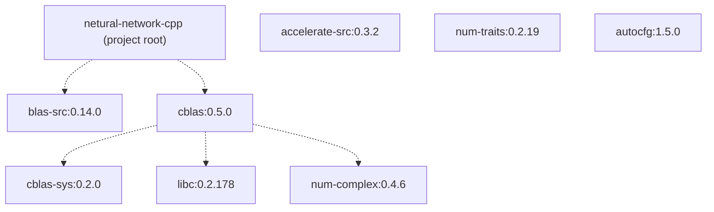
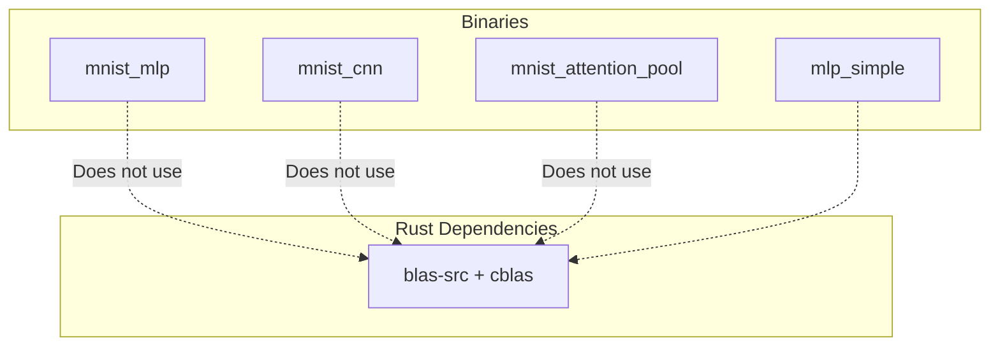
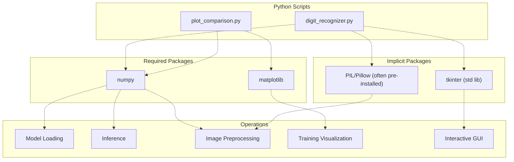
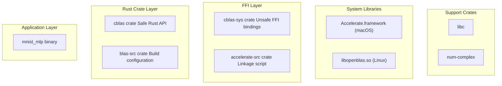

# Dependencies

> **Relevant source files**
> * [Cargo.lock](https://github.com/ThalesMMS/Rust-Neural-Networks/blob/0e978f90/Cargo.lock)
> * [Cargo.toml](https://github.com/ThalesMMS/Rust-Neural-Networks/blob/0e978f90/Cargo.toml)
> * [requirements.txt](https://github.com/ThalesMMS/Rust-Neural-Networks/blob/0e978f90/requirements.txt)

This page documents all external dependencies used in the Rust Neural Networks project, including Rust crates and Python packages. For detailed information about BLAS backend configuration and optimization, see [BLAS Integration](#5.1). For installation procedures, see [Installation](#2.1).

---

## Overview

The project has two distinct dependency ecosystems:

1. **Rust Dependencies**: Used for neural network training implementations, managed via Cargo
2. **Python Dependencies**: Used for visualization and inference utilities, managed via pip/requirements.txt

The Rust dependencies focus on mathematical acceleration through BLAS libraries, while Python dependencies provide user interface and data visualization capabilities.

---

## Rust Dependencies

### Direct Dependencies

The project declares two direct Rust dependencies in [Cargo.toml L6-L8](https://github.com/ThalesMMS/Rust-Neural-Networks/blob/0e978f90/Cargo.toml#L6-L8)

:

| Crate | Version | Purpose | Features |
| --- | --- | --- | --- |
| `blas-src` | 0.14 | Build-time BLAS backend selection | `accelerate` (macOS) |
| `cblas` | 0.5 | Runtime CBLAS bindings | None |

#### blas-src

The `blas-src` crate is a **build-time dependency** that configures linkage to platform-specific BLAS implementations. It does not contain BLAS code itself; instead, it detects the target platform and links to appropriate libraries.

**Configuration**: [Cargo.toml L7](https://github.com/ThalesMMS/Rust-Neural-Networks/blob/0e978f90/Cargo.toml#L7-L7)

```
blas-src = { version = "0.14", features = ["accelerate"] }
```

The `accelerate` feature instructs `blas-src` to link against Apple's Accelerate framework on macOS, providing highly optimized matrix operations for both Intel and Apple Silicon processors. On other platforms, the build configuration would need to specify alternative backends like `openblas` or `intel-mkl`.

**Resolved Version**: `0.14.0` [Cargo.lock L18-L24](https://github.com/ThalesMMS/Rust-Neural-Networks/blob/0e978f90/Cargo.lock#L18-L24)

**Dependencies**: `accelerate-src` (0.3.2) - provides the actual linkage mechanism to Accelerate.framework

#### cblas

The `cblas` crate provides **safe Rust bindings** to the CBLAS (C BLAS) interface. This crate is used at runtime to invoke BLAS operations like `sgemm` (single-precision general matrix multiply).

**Configuration**: [Cargo.toml L8](https://github.com/ThalesMMS/Rust-Neural-Networks/blob/0e978f90/Cargo.toml#L8-L8)

**Resolved Version**: `0.5.0` [Cargo.lock L27-L35](https://github.com/ThalesMMS/Rust-Neural-Networks/blob/0e978f90/Cargo.lock#L27-L35)

**Usage**: The MLP implementation uses `cblas::sgemm()` for batched matrix multiplication in forward and backward passes. See [BLAS Integration](#5.1) for implementation details.

---

### Transitive Dependencies

The dependency tree includes several indirect dependencies required by the direct dependencies:



**Sources**: [Cargo.lock L1-L77](https://github.com/ThalesMMS/Rust-Neural-Networks/blob/0e978f90/Cargo.lock#L1-L77)

 [Cargo.toml L6-L8](https://github.com/ThalesMMS/Rust-Neural-Networks/blob/0e978f90/Cargo.toml#L6-L8)

### Transitive Dependency Descriptions

| Crate | Version | Purpose |
| --- | --- | --- |
| `accelerate-src` | 0.3.2 | Provides build script to link against macOS Accelerate.framework |
| `cblas-sys` | 0.2.0 | Unsafe FFI bindings to CBLAS C interface |
| `libc` | 0.2.178 | Raw FFI bindings to platform libc for system calls |
| `num-complex` | 0.4.6 | Complex number types (required by cblas API, unused in this project) |
| `num-traits` | 0.2.19 | Numeric trait definitions (transitive via num-complex) |
| `autocfg` | 1.5.0 | Automatic cfg detection for conditional compilation |

**Sources**: [Cargo.lock L5-L77](https://github.com/ThalesMMS/Rust-Neural-Networks/blob/0e978f90/Cargo.lock#L5-L77)

---

## Dependency Usage by Binary

The four binary targets have different dependency requirements:



**Analysis**: Only `mnist_mlp` actively uses the BLAS dependencies for accelerated matrix multiplication via the `sgemm_wrapper()` function. The other implementations (`mnist_cnn`, `mnist_attention_pool`, `mlp_simple`) use explicit loops for all operations and do not invoke BLAS functions. However, all binaries link against these dependencies due to shared [Cargo.toml](https://github.com/ThalesMMS/Rust-Neural-Networks/blob/0e978f90/Cargo.toml)

 configuration.

**Sources**: [Cargo.toml L10-L24](https://github.com/ThalesMMS/Rust-Neural-Networks/blob/0e978f90/Cargo.toml#L10-L24)

 `mnist_mlp.rs`, `mnist_cnn.rs`, `mnist_attention_pool.rs`, `mlp_simple.rs`

---

## Python Dependencies

### Requirements File

The Python utilities require packages specified in [requirements.txt L1-L2](https://github.com/ThalesMMS/Rust-Neural-Networks/blob/0e978f90/requirements.txt#L1-L2)

:

```
numpy
matplotlib
```

### Direct Python Dependencies

| Package | Purpose | Used By |
| --- | --- | --- |
| `numpy` | Array operations, matrix math, model inference | `digit_recognizer.py`, `plot_comparison.py` |
| `matplotlib` | Plotting training curves, generating visualizations | `plot_comparison.py` |

**numpy**: Provides N-dimensional arrays and vectorized operations for:

* Loading binary model files (`.bin` format)
* Performing forward propagation during inference
* Image preprocessing (resizing, normalization)

**matplotlib**: Used exclusively by `plot_comparison.py` to:

* Generate multi-panel training loss plots
* Visualize per-epoch timing metrics
* Export comparison charts as PNG files

**Sources**: [requirements.txt L1-L2](https://github.com/ThalesMMS/Rust-Neural-Networks/blob/0e978f90/requirements.txt#L1-L2)

---

### Implicit Python Dependencies

The Python utilities also depend on packages **not listed** in `requirements.txt` because they are part of the Python standard library or commonly pre-installed:

| Package | Purpose | Used By | Distribution |
| --- | --- | --- | --- |
| `tkinter` | GUI framework for canvas-based drawing | `digit_recognizer.py` | Python standard library |
| `PIL` (Pillow) | Image manipulation (resize, convert) | `digit_recognizer.py` | Usually pre-installed |

**tkinter**: Provides the GUI framework for the digit recognizer, including:

* 280×280 canvas for drawing
* Button widgets for prediction and clearing
* Layout management

**PIL/Pillow**: Handles image operations:

* Resizing drawn images from 280×280 to 28×28
* Converting between image formats
* Pixel data extraction

**Note**: These dependencies may require manual installation on some systems. See [Installation](#2.1) for platform-specific instructions.

**Sources**: `digit_recognizer.py`, [README.md](https://github.com/ThalesMMS/Rust-Neural-Networks/blob/0e978f90/README.md)

---

## Python Dependency Usage



**Sources**: `digit_recognizer.py`, `plot_comparison.py`, [requirements.txt L1-L2](https://github.com/ThalesMMS/Rust-Neural-Networks/blob/0e978f90/requirements.txt#L1-L2)

---

## Version Management

### Rust Version Pinning

Rust dependencies are **pinned** in [Cargo.lock](https://github.com/ThalesMMS/Rust-Neural-Networks/blob/0e978f90/Cargo.lock)

 ensuring reproducible builds across environments. The lockfile is committed to version control.

**Key versions**:

* `blas-src`: 0.14.0 [Cargo.lock L18](https://github.com/ThalesMMS/Rust-Neural-Networks/blob/0e978f90/Cargo.lock#L18-L18)
* `cblas`: 0.5.0 [Cargo.lock L27](https://github.com/ThalesMMS/Rust-Neural-Networks/blob/0e978f90/Cargo.lock#L27-L27)
* `libc`: 0.2.178 [Cargo.lock L47](https://github.com/ThalesMMS/Rust-Neural-Networks/blob/0e978f90/Cargo.lock#L47-L47)

To update dependencies:

```sql
cargo update
```

### Python Version Flexibility

Python dependencies in [requirements.txt](https://github.com/ThalesMMS/Rust-Neural-Networks/blob/0e978f90/requirements.txt)

 do **not specify version constraints**, allowing `pip` to install the latest compatible versions. This provides flexibility but may introduce compatibility issues with future releases.

**Recommended approach** for production:

```
numpy>=1.20.0,<2.0.0
matplotlib>=3.3.0,<4.0.0
```

**Sources**: [requirements.txt L1-L2](https://github.com/ThalesMMS/Rust-Neural-Networks/blob/0e978f90/requirements.txt#L1-L2)

 [Cargo.lock L1-L3](https://github.com/ThalesMMS/Rust-Neural-Networks/blob/0e978f90/Cargo.lock#L1-L3)

---

## Dependency Compilation Flags

The Rust dependencies are built with release optimizations configured in [Cargo.toml L26-L28](https://github.com/ThalesMMS/Rust-Neural-Networks/blob/0e978f90/Cargo.toml#L26-L28)

:

```
[profile.release]lto = truecodegen-units = 1
```

These flags affect dependency compilation:

* **`lto = true`**: Enables Link-Time Optimization across all dependencies, including BLAS crates
* **`codegen-units = 1`**: Reduces parallelism during compilation but increases runtime performance

BLAS libraries (Accelerate, OpenBLAS) are **pre-compiled system libraries** and are not affected by these flags. Only the Rust binding layers (`cblas`, `blas-src`) undergo LTO.

**Sources**: [Cargo.toml L26-L28](https://github.com/ThalesMMS/Rust-Neural-Networks/blob/0e978f90/Cargo.toml#L26-L28)

---

## Platform-Specific Considerations

### macOS

The `accelerate` feature in `blas-src` links against Accelerate.framework:

* **Path**: `/System/Library/Frameworks/Accelerate.framework`
* **Thread Control**: Set `VECLIB_MAXIMUM_THREADS` environment variable to control parallelism
* **Architecture**: Optimized for both Intel (AVX) and Apple Silicon (NEON)

### Linux

Default `blas-src` configuration on Linux requires manual backend specification:

```
blas-src = { version = "0.14", features = ["openblas"] }
```

Or via environment variables at build time:

```
export BLAS_SRC_OPENBLAS=1cargo build --release
```

### Windows

Similar to Linux, Windows requires explicit BLAS backend configuration. Intel MKL is commonly used:

```
blas-src = { version = "0.14", features = ["intel-mkl"] }
```

**Sources**: [Cargo.toml L7](https://github.com/ThalesMMS/Rust-Neural-Networks/blob/0e978f90/Cargo.toml#L7-L7)

 [README.md](https://github.com/ThalesMMS/Rust-Neural-Networks/blob/0e978f90/README.md)

---

## Dependency Relationship Summary



This diagram shows the **complete dependency chain** from application code down to system libraries. The `blas-src` crate operates at build time to configure linkage, while `cblas` provides the runtime API used by application code.

**Sources**: [Cargo.lock L1-L77](https://github.com/ThalesMMS/Rust-Neural-Networks/blob/0e978f90/Cargo.lock#L1-L77)

 [Cargo.toml L6-L8](https://github.com/ThalesMMS/Rust-Neural-Networks/blob/0e978f90/Cargo.toml#L6-L8)

Refresh this wiki

Last indexed: 5 January 2026 ([0e978f](https://github.com/ThalesMMS/Rust-Neural-Networks/commit/0e978f90))

### On this page

* [Dependencies](#6.2-dependencies)
* [Overview](#6.2-overview)
* [Rust Dependencies](#6.2-rust-dependencies)
* [Direct Dependencies](#6.2-direct-dependencies)
* [Transitive Dependencies](#6.2-transitive-dependencies)
* [Transitive Dependency Descriptions](#6.2-transitive-dependency-descriptions)
* [Dependency Usage by Binary](#6.2-dependency-usage-by-binary)
* [Python Dependencies](#6.2-python-dependencies)
* [Requirements File](#6.2-requirements-file)
* [Direct Python Dependencies](#6.2-direct-python-dependencies)
* [Implicit Python Dependencies](#6.2-implicit-python-dependencies)
* [Python Dependency Usage](#6.2-python-dependency-usage)
* [Version Management](#6.2-version-management)
* [Rust Version Pinning](#6.2-rust-version-pinning)
* [Python Version Flexibility](#6.2-python-version-flexibility)
* [Dependency Compilation Flags](#6.2-dependency-compilation-flags)
* [Platform-Specific Considerations](#6.2-platform-specific-considerations)
* [macOS](#6.2-macos)
* [Linux](#6.2-linux)
* [Windows](#6.2-windows)
* [Dependency Relationship Summary](#6.2-dependency-relationship-summary)

Ask Devin about Rust-Neural-Networks