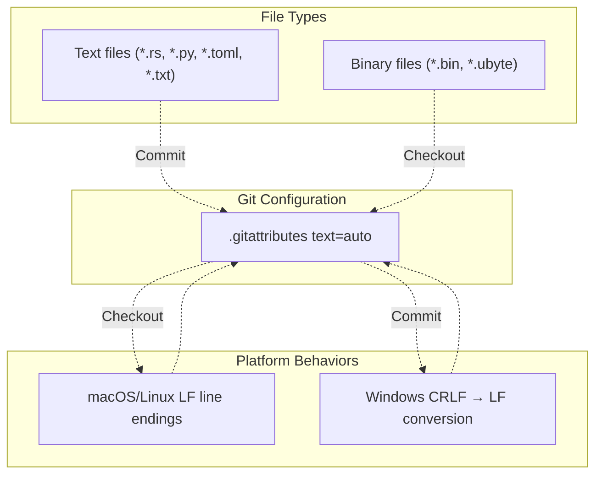
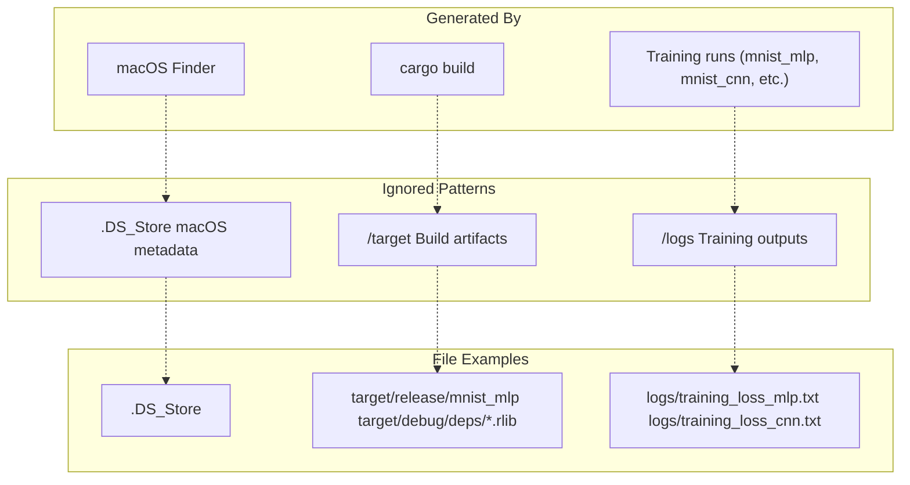
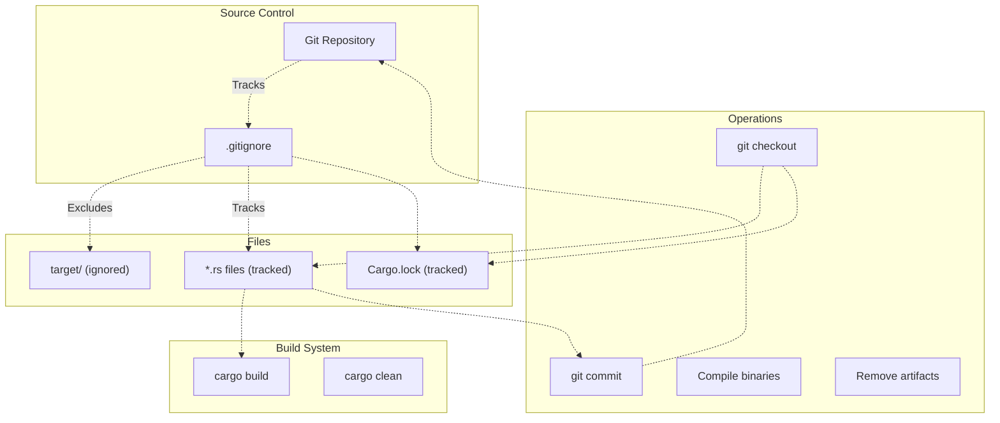

# Project Configuration

> **Relevant source files**
> * [.gitattributes](https://github.com/ThalesMMS/Rust-Neural-Networks/blob/0e978f90/.gitattributes)
> * [.gitignore](https://github.com/ThalesMMS/Rust-Neural-Networks/blob/0e978f90/.gitignore)
> * [README.md](https://github.com/ThalesMMS/Rust-Neural-Networks/blob/0e978f90/README.md)

## Purpose and Scope

This document covers the repository-level configuration files that control Git behavior, version control patterns, and the organizational structure of the project. It explains the purpose of `.gitattributes` and `.gitignore`, their configured rules, and how they interact with the development workflow.

For information about build system configuration, see [Build System](#6.1). For dependency management, see [Dependencies](#6.2).

---

## Git Configuration Overview

The repository uses two Git configuration files to ensure consistent behavior across different platforms and to manage which files are tracked in version control:

| File | Purpose | Scope |
| --- | --- | --- |
| `.gitattributes` | Controls text file normalization and line ending conversion | All text files |
| `.gitignore` | Specifies intentionally untracked files to be ignored | Build artifacts, logs, OS files |

These configuration files ensure that the repository behaves consistently across macOS, Linux, and Windows development environments, preventing common issues with line endings and build artifacts.

**Sources:** [.gitattributes L1-L3](https://github.com/ThalesMMS/Rust-Neural-Networks/blob/0e978f90/.gitattributes#L1-L3)

 [.gitignore L1-L4](https://github.com/ThalesMMS/Rust-Neural-Networks/blob/0e978f90/.gitignore#L1-L4)

---

## Repository Structure

The repository follows a standard Rust project layout with additional directories for data, logs, and Python utilities:

```mermaid
flowchart TD

ROOT["Repository Root"]
SRC_MLP["mnist_mlp.rs"]
SRC_CNN["mnist_cnn.rs"]
SRC_ATT["mnist_attention_pool.rs"]
SRC_XOR["mlp_simple.rs"]
CARGO["Cargo.toml"]
LOCK["Cargo.lock"]
PY_RECOG["digit_recognizer.py"]
PY_PLOT["plot_comparison.py"]
PY_REQ["requirements.txt"]
GIT_ATTR[".gitattributes"]
GIT_IGN[".gitignore"]
DATA_DIR["data/"]
TRAIN_IMG["train-images.idx3-ubyte"]
TRAIN_LAB["train-labels.idx1-ubyte"]
TEST_IMG["t10k-images.idx3-ubyte"]
TEST_LAB["t10k-labels.idx1-ubyte"]
TARGET["target/"]
BUILD_OUT["Compiled binaries"]
LOGS_DIR["logs/"]
LOSS_LOG["training_loss_*.txt"]
MODEL_BIN["mnist_model.bin"]
DS_STORE[".DS_Store"]

ROOT -.-> SRC_MLP
ROOT -.-> SRC_CNN
ROOT -.-> SRC_ATT
ROOT -.-> SRC_XOR
ROOT -.-> CARGO
ROOT -.-> LOCK
ROOT -.-> PY_RECOG
ROOT -.-> PY_PLOT
ROOT -.-> PY_REQ
ROOT -.-> GIT_ATTR
ROOT -.-> GIT_IGN
ROOT -.-> DATA_DIR
ROOT -.-> TARGET
ROOT -.-> LOGS_DIR
ROOT -.-> DS_STORE
ROOT -.-> MODEL_BIN

subgraph subGraph7 ["OS Files (Ignored)"]
    DS_STORE
end

subgraph subGraph6 ["Runtime Outputs (Ignored)"]
    LOGS_DIR
    LOSS_LOG
    MODEL_BIN
end

subgraph subGraph5 ["Build Artifacts (Ignored)"]
    TARGET
    BUILD_OUT
    TARGET -.-> BUILD_OUT
end

subgraph subGraph4 ["Data Directory (Ignored)"]
    DATA_DIR
    TRAIN_IMG
    TRAIN_LAB
    TEST_IMG
    TEST_LAB
end

subgraph subGraph3 ["Git Configuration"]
    GIT_ATTR
    GIT_IGN
end

subgraph subGraph2 ["Python Utilities"]
    PY_RECOG
    PY_PLOT
    PY_REQ
end

subgraph subGraph1 ["Build Configuration"]
    CARGO
    LOCK
end

subgraph subGraph0 ["Rust Source Files"]
    SRC_MLP
    SRC_CNN
    SRC_ATT
    SRC_XOR
end
```



**Directory Structure Analysis**

The repository is organized into several functional areas:

* **Root-level source files**: The four Rust implementations (`mnist_mlp.rs`, `mnist_cnn.rs`, `mnist_attention_pool.rs`, `mlp_simple.rs`) are stored directly in the repository root rather than a `src/` directory, as this is a multi-binary project with no shared library code.
* **Build configuration**: `Cargo.toml` and `Cargo.lock` manage Rust dependencies and binary targets.
* **Python utilities**: Scripts for visualization and inference are stored at the root level for easy access.
* **Data directory**: Expected to contain the four MNIST IDX files, but not tracked in version control due to their size (47+ MB total).
* **Build artifacts**: The `target/` directory contains compiled binaries and intermediate build files, ignored by Git as they are platform-specific and regenerated on each build.
* **Runtime outputs**: The `logs/` directory stores training metrics, and `mnist_model.bin` stores trained model weights. These are ignored to avoid committing large binary files.

**Sources:** [README.md L14-L31](https://github.com/ThalesMMS/Rust-Neural-Networks/blob/0e978f90/README.md#L14-L31)

 [.gitignore L1-L4](https://github.com/ThalesMMS/Rust-Neural-Networks/blob/0e978f90/.gitignore#L1-L4)

---

## .gitattributes Configuration

The `.gitattributes` file configures Git's line ending normalization to ensure consistent behavior across platforms:



### Configuration Rules

The repository uses a single directive:

```
* text=auto
```

This rule instructs Git to:

1. **Auto-detect text files**: Git determines whether a file is text or binary based on its content.
2. **Normalize line endings**: On commit, convert all text files to LF (`\n`) line endings.
3. **Platform-specific checkout**: On checkout, convert line endings to the platform's native format (LF on Unix-like systems, CRLF on Windows by default).

### Files Affected

This configuration applies to all text files in the repository, including:

| File Type | Examples | Line Ending Normalization |
| --- | --- | --- |
| Rust source | `mnist_mlp.rs`, `mnist_cnn.rs` | Yes |
| Python scripts | `digit_recognizer.py`, `plot_comparison.py` | Yes |
| Configuration | `Cargo.toml`, `requirements.txt` | Yes |
| Documentation | `README.md` | Yes |
| Training logs | `logs/training_loss_mlp.txt` | Yes |
| Binary files | `mnist_model.bin`, `*.idx3-ubyte` | No (auto-detected) |

### Why This Matters

Line ending inconsistencies can cause:

* Spurious diffs showing every line as changed
* Build failures when scripts contain mixed line endings
* Checksum mismatches in automated testing

The `text=auto` directive prevents these issues by ensuring the repository stores a canonical line ending format (LF) while allowing developers to use their platform's native format in their working directory.

**Sources:** [.gitattributes L1-L3](https://github.com/ThalesMMS/Rust-Neural-Networks/blob/0e978f90/.gitattributes#L1-L3)

---

## .gitignore Patterns

The `.gitignore` file specifies three categories of files that should not be tracked in version control:



### Pattern Breakdown

The `.gitignore` file contains three patterns:

| Pattern | Type | Purpose | Size Impact |
| --- | --- | --- | --- |
| `.DS_Store` | OS metadata | macOS folder view settings | ~8-12 KB per directory |
| `/target` | Build artifacts | Compiled binaries, dependencies, intermediate files | 100+ MB typical |
| `/logs` | Runtime outputs | Training loss logs, metrics | ~1-10 KB per run |

### Pattern Analysis

#### 1. .DS_Store (Line 1)

```
.DS_Store
```

This pattern matches `.DS_Store` files anywhere in the repository tree. macOS Finder creates these files to store custom folder view settings (icon positions, background colors, view mode). They are:

* Platform-specific (only generated on macOS)
* Binary format
* Not relevant to other developers
* Frequently modified by normal filesystem operations

**Impact:** Prevents noisy commits when developers browse the repository in Finder.

#### 2. /target (Line 2)

```
/target
```

This pattern matches only the `/target` directory at the repository root (note the leading slash). The Cargo build system creates this directory structure:

```
target/
├── debug/
│   ├── mnist_mlp (executable)
│   ├── mnist_cnn (executable)
│   ├── deps/ (compiled dependencies)
│   └── incremental/ (incremental compilation cache)
└── release/
    ├── mnist_mlp (optimized executable)
    ├── mnist_cnn (optimized executable)
    └── deps/
```

The `target/` directory contains:

* Compiled binaries (platform and architecture-specific)
* Compiled dependencies (`.rlib`, `.rmeta` files)
* Incremental compilation caches
* Build scripts output

**Impact:** Prevents committing 100+ MB of platform-specific build artifacts that can be regenerated with `cargo build`.

#### 3. /logs (Line 3)

```
/logs
```

This pattern matches only the `/logs` directory at the repository root. During training, the neural network implementations write CSV-formatted loss logs:

* `logs/training_loss_mlp.txt`
* `logs/training_loss_cnn.txt`
* `logs/training_loss_attention.txt`
* `logs/training_loss_xor.txt`

These files contain epoch-by-epoch metrics (see [Training Visualization](#4.2)) and are:

* Regenerated on each training run
* User-specific (depend on hardware, hyperparameters, random initialization)
* Used locally for visualization with `plot_comparison.py`

**Impact:** Prevents accumulating user-specific training results in the repository history.

**Sources:** [.gitignore L1-L4](https://github.com/ThalesMMS/Rust-Neural-Networks/blob/0e978f90/.gitignore#L1-L4)

 [README.md L29-L31](https://github.com/ThalesMMS/Rust-Neural-Networks/blob/0e978f90/README.md#L29-L31)

---

## Notable Omissions from .gitignore

Several categories of files are **not** ignored, which is intentional:

### 1. mnist_model.bin

The trained model binary is **not ignored**, despite being a generated file. The README indicates this file is expected at the root ([README.md L31](https://github.com/ThalesMMS/Rust-Neural-Networks/blob/0e978f90/README.md#L31-L31)

) and is used by `digit_recognizer.py` ([README.md L175-L179](https://github.com/ThalesMMS/Rust-Neural-Networks/blob/0e978f90/README.md#L175-L179)

). Users may want to:

* Commit a reference model for reproducibility
* Share trained models with collaborators
* Version control different model checkpoints

The file is typically ~800 KB, which is acceptable for Git tracking. However, developers may choose to add it to `.gitignore` if they train many model variants.

### 2. data/ Directory

The MNIST dataset directory is **not ignored**. However, the README ([README.md L152-L163](https://github.com/ThalesMMS/Rust-Neural-Networks/blob/0e978f90/README.md#L152-L163)

) indicates these files are required:

* `data/train-images.idx3-ubyte` (9,912,422 bytes)
* `data/train-labels.idx1-ubyte` (28,881 bytes)
* `data/t10k-images.idx3-ubyte` (1,648,877 bytes)
* `data/t10k-labels.idx1-ubyte` (4,542 bytes)

Total size: ~47 MB. These files are too large for typical Git repositories and should ideally be added to `.gitignore` and distributed separately (via Git LFS, external hosting, or download scripts). This appears to be an oversight in the current configuration.

### 3. Python Cache Files

Python cache directories (`__pycache__/`, `*.pyc`) are not ignored, but this is acceptable since:

* The Python scripts are simple utilities, not an installable package
* They are run directly (`python digit_recognizer.py`) rather than imported as modules
* Cache files are unlikely to be generated in normal usage

**Sources:** [.gitignore L1-L4](https://github.com/ThalesMMS/Rust-Neural-Networks/blob/0e978f90/.gitignore#L1-L4)

 [README.md L29-L31](https://github.com/ThalesMMS/Rust-Neural-Networks/blob/0e978f90/README.md#L29-L31)

 [README.md L152-L163](https://github.com/ThalesMMS/Rust-Neural-Networks/blob/0e978f90/README.md#L152-L163)

 [README.md L175-L179](https://github.com/ThalesMMS/Rust-Neural-Networks/blob/0e978f90/README.md#L175-L179)

---

## Configuration Interaction with Build System

The Git configuration interacts with the Cargo build system:



### Build Workflow

1. **Clean checkout**: When cloning the repository, only source files and `Cargo.lock` are present. The `target/` directory does not exist.
2. **First build**: Running `cargo build --release` creates the `target/` directory and compiles binaries. These files remain ignored by Git.
3. **Development cycle**: Developers modify source files (tracked), rebuild (updating `target/`, ignored), and commit only source changes.
4. **Cleanup**: Running `cargo clean` removes the `target/` directory. This is useful before switching branches or troubleshooting build issues.

### Why Cargo.lock is Tracked

The `Cargo.lock` file **is tracked** in version control (not ignored) because this is a binary project with multiple executables. Tracking `Cargo.lock` ensures:

* Reproducible builds with exact dependency versions
* All developers and CI systems use the same dependency versions
* Consistent behavior across platforms

This follows Rust best practices for binary projects (as opposed to libraries, where `Cargo.lock` is typically ignored).

**Sources:** [.gitignore L1-L4](https://github.com/ThalesMMS/Rust-Neural-Networks/blob/0e978f90/.gitignore#L1-L4)

 [README.md L19](https://github.com/ThalesMMS/Rust-Neural-Networks/blob/0e978f90/README.md#L19-L19)

---

## Configuration Best Practices

### Recommended Additions

Based on typical Rust and Python development workflows, consider adding these patterns to `.gitignore`:

```
# Large dataset files/data/# Python cache__pycache__/*.pyc*.pyo# Generated model files (if training frequently)*.bin# Editor/IDE files.vscode/.idea/*.swp*.swo*~# Benchmark outputs*.profdata
```

### Platform-Specific Considerations

| Platform | Additional Ignores | Reason |
| --- | --- | --- |
| macOS | `.DS_Store` (already present) | Finder metadata |
| Windows | `Thumbs.db`, `desktop.ini` | Explorer metadata |
| Linux | `.directory` | Dolphin metadata |

### Performance Considerations

The current `.gitignore` patterns use simple prefix matching, which is efficient:

* `/target` matches only the root-level directory (fast)
* `.DS_Store` matches in any directory (requires recursive search, but macOS-specific)
* `/logs` matches only the root-level directory (fast)

Adding wildcard patterns like `**/*.bin` or recursive patterns can slow down Git operations in large repositories, but this is unlikely to be an issue for this small project.

**Sources:** [.gitignore L1-L4](https://github.com/ThalesMMS/Rust-Neural-Networks/blob/0e978f90/.gitignore#L1-L4)

---

## Repository Metadata

The repository configuration supports the following development workflows:

| Workflow | Configuration Support | File References |
| --- | --- | --- |
| Cross-platform development | `.gitattributes` normalizes line endings | [.gitattributes L1-L3](https://github.com/ThalesMMS/Rust-Neural-Networks/blob/0e978f90/.gitattributes#L1-L3) |
| Incremental builds | `.gitignore` excludes `target/` | [.gitignore L2](https://github.com/ThalesMMS/Rust-Neural-Networks/blob/0e978f90/.gitignore#L2-L2) |
| Model training | `.gitignore` excludes `logs/` | [.gitignore L3](https://github.com/ThalesMMS/Rust-Neural-Networks/blob/0e978f90/.gitignore#L3-L3) |
| macOS development | `.gitignore` excludes `.DS_Store` | [.gitignore L1](https://github.com/ThalesMMS/Rust-Neural-Networks/blob/0e978f90/.gitignore#L1-L1) |
| Dependency locking | `Cargo.lock` is tracked | [README.md L19](https://github.com/ThalesMMS/Rust-Neural-Networks/blob/0e978f90/README.md#L19-L19) |

The configuration prioritizes:

1. **Reproducibility**: `Cargo.lock` tracked, line endings normalized
2. **Performance**: Large build artifacts ignored
3. **Cross-platform compatibility**: Line ending normalization, platform-specific metadata excluded
4. **Developer experience**: No manual cleanup required for build artifacts

**Sources:** [.gitattributes L1-L3](https://github.com/ThalesMMS/Rust-Neural-Networks/blob/0e978f90/.gitattributes#L1-L3)

 [.gitignore L1-L4](https://github.com/ThalesMMS/Rust-Neural-Networks/blob/0e978f90/.gitignore#L1-L4)

 [README.md L19](https://github.com/ThalesMMS/Rust-Neural-Networks/blob/0e978f90/README.md#L19-L19)

Refresh this wiki

Last indexed: 5 January 2026 ([0e978f](https://github.com/ThalesMMS/Rust-Neural-Networks/commit/0e978f90))

### On this page

* [Project Configuration](#6.3-project-configuration)
* [Purpose and Scope](#6.3-purpose-and-scope)
* [Git Configuration Overview](#6.3-git-configuration-overview)
* [Repository Structure](#6.3-repository-structure)
* [.gitattributes Configuration](#6.3-gitattributes-configuration)
* [Configuration Rules](#6.3-configuration-rules)
* [Files Affected](#6.3-files-affected)
* [Why This Matters](#6.3-why-this-matters)
* [.gitignore Patterns](#6.3-gitignore-patterns)
* [Pattern Breakdown](#6.3-pattern-breakdown)
* [Pattern Analysis](#6.3-pattern-analysis)
* [Notable Omissions from .gitignore](#6.3-notable-omissions-from-gitignore)
* [1. mnist_model.bin](#6.3-1-object-object)
* [2. data/ Directory](#6.3-2-object-object-directory)
* [3. Python Cache Files](#6.3-3-python-cache-files)
* [Configuration Interaction with Build System](#6.3-configuration-interaction-with-build-system)
* [Build Workflow](#6.3-build-workflow)
* [Why Cargo.lock is Tracked](#6.3-why-object-object-is-tracked)
* [Configuration Best Practices](#6.3-configuration-best-practices)
* [Recommended Additions](#6.3-recommended-additions)
* [Platform-Specific Considerations](#6.3-platform-specific-considerations)
* [Performance Considerations](#6.3-performance-considerations)
* [Repository Metadata](#6.3-repository-metadata)

Ask Devin about Rust-Neural-Networks